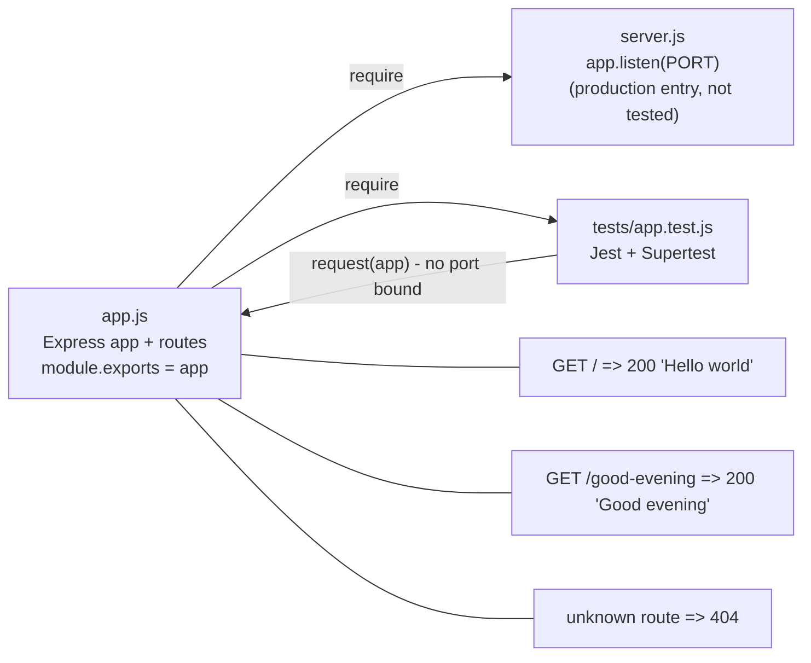

# Technical Specification

# 0. Agent Action Plan

## 0.1 Intent Clarification

This Agent Action Plan (AAP) governs the **automated testing workstream** that accompanies the requested feature change. The user's request is a feature addition — introduce Express.js into an existing Node.js tutorial server and add a second HTTP endpoint — and this section translates that request into a precise, self-contained plan for the **unit and HTTP-integration test suite** that validates the resulting server. Because the Artifact-4 repository is currently empty except for a placeholder `README.md`, the testing workstream is **greenfield**: it establishes the project's first test suite, test tooling, and coverage baseline rather than modifying any pre-existing tests.

### 0.1.1 Core Testing Objective

Based on the provided requirements, the Blitzy platform understands that the testing objective is to **establish the project's first automated test suite that verifies an Express.js HTTP server which exposes two `GET` endpoints — the existing endpoint that returns the response body `Hello world`, and a new endpoint that returns the response body `Good evening` — with each endpoint responding with HTTP status `200`**, while ensuring the server is structured so the routes can be exercised by an HTTP assertion library without binding to a live network port.

- **Request categorization:** `Add new tests` (greenfield). The repository contains zero existing test files, so there is nothing to *update* or *fix*. A secondary, implicit objective is to *establish a coverage baseline* and a repeatable test-quality standard for the project.

User-provided request (preserved exactly):

> **User Example:** "add feature to a existing product / this is a tutorial of node js server hosting one endpoint that returns the response 'Hello world'. Could you add expressjs into the project and add another endpoint that return the reponse of 'Good evening'?"

Each testing requirement, restated with technical clarity:

| # | Restated Testing Requirement | Derived From |
|---|------------------------------|--------------|
| R1 | Assert that a `GET` request to the existing route returns HTTP `200` and a response body equal to the exact string `Hello world`. | "one endpoint that returns the response 'Hello world'" |
| R2 | Assert that a `GET` request to the new route returns HTTP `200` and a response body equal to the exact string `Good evening`. | "add another endpoint that return the reponse of 'Good evening'" |
| R3 | Assert that the application is built on Express.js and that its route table is wired correctly (each path returns its own distinct body, with no cross-wiring). | "add expressjs into the project" |
| R4 | Assert the negative path — an unknown route returns HTTP `404` (Express default not-found behavior). | Implicit (robustness of a routed HTTP server) |

Implicit testing needs surfaced from the request:

- **Exact-body fidelity** — the response strings `Hello world` and `Good evening` must be asserted as exact matches; partial or case-insensitive matching is insufficient.
- **Status-code verification** — both defined routes must return `200`; the not-found path must return `404`.
- **Routing isolation** — each path must resolve to its own handler so the two responses cannot be transposed.
- **Testability precondition** — the Express `app` instance must be created and exported independently of the `app.listen()` call, so the test suite can import the app and drive it in-process.
- **HTTP method scoping** — the routes are defined for `GET`; undefined method/path combinations are expected to fall through to Express's `404` handler.

### 0.1.2 Special Instructions and Constraints

- **No explicit testing directives were supplied.** The user provided no attachments and no implementation rules; therefore there are no user-mandated mocking libraries, naming conventions, or pattern files to inherit. The plan adopts widely-documented Express testing conventions as the de-facto standard for this greenfield project.
- **Preserve response strings exactly** — assertions must use the literal strings `Hello world` and `Good evening`, including capitalization and the single space, exactly as written by the user.
- **Test-only, minimal-change discipline** — this workstream creates test files, test configuration, and test dependencies only. It must **not** add application features or alter business behavior. The single coordination point with the feature workstream is the testability requirement (export the app separately from `listen()`); see § 0.8.2 and § 0.10.
- **Path ambiguity (flagged for alignment)** — the user specified the response *bodies* but not the URL *paths*. The accompanying feature implementation chooses the actual paths. This plan assumes representative paths (existing `GET /` → `Hello world`; new `GET /good-evening` → `Good evening`) and explicitly requires the test request paths to be aligned to the routes the feature implementation registers.
- **Web search requirements** — research into current Express + Jest + Supertest testing patterns and version compatibility was required and has been completed; findings are documented in § 0.2.2 and § 0.3.2.

### 0.1.3 Technical Interpretation

These testing requirements translate to the following technical test-implementation strategy, expressed as direct goal-to-action mappings:

- To verify the existing `Hello world` endpoint (R1), the plan will **create** the test file `tests/app.test.js` with a Supertest case issuing `GET /` and asserting `status === 200` and `text === "Hello world"`.
- To verify the new `Good evening` endpoint (R2), the plan will **add a case to** `tests/app.test.js` issuing `GET /good-evening` and asserting `status === 200` and `text === "Good evening"`.
- To verify the Express integration and routing isolation (R3), the plan will **import** the exported Express `app` into the test file and exercise both routes through Supertest, which confirms Express constructs and dispatches the route table correctly.
- To verify the not-found path (R4), the plan will **add a case** issuing `GET` to an unregistered route and asserting `status === 404`.
- To make the above executable, the plan will **update** `package.json` (add `jest` and `supertest` dev-dependencies plus `test` scripts) and **create** an optional minimal `jest.config.js` for coverage configuration.

### 0.1.4 Coverage Requirements Interpretation

- **Explicit coverage targets:** none were stated by the user.
- **Implicit coverage expectations** are derived from:
  - *Industry standard for the language/framework* — for a small Express service, the HTTP-contract layer (each endpoint's status and body) is the highest-value coverage and is straightforward to drive to completion.
  - *Repository coverage patterns* — none exist (greenfield), so this plan sets the initial standard.
  - *Critical-path analysis* — the entire functional surface is the two route handlers; both are critical paths and must be fully covered.
- **To achieve comprehensive testing, coverage should include:** every defined route's happy path (status + exact body), the not-found negative path, and confirmation that the app is importable in isolation. Given the trivial surface, the natural target is **100% of statements, branches, functions, and lines for the application route module (`app.js`)**, with the server bootstrap (`server.js`) excluded from coverage because it binds a port and contains no business logic. Detailed metrics and thresholds appear in § 0.7.

## 0.2 Test Discovery and Analysis

Because the user's description references an "existing" tutorial server that is not yet present in the repository, an extensive repository search was conducted to confirm the true starting state and to locate any test infrastructure, framework, or conventions to inherit.

### 0.2.1 Existing Test Infrastructure Assessment

Repository analysis reveals **no testing setup of any kind and no application source code**. The repository root contains a single file, `README.md` (12 bytes, contents `# Artifact-4`), and zero subdirectories. Semantic searches for (a) a Node.js HTTP server entry point and (b) test/spec files plus Jest/Mocha configuration both returned zero matches, and no `.blitzyignore` files exist. This greenfield state is corroborated by the Technical Specification's § 6.6, which records that the repository contains zero test source files, zero test framework configurations, and zero coverage configurations.

The implication is direct: the test suite, its tooling, its configuration, and its dependency declarations must all be **created from scratch**; there are no existing tests to extend, refactor, fix, or delete, and no in-repository pattern file to mirror.

| Infrastructure Dimension | Finding | Consequence for This Plan |
|--------------------------|---------|---------------------------|
| Current testing framework | None present | Select and introduce a framework (see § 0.3.2) |
| Test runner configuration | None present (`jest.config.*`, `mocha.opts`, `pytest.ini` absent) | Create a minimal `jest.config.js` (optional) + `test` script |
| Coverage tool | None present | Use Jest's built-in coverage (`--coverage`) |
| Mock / stub library | None present | None required — endpoints have no external dependencies |
| Test data fixtures / factories | None present | None required — assertions use inline literal strings |
| Application source under test | None present (`app.js`/`server.js` not yet created) | Tests target the to-be-created Express app; path alignment required (§ 0.1.2) |

### 0.2.2 Web Search Research Conducted

Current best-practice research was performed to ground the framework selection and test structure for an Express application, since no in-repository conventions exist. Key findings:

- **Recommended stack and test organization for Express APIs.** <cite index="4-1">Jest plus Supertest remains a practical default stack for HTTP API testing across Express, Fastify, and Nest-based services.</cite> Jest serves as the test runner and assertion/mocking library, while Supertest provides the HTTP-level assertions. Jest auto-discovers files ending in `.test.js` or `.spec.js`, so a `tests/` directory or co-located test files require no extra configuration.
- **The critical testability pattern (app/listen separation).** The dominant, repeatedly-documented practice is to <cite index="2-3,2-4,2-5">separate app creation from server startup, export the Express app for testing, and call listen() in a separate entry point file.</cite> This matters because <cite index="2-15">the key insight is that Supertest does not need a running server</cite> — it can drive the exported app instance directly. Failing to separate the two causes port-in-use and hanging errors: when `app.listen()` runs inside the imported module, <cite index="3-22,3-23">it starts listening on one port, and writing many test files produces a "port in use" error.</cite>
- **Recommended mocking strategy for this surface.** Supertest passes the app instance rather than a listening socket, which <cite index="8-1,8-2">is the faster method since Supertest is designed to work with an already-listening server or an app instance.</cite> For the two pure string-returning endpoints in this task there are no external services, databases, or file-system calls, so **no mocking or stubbing is warranted**; community guidance warns that over-mocking trivial logic produces brittle, low-value tests.
- **Per-endpoint coverage conventions.** Recommended coverage for an endpoint is to <cite index="8-21">cover the main success path (happy path), key validation failures, edge cases, and authentication failures if applicable.</cite> For this task that reduces to the happy path (status + exact body) plus a not-found edge case; there is no request body to validate and no authentication layer.
- **Framework-agnostic alternative noted.** Supertest is runner-agnostic and also works with Mocha/Chai, and Node.js now ships a built-in test runner; however, Jest's batteries-included runner, mocking, parallelism, and built-in coverage make it the more convenient, tutorial-friendly choice for this project.

These findings were independently validated by a working proof-of-concept (an Express app with the two endpoints plus a Jest/Supertest suite) that executed successfully with 100% coverage, confirming both the approach and the exact dependency versions recorded in § 0.6.

## 0.3 Testing Scope Analysis

This subsection identifies precisely what code will be exercised by the test suite and pins the compatible versions of every testing tool the plan introduces.

### 0.3.1 Test Target Identification

The primary code to be tested is the Express application module that the feature workstream will create. Because the application is greenfield, the targets below are described by their expected role; test request paths must be aligned to the routes the implementation registers (§ 0.1.2).

- **Module/Class:** the exported Express application `app` at `app.js` (path expected at repository root or `src/app.js`) — requires HTTP-integration tests driven through Supertest.
- **Functions (route handlers):**
  - `GET /` handler → returns `Hello world` — test categories: happy path (status `200`, exact body).
  - `GET /good-evening` handler → returns `Good evening` — test categories: happy path (status `200`, exact body).
  - Express default not-found handler → test categories: error/edge path (unknown route returns `404`).

Existing test file mapping:

| Source File | Existing Test File | Test Categories Present |
|-------------|--------------------|-------------------------|
| `app.js` (to be created by feature work) | None — to be created as `tests/app.test.js` | None present (greenfield); happy-path + not-found to be added |
| `server.js` (to be created by feature work) | None — intentionally not tested (see § 0.8.2) | None present; excluded from coverage |

Dependencies requiring mocking:

- **External services to mock:** none — the endpoints call no third-party services.
- **Database interactions to stub:** none — there is no datastore.
- **File-system operations to virtualize:** none — the handlers return in-memory string literals.

The absence of external dependencies is itself a design conclusion: the test suite is fully hermetic and deterministic without any test doubles, fixtures, or environment seeding.

### 0.3.2 Version Compatibility Research

The compatible versions below were verified against the npm registry (engine fields and latest dist-tags) and exercised in a passing proof-of-concept on the available runtime, **Node.js v22.22.2** (Active LTS; npm 11.1.0). No project manifest pre-declared any version, so the highest current stable releases were selected and validated.

Based on the current Node.js v22 (LTS) runtime, the recommended testing stack is:

- **Test framework / runner:** Jest version `30.4.2` — rationale: batteries-included runner with assertions, mocking, and built-in coverage; engine support `^18.14.0 || ^20.0.0 || ^22.0.0 || >=24.0.0`, satisfied by Node 22.
- **Assertion library:** Jest's built-in `expect` (no separate library) — rationale: avoids an extra dependency; sufficient for status/body assertions.
- **HTTP assertion / request library:** Supertest version `7.2.2` — rationale: drives the exported Express app in-process; engine support `>=14.18.0`, satisfied by Node 22.
- **Coverage tool:** Jest built-in coverage (Istanbul/V8) — rationale: no additional dependency; produces statement/branch/function/line metrics out of the box.
- **Runtime under test (feature-owned, listed for compatibility):** Express version `5.2.1` — engine support `node >= 18`, satisfied by Node 22.

Version conflicts to resolve: **none identified.** All three core packages (Express 5, Jest 30, Supertest 7) declare Node ≥ 18 compatibility and install together cleanly on Node 22 without peer-dependency warnings. One compatibility consideration is the module system: this plan recommends **CommonJS** (`require`/`module.exports`) for the application and tests so Jest runs with zero extra configuration; if the feature workstream elects ECMAScript Modules (`"type": "module"`), Jest requires additional ESM enablement (for example running under `NODE_OPTIONS=--experimental-vm-modules`), which is flagged here as the only conditional adjustment.

## 0.4 Test Implementation Design

This subsection defines the testing strategy, the per-component test-case blueprints, the (non-)extension posture for existing tests, and the test-data design.

### 0.4.1 Test Strategy Selection

The strategy centers on **HTTP-level integration tests using Supertest against the exported Express `app`**, which for this small surface simultaneously provide unit-level coverage of the route handlers and integration coverage of Express routing/middleware. This is the highest-value layer for an HTTP API and the most direct expression of the user's requirements.

Test types to implement:

- **Unit / HTTP tests (primary):** drive each route through `request(app)` and assert status and body. The route handlers are pure (`res.send(<literal>)`), so these tests fully exercise their logic without additional isolation.
- **Integration tests:** the same Supertest cases confirm that Express correctly registers and dispatches the route table (each path resolves to its own handler).
- **Edge-case tests:** an unknown route returns `404`; optionally, a non-`GET` method on a defined path falls through to `404` (Express default).
- **Error-handling tests:** limited to the not-found path, as the endpoints have no failure modes of their own (no inputs, no I/O).

A deliberate non-goal is **over-mocking**: because there are no external dependencies, no mocks, spies, or stubs are introduced. The strategy depends on one architectural precondition — the Express app must be exported separately from `app.listen()` — illustrated below:



### 0.4.2 Test Case Blueprint

The following blueprints enumerate the cases for each component requiring tests:

```text
Component: Express application bootstrap (app.js)
Test Categories:
- Happy path: requiring the module returns a defined, callable Express app (implicitly covered by route tests)
- Edge cases: none
- Error cases: none

Component: GET / (existing "Hello world" route)
Test Categories:
- Happy path: GET / responds with status 200 and body exactly "Hello world"
- Edge cases: response Content-Type aligns with implementation (res.send(string) => text/html; charset=utf-8)
- Error cases: none (no inputs)

Component: GET /good-evening (new "Good evening" route)
Test Categories:
- Happy path: GET /good-evening responds with status 200 and body exactly "Good evening"
- Edge cases: response Content-Type aligns with implementation
- Error cases: none (no inputs)

Component: Not-found behavior (Express default)
Test Categories:
- Happy path: n/a
- Edge cases: undefined method on a defined path returns 404 (optional)
- Error cases: GET to an unregistered route returns status 404
```

### 0.4.3 Existing Test Extension Strategy

Not applicable — the repository contains **no existing tests**. All work is net-new creation:

- **Tests to extend:** none (no prior test files exist).
- **Tests to refactor:** none.
- **Tests to fix:** none (there are no broken or failing tests).

This subsection is retained for completeness to make explicit that every test artifact in § 0.5 is a `CREATE`, with the sole `UPDATE` being the addition of test dependencies and scripts to `package.json`.

### 0.4.4 Test Data and Fixtures Design

The test-data footprint is intentionally minimal because the endpoints are deterministic and dependency-free:

- **Required test data structures:** the two expected response strings (`Hello world`, `Good evening`) asserted inline within the test cases. No external data structures are needed.
- **Fixture organization strategy:** no fixture files are required; introducing fixtures here would add complexity without value.
- **Mock object specifications:** none — there are no collaborators (services, databases, file system, clock, randomness) to substitute.
- **Test database / state management approach:** stateless. Each test is independent and parallel-safe. Because Supertest is handed the `app` instance rather than a listening socket, the suite requires **no port management and no `afterAll` server teardown**, eliminating a common source of flakiness and inter-test coupling.

## 0.5 Test File Transformation Mapping

This subsection maps every file the testing workstream will create, update, or reference. The target file is listed first in the transformation table. No files are deleted (greenfield).

### 0.5.1 File-by-File Test Plan

Transformation modes — `CREATE` (new test file), `UPDATE` (modify existing file), `DELETE` (remove obsolete file), `REFERENCE` (use as the subject/example for tests).

| Target Test File | Transformation | Source File / Test Subject | Purpose/Changes |
|------------------|----------------|----------------------------|-----------------|
| `tests/app.test.js` | CREATE | `app.js` (`GET /`, `GET /good-evening`) | Supertest HTTP suite: assert `200` + exact body `Hello world` and `Good evening`; assert `404` for an unknown route; sanity-check that the app module imports |
| `package.json` | UPDATE | `package.json` | Add dev-dependencies `jest@30.4.2` and `supertest@7.2.2`; add `test` and `test:coverage` scripts |
| `jest.config.js` | CREATE | (new) | Minimal, optional Jest config: `testEnvironment: 'node'`, `collectCoverageFrom: ['app.js']`, coverage thresholds |
| `app.js` | REFERENCE | `app.js` | System under test imported by the suite; confirm the actual registered route paths to align test requests; must export the app **without** calling `listen()` |
| `README.md` | UPDATE | `README.md` | Optional — add a "Testing" section documenting the test and coverage commands |

- All test file names are listed explicitly above; nothing is left "pending" or "to be discovered."
- A wildcard view of the in-scope test surface is `tests/**/*.test.js` (presently a single file, `tests/app.test.js`).
- An optional split into `tests/hello.test.js` and `tests/good-evening.test.js` is possible but is not recommended for a two-route surface; the single cohesive `tests/app.test.js` is preferred.

### 0.5.2 New Test Files Detail

- **`tests/app.test.js`** — primary (and only) test file; provides unit + HTTP-integration coverage for the whole surface.
  - Test categories: happy path (both endpoints), edge/error path (unknown route → `404`), bootstrap sanity (app imports).
  - Mock dependencies: none.
  - Imports: `const request = require('supertest');` and `const app = require('../app');` (relative path aligned to the app module's final location).
  - Assertions focus: `expect(res.statusCode).toBe(200)` and `expect(res.text).toBe('Hello world')` / `toBe('Good evening')`; `expect(res.statusCode).toBe(404)` for the unknown route.
- **Integration-specific file** (`tests/**/*_integration_test.js`): not created — the HTTP tests in `tests/app.test.js` already constitute the integration layer for this surface.
- **Fixtures file** (`tests/fixtures/**`): not created — no test data beyond inline literals is required.

### 0.5.3 Test Files to Modify Detail

Not applicable — there are no pre-existing test files to modify. The only non-test file modified is `package.json`, detailed in § 0.5.4. This explicit statement closes out the `UPDATE`-of-existing-tests category with zero items.

### 0.5.4 Test Configuration Updates

- **`package.json`** — add the testing dev-dependencies and scripts. Representative scripts stanza:

```json
"scripts": { "test": "jest", "test:coverage": "jest --coverage" }
```

- **`jest.config.js`** (optional but recommended) — declare the Node environment and coverage scope:

```js
module.exports = { testEnvironment: 'node', collectCoverageFrom: ['app.js'] };
```

- **Coverage configuration** — collect coverage only from the application route module (`app.js`); exclude `server.js` (port-binding bootstrap with no business logic) and `node_modules`. Thresholds are specified in § 0.7.1.
- **Test-runner discovery** — Jest's default `testMatch` discovers `tests/app.test.js` via the `.test.js` suffix; no custom matcher is required.

### 0.5.5 Cross-File Test Dependencies

- **Shared fixtures:** none.
- **Mock objects:** none.
- **Test utilities / helpers:** none required for this surface (no shared setup beyond importing the app).
- **Import relationships:** `tests/app.test.js` imports `supertest` (dev-dependency) and the exported `app` from `app.js`. The production entry `server.js` also imports `app.js` but is **not** imported by any test (importing it would attempt to bind a port). This single-source-of-truth import of `app.js` by both the server and the test is the structural backbone of the suite (illustrated in § 0.4.1).
- **Import updates required across test files:** none — this is greenfield, so there are no existing import paths to rewrite. New test imports are introduced fresh as described above.

## 0.6 Dependency Inventory

This subsection inventories the testing packages introduced by this workstream. All versions are exact, verified against the npm registry, and confirmed installable and passing together on Node.js v22.

### 0.6.1 Testing Dependencies

The following packages are added to `package.json` under `devDependencies`:

| Registry | Package Name | Version | Purpose |
|----------|--------------|---------|---------|
| npm | jest | 30.4.2 | Testing framework — test runner, `expect` assertions, mocking, and built-in code coverage |
| npm | supertest | 7.2.2 | HTTP assertion library — issues requests against the exported Express app in-process and asserts on responses |

Runtime dependency under test (introduced by the **feature** workstream, listed here only for compatibility context — not a testing dependency):

| Registry | Package Name | Version | Purpose |
|----------|--------------|---------|---------|
| npm | express | 5.2.1 | Web framework providing the routing exercised by the tests |

- No placeholder versions are used; `jest@30.4.2` and `supertest@7.2.2` are the verified current releases and both declare Node ≥ 18 engine support, satisfied by the Node 22 runtime.
- No separate assertion, mocking, or coverage packages are added — Jest provides all three natively, keeping the dependency surface minimal.
- The `cross-env` package would only be required if the project adopts ESM and must pass `NODE_OPTIONS` to Jest; it is **not** included under the recommended CommonJS approach.

### 0.6.2 Import Updates

No import-rewrite migration is required because the repository is greenfield — there are no existing test files whose imports must be updated. The only imports introduced are the new ones inside the created test file:

- `tests/app.test.js` introduces `require('supertest')` and `require('../app')` (the relative path aligned to the final location of the application module).

Import transformation rules:

- Old → New rewrites: none (no legacy import paths exist).
- Apply to: newly created test files only.

If the feature workstream places the application module at `src/app.js` rather than the repository root, the test import path adjusts accordingly (for example `require('../src/app')`), and the test file location and `collectCoverageFrom` glob are aligned to match.

## 0.7 Coverage and Quality Targets

This subsection defines the coverage metrics and the qualitative standards the test suite must meet.

### 0.7.1 Coverage Metrics

- **Current coverage:** 0% — no tests or instrumented code exist yet.
- **Target coverage:** **100%** of statements, branches, functions, and lines for the application route module (`app.js`). This target is grounded in the validated proof-of-concept, which achieved 100% across all four metrics for an equivalent two-endpoint app, and is realistic because the entire functional surface is two trivial handlers plus the framework's default not-found path.
- **Coverage gaps to address:**
  - `app.js`: currently 0%, target 100%. Focus areas — the `GET /` handler, the `GET /good-evening` handler, and the not-found path.
  - `server.js`: excluded from coverage (port-binding bootstrap, no business logic).

Per-file coverage targets:

| File | Statements | Branches | Functions | Lines | Notes |
|------|-----------|----------|-----------|-------|-------|
| `app.js` | 100% | 100% | 100% | 100% | Full coverage of both route handlers + not-found path |
| `server.js` | n/a | n/a | n/a | n/a | Excluded — not imported by tests |

Representative Jest threshold configuration (enforced in `jest.config.js`):

```js
coverageThreshold: { './app.js': { statements: 100, branches: 100, functions: 100, lines: 100 } }
```

A pragmatic global floor (for example 80–90%) may additionally be set so that, if the application grows, overall coverage cannot silently regress while the `app.js` target remains the strict gate.

### 0.7.2 Test Quality Criteria

- **Assertion density:** every endpoint test asserts **both** the HTTP status code and the exact response body; the not-found test asserts the `404` status.
- **Test isolation:** each test is fully independent, shares no mutable state, and is safe to run in parallel; Supertest drives the app instance, so no shared port or server handle exists to couple tests.
- **Performance constraints:** the full suite must complete in well under one second (the proof-of-concept ran in ~0.46s); there are no slow I/O paths.
- **Maintainability standards:** tests follow the Arrange–Act–Assert structure with descriptive `describe`/`it` names that state the route and the expected outcome; asynchronous cases `await` (or return) the Supertest chain.
- **Repository conventions established by this plan:** the `.test.js` suffix under a `tests/` directory; Supertest invoked with the imported app instance; and the mandatory separation of `app.js` (exported app) from `server.js` (`listen`). These become the reference conventions for any future tests added to the project.

## 0.8 Scope Boundaries

This subsection draws explicit boundaries around the testing workstream.

### 0.8.1 Exhaustively In Scope

- **New test files:**
  - `tests/**/*.test.js` — all new test files (currently the single file `tests/app.test.js`).
- **Test configuration:**
  - `jest.config.js` — new, minimal coverage and environment configuration.
  - `package.json` — limited to adding the `jest`/`supertest` dev-dependencies and the `test`/`test:coverage` scripts.
- **Documentation (optional):**
  - `README.md` — addition of a "Testing" section describing how to install dependencies and run the tests and coverage.

### 0.8.2 Explicitly Out of Scope

- **Application / business logic** — the implementation of the Express route handlers in `app.js` is owned by the feature workstream; this testing plan adds no endpoints, features, or behavior.
- **Server bootstrap** — `server.js` (the `app.listen()` entry point) is not imported or executed by the tests and is excluded from coverage.
- **Infrastructure and automation** — no CI/CD pipeline files, no containerization (Dockerfile/compose), and no deployment configuration are created by this workstream.
- **Non-functional test types** — performance/load testing, security testing, and browser-based end-to-end testing are out of scope for this request.
- **Unrelated or speculative tests** — no tests are written for endpoints or features beyond the two the user specified.
- **Source refactoring** — no refactoring of application code is performed beyond the one coordination point below.

**Precondition / coordination point (not a license to modify business logic):** the Express `app` must be exported independently of `app.listen()` so Supertest can import and drive it. This separation is a structural requirement the feature workstream is expected to satisfy when it creates `app.js` and `server.js`; if it is not yet in place, it must be coordinated as a prerequisite. The testing workstream itself does not add or change request-handling behavior.

## 0.9 Execution Parameters

This subsection records the exact commands and environment needed to run the suite.

### 0.9.1 Testing-Specific Instructions

| Purpose | Command |
|---------|---------|
| Run all tests | `npm test` (resolves to `jest`) |
| Run tests non-interactively (CI) | `CI=true npx jest --ci --watchAll=false` |
| Measure coverage | `npm run test:coverage` (resolves to `jest --coverage`) |
| Run a single test file | `npx jest tests/app.test.js` |
| Run tests matching a name | `npx jest -t "Good evening"` |
| Watch mode (local development only) | `npx jest --watch` |
| Debug a test | `node --inspect-brk node_modules/.bin/jest --runInBand` |

- **Environment setup requirements:** install Node.js 22 LTS, then run `npm install` to install the `jest` and `supertest` dev-dependencies (alongside the feature workstream's `express`). No environment variables, services, or databases are required to run the suite.
- **Specific patterns to follow:** name files with the `.test.js` suffix under `tests/`; import the app via `require('../app')`; drive routes with `request(app)`; assert status and exact body in each case.
- **Excluded test categories (per scope):** watch mode must not be used in CI; no performance, security, or browser-E2E categories are executed.
- **Determinism note:** because the suite is hermetic (no network, database, or file-system access) and Supertest binds no port, tests run reliably in parallel and require no special isolation flags; `--runInBand` is reserved for debugging only.

## 0.10 Special Instructions for Testing

**No user-specified testing directives were provided** — the project supplied no implementation rules and no attachments, so there are no mandated mocking libraries, naming conventions, or pattern files to enforce. In the absence of explicit directives, the following guiding principles are adopted by this plan as standing instructions for the testing workstream, derived from the request's intent and from documented Express testing best practice:

- **Minimal-change, test-only discipline** — modify only test files and test-related configuration (`tests/**`, `jest.config.js`, and the test sections of `package.json`/`README.md`). Do not modify application source code.
- **Do not modify source code unless absolutely necessary for testability** — the sole permitted coordination is ensuring the Express app is exported separately from `app.listen()`; this is a structural prerequisite, not a behavioral change, and is owned by the feature workstream (§ 0.8.2).
- **Preserve the user's exact response strings** — assertions must compare against the literal strings `Hello world` and `Good evening` exactly as provided.
- **Follow the established Express testing pattern** — drive the exported app with Supertest (no port binding), keeping `app.js` (app definition) and `server.js` (`listen`) separate.
- **Maintain test isolation and parallel safety** — every test must run independently and in parallel without shared mutable state, ports, or teardown ordering.
- **Avoid over-mocking** — introduce no test doubles for this dependency-free surface; assert observable HTTP outcomes (status and body), not implementation internals.
- **Match conventions across the suite** — use the `.test.js` suffix, the `tests/` directory, descriptive `describe`/`it` names, and the Arrange–Act–Assert structure consistently, so the suite remains a clean reference for future tests.

