# Technical Specification

# 1. Introduction

## 1.1 EXECUTIVE SUMMARY

### 1.1.1 Project Overview

The repository under documentation is identified as **Artifact-4**, hosted at `github.com/ShaliniTest-maker/Artifact-4`. As of the latest commit (`3e64ae951eb38821e57b0e58e2d3d83f567c2a64`, dated 28 May 2026), the repository exists in a **pre-implementation placeholder state**. It contains exactly one file — a 12-byte `README.md` consisting solely of the level-1 Markdown heading `# Artifact-4` — and no source code, configuration files, build manifests, dependency declarations, infrastructure definitions, test artifacts, or supporting documentation.

This Technical Specification therefore documents a repository that has been **initialized but not yet populated with any system, feature, or design artifact**. The "system" described herein is, at present, a named container awaiting substantive contribution. All subsequent sections of this specification must be interpreted in light of this foundational reality: no implementation exists from which to derive functional, architectural, or operational characteristics.

#### 1.1.1.1 Repository State Snapshot

| Attribute | Value |
|-----------|-------|
| Repository Name | Artifact-4 |
| Remote Origin | `https://github.com/ShaliniTest-maker/Artifact-4.git` |
| Default Branch | `main` |
| Total File Count | 1 (excluding `.git` metadata) |

| Attribute | Value |
|-----------|-------|
| Total Commit Count | 1 |
| Latest Commit Hash | `3e64ae951eb38821e57b0e58e2d3d83f567c2a64` |
| Latest Commit Message | `Initial commit` |
| Latest Commit Date | 2026-05-28 16:08:59 +0530 |

### 1.1.2 Core Business Problem

The repository contains **no requirements documentation, no problem statement, no domain model, no user stories, and no code comments** from which a business problem can be derived. Consequently, this specification cannot assert any business problem that Artifact-4 is intended to solve. Any such assertion would constitute fabrication and is therefore explicitly omitted.

When project sponsors or contributors populate the repository with implementation artifacts, requirements documents, or descriptive README content, this subsection should be revised to reflect the actual business problem being addressed.

### 1.1.3 Key Stakeholders and Users

The only individual identifiable from repository metadata is the **commit author**, recorded in the single existing commit as `ShaliniTest-maker <shaliniguptatest@gmail.com>`. No additional stakeholder roles — such as product owner, end users, administrators, integration partners, or governance bodies — are documented anywhere within the repository.

| Stakeholder Role | Identified Party | Source of Evidence |
|------------------|------------------|--------------------|
| Commit Author | ShaliniTest-maker | `git log` author field |
| Product Owner | Not documented | No evidence in repository |
| End Users | Not documented | No evidence in repository |
| Integration Partners | Not documented | No evidence in repository |

### 1.1.4 Expected Business Impact and Value Proposition

No value proposition, expected business impact, return-on-investment estimate, or success narrative is documented within the repository. This subsection cannot be populated with substantive content until the project's sponsors author such material.

---

## 1.2 SYSTEM OVERVIEW

### 1.2.1 Project Context

#### 1.2.1.1 Business Context and Market Positioning

No business context or market positioning information is present in the repository. The name "Artifact-4" — appearing both in the repository URL and as the sole content of the `README.md` — is the only descriptive token available, and it does not, by itself, convey any market, industry, or domain orientation. The numeric suffix `-4` may suggest membership in a series of related artifacts, but no sibling artifacts (`Artifact-1`, `Artifact-2`, `Artifact-3`) are referenced from within this repository.

#### 1.2.1.2 Current System Limitations

This subsection conventionally describes the limitations of a system being replaced or upgraded. **No such predecessor system is referenced anywhere in the repository.** Furthermore, because no implementation currently exists within Artifact-4 itself, there are no current system limitations to enumerate. The repository's "limitation" — if any framing is appropriate — is simply that it has not yet been populated.

#### 1.2.1.3 Integration with Existing Enterprise Landscape

No integrations, external system references, API contracts, message broker configurations, database connection strings, third-party SDKs, enterprise service bus definitions, or identity provider configurations exist within the repository. Consequently, the system's integration posture with any existing enterprise landscape is **wholly undefined**.

### 1.2.2 High-Level Description

#### 1.2.2.1 Primary System Capabilities

The repository defines **no system capabilities**. There are no executable entry points, no service definitions, no user interfaces, no command-line tools, no library exports, and no documented behaviors. Any capability statement made in this specification would be unsubstantiated.

#### 1.2.2.2 Major System Components

The repository contains **no modules, packages, services, classes, functions, or other architectural components**. The component diagram below faithfully represents the present state:

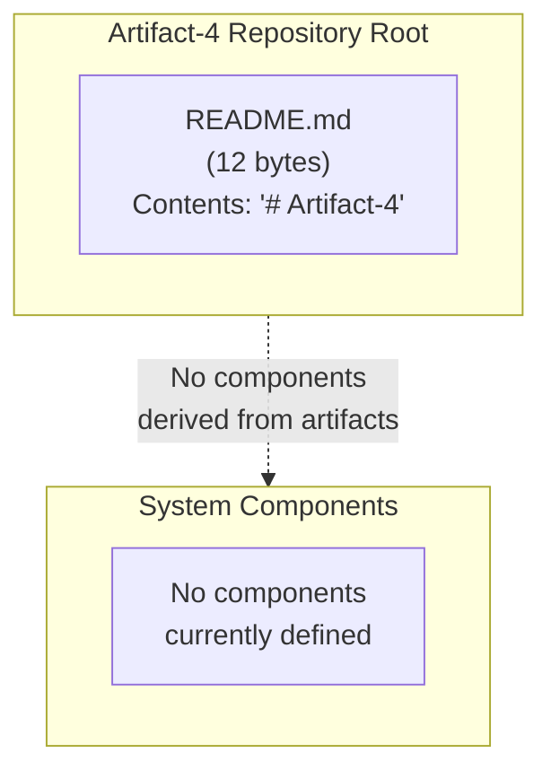

#### 1.2.2.3 Core Technical Approach

No technical approach is discernible from the repository. The following technical attributes — typically inferable from a populated codebase — are **all undetermined**:

| Technical Dimension | Status in Repository |
|---------------------|---------------------|
| Programming Language(s) | Not determined; no source files present |
| Application Framework | Not determined; no framework configuration present |
| Runtime Environment | Not determined; no manifest files present |
| Build / Package Manager | Not determined; no build files present |

| Technical Dimension | Status in Repository |
|---------------------|---------------------|
| Data Storage Strategy | Not determined; no schemas or migrations present |
| Deployment Target | Not determined; no infrastructure definitions present |
| Testing Strategy | Not determined; no test files present |
| Containerization | Not determined; no `Dockerfile` or compose files present |

### 1.2.3 Success Criteria

#### 1.2.3.1 Measurable Objectives

No measurable objectives are documented in the repository. There are no acceptance criteria, no service-level objectives (SLOs), no service-level agreements (SLAs), and no functional/non-functional requirement statements.

#### 1.2.3.2 Critical Success Factors

No critical success factors have been articulated within the repository. This subsection should be revisited once project stakeholders contribute the corresponding planning artifacts.

#### 1.2.3.3 Key Performance Indicators

| KPI Category | Defined Metric | Source of Definition |
|--------------|----------------|----------------------|
| Functional | None defined | Not present in repository |
| Performance | None defined | Not present in repository |
| Reliability | None defined | Not present in repository |
| User Experience | None defined | Not present in repository |

---

## 1.3 SCOPE

### 1.3.1 In-Scope Elements

#### 1.3.1.1 Core Features and Functionalities

No features or functionalities are declared in scope, because no features exist within the repository. The table below reflects the verifiable state:

| In-Scope Category | Items Defined in Repository |
|-------------------|----------------------------|
| Must-Have Capabilities | None defined |
| Primary User Workflows | None defined |
| Essential Integrations | None defined |
| Key Technical Requirements | None defined |

The single artifact present in the repository — the `README.md` file containing the heading `# Artifact-4` — establishes only a **project identifier** and does not constitute a feature, capability, workflow, integration, or technical requirement.

#### 1.3.1.2 Implementation Boundaries

System boundaries cannot be drawn from the current repository contents. The following dimensions of implementation boundary are all **undefined**:

| Boundary Dimension | Defined Boundary |
|--------------------|------------------|
| System Boundaries | Not defined; no component or service edges exist |
| User Groups Covered | Not defined; no user roles documented |
| Geographic / Market Coverage | Not defined; no locale, region, or market named |
| Data Domains Included | Not defined; no schemas, entities, or domain models present |

### 1.3.2 Out-of-Scope Elements

#### 1.3.2.1 Explicitly Excluded Features

The repository does not enumerate any explicitly excluded features. Because no scope-defining document (such as a Product Requirements Document, a Scope Statement, or a Statement of Work) is present, no items can be cited as deliberately out of scope.

#### 1.3.2.2 Future Phase Considerations

No phasing plan, roadmap, milestone schedule, release plan, or future-state design exists within the repository. Consequently, no future-phase items can be enumerated. The repository's near-term implicit "future phase" is simply the initial population of substantive artifacts.

#### 1.3.2.3 Integration Points Not Covered

Since no integration points are defined as in-scope (per § 1.3.1.1), the corresponding inverse — integration points explicitly excluded — likewise contains no entries.

#### 1.3.2.4 Unsupported Use Cases

No use cases — supported or unsupported — are described in the repository. This subsection will require contribution of use-case documentation before meaningful content can be authored.

### 1.3.3 Consolidated Scope Summary

The following diagram summarizes the consolidated scope state of the repository at the time of this specification's authoring:

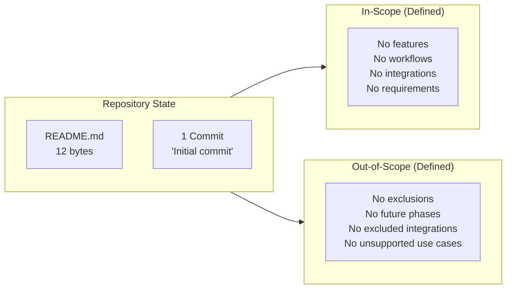

---

## 1.4 DOCUMENT CONVENTIONS AND APPROACH

### 1.4.1 Evidence-Based Documentation Standard

This Technical Specification adheres to a strict **evidence-based documentation standard**. Every assertion regarding the Artifact-4 system is grounded in artifacts actually present within the repository. Where the repository contains no evidence supporting a conventional specification topic, this document records the absence explicitly rather than inferring, extrapolating, or fabricating content.

### 1.4.2 Treatment of Absent Information

#### 1.4.2.1 Explicit Acknowledgment of Gaps

Throughout this document, statements such as "Not defined," "Not present in repository," and "Not determined" indicate **verified absence** of information at the time of authoring, based on exhaustive examination of the repository's complete file listing, git history, and remote metadata.

#### 1.4.2.2 Recommended Revision Triggers

This specification — and particularly this Introduction — should be revised when any of the following events occur:

| Revision Trigger | Sections Most Affected |
|------------------|-----------------------|
| README is expanded with project description | § 1.1.1, § 1.1.2, § 1.1.4 |
| Source code is added to the repository | § 1.2.2, § 1.2.3, § 1.3.1 |
| Requirements documentation is contributed | § 1.1.2, § 1.2.3, § 1.3 |
| Stakeholder roster is documented | § 1.1.3 |

### 1.4.3 Document Structure Overview

The Introduction section follows the canonical structure of an enterprise Technical Specification introduction, comprising an Executive Summary (§ 1.1), a System Overview (§ 1.2), a Scope statement (§ 1.3), and these documentation conventions (§ 1.4). Subsequent sections of this Technical Specification — when authored — will provide architectural, design, operational, and verification detail.

---

## 1.5 REFERENCES

### 1.5.1 Files Examined

- `README.md` — The sole file in the repository. Examined in full to confirm its contents (the single line `# Artifact-4`) and its byte size (12 bytes). Provides the project's only identifying token and is the basis for the repository-name reference used throughout § 1.1.

### 1.5.2 Folders Examined

- `/` (repository root, depth 0) — Examined to confirm complete folder inventory. Verified to contain exactly one entry (`README.md`) and zero subdirectories. Provides the basis for all statements regarding repository completeness and the absence of source, configuration, test, and infrastructure artifacts.

### 1.5.3 Repository Metadata Consulted

- **Git remote configuration** — Confirms the canonical project URL `https://github.com/ShaliniTest-maker/Artifact-4.git` referenced in § 1.1.1.1.
- **Git commit log** — Confirms the single-commit history (hash `3e64ae951eb38821e57b0e58e2d3d83f567c2a64`, message `Initial commit`, date 2026-05-28 16:08:59 +0530) referenced in § 1.1.1.1.
- **Git author records** — Confirms commit authorship by `ShaliniTest-maker <shaliniguptatest@gmail.com>` referenced in § 1.1.3.

### 1.5.4 Cross-Referenced Technical Specification Sections

No other Technical Specification sections were available for cross-reference at the time of authoring this section (the list of retrievable section headings was empty). Cross-references should be added in subsequent revisions of this document as additional sections are produced.

# 2. Product Requirements

This section catalogs the discrete, testable product features of the Artifact-4 system, together with their functional requirements, inter-feature relationships, implementation considerations, and traceability information. In accordance with the **evidence-based documentation standard** formally adopted in § 1.4.1, every entry below is grounded exclusively in artifacts verifiably present in the repository at commit `3e64ae951eb38821e57b0e58e2d3d83f567c2a64`. Because the repository in its present snapshot contains exactly one file — a 12-byte `README.md` consisting solely of the heading `# Artifact-4` — and because § 1.3.1.1 has already established that "No features or functionalities are declared in scope, because no features exist within the repository," this section necessarily records **the verified absence of all product-requirement artifacts** rather than fabricating any. The substructure below preserves the canonical Product Requirements outline (Feature Catalog, Functional Requirements Table, Feature Relationships, Implementation Considerations, Traceability Matrix) so that future contributors can populate each container as substantive requirements are authored, without altering the document skeleton.

## 2.1 DOCUMENTATION APPROACH FOR PRODUCT REQUIREMENTS

### 2.1.1 Evidence-Based Standard Reaffirmed

Per § 1.4.1, the present Technical Specification "adheres to a strict evidence-based documentation standard," and per § 1.4.2.1, vocabulary such as **"Not defined,"** **"Not present in repository,"** and **"Not determined"** indicates verified absence of information at the time of authoring. Section 2 applies this convention uniformly:

- No `F-XXX` feature identifier is assigned, because no feature is observable in the repository.
- No `F-XXX-RQ-YYY` requirement identifier is assigned, because no functional or non-functional requirement is observable in the repository.
- No acceptance criterion, priority designation, complexity rating, performance criterion, validation rule, business rule, security requirement, or compliance requirement is recorded, because none exists within the repository's contents.

The above constraints are **hard constraints** for this section. They are derived from the cumulative findings of § 1.1.4, § 1.2.2.1, § 1.2.2.2, § 1.2.2.3, § 1.2.3.1, § 1.2.3.3, § 1.3.1.1, § 1.3.1.2, and § 1.3.2.4, each of which independently documents that the corresponding category of artifact does not exist in Artifact-4.

### 2.1.2 Repository State Affecting This Section

The repository state established in § 1.1.1.1 governs every subsection that follows. The table below summarizes only those state attributes directly relevant to Product Requirements authoring:

| Repository Attribute | Value Affecting § 2 | Reference |
|----------------------|---------------------|-----------|
| Total file count | 1 (`README.md` only) | § 1.1.1.1 |
| Total subfolder count | 0 | § 1.5.2 |
| Substantive artifacts present | None beyond a naming placeholder | § 1.3.1.1 |
| Requirements documentation present | None | § 1.2.3.1 |

| Repository Attribute | Value Affecting § 2 | Reference |
|----------------------|---------------------|-----------|
| Source code present | None | § 1.2.2.2 |
| Configuration / manifest files present | None | § 1.2.2.3 |
| Test or acceptance artifacts present | None | § 1.2.2.3 |
| Issue tracker / roadmap artifacts present | None | § 1.3.2.2 |

### 2.1.3 Treatment of Conventional Subsections

Each subsection of § 2 retains its canonical heading and table structure so that the document's contract with downstream readers, automated documentation pipelines, and traceability tooling is preserved. The cells of each table are populated with explicit absence markers rather than left blank, to distinguish **verified absence** (the present state) from **unverified silence** (which evidence-based documentation does not permit). When substantive product-requirement material is contributed to the repository, the cells below will be replaced in situ; the surrounding structure will not change.

---

## 2.2 FEATURE CATALOG

### 2.2.1 Cataloging Methodology

A Feature Catalog enumerates discrete, testable product features, each assigned a unique identifier of the form `F-XXX`. Cataloging proceeds by extracting features from one or more of the following sources, in descending order of authority: (1) a Product Requirements Document (PRD), (2) a backlog of user stories or epics, (3) accepted change requests, (4) operative source code exposing user-facing behavior, or (5) explicit feature flags in configuration. **None of these source types is present in the Artifact-4 repository** (see § 1.3.1.1 and § 1.5.1).

### 2.2.2 Feature Catalog Inventory

The Feature Catalog is presented in canonical four-column form. The body row records the verified absence:

| Feature ID | Feature Name | Category | Priority |
|------------|--------------|----------|----------|
| None defined | None defined | None defined | None defined |

| Feature ID | Status | Source of Evidence | Reference |
|------------|--------|--------------------|-----------|
| None defined | Not applicable — no features exist | Repository inventory: only `README.md` | § 1.1.1.1, § 1.3.1.1 |

No `F-001`, `F-002`, or any other feature identifier is assigned. The author of this specification has affirmatively refrained from inferring features from the repository name "Artifact-4," from the numeric suffix `-4`, or from the contents of the `README.md` heading, as such inference would violate § 1.4.1.

### 2.2.3 Feature Metadata Schema (Reserved for Future Population)

The following table records the metadata schema that will be applied when features are contributed. No rows are populated because no features exist.

| Metadata Field | Expected Format | Current Value |
|----------------|-----------------|---------------|
| Unique ID | `F-XXX` (zero-padded numeric) | None defined |
| Feature Name | Short descriptive label | None defined |
| Feature Category | Functional grouping | None defined |
| Priority Level | Critical / High / Medium / Low | None defined |

| Metadata Field | Expected Format | Current Value |
|----------------|-----------------|---------------|
| Status | Proposed / Approved / In Development / Completed | None defined |
| Owner | Stakeholder or team identifier | None defined |
| Target Release | Version or milestone identifier | None defined |
| Documentation Link | Cross-reference to detailed feature page | None defined |

### 2.2.4 Feature Description Schema (Reserved for Future Population)

The conventional four narrative dimensions of a feature description — overview, business value, user benefits, and technical context — cannot be populated for any feature because no features have been cataloged. The cross-references below confirm the absence of each upstream artifact required to author these descriptions:

| Description Dimension | Required Upstream Artifact | Status | Reference |
|-----------------------|----------------------------|--------|-----------|
| Overview | Feature statement in PRD or backlog | Not present in repository | § 1.3.1.1 |
| Business Value | Documented value proposition | Not present in repository | § 1.1.4 |
| User Benefits | Documented user personas / benefits | Not present in repository | § 1.1.3, § 1.3.1.2 |
| Technical Context | Architecture or design notes | Not present in repository | § 1.2.2.1, § 1.2.2.2 |

### 2.2.5 Feature Dependency Schema (Reserved for Future Population)

A feature's dependency profile conventionally enumerates prerequisite features, system-level dependencies, external dependencies, and integration requirements. Each category is documented below as verifiably absent:

| Dependency Category | Status | Source of Evidence | Reference |
|---------------------|--------|--------------------|-----------|
| Prerequisite Features | Not applicable — no features exist | Empty Feature Catalog | § 2.2.2 |
| System Dependencies | None declared — no manifests present | No `package.json`, `requirements.txt`, `pom.xml`, `Cargo.toml`, `go.mod`, `Gemfile`, `*.csproj`, etc. | § 1.2.2.3 |
| External Dependencies | None declared — no integrations present | No API contracts, SDKs, or broker configs | § 1.2.1.3 |
| Integration Requirements | None declared — no integration surface defined | No service interfaces or endpoints present | § 1.2.1.3, § 1.2.2.1 |

---

## 2.3 FUNCTIONAL REQUIREMENTS TABLE

### 2.3.1 Functional Requirements Inventory

A Functional Requirements Table enumerates testable requirements, each tied to a parent feature via an identifier of the form `F-XXX-RQ-YYY`. Because the Feature Catalog (§ 2.2.2) contains no entries, no functional requirements can be derived. The inventory below records this verified absence:

| Requirement ID | Parent Feature | Description | Priority |
|----------------|----------------|-------------|----------|
| None defined | None defined | None defined | None defined |

| Requirement ID | Acceptance Criteria | Complexity | Reference |
|----------------|---------------------|------------|-----------|
| None defined | None defined | None defined | § 1.2.3.1 |

No `F-XXX-RQ-001`, `F-XXX-RQ-002`, or any other requirement identifier is issued. Per § 1.2.3.1, "No measurable objectives are documented in the repository. There are no acceptance criteria, no service-level objectives (SLOs), no service-level agreements (SLAs), and no functional/non-functional requirement statements" — a finding that fully governs this subsection.

### 2.3.2 Requirement Detail Schema (Reserved for Future Population)

The schema below documents the columns that will be populated when requirements are authored. The schema is preserved so that future contributors may insert rows without restructuring the table.

| Schema Field | Expected Format | Current Value |
|--------------|-----------------|---------------|
| Requirement ID | `F-XXX-RQ-YYY` | None defined |
| Description | Imperative testable statement | None defined |
| Acceptance Criteria | Given/When/Then or equivalent | None defined |
| Priority | Must-Have / Should-Have / Could-Have | None defined |

| Schema Field | Expected Format | Current Value |
|--------------|-----------------|---------------|
| Complexity | High / Medium / Low | None defined |
| Stability | Stable / Volatile | None defined |
| Verification Method | Test / Inspection / Analysis / Demonstration | None defined |
| Source / Origin | Stakeholder, document, or evidence trail | None defined |

### 2.3.3 Technical Specification Schema (Reserved for Future Population)

The technical-specification dimensions of each requirement — input parameters, output/response, performance criteria, and data requirements — are documented below as verifiably absent. Each cross-reference confirms that no upstream artifact exists from which to derive these specifications.

| Specification Dimension | Status | Source of Evidence | Reference |
|--------------------------|--------|--------------------|-----------|
| Input Parameters | None defined — no interfaces present | No source code, no API spec | § 1.2.2.1 |
| Output / Response | None defined — no interfaces present | No source code, no API spec | § 1.2.2.1 |
| Performance Criteria | None defined — no SLOs/SLAs present | No performance KPIs documented | § 1.2.3.3 |
| Data Requirements | None defined — no schemas present | No data domains identified | § 1.3.1.2 |

### 2.3.4 Validation Rules Schema (Reserved for Future Population)

Conventional validation-rule categories — business rules, data validation, security requirements, and compliance requirements — are each documented below as verifiably absent.

| Validation Category | Status | Source of Evidence | Reference |
|---------------------|--------|--------------------|-----------|
| Business Rules | None defined | No domain model, no rules engine, no documented rules | § 1.2.2.1 |
| Data Validation | None defined | No schemas, no constraints, no validators present | § 1.3.1.2 |
| Security Requirements | None defined | No authentication, authorization, or encryption configuration present | § 1.2.1.3 |
| Compliance Requirements | None defined | No regulatory, industry, or organizational policy referenced | § 1.2.1.1 |

---

## 2.4 FEATURE RELATIONSHIPS

The Feature Relationships subsection conventionally maps inter-feature dependencies, shared integration points, common components, and shared services. Each map below is necessarily empty, because — per § 2.2.2 — the Feature Catalog contains zero entries, and per § 1.2.2.2, "The repository contains no modules, packages, services, classes, functions, or other architectural components."

### 2.4.1 Feature Dependency Map

A dependency map requires at least two features between which a dependency edge can be drawn. With zero features cataloged, no edges can be drawn. The dependency-map state is recorded below:

| Map Attribute | Current Value | Reference |
|---------------|---------------|-----------|
| Number of nodes (features) | 0 | § 2.2.2 |
| Number of edges (dependencies) | 0 | § 2.2.2 |
| Cycles detected | Not applicable | § 2.2.2 |
| Topological ordering | Not applicable | § 2.2.2 |

### 2.4.2 Integration Points

Per § 1.2.1.3, no API contracts, message broker configurations, database connection strings, third-party SDKs, enterprise service bus definitions, or identity provider configurations exist within the repository. Accordingly, no integration points can be enumerated:

| Integration Point Type | Status | Reference |
|------------------------|--------|-----------|
| Synchronous API endpoints | None defined | § 1.2.1.3 |
| Asynchronous messaging | None defined | § 1.2.1.3 |
| Database / persistence interfaces | None defined | § 1.2.2.3 |
| Third-party SDK invocations | None defined | § 1.2.1.3 |

### 2.4.3 Shared Components

Per § 1.2.2.2, the repository contains no modules, packages, services, classes, or functions. Consequently, no components can be designated as shared between features:

| Shared-Component Category | Status | Reference |
|---------------------------|--------|-----------|
| Shared libraries or modules | None defined | § 1.2.2.2 |
| Shared data models | None defined | § 1.3.1.2 |
| Shared UI components | None defined | § 1.2.2.1 |
| Shared utility functions | None defined | § 1.2.2.2 |

### 2.4.4 Common Services

Per § 1.2.2.1, the repository "defines no system capabilities" and contains "no executable entry points, no service definitions, no user interfaces, no command-line tools, no library exports, and no documented behaviors." Therefore, no common services can be enumerated:

| Common-Service Category | Status | Reference |
|-------------------------|--------|-----------|
| Authentication / Identity service | None defined | § 1.2.1.3 |
| Logging / Observability service | None defined | § 1.2.2.3 |
| Configuration / Feature-flag service | None defined | § 1.2.2.3 |
| Background / Scheduled job service | None defined | § 1.2.2.1 |

---

## 2.5 IMPLEMENTATION CONSIDERATIONS

Implementation considerations enumerate, for each feature, the technical constraints, performance requirements, scalability considerations, security implications, and maintenance requirements that govern its construction and operation. With zero features cataloged in § 2.2.2, none of these dimensions can be populated per-feature. The categorical absence is recorded below for completeness.

### 2.5.1 Technical Constraints

Per § 1.2.2.3, the programming language, application framework, runtime environment, build / package manager, data storage strategy, deployment target, testing strategy, and containerization approach are **all "Not determined"** for the Artifact-4 repository. Consequently, no technical constraints can be enumerated:

| Constraint Dimension | Status | Reference |
|----------------------|--------|-----------|
| Language / Platform Constraints | Not determined | § 1.2.2.3 |
| Framework Constraints | Not determined | § 1.2.2.3 |
| Runtime / OS Constraints | Not determined | § 1.2.2.3 |
| Build / Toolchain Constraints | Not determined | § 1.2.2.3 |

### 2.5.2 Performance Requirements

Per the Key Performance Indicators table in § 1.2.3.3, the Functional, Performance, Reliability, and User Experience KPI categories are each marked "None defined." Consequently, no performance requirements can be enumerated:

| Performance Dimension | Status | Reference |
|-----------------------|--------|-----------|
| Throughput targets | None defined | § 1.2.3.3 |
| Latency / response-time targets | None defined | § 1.2.3.3 |
| Concurrency / load targets | None defined | § 1.2.3.3 |
| Resource-utilization targets | None defined | § 1.2.3.3 |

### 2.5.3 Scalability Considerations

Per § 1.2.2.3, no deployment target is determined and no infrastructure definitions are present. Per § 1.2.1.3, no integration posture with any enterprise landscape is defined. Consequently, no scalability considerations can be enumerated:

| Scalability Dimension | Status | Reference |
|-----------------------|--------|-----------|
| Horizontal scaling approach | None defined | § 1.2.2.3 |
| Vertical scaling approach | None defined | § 1.2.2.3 |
| Stateful vs. stateless design | None defined | § 1.2.2.1 |
| Capacity planning assumptions | None defined | § 1.2.3.1 |

### 2.5.4 Security Implications

The repository contains no authentication mechanism, no authorization scheme, no encryption configuration, no secrets store, no security policy, no threat model, and no compliance framework. Consequently, no security implications can be enumerated:

| Security Dimension | Status | Reference |
|--------------------|--------|-----------|
| Authentication / Identity | None defined | § 1.2.1.3 |
| Authorization / Access control | None defined | § 1.2.1.3 |
| Data protection / Encryption | None defined | § 1.3.1.2 |
| Auditing / Compliance | None defined | § 1.2.1.1 |

### 2.5.5 Maintenance Requirements

Per § 1.2.2.3, no testing strategy is determined. The repository contains no CI/CD pipeline configuration, no monitoring or observability setup, no runbook, and no operational documentation. Consequently, no maintenance requirements can be enumerated:

| Maintenance Dimension | Status | Reference |
|-----------------------|--------|-----------|
| Test strategy / coverage targets | Not determined | § 1.2.2.3 |
| CI/CD pipeline | Not present in repository | § 1.2.2.3 |
| Monitoring / Observability | Not present in repository | § 1.2.2.3 |
| Operational runbook / playbook | Not present in repository | § 1.3.2.4 |

---

## 2.6 TRACEABILITY MATRIX

### 2.6.1 Matrix Structure

A Traceability Matrix conventionally links each functional requirement (column key) to the upstream artifacts that justify it (rows) and to the downstream artifacts that verify it (rows). Rows commonly include: business objective, stakeholder need, design element, source-code module, and test case. Columns enumerate `F-XXX-RQ-YYY` identifiers.

### 2.6.2 Current Matrix State

Because § 2.3.1 issues no `F-XXX-RQ-YYY` identifiers, the matrix has zero columns. Because § 1.1.2, § 1.1.4, § 1.2.2.2, and § 1.5.1 confirm the absence of upstream and downstream artifacts, the matrix has zero usable rows. The current matrix is therefore a **null matrix**, recorded as follows:

| Traceability Dimension | Current Value | Reference |
|------------------------|---------------|-----------|
| Number of requirements (columns) | 0 | § 2.3.1 |
| Number of upstream artifacts (rows) | 0 | § 1.1.2, § 1.1.4 |
| Number of downstream artifacts (rows) | 0 | § 1.2.2.2, § 1.5.1 |
| Number of traceability links | 0 | § 2.4.1 |

| Linkage Type | Status | Reference |
|--------------|--------|-----------|
| Business objective → Requirement | None defined | § 1.1.4 |
| Stakeholder need → Requirement | None defined | § 1.1.3 |
| Requirement → Design element | None defined | § 1.2.2.2 |
| Requirement → Test case | None defined | § 1.2.2.3 |

No related process flowcharts are referenced from this section, because no processes are defined in the repository (see § 1.2.2.1). When functional and non-functional requirements are authored in a future revision, this matrix should be expanded to include explicit cross-references to corresponding architecture, design, and test sections of the Technical Specification.

---

## 2.7 ASSUMPTIONS, CONSTRAINTS, AND REVISION CONTROL

### 2.7.1 Documented Assumptions

This section makes the following assumptions, each of which is itself grounded in evidence already documented in §§ 1.1–1.5:

| Assumption | Justification | Reference |
|------------|---------------|-----------|
| The repository snapshot examined is authoritative | Single-commit history confirms no alternative state exists | § 1.1.1.1 |
| The README content is complete, not truncated | `read_file` returned exactly 12 bytes; one line | § 1.5.1 |
| No hidden files or `.blitzyignore` masking occurs | File-system check returned no `.blitzyignore` files | § 1.5.2 |
| The repository name does not, of itself, imply requirements | Per § 1.4.1, naming is insufficient evidence for feature inference | § 1.2.1.1 |

### 2.7.2 Documented Constraints

The following constraints govern this section's content and structure:

| Constraint | Source | Reference |
|------------|--------|-----------|
| No fabrication of feature identifiers | Evidence-based standard | § 1.4.1 |
| No fabrication of requirement identifiers | Evidence-based standard | § 1.4.1 |
| Use of vocabulary "Not defined," "Not determined," "Not present in repository" | Treatment of absent information | § 1.4.2.1 |
| Preservation of canonical PRD substructure | Documentation contract with downstream readers | § 2.1.3 |

### 2.7.3 Revision Triggers for Section 2

Modeled on the revision-trigger table in § 1.4.2.2, the following events warrant revision of Section 2:

| Revision Trigger | Subsections Most Affected |
|------------------|---------------------------|
| A Product Requirements Document (PRD) is contributed | § 2.2, § 2.3, § 2.6 |
| A user-story backlog or epic list is contributed | § 2.2, § 2.3 |
| Source code introducing user-facing behavior is added | § 2.2, § 2.4, § 2.5 |
| API contracts (OpenAPI, gRPC, GraphQL, AsyncAPI) are added | § 2.3.3, § 2.4.2 |

| Revision Trigger | Subsections Most Affected |
|------------------|---------------------------|
| Data schemas or domain models are added | § 2.3.3, § 2.3.4, § 2.4.3 |
| Test suites or acceptance-criteria fixtures are added | § 2.3.2, § 2.6 |
| Performance budgets, SLOs, or SLAs are documented | § 2.5.2, § 2.5.3 |
| Security or compliance policies are documented | § 2.3.4, § 2.5.4 |

### 2.7.4 Requirement Version Tracking

Requirement version tracking conventionally records, for each `F-XXX-RQ-YYY` identifier, the version at which the requirement was introduced, the versions in which it was amended, and the version at which it was retired (if applicable). With zero requirements issued in § 2.3.1, no version-tracking entries exist:

| Tracking Dimension | Current Value | Reference |
|--------------------|---------------|-----------|
| Requirements introduced (this version) | 0 | § 2.3.1 |
| Requirements amended (this version) | 0 | § 2.3.1 |
| Requirements retired (this version) | 0 | § 2.3.1 |
| Section 2 baseline version | Initial (concurrent with § 1 baseline) | § 1.1.1.1 |

---

## 2.8 CONSOLIDATED PRODUCT REQUIREMENTS STATE

The following diagram summarizes the consolidated state of Section 2 at the time of this specification's authoring. The diagram preserves the canonical PRD substructure while reflecting the verified absence of substantive content in every container.

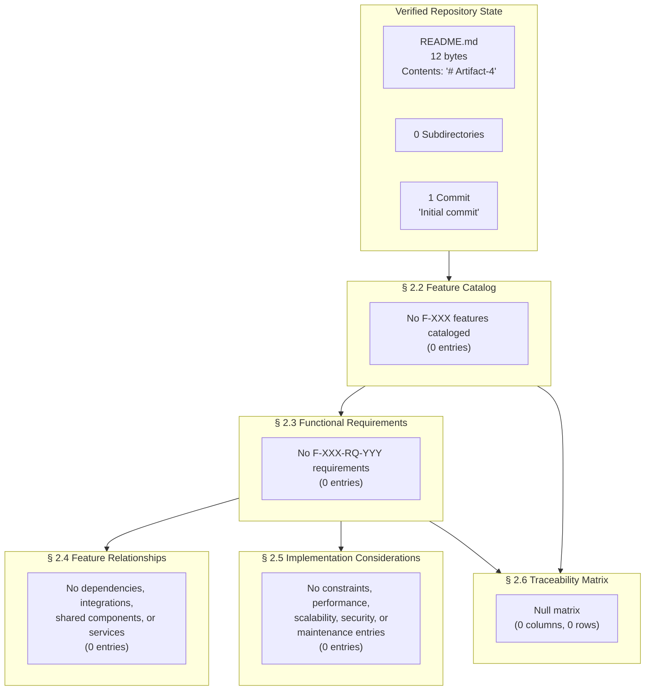

The diagram is intentionally a faithful pictorial counterpart to the textual content of §§ 2.2 through 2.6: every container exists structurally and is connected as it would be in a populated PRD, but each container holds zero substantive entries. As substantive product-requirement artifacts are contributed to the repository, the nodes labeled "No …" should be replaced with concrete feature, requirement, and relationship descriptors, and edges should be augmented with explicit traceability annotations.

---

## 2.9 REFERENCES

### 2.9.1 Files Examined

- `README.md` — The sole file in the repository. Examined to confirm its 12-byte size and one-line content (`# Artifact-4`). Establishes that no feature, requirement, acceptance criterion, or product description can be derived from documentation present in the repository. Cited throughout § 2.1, § 2.2, and § 2.3.

### 2.9.2 Folders Examined

- `/` (repository root, depth 0) — Examined to confirm that no subdirectories exist. Establishes that no source code directories, configuration directories, test directories, documentation directories, or infrastructure directories are present from which features or requirements could be derived. Cited throughout § 2.4 and § 2.5.

### 2.9.3 Repository Metadata Consulted

- **Git remote configuration** — Confirms the canonical project URL `https://github.com/ShaliniTest-maker/Artifact-4.git`. Used in § 2.1.2 to anchor the repository-state attestation.
- **Git commit log** — Confirms a single-commit history (hash `3e64ae951eb38821e57b0e58e2d3d83f567c2a64`, message `Initial commit`, date 2026-05-28 16:08:59 +0530). Used in § 2.7.1 as the basis for the "snapshot is authoritative" assumption.
- **Git author records** — Confirms commit authorship by `ShaliniTest-maker <shaliniguptatest@gmail.com>`. Used in § 2.6.2 to establish that no additional stakeholder roles are available for traceability rows.

### 2.9.4 Cross-Referenced Technical Specification Sections

The following sections of the present Technical Specification are cross-referenced from § 2 to anchor the evidence-based attestations:

- **§ 1.1.1.1 Repository State Snapshot** — Anchors the repository attributes table in § 2.1.2.
- **§ 1.1.2 Core Business Problem** — Establishes the absence of upstream traceability rows referenced in § 2.6.2.
- **§ 1.1.3 Key Stakeholders and Users** — Establishes the absence of stakeholder-need traceability rows referenced in § 2.6.2.
- **§ 1.1.4 Expected Business Impact and Value Proposition** — Establishes the absence of business-value description referenced in § 2.2.4.
- **§ 1.2.1.1 Business Context and Market Positioning** — Establishes that the repository name "Artifact-4" cannot be used to infer features, referenced in § 2.7.1.
- **§ 1.2.1.3 Integration with Existing Enterprise Landscape** — Establishes the absence of integration points referenced in § 2.4.2.
- **§ 1.2.2.1 Primary System Capabilities** — Establishes the absence of capabilities referenced in § 2.4.4.
- **§ 1.2.2.2 Major System Components** — Establishes the absence of shared components referenced in § 2.4.3.
- **§ 1.2.2.3 Core Technical Approach** — Establishes the absence of technical constraints referenced in § 2.5.1.
- **§ 1.2.3.1 Measurable Objectives** — Establishes the absence of acceptance criteria, SLOs, and SLAs referenced in § 2.3.1.
- **§ 1.2.3.3 Key Performance Indicators** — Establishes the absence of performance KPIs referenced in § 2.5.2.
- **§ 1.3.1.1 Core Features and Functionalities** — Establishes the empty In-Scope inventory referenced throughout § 2.1 and § 2.2.
- **§ 1.3.1.2 Implementation Boundaries** — Establishes the absence of data domains and user groups referenced in § 2.3.3 and § 2.4.3.
- **§ 1.3.2.2 Future Phase Considerations** — Establishes the absence of roadmap or backlog artifacts referenced in § 2.1.2.
- **§ 1.3.2.4 Unsupported Use Cases** — Establishes the absence of use-case documentation referenced in § 2.5.5.
- **§ 1.4.1 Evidence-Based Documentation Standard** — Establishes the binding standard reaffirmed in § 2.1.1.
- **§ 1.4.2.1 Explicit Acknowledgment of Gaps** — Establishes the canonical absence vocabulary used uniformly in § 2.
- **§ 1.4.2.2 Recommended Revision Triggers** — Provides the template adapted into § 2.7.3.
- **§ 1.5.1 Files Examined** — Confirms the file inventory underpinning § 2.9.1.
- **§ 1.5.2 Folders Examined** — Confirms the folder inventory underpinning § 2.9.2.

### 2.9.5 External Searches Performed

No external web searches were performed in the authoring of this section. All factual content was derived from artifacts and metadata internal to the Artifact-4 repository and from sections § 1.1 through § 1.5 of the present Technical Specification.

# 3. Technology Stack

This section enumerates the programming languages, frameworks, libraries, third-party services, databases, and development/deployment tooling that constitute the Artifact-4 technology stack. Consistent with the **evidence-based documentation standard** established in § 1.4.1, every entry in this section is grounded in artifacts actually present within the repository. Where the repository contains no evidence supporting a conventional technology-stack topic, this section records the absence explicitly using the canonical vocabulary defined in § 1.4.2.1 (`"Not defined,"` `"Not present in repository,"` `"Not determined"`) rather than inferring, extrapolating, or fabricating content.

The authoritative inventory of technical dimensions for Artifact-4 — established in § 1.2.2.3 (*Core Technical Approach*) — records all eight conventional dimensions (Programming Language, Application Framework, Runtime Environment, Build/Package Manager, Data Storage Strategy, Deployment Target, Testing Strategy, Containerization) as **"Not determined."** Section 3 reaffirms, refines, and cross-indexes those findings into the canonical six-subsection technology-stack taxonomy demanded by enterprise documentation practice.

## 3.1 TECHNOLOGY STACK DOCUMENTATION APPROACH

### 3.1.1 Evidence-Based Selection Methodology

A technology-stack section conventionally documents the deliberate, justified selection of programming languages, frameworks, services, and tooling that the system under specification has adopted. Such documentation is grounded in one or more of the following sources of authority, in descending order: (1) declared dependency manifests (e.g., `package.json`, `requirements.txt`, `pom.xml`, `Cargo.toml`, `go.mod`, `Gemfile`, `*.csproj`); (2) executable source files whose extensions and import statements identify the language and framework in use; (3) infrastructure-as-code (IaC) artifacts (e.g., `Dockerfile`, `docker-compose.yml`, Terraform, Helm, Kubernetes manifests); (4) CI/CD pipeline definitions; and (5) explicit Architectural Decision Records (ADRs).

**None of these source types is present in the Artifact-4 repository.** Per § 1.1.1.1 (*Repository State Snapshot*), the working tree contains exactly one file (`README.md`, 12 bytes) and zero subdirectories outside `.git/` version-control metadata. Per § 2.2.5 (*Feature Dependency Schema*), system dependencies are recorded as "None declared — no manifests present" with the explicit observation that no `package.json`, `requirements.txt`, `pom.xml`, `Cargo.toml`, `go.mod`, `Gemfile`, or `*.csproj` exists in the repository.

### 3.1.2 Treatment of the Default Technology Stack

A default technology stack was offered as authoring guidance for this section (Python/Flask, MongoDB, Auth0, AWS, Docker, Terraform, GitHub Actions, React with TypeScript, TailwindCSS, React Native, Swift, Kotlin, Objective-C, ElectronJS, and Langchain). **This default is not applied** in Section 3, for the following compounding reasons:

| Reason for Non-Application | Governing Authority |
|----------------------------|--------------------|
| The evidence-based standard prohibits inference, extrapolation, or fabrication | § 1.4.1 |
| Section 3's own authoring instructions direct: *"Only include sections and items that are actually relevant to this system, based on your analysis of its requirements. Don't add any items that aren't clearly applicable."* | Section 3 prompt (binding) |
| Eight technical dimensions are already authoritatively recorded as "Not determined" | § 1.2.2.3 |
| Fabrication of identifiers is explicitly enumerated as a documented constraint | § 2.7.2 |
| No system dependencies are declared | § 2.2.5 |
| No integration points (API/messaging/database/SDK) exist | § 2.4.2 |
| No common services (authentication/logging/configuration/jobs) exist | § 2.4.4 |
| No technical constraints (language/framework/runtime/toolchain) exist | § 2.5.1 |
| No security dimensions (authn/authz/encryption/audit) exist | § 2.5.4 |
| No maintenance dimensions (test/CI-CD/monitoring/runbook) exist | § 2.5.5 |

Applying the default stack would directly contradict and invalidate every preceding section of this Technical Specification. The default is therefore retained as **non-binding authoring guidance only**, available as a reference set when contributors begin populating the repository and may consult it as one of several candidate baselines.

### 3.1.3 Canonical Subsection Preservation

Per the documentation contract with downstream readers articulated in § 2.7.2 ("Preservation of canonical PRD substructure"), Section 3 preserves the canonical six-subsection technology-stack structure — Programming Languages (§ 3.2), Frameworks & Libraries (§ 3.3), Open Source Dependencies (§ 3.4), Third-Party Services (§ 3.5), Databases & Storage (§ 3.6), and Development & Deployment (§ 3.7) — and populates each with verified-absence markers and reserved-for-future-population scaffolding. This treatment mirrors the pattern established in § 2.2.3 (*Feature Metadata Schema (Reserved for Future Population)*), § 2.2.4 (*Feature Description Schema (Reserved for Future Population)*), and § 2.2.5 (*Feature Dependency Schema (Reserved for Future Population)*).

## 3.2 PROGRAMMING LANGUAGES

### 3.2.1 Language Inventory by Platform and Component

A programming-language inventory enumerates the languages adopted for each platform or component of the system (backend services, frontend applications, mobile clients, native applications, data pipelines, infrastructure scripting, etc.). Identification of a language requires either (a) source files with language-specific extensions (`.py`, `.js`, `.ts`, `.tsx`, `.java`, `.kt`, `.swift`, `.m`, `.go`, `.rs`, `.rb`, `.cs`, `.cpp`, `.c`, `.php`, etc.) or (b) language-version pinning files (`.python-version`, `.nvmrc`, `.ruby-version`, `.tool-versions`, `rust-toolchain.toml`, etc.).

| Platform / Component | Language(s) Adopted | Source of Evidence |
|----------------------|---------------------|---------------------|
| Backend services | None defined | No source files; § 1.2.2.3 |
| Frontend web | None defined | No source files; § 1.2.2.3 |
| Mobile / cross-platform | None defined | No source files; § 1.2.2.3 |
| Native iOS / macOS / Android | None defined | No source files; § 1.2.2.3 |
| Desktop applications | None defined | No source files; § 1.2.2.3 |
| Infrastructure / scripting | None defined | No source files; § 1.2.2.3 |

The only file present in the working tree (`README.md`, 12 bytes, sole content `# Artifact-4`) is a Markdown document, not a programming-language artifact. Markdown is a lightweight markup syntax used here for naming only; it is not a programming language in the sense intended by this subsection.

### 3.2.2 Selection Criteria (Reserved for Future Population)

When languages are adopted, the following selection-criteria schema will be applied. No rows are populated because no language has been adopted.

| Selection Criterion | Expected Documentation | Current Value |
|---------------------|------------------------|---------------|
| Suitability for problem domain | Mapping of language features to functional requirements | Not determined — no requirements documented (§ 2.3) |
| Team expertise and hiring market | Skills-availability rationale | Not determined — no stakeholder roster (§ 1.1.3) |
| Ecosystem maturity | Library/framework availability | Not determined — no framework requirement (§ 3.3) |
| Performance characteristics | Latency/throughput rationale | Not determined — no performance targets (§ 2.5.2) |
| Tooling and developer experience | Build/test/debug ecosystem rationale | Not determined — no toolchain defined (§ 3.7) |
| Long-term support and stability | LTS/EOL policy alignment | Not determined — no runtime defined (§ 1.2.2.3) |

### 3.2.3 Language Version Files and Toolchain Pinning

Language-version files declare the specific runtime version that the project requires, enabling reproducible local and CI environments. The repository contains **no language-version pinning files**.

| Pinning File | Purpose | Status in Repository |
|--------------|---------|----------------------|
| `.python-version` | pyenv Python version pin | Not present in repository |
| `.nvmrc` / `.node-version` | Node.js version pin | Not present in repository |
| `.ruby-version` | rbenv/chruby Ruby version pin | Not present in repository |
| `.tool-versions` | asdf multi-runtime pin | Not present in repository |
| `rust-toolchain.toml` | Rust toolchain pin | Not present in repository |
| `go.mod` (Go directive) | Go language version pin | Not present in repository |
| `.java-version` / `.sdkmanrc` | Java toolchain pin | Not present in repository |

## 3.3 FRAMEWORKS AND LIBRARIES

### 3.3.1 Core Framework Inventory

A core framework is the dominant application framework that structures the runtime model of each platform or component (e.g., a web framework, an application server, a UI framework, a mobile framework, an AI/ML framework). Identification requires either explicit declaration in a dependency manifest, import statements in source files, or framework-specific configuration files (e.g., `next.config.js`, `vite.config.ts`, `manage.py`, `pom.xml` with framework dependencies, `application.yml`).

| Component | Core Framework | Version | Source of Evidence |
|-----------|----------------|---------|---------------------|
| Web backend framework | None defined | Not applicable | § 1.2.2.3 (Application Framework: Not determined) |
| Web frontend framework | None defined | Not applicable | § 1.2.2.3 |
| Mobile / cross-platform framework | None defined | Not applicable | § 1.2.2.3 |
| AI / ML framework | None defined | Not applicable | § 1.2.2.3 |
| Testing framework | None defined | Not applicable | § 2.5.5 (Test strategy: Not determined) |
| Infrastructure / IaC framework | None defined | Not applicable | § 2.5.5 (CI/CD pipeline: Not present in repository) |

Per § 2.5.1 (*Technical Constraints*), the "Framework Constraints" dimension is recorded as "Not determined" with cross-reference to § 1.2.2.3. No core framework can therefore be enumerated.

### 3.3.2 Supporting Library Inventory

Supporting libraries augment core frameworks with cross-cutting concerns: logging, configuration, validation, serialization, HTTP clients, ORM/DAL, queue clients, observability, feature-flag clients, and similar. Per § 2.4.3 (*Shared Components*), no shared libraries or modules exist; per § 2.4.4 (*Common Services*), no logging/observability, configuration/feature-flag, or background-job services are defined.

| Supporting Library Category | Library Selection | Source of Evidence |
|-----------------------------|-------------------|---------------------|
| Logging / structured logging | None defined | § 2.4.4 |
| Configuration / environment loaders | None defined | § 2.4.4 |
| Validation / schema enforcement | None defined | § 2.3.3 |
| HTTP client | None defined | § 2.4.2 |
| ORM / data-access library | None defined | § 1.2.2.3 (Data Storage Strategy: Not determined) |
| Message-broker / queue client | None defined | § 2.4.2 |
| Observability / tracing | None defined | § 2.5.5 |
| Feature-flag client | None defined | § 2.4.4 |

### 3.3.3 Compatibility Requirements

Compatibility requirements document the minimum/maximum versions, the interoperability constraints, and the supported runtime matrices for each adopted framework or library. With zero frameworks and zero libraries adopted, no compatibility requirements can be enumerated.

| Compatibility Dimension | Status | Reference |
|-------------------------|--------|-----------|
| Minimum framework version | Not applicable — no frameworks adopted | § 3.3.1 |
| Cross-library interoperability matrix | Not applicable — no libraries adopted | § 3.3.2 |
| Target runtime matrix | Not determined | § 1.2.2.3 (Runtime Environment: Not determined) |
| Operating-system support matrix | Not determined | § 2.5.3 |

## 3.4 OPEN SOURCE DEPENDENCIES

### 3.4.1 Dependency Manifest Inventory

Open-source dependencies are declared in language- and ecosystem-specific manifest files. Per § 2.2.5 (*Feature Dependency Schema*), the repository contains **no dependency manifests of any kind**. The exhaustive list of manifest formats sought and not found is reproduced below for traceability:

| Ecosystem | Primary Manifest | Lockfile(s) | Status in Repository |
|-----------|-----------------|-------------|----------------------|
| Node.js / JavaScript / TypeScript | `package.json` | `package-lock.json`, `yarn.lock`, `pnpm-lock.yaml` | Not present in repository |
| Python | `requirements.txt`, `pyproject.toml`, `setup.py`, `Pipfile` | `Pipfile.lock`, `poetry.lock`, `uv.lock` | Not present in repository |
| Java / JVM | `pom.xml`, `build.gradle`, `build.gradle.kts`, `settings.gradle` | `gradle.lockfile` | Not present in repository |
| Rust | `Cargo.toml` | `Cargo.lock` | Not present in repository |
| Go | `go.mod` | `go.sum` | Not present in repository |
| Ruby | `Gemfile` | `Gemfile.lock` | Not present in repository |
| PHP | `composer.json` | `composer.lock` | Not present in repository |
| .NET | `*.csproj`, `*.sln`, `packages.config` | `packages.lock.json` | Not present in repository |
| Elixir | `mix.exs` | `mix.lock` | Not present in repository |
| Dart / Flutter | `pubspec.yaml` | `pubspec.lock` | Not present in repository |
| Swift Packages | `Package.swift` | `Package.resolved` | Not present in repository |

### 3.4.2 Package Registries and Lockfiles

Package-registry usage and lockfile policy describe which registries the project consumes (e.g., npmjs.com, PyPI, Maven Central, crates.io, pkg.go.dev, RubyGems, NuGet) and how transitive resolution is pinned for reproducibility. With zero manifests present, no registry usage is configured, and no lockfile commitments exist.

| Registry / Policy Dimension | Status | Reference |
|-----------------------------|--------|-----------|
| Public registries consumed | None defined | § 3.4.1 |
| Private / mirrored registries configured | None defined | § 3.4.1 |
| Lockfile policy (committed vs. ignored) | Not determined — no lockfiles exist | § 3.4.1 |
| Dependency-resolution strategy | Not determined — no resolver invoked | § 3.4.1 |

### 3.4.3 Version Pinning and Vulnerability Management

Version-pinning policy and vulnerability-management workflow describe how the project specifies acceptable version ranges, how it incorporates security advisories, and how supply-chain integrity is enforced. With no declared dependencies, none of these dimensions can be populated.

| Vulnerability / Pinning Dimension | Status | Reference |
|-----------------------------------|--------|-----------|
| Pin strategy (exact, caret, tilde, range) | None defined | § 3.4.1 |
| Vulnerability scanning tool | Not present in repository | § 2.5.5 |
| Dependency-update automation (e.g., Dependabot, Renovate) | Not present in repository | § 2.5.5 |
| Software Bill of Materials (SBOM) | Not present in repository | § 2.5.5 |
| License compliance scanning | Not present in repository | § 2.5.5 |

## 3.5 THIRD-PARTY SERVICES

### 3.5.1 External APIs and Integrations

Third-party APIs and integrations are documented through API contracts (OpenAPI / Swagger, gRPC `.proto`, GraphQL SDL, AsyncAPI), SDK imports in source code, or explicit configuration of endpoint URLs, credentials, and webhooks. Per § 1.2.1.3 (*Integration with Existing Enterprise Landscape*) and § 2.4.2 (*Integration Points*), no such artifacts exist in the repository.

| Integration Surface | Status | Reference |
|---------------------|--------|-----------|
| Outbound REST / GraphQL APIs | None defined | § 2.4.2 |
| Inbound webhook receivers | None defined | § 2.4.2 |
| gRPC service interfaces | None defined | § 2.4.2 |
| Message-broker integrations (Kafka, RabbitMQ, SQS, etc.) | None defined | § 2.4.2 |
| Vendor SDK invocations | None defined | § 2.4.2 |
| Payment / billing services | None defined | § 1.2.1.3 |
| Email / notification services | None defined | § 1.2.1.3 |

### 3.5.2 Authentication and Identity Services

Per § 2.4.4 (*Common Services*), the "Authentication / Identity service" category is recorded as "None defined." Per § 2.5.4 (*Security Implications*), the "Authentication / Identity" and "Authorization / Access control" security dimensions are likewise recorded as "None defined."

| Identity Capability | Provider Selection | Reference |
|---------------------|-------------------|-----------|
| User authentication / sign-in | None defined | § 2.5.4 |
| Single sign-on (SSO) | None defined | § 2.5.4 |
| OAuth / OIDC integration | None defined | § 2.5.4 |
| Multi-factor authentication | None defined | § 2.5.4 |
| Authorization / RBAC | None defined | § 2.5.4 |
| Service-to-service authentication | None defined | § 2.5.4 |

### 3.5.3 Monitoring and Observability Services

Per § 2.4.4 (*Common Services*) and § 2.5.5 (*Maintenance Requirements*), no logging, observability, monitoring, or tracing service is configured.

| Observability Capability | Provider Selection | Reference |
|--------------------------|-------------------|-----------|
| Centralized logging (e.g., ELK, Splunk, Loki) | Not present in repository | § 2.5.5 |
| Metrics collection (e.g., Prometheus, Datadog) | Not present in repository | § 2.5.5 |
| Distributed tracing (e.g., Jaeger, Tempo, X-Ray) | Not present in repository | § 2.5.5 |
| Application Performance Monitoring (APM) | Not present in repository | § 2.5.5 |
| Error / crash reporting (e.g., Sentry, Rollbar) | Not present in repository | § 2.5.5 |
| Synthetic monitoring / uptime checks | Not present in repository | § 2.5.5 |
| Real User Monitoring (RUM) | Not present in repository | § 2.5.5 |

### 3.5.4 Cloud Platform Services

Cloud platform usage is documented through infrastructure-as-code (IaC) artifacts (Terraform, CloudFormation, Pulumi, Bicep, ARM templates), container orchestration manifests (Kubernetes YAML, Helm charts, ECS task definitions), or serverless deployment descriptors (SAM, Serverless Framework, AWS CDK). Per § 1.2.2.3 (*Core Technical Approach*), the "Deployment Target" dimension is "Not determined; no infrastructure definitions present."

| Cloud-Service Category | Provider / Selection | Reference |
|------------------------|---------------------|-----------|
| Compute (VM / serverless / container) | None defined | § 1.2.2.3 |
| Managed databases | None defined | § 1.2.2.3 |
| Object storage | None defined | § 1.2.2.3 |
| Content Delivery Network (CDN) | None defined | § 1.2.2.3 |
| DNS / domain management | None defined | § 1.2.2.3 |
| Secrets management (e.g., AWS SM, HashiCorp Vault) | None defined | § 2.5.4 |
| Identity / IAM platform | None defined | § 2.5.4 |
| Container registry | None defined | § 1.2.2.3 |

## 3.6 DATABASES AND STORAGE

### 3.6.1 Primary and Secondary Databases

Database adoption is documented through schema files (`*.sql`, `*.prisma`, JSON-Schema), migration directories (Alembic, Flyway, Liquibase, Django migrations, Rails migrations), ORM model files, or explicit connection-string configuration. Per § 1.2.2.3 (*Core Technical Approach*), the "Data Storage Strategy" dimension is "Not determined; no schemas or migrations present." Per § 2.4.2 (*Integration Points*), "Database / persistence interfaces" are recorded as "None defined."

| Database Tier | Engine / Selection | Version | Reference |
|---------------|-------------------|---------|-----------|
| Primary OLTP database | None defined | Not applicable | § 1.2.2.3 |
| Secondary / read-replica database | None defined | Not applicable | § 1.2.2.3 |
| Analytical / OLAP store | None defined | Not applicable | § 1.2.2.3 |
| Document database | None defined | Not applicable | § 1.2.2.3 |
| Key-value store | None defined | Not applicable | § 1.2.2.3 |
| Graph database | None defined | Not applicable | § 1.2.2.3 |
| Search index (Elasticsearch, OpenSearch, etc.) | None defined | Not applicable | § 1.2.2.3 |
| Time-series database | None defined | Not applicable | § 1.2.2.3 |
| Vector / embedding database | None defined | Not applicable | § 1.2.2.3 |

### 3.6.2 Data Persistence Strategy

Data-persistence strategy describes the schemas, the migration approach, the consistency and transactional guarantees, the partitioning and sharding policy, and the backup-and-recovery posture. Per § 2.3.3, "Data Requirements" are recorded as "None defined — no schemas present | No data domains identified." Per § 1.3.1.2, "Data Domains Included" is recorded as "Not defined; no schemas, entities, or domain models present."

| Persistence Dimension | Status | Reference |
|-----------------------|--------|-----------|
| Schema design / data model | None defined | § 1.3.1.2 |
| Migration framework | None defined | § 1.2.2.3 |
| Transactional consistency model | None defined | § 2.3.3 |
| Sharding / partitioning strategy | None defined | § 2.5.3 |
| Backup / restore policy | None defined | § 2.5.5 |
| Retention / archival policy | None defined | § 2.5.4 |
| Encryption-at-rest configuration | None defined | § 2.5.4 |

### 3.6.3 Caching Solutions

Caching solutions are documented through in-process cache configuration (e.g., LRU caches in code), distributed-cache deployments (Redis, Memcached, Hazelcast), HTTP-cache directives, or CDN edge-cache policies. None of these artifacts exists in the repository.

| Cache Tier | Selection | Reference |
|------------|-----------|-----------|
| In-process / local cache | None defined | § 1.2.2.2 |
| Distributed cache (Redis, Memcached, etc.) | None defined | § 1.2.2.3 |
| HTTP-response cache | None defined | § 2.4.2 |
| CDN edge cache | None defined | § 3.5.4 |
| Cache invalidation strategy | None defined | § 1.2.2.2 |

### 3.6.4 Object and File Storage Services

Object- and file-storage usage is documented through storage-bucket configuration (S3, GCS, Azure Blob), file-system mount declarations, or content-addressable storage adapters. None of these artifacts exists in the repository.

| Storage Category | Selection | Reference |
|------------------|-----------|-----------|
| Blob / object storage (S3 / GCS / Azure Blob) | None defined | § 3.5.4 |
| Network-attached file storage | None defined | § 3.5.4 |
| Static-asset hosting | None defined | § 3.5.4 |
| Media / large-object pipeline | None defined | § 3.5.4 |

## 3.7 DEVELOPMENT AND DEPLOYMENT

### 3.7.1 Development Tooling

Development tooling encompasses editor configuration, linters, formatters, type checkers, pre-commit hooks, and developer-experience scripts. The repository contains **no development-tool configuration files**.

| Development Tool Category | Configuration File(s) Sought | Status |
|---------------------------|------------------------------|--------|
| EditorConfig | `.editorconfig` | Not present in repository |
| JavaScript / TypeScript linter | `.eslintrc.*`, `eslint.config.*` | Not present in repository |
| Code formatter | `.prettierrc`, `pyproject.toml [tool.black]` | Not present in repository |
| Python linter | `.flake8`, `ruff.toml`, `pylintrc` | Not present in repository |
| Type checker | `tsconfig.json`, `mypy.ini`, `pyrightconfig.json` | Not present in repository |
| Git hooks framework | `.pre-commit-config.yaml`, `.husky/` | Not present in repository |
| Commit-message linter | `commitlint.config.*`, `.gitmessage` | Not present in repository |
| Editor recommendations | `.vscode/`, `.idea/` | Not present in repository |
| Issue / PR templates | `.github/ISSUE_TEMPLATE/`, `.github/PULL_REQUEST_TEMPLATE.md` | Not present in repository |

### 3.7.2 Build System and Task Runners

Build systems and task runners are identified through build scripts (`Makefile`, `Justfile`, `Taskfile.yml`), language-native build descriptors (covered in § 3.4.1), or polyglot orchestrators (Bazel, Nx, Turborepo, Lerna). Per § 1.2.2.3 (*Core Technical Approach*), the "Build / Package Manager" dimension is "Not determined; no build files present."

| Build / Task Tool | Configuration File(s) Sought | Status |
|-------------------|------------------------------|--------|
| GNU Make | `Makefile`, `GNUmakefile` | Not present in repository |
| Just | `Justfile` | Not present in repository |
| Task | `Taskfile.yml` | Not present in repository |
| npm / pnpm / Yarn scripts | `package.json` `scripts` block | Not present in repository (§ 3.4.1) |
| Gradle | `build.gradle`, `build.gradle.kts` | Not present in repository (§ 3.4.1) |
| Maven | `pom.xml` | Not present in repository (§ 3.4.1) |
| Bazel | `BUILD`, `WORKSPACE`, `MODULE.bazel` | Not present in repository |
| Polyglot monorepo orchestrator | `nx.json`, `turbo.json`, `lerna.json`, `pnpm-workspace.yaml` | Not present in repository |
| Custom shell build script | `build.sh`, `scripts/` | Not present in repository |

### 3.7.3 Containerization

Containerization is documented through container-image build definitions (`Dockerfile`, `Containerfile`), multi-container orchestration (`docker-compose.yml`, `docker-compose.yaml`, `compose.yaml`), build-context exclusions (`.dockerignore`), and image-base/registry declarations. Per § 1.2.2.3 (*Core Technical Approach*), the "Containerization" dimension is "Not determined; no `Dockerfile` or compose files present."

| Containerization Artifact | Status | Reference |
|---------------------------|--------|-----------|
| `Dockerfile` / `Containerfile` | Not present in repository | § 1.2.2.3 |
| `docker-compose.yml` / `compose.yaml` | Not present in repository | § 1.2.2.3 |
| `.dockerignore` | Not present in repository | § 1.2.2.3 |
| Base image policy | None defined | § 1.2.2.3 |
| Container registry target | None defined | § 3.5.4 |
| Kubernetes manifests (`*.yaml` under `k8s/`, `manifests/`) | Not present in repository | § 3.5.4 |
| Helm chart (`Chart.yaml`, `values.yaml`) | Not present in repository | § 3.5.4 |

### 3.7.4 Continuous Integration and Continuous Deployment

CI/CD pipelines are documented through workflow files for hosted services (GitHub Actions, GitLab CI, Azure Pipelines, CircleCI, Bitbucket Pipelines, Jenkins, Drone, Buildkite). Per § 2.5.5 (*Maintenance Requirements*), the "CI/CD pipeline" dimension is recorded as "Not present in repository."

| CI / CD Platform | Configuration File(s) Sought | Status |
|------------------|------------------------------|--------|
| GitHub Actions | `.github/workflows/*.yml` | Not present in repository |
| GitLab CI/CD | `.gitlab-ci.yml` | Not present in repository |
| Azure Pipelines | `azure-pipelines.yml` | Not present in repository |
| CircleCI | `.circleci/config.yml` | Not present in repository |
| Bitbucket Pipelines | `bitbucket-pipelines.yml` | Not present in repository |
| Jenkins | `Jenkinsfile` | Not present in repository |
| Drone | `.drone.yml` | Not present in repository |
| Buildkite | `.buildkite/pipeline.yml` | Not present in repository |
| Argo / Flux GitOps | Argo `Application`, Flux `Kustomization` | Not present in repository |
| IaC (Terraform / Pulumi / CDK) | `*.tf`, `*.tfvars`, Pulumi project, CDK app | Not present in repository |
| Configuration management (Ansible / Chef / Puppet) | `playbook.yml`, recipes, manifests | Not present in repository |

## 3.8 CROSS-COMPONENT INTEGRATION AND SECURITY POSTURE

### 3.8.1 Integration Requirements Between Components

A technology-stack section conventionally documents the integration contracts that bind one component of the stack to another — e.g., how the web tier authenticates to the database, how the backend obtains secrets, how the frontend consumes the backend API, how the CI pipeline pushes images to the registry. **Zero such contracts exist** in Artifact-4 because zero components exist to be integrated. Per § 1.2.2.2 (*Major System Components*), the repository contains "no modules, packages, services, classes, functions, or other architectural components."

| Inter-Component Contract | Status | Reference |
|--------------------------|--------|-----------|
| Frontend ↔ backend API contract | None defined | § 2.4.2 |
| Backend ↔ database connection contract | None defined | § 3.6.1 |
| Backend ↔ message-broker contract | None defined | § 2.4.2 |
| Backend ↔ secrets-store contract | None defined | § 3.5.4 |
| Service ↔ service mesh contract | None defined | § 1.2.2.2 |
| Container ↔ orchestrator contract | None defined | § 3.7.3 |
| Pipeline ↔ registry push contract | None defined | § 3.7.4 |

### 3.8.2 Security Implications of Technology Choices

Technology-stack choices typically carry security implications: a chosen language's memory-safety profile, a framework's CVE history, a library's transitive vulnerability surface, a database engine's encryption defaults, a cloud provider's compliance posture. Per § 2.5.4 (*Security Implications*), all security dimensions (Authentication/Identity, Authorization/Access control, Data protection/Encryption, Auditing/Compliance) are recorded as "None defined." Because **no technology choices have been made**, there are correspondingly **no technology-derived security implications to document at this time**.

| Security Implication Category | Status | Reference |
|------------------------------|--------|-----------|
| Language-level memory-safety profile | Not applicable — no language adopted | § 3.2.1 |
| Framework CVE / advisory surface | Not applicable — no framework adopted | § 3.3.1 |
| Transitive dependency vulnerabilities | Not applicable — no dependencies declared | § 3.4.1 |
| Encryption-in-transit (TLS configuration) | None defined | § 2.5.4 |
| Encryption-at-rest (database / object store) | None defined | § 3.6.2 |
| Secrets-management posture | None defined | § 3.5.4 |
| Identity-provider trust boundaries | None defined | § 3.5.2 |
| Compliance / regulatory alignment (SOC 2, HIPAA, GDPR, PCI-DSS) | None defined | § 2.5.4 |

## 3.9 CONSOLIDATED TECHNOLOGY STACK STATE

### 3.9.1 State Summary Diagram

The following diagram summarizes the consolidated state of Section 3 at the time of this specification's authoring. The diagram preserves the canonical technology-stack substructure while reflecting the verified absence of any concrete technology selection in every container. The diagram follows the pattern established in § 1.2.2.2 and § 2.8.

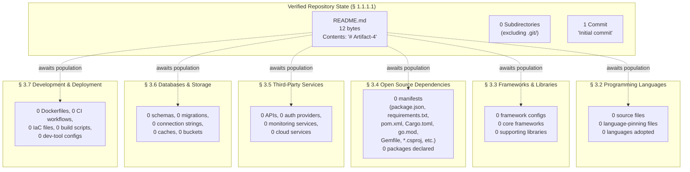

The diagram is intentionally a faithful pictorial counterpart to the textual content of §§ 3.2 through 3.7: every container exists structurally and is positioned as it would be in a populated technology stack, but each container holds zero concrete entries. As substantive technology artifacts are contributed to the repository, the nodes labeled "0 …" should be replaced with concrete language, framework, dependency, service, store, and pipeline descriptors.

### 3.9.2 Cross-Reference Summary Matrix

The following matrix consolidates every cross-reference made in Section 3 back to the upstream subsections of Sections 1 and 2 that originally established the verified absence:

| Section 3 Subsection | Primary Upstream Reference | Supporting Upstream References |
|----------------------|---------------------------|--------------------------------|
| § 3.2 Programming Languages | § 1.2.2.3 (Programming Language: Not determined) | § 2.5.1 (Language/Platform Constraints: Not determined) |
| § 3.3 Frameworks & Libraries | § 1.2.2.3 (Application Framework: Not determined) | § 2.5.1, § 2.4.3, § 2.4.4 |
| § 3.4 Open Source Dependencies | § 2.2.5 (System Dependencies: None declared) | § 1.2.2.3 (Build / Package Manager: Not determined) |
| § 3.5 Third-Party Services | § 1.2.1.3 (Enterprise integration: wholly undefined) | § 2.4.2, § 2.4.4, § 2.5.4 |
| § 3.6 Databases & Storage | § 1.2.2.3 (Data Storage Strategy: Not determined) | § 2.3.3, § 2.4.2, § 1.3.1.2 |
| § 3.7 Development & Deployment | § 1.2.2.3 (Containerization, Deployment Target, Testing Strategy: Not determined) | § 2.5.5 (CI/CD: Not present in repository) |
| § 3.8.1 Inter-Component Integration | § 1.2.2.2 (no components exist) | § 2.4.2, § 2.4.3 |
| § 3.8.2 Security Implications | § 2.5.4 (all security dimensions: None defined) | § 1.2.1.3 |

## 3.10 REVISION TRIGGERS FOR SECTION 3

Modeled on the revision-trigger tables in § 1.4.2.2 (*Recommended Revision Triggers*) and § 2.7.3 (*Revision Triggers for Section 2*), the following events warrant revision of Section 3.

### 3.10.1 Triggers by Subsection

| Revision Trigger | Subsections Most Affected |
|------------------|---------------------------|
| Source files with language-specific extensions are added | § 3.2.1, § 3.2.3 |
| A language-version pinning file (`.python-version`, `.nvmrc`, `.tool-versions`, etc.) is added | § 3.2.3 |
| A core framework configuration file is added | § 3.3.1, § 3.3.3 |
| A dependency manifest (`package.json`, `requirements.txt`, `pom.xml`, `Cargo.toml`, `go.mod`, `Gemfile`, `*.csproj`, etc.) is added | § 3.4.1, § 3.4.2, § 3.4.3 |
| API contracts (OpenAPI, gRPC `.proto`, GraphQL SDL, AsyncAPI) are added | § 3.5.1, § 3.8.1 |
| Identity-provider configuration (Auth0, Cognito, Keycloak, etc.) is added | § 3.5.2, § 3.8.2 |
| Observability or monitoring configuration is added | § 3.5.3 |
| Infrastructure-as-code artifacts (Terraform, CloudFormation, Pulumi, CDK) are added | § 3.5.4, § 3.7.4 |
| Database schemas, migrations, or ORM models are added | § 3.6.1, § 3.6.2 |
| Cache deployment manifests or in-process cache configuration is added | § 3.6.3 |
| Object/blob storage bucket configuration is added | § 3.6.4 |
| Linter, formatter, or type-checker configuration is added | § 3.7.1 |
| Build script (`Makefile`, `Justfile`, `Taskfile.yml`) or build-tool descriptor is added | § 3.7.2 |
| `Dockerfile`, `docker-compose.yml`, Kubernetes manifests, or Helm charts are added | § 3.7.3 |
| CI/CD workflow files are added | § 3.7.4 |
| Security policies, threat models, or compliance documentation are added | § 3.8.2 |

### 3.10.2 Artifact-to-Subsection Mapping

The following inverse mapping lets contributors immediately locate the subsections that require revision when a specific artifact type is contributed:

| Contributed Artifact Type | Subsections Requiring Revision |
|---------------------------|-------------------------------|
| Source file (any executable language) | § 3.2.1, § 3.9.1 |
| Dependency manifest | § 3.4.1, § 3.4.2, § 3.4.3, § 3.9.1 |
| Framework configuration | § 3.3.1, § 3.3.3, § 3.9.1 |
| API contract or SDK invocation | § 3.5.1, § 3.8.1 |
| Database schema or migration | § 3.6.1, § 3.6.2, § 3.9.1 |
| Containerization artifact | § 3.7.3, § 3.9.1 |
| CI/CD workflow file | § 3.7.4, § 3.9.1 |
| IaC artifact | § 3.5.4, § 3.7.4, § 3.9.1 |
| Authentication / identity configuration | § 3.5.2, § 3.8.2 |
| Observability / monitoring configuration | § 3.5.3 |
| Security or compliance policy | § 3.8.2 |

## 3.11 REFERENCES

### 3.11.1 Files Examined

- `README.md` — The sole file in the working tree (12 bytes; sole content `# Artifact-4`). Examined to confirm that no language identifier, framework declaration, dependency reference, service URL, database engine, or build/deployment instruction is present. Provides only a naming token; supplies no technology-stack evidence.

### 3.11.2 Folders Explored

- Repository root (`/`) — Examined to confirm that no source-code subdirectories (`src/`, `lib/`, `app/`, `cmd/`, `pkg/`, `internal/`), no test directories (`tests/`, `test/`, `__tests__/`, `spec/`), no infrastructure directories (`terraform/`, `infra/`, `deploy/`, `k8s/`, `helm/`, `ansible/`), no CI directories (`.github/`, `.gitlab/`, `.circleci/`, `.buildkite/`), and no configuration directories (`.vscode/`, `.idea/`, `config/`, `etc/`) exist. The only entry beyond `.git/` version-control metadata is the single `README.md` file. Verified search coverage included queries for "package manifest dependency file," "Dockerfile container configuration infrastructure," "source code implementation," and "source folder code," each of which returned zero matching artifacts.

### 3.11.3 Technical Specification Sections Referenced

- **§ 1.1.1.1 Repository State Snapshot** — Authoritative source for the file inventory (1 file), commit count (1), branch (`main`), and remote-origin URL.
- **§ 1.2.1.3 Integration with Existing Enterprise Landscape** — Authoritative source for the absence of integrations, API contracts, message brokers, database connection strings, third-party SDKs, ESB definitions, and identity-provider configurations.
- **§ 1.2.2.2 Major System Components** — Authoritative source for the absence of modules, packages, services, classes, functions, and other architectural components.
- **§ 1.2.2.3 Core Technical Approach** — Authoritative source for the eight "Not determined" technical dimensions: Programming Language(s), Application Framework, Runtime Environment, Build/Package Manager, Data Storage Strategy, Deployment Target, Testing Strategy, Containerization.
- **§ 1.3.1.2 Data Domains Included** — Authoritative source for the absence of data domains, schemas, entities, and domain models.
- **§ 1.4.1 Evidence-Based Documentation Standard** — Binding constraint prohibiting inference, extrapolation, or fabrication; the principal justification for not applying the Default Technology Stack.
- **§ 1.4.2.1 Explicit Acknowledgment of Gaps** — Canonical absence vocabulary (`"Not defined,"` `"Not present in repository,"` `"Not determined"`) used throughout Section 3.
- **§ 1.4.2.2 Recommended Revision Triggers** — Template adapted for § 3.10.
- **§ 2.1.3** — Documentation contract requiring preservation of canonical PRD substructure with absence markers.
- **§ 2.2.5 Feature Dependency Schema (Reserved for Future Population)** — Authoritative source for the exhaustive list of dependency-manifest formats sought and not found.
- **§ 2.3.3** — Authoritative source for the absence of data requirements and schemas.
- **§ 2.4.2 Integration Points** — Authoritative source for the absence of synchronous APIs, asynchronous messaging, database/persistence interfaces, and third-party SDK invocations.
- **§ 2.4.3 Shared Components** — Authoritative source for the absence of shared libraries, modules, data models, UI components, and utility functions.
- **§ 2.4.4 Common Services** — Authoritative source for the absence of authentication/identity, logging/observability, configuration/feature-flag, and background/scheduled-job services.
- **§ 2.5.1 Technical Constraints** — Authoritative source for the absence of language/platform, framework, runtime/OS, and build/toolchain constraints.
- **§ 2.5.3 Scalability Considerations** — Authoritative source for the absence of horizontal/vertical scaling approaches and capacity-planning assumptions.
- **§ 2.5.4 Security Implications** — Authoritative source for the absence of authentication/identity, authorization/access control, data protection/encryption, and auditing/compliance dimensions.
- **§ 2.5.5 Maintenance Requirements** — Authoritative source for the absence of test strategy/coverage, CI/CD pipeline, monitoring/observability, and operational runbook.
- **§ 2.7.2 Documented Constraints** — Establishes the prohibition against fabrication of identifiers, governing the disposition of the Default Technology Stack.
- **§ 2.7.3 Revision Triggers for Section 2** — Template adapted for § 3.10.
- **§ 2.8 Consolidated Product Requirements State** — Pictorial pattern adapted for § 3.9.1.

---

# 4. Process Flowchart

This section documents the process flows, workflow sequences, decision logic, state transitions, and integration choreography of the Artifact-4 system. Consistent with the **evidence-based documentation standard** established in § 1.4.1 and reaffirmed in § 2.1.1 and § 3.1.1, every entry below is grounded in artifacts actually present within the repository. Where the repository contains no evidence supporting a conventional Process-Flowchart topic, this section records the absence explicitly using the canonical vocabulary defined in § 1.4.2.1 (`"Not defined,"` `"Not present in repository,"` `"Not determined"`), rather than inferring, extrapolating, or fabricating workflows, sequences, or state machines.

The authoritative inventory of artifacts available for flowchart derivation — established in § 1.1.1.1 (*Repository State Snapshot*) — records exactly one file (`README.md`, 12 bytes, content `# Artifact-4`), zero subdirectories outside `.git/` metadata, and one commit (`Initial commit`, hash `3e64ae951eb38821e57b0e58e2d3d83f567c2a64`). From this snapshot, no executable behavior, no user-facing interaction, no system component, no integration surface, no state machine, and no error-handling pathway is observable. Section 4 therefore preserves the canonical Process-Flowchart substructure while documenting verified absence in every container.

---

## 4.1 PROCESS FLOWCHART DOCUMENTATION APPROACH

### 4.1.1 Evidence-Based Standard Reaffirmed

Per § 1.4.1, the present Technical Specification "adheres to a strict evidence-based documentation standard," and per § 1.4.2.1, vocabulary such as **"Not defined,"** **"Not present in repository,"** and **"Not determined"** indicates verified absence of information at the time of authoring. Section 4 applies this convention uniformly:

- No workflow identifier (e.g., `W-XXX`) is assigned, because no workflow is observable in the repository.
- No process step, decision diamond, swim lane, or actor is defined, because no behavior, no component, no user role, and no integration counterparty is observable in the repository.
- No state, state transition, persistence point, transaction boundary, or caching tier is defined, because no stateful artifact is observable in the repository.
- No error state, retry policy, fallback path, notification channel, or recovery procedure is defined, because no operational artifact is observable in the repository.
- No timing constraint, SLA target, or SLO budget is defined, because no measurable objective is observable in the repository.

The above constraints are **hard constraints** for this section. They are derived from the cumulative findings of § 1.2.1.3 (*Integration with Existing Enterprise Landscape*), § 1.2.2.1 (*Primary System Capabilities*), § 1.2.2.2 (*Major System Components*), § 1.2.2.3 (*Core Technical Approach*), § 1.2.3.1 (*Measurable Objectives*), § 1.2.3.3 (*Key Performance Indicators*), § 1.3.1.1 (*Core Features and Functionalities*), § 1.3.1.2 (*Implementation Boundaries*), § 2.2.2 (*Feature Catalog Inventory*), § 2.3.1 (*Functional Requirements Inventory*), § 2.3.4 (*Validation Rules Schema*), § 2.4.2 (*Integration Points*), § 2.4.4 (*Common Services*), § 2.5.4 (*Security Implications*), § 2.5.5 (*Maintenance Requirements*), § 3.5.1 (*External APIs and Integrations*), § 3.5.3 (*Monitoring and Observability Services*), § 3.6.1 (*Primary and Secondary Databases*), § 3.6.2 (*Data Persistence Strategy*), and § 3.6.3 (*Caching Solutions*) — each of which independently documents that the corresponding category of artifact does not exist in Artifact-4.

### 4.1.2 Repository State Affecting This Section

The repository state established in § 1.1.1.1 governs every subsection that follows. The table below summarizes only those state attributes directly relevant to Process-Flowchart authoring:

| Repository Attribute | Value Affecting § 4 | Reference |
|----------------------|---------------------|-----------|
| Total file count | 1 (`README.md` only) | § 1.1.1.1 |
| Executable entry points present | None | § 1.2.2.1 |
| Architectural components present | None | § 1.2.2.2 |
| User-facing interfaces present | None | § 1.2.2.1 |

| Repository Attribute | Value Affecting § 4 | Reference |
|----------------------|---------------------|-----------|
| API contracts (OpenAPI / gRPC / GraphQL / AsyncAPI) present | None | § 3.5.1 |
| Message-broker / event-bus configuration present | None | § 2.4.2 |
| Database schemas / migrations / ORM models present | None | § 3.6.1, § 3.6.2 |
| Workflow / BPMN / state-machine descriptors present | None | § 1.2.2.3 |

| Repository Attribute | Value Affecting § 4 | Reference |
|----------------------|---------------------|-----------|
| Operational runbook / playbook present | None | § 2.5.5 |
| CI/CD pipeline / scheduled-job definitions present | None | § 2.5.5, § 2.4.4 |
| Observability / monitoring / error-reporting configuration present | None | § 3.5.3 |
| SLO / SLA / KPI definitions present | None | § 1.2.3.1, § 1.2.3.3 |

### 4.1.3 Canonical Subsection Preservation

Per the documentation contract with downstream readers articulated in § 2.7.2 (*"Preservation of canonical PRD substructure"*) and reaffirmed in § 3.1.3, Section 4 preserves the canonical Process-Flowchart substructure — **System Workflows** (§ 4.2), **Flowchart Requirements** (§ 4.3), **Technical Implementation** (§ 4.4), and **Required Diagrams** (§ 4.5) — and populates each with verified-absence markers and reserved-for-future-population scaffolding. This treatment mirrors the pattern established in § 2.2.3 (*Feature Metadata Schema (Reserved for Future Population)*), § 2.2.4 (*Feature Description Schema (Reserved for Future Population)*), § 2.2.5 (*Feature Dependency Schema (Reserved for Future Population)*), § 2.3.2, § 2.3.3, and § 2.3.4. When substantive process-flow material is contributed to the repository, the cells and diagrams below will be replaced in situ; the surrounding structure will not change.

---

## 4.2 SYSTEM WORKFLOWS

A System Workflows subsection conventionally describes (1) the end-to-end business processes that the system orchestrates and (2) the integration workflows by which the system exchanges data and events with external counterparties. Both dimensions are documented below as verifiably absent.

### 4.2.1 Core Business Processes

Core business processes are derived from operative source code exposing user-facing behavior, a Product Requirements Document (PRD), a backlog of user stories or epics, or explicit workflow descriptors (BPMN, Camunda, Temporal, Step Functions, Airflow DAGs, etc.). Per § 1.2.2.1, the repository "defines no system capabilities" and contains "no executable entry points, no service definitions, no user interfaces, no command-line tools, no library exports, and no documented behaviors." Per § 1.3.1.1, "No features or functionalities are declared in scope, because no features exist within the repository." Per § 2.2.2, the Feature Catalog contains zero entries.

| Core-Process Dimension | Status | Source of Evidence | Reference |
|------------------------|--------|--------------------|-----------|
| End-to-end user journeys | None defined | No user roles documented; no UI; no entry points | § 1.1.3, § 1.2.2.1, § 1.3.1.1 |
| System interactions | None defined | No components, services, or modules present | § 1.2.2.2, § 2.4.3 |
| Decision points | None defined | No business rules, no domain model, no rules engine | § 2.3.4 |
| Error handling paths (within core processes) | None defined | No operational runbook; no error-reporting service | § 2.5.5, § 3.5.3 |

| Core-Process Dimension | Status | Source of Evidence | Reference |
|------------------------|--------|--------------------|-----------|
| Workflow start points | None defined | No executable entry points present | § 1.2.2.1 |
| Workflow end points | None defined | No terminating states or success conditions documented | § 1.2.2.1, § 1.2.3.1 |
| Process steps | None defined | No behaviors, no functions, no methods present | § 1.2.2.1, § 1.2.2.2 |
| User touchpoints | None defined | No UIs, no CLIs, no user roles documented | § 1.1.3, § 1.2.2.1 |

No `W-001`, `W-002`, or any other workflow identifier is assigned. The author of this specification has affirmatively refrained from inferring user journeys from the repository name "Artifact-4" or from the contents of the `README.md` heading, as such inference would violate § 1.4.1.

### 4.2.2 Integration Workflows

Integration workflows are derived from API contracts, message-broker topic and queue definitions, event-stream schemas (Avro, Protobuf, JSON-Schema), batch-job descriptors, file-transfer manifests, or scheduled-task configurations. Per § 1.2.1.3 (*Integration with Existing Enterprise Landscape*), "No integrations, external system references, API contracts, message broker configurations, database connection strings, third-party SDKs, enterprise service bus definitions, or identity provider configurations exist within the repository." Per § 2.4.2 (*Integration Points*), every integration-point category is recorded as "None defined." Per § 3.5.1 (*External APIs and Integrations*), every integration surface is likewise "None defined."

| Integration-Workflow Dimension | Status | Reference |
|---------------------------------|--------|-----------|
| Data flow between systems | None defined | § 1.2.1.3, § 1.3.1.2 |
| API interactions (REST / GraphQL / gRPC) | None defined | § 2.4.2, § 3.5.1 |
| Event processing flows (Kafka / RabbitMQ / SQS / SNS / EventBridge) | None defined | § 2.4.2, § 3.5.1 |
| Batch processing sequences | None defined | § 2.4.4 (no Background / Scheduled job service) |

| Integration-Workflow Dimension | Status | Reference |
|---------------------------------|--------|-----------|
| Inbound webhook receivers | None defined | § 3.5.1 |
| Outbound webhook publishers | None defined | § 3.5.1 |
| File-transfer / SFTP / EDI pipelines | None defined | § 1.2.1.3 |
| Vendor SDK invocations | None defined | § 3.5.1 |

Because no integration counterparties are named anywhere in the repository, no swim-lane partitioning is possible. The default technology stack referenced in § 3.1.2 (Python/Flask, MongoDB, Auth0, AWS, etc.) is **explicitly not applied** to populate hypothetical integration sequences, in conformance with the binding non-application directive established in § 3.1.2.

---

## 4.3 FLOWCHART REQUIREMENTS

### 4.3.1 Workflow Element Schema (Reserved for Future Population)

The schema below documents the canonical workflow elements that will be populated when process flows are authored. The schema is preserved so that future contributors may insert flowchart elements without restructuring this section.

| Schema Field | Expected Format | Current Value |
|--------------|-----------------|---------------|
| Workflow ID | `W-XXX` (zero-padded numeric) | None defined |
| Workflow Name | Short descriptive label | None defined |
| Start Point | Triggering event / entry condition | None defined |
| End Point(s) | Success / terminal states | None defined |

| Schema Field | Expected Format | Current Value |
|--------------|-----------------|---------------|
| Process Steps | Ordered list of activities | None defined |
| Decision Diamonds | Predicate expressions with branch labels | None defined |
| System Boundaries | Component / service / domain edges | None defined |
| User Touchpoints | UI screens, CLI commands, API surfaces | None defined |

| Schema Field | Expected Format | Current Value |
|--------------|-----------------|---------------|
| Error States | Exception classes, fault codes, dead-letter destinations | None defined |
| Recovery Paths | Compensating actions, retry/backoff policies | None defined |
| Timing Constraints | Step-level latency budgets, end-to-end SLA targets | None defined |
| Actors / Swim Lanes | Roles, services, external systems | None defined |

Per § 1.2.3.1, "No measurable objectives are documented in the repository. There are no acceptance criteria, no service-level objectives (SLOs), no service-level agreements (SLAs), and no functional/non-functional requirement statements." Consequently, the "Timing Constraints" row above cannot be derived from any upstream artifact.

### 4.3.2 Validation Rules

The Validation Rules subsection conventionally enumerates the business rules, data-validation requirements, authorization checkpoints, and regulatory-compliance checks invoked at each step of each workflow. This subsection mirrors the schema established in § 2.3.4 (*Validation Rules Schema (Reserved for Future Population)*), with each row cross-referenced to the upstream attestation of absence.

| Validation Category | Status | Source of Evidence | Reference |
|---------------------|--------|--------------------|-----------|
| Business Rules at each step | None defined | No domain model, no rules engine, no documented rules | § 2.3.4 |
| Data Validation Requirements | None defined | No schemas, no constraints, no validators present | § 2.3.3, § 2.3.4 |
| Authorization Checkpoints | None defined | No authentication, authorization, or RBAC scheme present | § 2.5.4, § 3.5.2 |
| Regulatory Compliance Checks | None defined | No regulatory, industry, or organizational policy referenced | § 1.2.1.1, § 2.5.4 |

| Validation Category | Status | Source of Evidence | Reference |
|---------------------|--------|--------------------|-----------|
| Input parameter validation | None defined | No interfaces, no API spec, no schemas | § 2.3.3 |
| Output / response validation | None defined | No interfaces, no API spec, no schemas | § 2.3.3 |
| Cross-field / business invariants | None defined | No domain model, no entities | § 1.3.1.2 |
| Quota / rate-limit enforcement | None defined | No API surface, no quota configuration | § 2.4.2, § 3.5.1 |

---

## 4.4 TECHNICAL IMPLEMENTATION

### 4.4.1 State Management

State management is documented through schema files, ORM models, finite-state-machine descriptors (XState, AASM, Spring State Machine, etc.), workflow-orchestration definitions (Temporal, Camunda, Step Functions), cache-key conventions, or explicit transaction-boundary annotations. Per § 1.2.2.1, the repository contains no documented behaviors. Per § 1.2.2.2, the repository contains no modules, packages, services, classes, or functions that could possess state. Per § 3.6.1, every database tier (Primary OLTP, Secondary, OLAP, Document, Key-value, Graph, Search, Time-series, Vector) is recorded as "None defined." Per § 3.6.2, every persistence dimension (schema design, migration framework, transactional consistency, sharding, backup, retention, encryption-at-rest) is recorded as "None defined." Per § 3.6.3, every cache tier (in-process, distributed, HTTP-response, CDN edge, invalidation strategy) is recorded as "None defined."

| State-Management Dimension | Status | Reference |
|----------------------------|--------|-----------|
| State transitions | None defined — no stateful components | § 1.2.2.1, § 1.2.2.2 |
| Data persistence points | None defined — no database tiers selected | § 3.6.1, § 3.6.2 |
| Caching requirements | None defined — no cache tiers configured | § 3.6.3 |
| Transaction boundaries | None defined — no transactional consistency model | § 3.6.2 |

| State-Management Dimension | Status | Reference |
|----------------------------|--------|-----------|
| Idempotency keys / deduplication windows | None defined | § 2.4.2, § 3.6.2 |
| Optimistic / pessimistic concurrency control | None defined | § 3.6.2 |
| Saga / distributed-transaction orchestration | None defined | § 2.4.2, § 3.6.2 |
| Event-sourcing / CQRS materializations | None defined | § 3.6.1, § 3.6.2 |

### 4.4.2 Error Handling

Error handling is documented through exception hierarchies in source code, retry/backoff library configuration (e.g., `tenacity`, `polly`, `resilience4j`), dead-letter queue declarations, circuit-breaker configurations, error-reporting service integrations (Sentry, Rollbar, Bugsnag, etc.), alerting routes, and operational runbooks. Per § 2.5.5 (*Maintenance Requirements*), the "Test strategy / coverage targets" dimension is "Not determined," and the "CI/CD pipeline," "Monitoring / Observability," and "Operational runbook / playbook" dimensions are each "Not present in repository." Per § 3.5.3 (*Monitoring and Observability Services*), every observability capability — centralized logging, metrics collection, distributed tracing, APM, error/crash reporting, synthetic monitoring, RUM — is recorded as "Not present in repository."

| Error-Handling Dimension | Status | Reference |
|--------------------------|--------|-----------|
| Retry mechanisms | None defined — no retry library or policy present | § 2.5.5 |
| Fallback processes | None defined — no circuit breaker or fallback handler present | § 2.5.5 |
| Error notification flows | Not present in repository — no error-reporting service configured | § 3.5.3 |
| Recovery procedures | None defined — no operational runbook present | § 2.5.5 |

| Error-Handling Dimension | Status | Reference |
|--------------------------|--------|-----------|
| Exception hierarchy / fault taxonomy | None defined — no source code present | § 1.2.2.2 |
| Dead-letter / parking-lot queues | None defined — no messaging infrastructure | § 2.4.2 |
| Circuit-breaker / bulkhead configuration | None defined — no resilience library configured | § 2.5.5 |
| Alert routing / on-call escalation | None defined — no observability platform configured | § 3.5.3 |
| Compensation / rollback handlers | None defined — no transactional or saga model | § 3.6.2 |

---

## 4.5 REQUIRED DIAGRAMS

The Section 4 authoring prompt mandates Mermaid.js diagrams for (1) a high-level system workflow, (2) detailed process flows for each core feature, (3) error-handling flowcharts, (4) integration sequence diagrams, and (5) state-transition diagrams. Because no system capabilities (§ 1.2.2.1), no components (§ 1.2.2.2), no features (§ 2.2.2), no integration points (§ 2.4.2), no error-handling infrastructure (§ 2.5.5, § 3.5.3), and no stateful behavior (§ 3.6.1, § 3.6.2) are present in the repository, each diagram below is rendered as a **structurally valid placeholder** that preserves the syntactic container required by enterprise documentation practice. This treatment follows the precedent established in § 1.2.2.2 (*Major System Components* — empty-component diagram), § 1.3.3 (*Consolidated Scope Summary* — empty in-/out-of-scope diagram), § 2.8 (*Consolidated Product Requirements State*), and § 3.9.1 (*State Summary Diagram*).

### 4.5.1 High-Level System Workflow

A high-level system workflow diagram conventionally depicts the principal entry points, the orchestrating components, the major branching decisions, and the terminal states of the system. With zero entry points (§ 1.2.2.1), zero components (§ 1.2.2.2), and zero decisions (§ 2.3.4), the diagram is rendered as a placeholder reflecting the verified absence of all such elements.

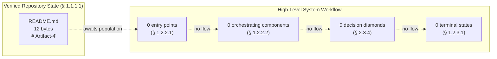

When substantive workflow artifacts are contributed (e.g., a service entry-point file, a controller dispatching to handlers, or an orchestration DAG), the placeholder nodes above should be replaced with concrete activity nodes, decision diamonds, and terminal markers.

### 4.5.2 Detailed Process Flows

A detailed process flow is conventionally produced **per feature**, with one diagram per `F-XXX` identifier enumerated in § 2.2.2. Per § 2.2.2, no `F-001`, `F-002`, or any other feature identifier is assigned. Consequently, no per-feature process flows can be rendered. The aggregate placeholder below records this verified absence:

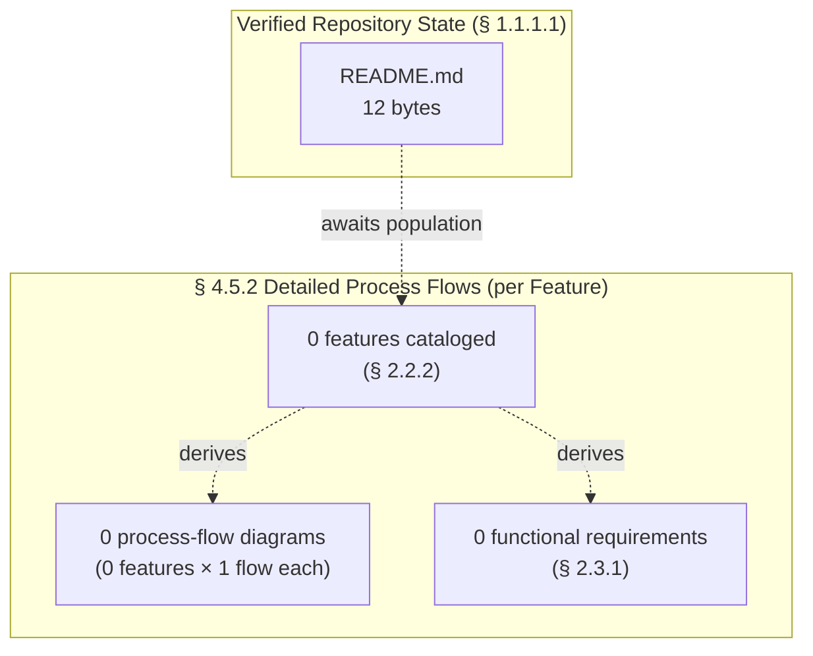

Once the Feature Catalog (§ 2.2.2) is populated with one or more `F-XXX` entries, this subsection should be expanded to include one detailed process-flow diagram per feature, each adhering to the schema established in § 4.3.1.

### 4.5.3 Error Handling Flowcharts

An error-handling flowchart depicts the detection, classification, retry, fallback, notification, and recovery pathways invoked when a process step fails. With zero retry mechanisms, zero fallback processes, zero notification flows, and zero recovery procedures defined (§ 4.4.2), the diagram is rendered as a placeholder.

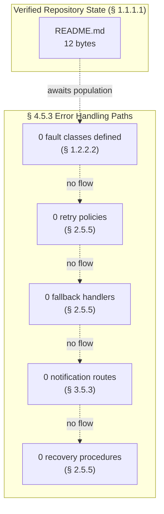

When source code containing exception handlers, retry decorators, circuit-breaker configurations, or error-reporting integrations is contributed, the placeholder nodes above should be replaced with concrete fault classes, retry-policy parameters, fallback handler references, alert routes, and recovery procedure links.

### 4.5.4 Integration Sequence Diagrams

An integration sequence diagram depicts the chronological exchange of messages between named participants (services, gateways, brokers, databases, third-party systems) during the execution of a workflow. Per § 1.2.1.3 and § 2.4.2, no integration counterparties are named anywhere in the repository. Per § 3.1.2, the default technology stack (which would otherwise supply candidate participant names) is **explicitly not applied**. The placeholder sequence diagram below preserves the syntactic container while recording the verified absence of all participants and messages.

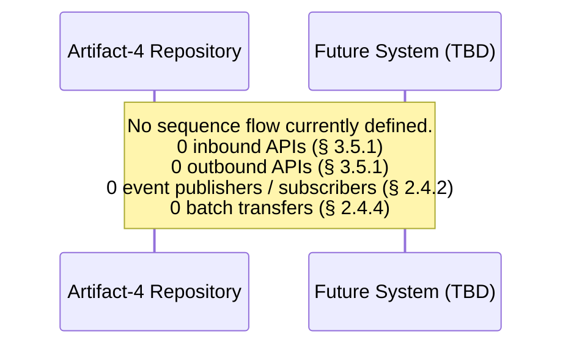

When API contracts (OpenAPI, gRPC `.proto`, GraphQL SDL, AsyncAPI) or SDK invocations are contributed to the repository, the placeholder above should be replaced with concrete participants (e.g., Client, API Gateway, Service, Database, External Provider) and labeled message arrows reflecting the actual request/response and event flow.

### 4.5.5 State Transition Diagrams

A state transition diagram depicts the discrete states that a domain entity, session, or workflow can occupy and the transitions between them. Per § 1.2.2.1, no stateful behavior is documented. Per § 3.6.1 and § 3.6.2, no domain entities, schemas, or persistence layers exist that could possess state. The placeholder state diagram below preserves the syntactic container while recording the verified absence of all states and transitions.

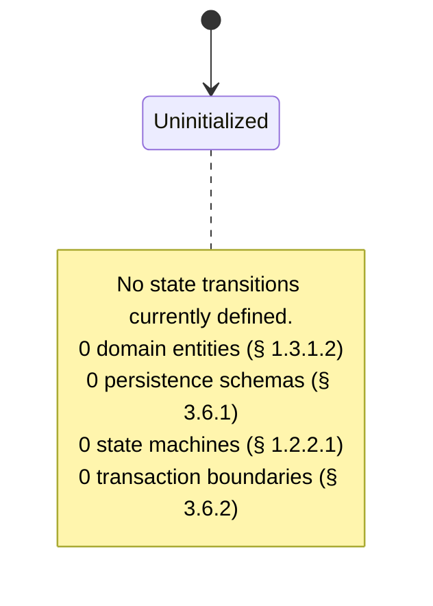

When domain entities, ORM models, session managers, or workflow-orchestration descriptors are contributed, the placeholder above should be replaced with concrete states (e.g., `Created`, `Validated`, `Processing`, `Completed`, `Failed`) and transition edges labeled with the events that trigger them.

---

## 4.6 CONSOLIDATED PROCESS FLOW STATE

The following diagram summarizes the consolidated state of Section 4 at the time of this specification's authoring. The diagram preserves the canonical Process-Flowchart substructure while reflecting the verified absence of substantive content in every container. The diagram follows the pattern established in § 1.2.2.2, § 1.3.3, § 2.8, and § 3.9.1.

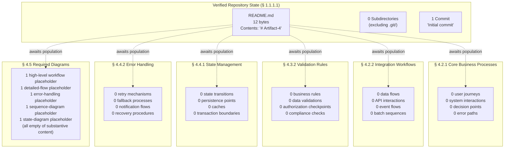

The diagram is intentionally a faithful pictorial counterpart to the textual content of §§ 4.2 through 4.5: every container exists structurally and is positioned as it would be in a populated Process-Flowchart section, but each container holds zero substantive entries. As substantive workflow, validation, state, error-handling, and diagrammatic artifacts are contributed to the repository, the nodes labeled "0 …" should be replaced with concrete activity, decision, integration, state, and recovery descriptors.

### 4.6.1 Cross-Reference Summary Matrix

The following matrix consolidates every cross-reference made in Section 4 back to the upstream subsections of Sections 1, 2, and 3 that originally established the verified absence:

| Section 4 Subsection | Primary Upstream Reference | Supporting Upstream References |
|----------------------|---------------------------|--------------------------------|
| § 4.2.1 Core Business Processes | § 1.2.2.1 (no system capabilities) | § 1.3.1.1, § 2.2.2, § 2.3.4 |
| § 4.2.2 Integration Workflows | § 1.2.1.3 (no integrations) | § 2.4.2, § 2.4.4, § 3.5.1 |
| § 4.3.1 Workflow Element Schema | § 1.2.2.1 (no behaviors) | § 1.2.3.1 (no timing constraints) |
| § 4.3.2 Validation Rules | § 2.3.4 (no validation rules) | § 2.5.4, § 3.5.2, § 2.3.3 |
| § 4.4.1 State Management | § 3.6.2 (no persistence strategy) | § 3.6.1, § 3.6.3, § 1.2.2.1 |
| § 4.4.2 Error Handling | § 2.5.5 (no operational runbook) | § 3.5.3, § 1.2.2.2 |
| § 4.5.1 High-Level Workflow | § 1.2.2.1 (no entry points) | § 1.2.2.2, § 2.3.4 |
| § 4.5.2 Detailed Process Flows | § 2.2.2 (no features) | § 2.3.1 |
| § 4.5.3 Error Handling Flowcharts | § 2.5.5 (no operational artifacts) | § 3.5.3 |
| § 4.5.4 Integration Sequence Diagrams | § 1.2.1.3 (no integrations) | § 2.4.2, § 3.5.1, § 3.1.2 |
| § 4.5.5 State Transition Diagrams | § 1.2.2.1 (no stateful behavior) | § 3.6.1, § 3.6.2, § 1.3.1.2 |

---

## 4.7 REVISION TRIGGERS FOR SECTION 4

Modeled on the revision-trigger tables in § 1.4.2.2 (*Recommended Revision Triggers*), § 2.7.3 (*Revision Triggers for Section 2*), and § 3.10 (*Revision Triggers for Section 3*), the following events warrant revision of Section 4.

### 4.7.1 Triggers by Subsection

| Revision Trigger | Subsections Most Affected |
|------------------|---------------------------|
| Source files exposing executable, user-facing behavior are added | § 4.2.1, § 4.5.1, § 4.5.2 |
| A Product Requirements Document or backlog enumerating workflows is contributed | § 4.2.1, § 4.5.2 |
| BPMN diagrams, workflow descriptors (Camunda, Temporal, Step Functions, Airflow DAG) are added | § 4.2.1, § 4.5.1, § 4.5.2 |
| API contracts (OpenAPI, gRPC `.proto`, GraphQL SDL, AsyncAPI) are added | § 4.2.2, § 4.5.4 |
| Message-broker topic / queue / event-schema definitions are added | § 4.2.2, § 4.5.4 |
| Scheduled-job / batch-processing descriptors (cron, Airflow, Argo) are added | § 4.2.2 |

| Revision Trigger | Subsections Most Affected |
|------------------|---------------------------|
| Domain models, ORM definitions, or finite-state-machine descriptors are added | § 4.4.1, § 4.5.5 |
| Database schemas / migrations / transaction-boundary annotations are added | § 4.4.1 |
| Cache configuration (in-process, Redis, Memcached, CDN) is added | § 4.4.1 |
| Exception hierarchies, retry library configurations, or circuit-breaker descriptors are added | § 4.4.2, § 4.5.3 |
| Error-reporting / observability service integrations (Sentry, Rollbar, Datadog) are configured | § 4.4.2, § 4.5.3 |
| Operational runbook, playbook, or recovery procedure documentation is contributed | § 4.4.2, § 4.5.3 |

| Revision Trigger | Subsections Most Affected |
|------------------|---------------------------|
| Validation libraries (JSON-Schema, Pydantic, Zod, Joi, Bean Validation) are configured | § 4.3.2 |
| Authorization / RBAC configuration is added | § 4.3.2 |
| Regulatory or compliance policy documents are contributed | § 4.3.2 |
| SLO / SLA / KPI documentation establishing timing budgets is contributed | § 4.3.1, § 4.5.1 |
| User-persona / actor documentation is contributed | § 4.2.1, § 4.5.2 |

### 4.7.2 Artifact-to-Subsection Mapping

The following inverse mapping lets contributors immediately locate the subsections of Section 4 that require revision when a specific artifact type is contributed:

| Contributed Artifact Type | Subsections Requiring Revision |
|---------------------------|-------------------------------|
| Service entry-point or controller source file | § 4.2.1, § 4.5.1, § 4.5.2, § 4.6 |
| API contract or SDK invocation | § 4.2.2, § 4.5.4, § 4.6 |
| Event / message schema (Avro, Protobuf, JSON-Schema) | § 4.2.2, § 4.5.4, § 4.6 |
| Workflow descriptor (BPMN, Camunda, Temporal, Step Functions, Airflow DAG) | § 4.2.1, § 4.5.1, § 4.5.2, § 4.6 |
| Database schema, migration, or ORM model | § 4.4.1, § 4.5.5, § 4.6 |
| Cache configuration | § 4.4.1, § 4.6 |
| Exception class, retry decorator, or circuit-breaker descriptor | § 4.4.2, § 4.5.3, § 4.6 |
| Error-reporting / observability configuration | § 4.4.2, § 4.5.3, § 4.6 |
| Authorization / RBAC configuration | § 4.3.2, § 4.6 |
| Validation schema or rules-engine configuration | § 4.3.2, § 4.6 |
| Operational runbook / playbook | § 4.4.2, § 4.5.3, § 4.6 |
| SLO / SLA / KPI documentation | § 4.3.1, § 4.5.1, § 4.6 |

### 4.7.3 Workflow Version Tracking

Workflow version tracking conventionally records, for each `W-XXX` workflow identifier, the version at which the workflow was introduced, the versions in which it was amended, and the version at which it was retired (if applicable). Mirroring the structure of § 2.7.4 (*Requirement Version Tracking*), and with zero workflow identifiers issued in § 4.2.1, no version-tracking entries exist:

| Tracking Dimension | Current Value | Reference |
|--------------------|---------------|-----------|
| Workflows introduced (this version) | 0 | § 4.2.1 |
| Workflows amended (this version) | 0 | § 4.2.1 |
| Workflows retired (this version) | 0 | § 4.2.1 |
| Section 4 baseline version | Initial (concurrent with § 1 baseline) | § 1.1.1.1 |

---

## 4.8 REFERENCES

### 4.8.1 Files Examined

- `README.md` — The sole file in the repository. Examined to confirm its 12-byte size and one-line content (`# Artifact-4`). Establishes that no workflow descriptor, sequence diagram, state machine, error-handling policy, or process-flow documentation can be derived from any artifact present in the repository. Cited throughout § 4.1, § 4.2, § 4.5, and § 4.6.

### 4.8.2 Folders Examined

- `/` (repository root, depth 0) — Examined to confirm that no subdirectories exist outside `.git/` version-control metadata. Establishes that no source-code directories (which could contain controllers, handlers, or service classes), no `workflows/` directory (which could contain BPMN or DAG files), no `migrations/` directory (which could contain schema or state-transition descriptors), no `runbooks/` directory (which could contain recovery procedures), and no `infrastructure/` directory (which could contain integration-topology descriptors) are present. Cited throughout § 4.2 and § 4.4.

### 4.8.3 Repository Metadata Consulted

- **Git remote configuration** — Confirms the canonical project URL `https://github.com/ShaliniTest-maker/Artifact-4.git`. Used in § 4.1.2 to anchor the repository-state attestation that governs every Section-4 subsection.
- **Git commit log** — Confirms a single-commit history (hash `3e64ae951eb38821e57b0e58e2d3d83f567c2a64`, message `Initial commit`, date 2026-05-28 16:08:59 +0530). Used to corroborate that no workflow, integration, or state-management artifact has been introduced in any historical revision of the repository.
- **Git author records** — Confirms commit authorship by `ShaliniTest-maker <shaliniguptatest@gmail.com>`. Used in § 4.2.1 to establish that no additional actor roles or swim-lane participants are available for workflow rendering.

### 4.8.4 Cross-Referenced Technical Specification Sections

The following sections of the present Technical Specification are cross-referenced from § 4 to anchor the evidence-based attestations:

- **§ 1.1.1.1 Repository State Snapshot** — Anchors the repository attributes table in § 4.1.2 and the consolidated diagram in § 4.6.
- **§ 1.1.3 Key Stakeholders and Users** — Establishes the absence of user roles referenced in § 4.2.1 (user touchpoints).
- **§ 1.2.1.1 Business Context and Market Positioning** — Establishes the absence of compliance / regulatory context referenced in § 4.3.2.
- **§ 1.2.1.3 Integration with Existing Enterprise Landscape** — Establishes the absence of integration counterparties referenced throughout § 4.2.2 and § 4.5.4.
- **§ 1.2.2.1 Primary System Capabilities** — Establishes the absence of executable entry points, behaviors, and user interfaces referenced throughout § 4.2.1, § 4.4.1, § 4.5.1, and § 4.5.5.
- **§ 1.2.2.2 Major System Components** — Establishes the absence of components and modules referenced in § 4.2.1 (system interactions) and § 4.4.2 (exception hierarchies).
- **§ 1.2.2.3 Core Technical Approach** — Establishes the absence of data storage strategy, containerization, and deployment target referenced in § 4.4.1.
- **§ 1.2.3.1 Measurable Objectives** — Establishes the absence of SLOs and SLAs referenced in § 4.3.1 (timing constraints) and § 4.5.1.
- **§ 1.2.3.3 Key Performance Indicators** — Establishes the absence of performance KPIs that would inform workflow timing budgets.
- **§ 1.3.1.1 Core Features and Functionalities** — Establishes the empty in-scope inventory referenced in § 4.2.1 and § 4.5.2.
- **§ 1.3.1.2 Implementation Boundaries** — Establishes the absence of system boundaries, user groups, and data domains referenced in § 4.2.1, § 4.3.1, and § 4.5.5.
- **§ 1.3.3 Consolidated Scope Summary** — Provides the diagrammatic precedent for the consolidated-state diagram in § 4.6.
- **§ 1.4.1 Evidence-Based Documentation Standard** — Establishes the binding standard reaffirmed in § 4.1.1.
- **§ 1.4.2.1 Explicit Acknowledgment of Gaps** — Establishes the canonical absence vocabulary used uniformly in § 4.
- **§ 1.4.2.2 Recommended Revision Triggers** — Provides the template adapted into § 4.7.1.
- **§ 2.1.3 Treatment of Conventional Subsections** — Establishes the substructure-preservation contract honored by § 4.1.3.
- **§ 2.2.2 Feature Catalog Inventory** — Establishes the absence of `F-XXX` identifiers referenced in § 4.5.2 (one diagram per feature).
- **§ 2.3.1 Functional Requirements Inventory** — Establishes the absence of acceptance criteria and SLOs referenced in § 4.3.1 and § 4.5.2.
- **§ 2.3.3 Technical Specification Schema** — Establishes the absence of data requirements referenced in § 4.3.2.
- **§ 2.3.4 Validation Rules Schema** — Provides the schema mirrored in § 4.3.2.
- **§ 2.4.2 Integration Points** — Establishes the absence of integration points referenced in § 4.2.2 and § 4.5.4.
- **§ 2.4.3 Shared Components** — Establishes the absence of shared services referenced in § 4.2.1.
- **§ 2.4.4 Common Services** — Establishes the absence of common services (background jobs, observability) referenced in § 4.2.2 (batch processing) and § 4.4.2.
- **§ 2.5.4 Security Implications** — Establishes the absence of authentication, authorization, and compliance referenced in § 4.3.2.
- **§ 2.5.5 Maintenance Requirements** — Establishes the absence of CI/CD, observability, and runbook artifacts referenced throughout § 4.4.2 and § 4.5.3.
- **§ 2.7.2 Documented Constraints** — Establishes the constraint catalog (no fabrication; preservation of canonical substructure) honored throughout § 4.
- **§ 2.7.3 Revision Triggers for Section 2** — Provides the template adapted into § 4.7.1.
- **§ 2.7.4 Requirement Version Tracking** — Provides the template adapted into § 4.7.3 (Workflow Version Tracking).
- **§ 2.8 Consolidated Product Requirements State** — Provides the diagrammatic precedent for the consolidated-state diagram in § 4.6.
- **§ 3.1.2 Treatment of the Default Technology Stack** — Establishes the binding non-application of the default stack referenced in § 4.2.2 and § 4.5.4 (no fabricated participant names).
- **§ 3.1.3 Canonical Subsection Preservation** — Reaffirms the substructure-preservation contract honored by § 4.1.3.
- **§ 3.5.1 External APIs and Integrations** — Establishes the absence of API surfaces referenced in § 4.2.2 and § 4.5.4.
- **§ 3.5.2 Authentication and Identity Services** — Establishes the absence of authorization checkpoints referenced in § 4.3.2.
- **§ 3.5.3 Monitoring and Observability Services** — Establishes the absence of error-reporting and alerting referenced in § 4.4.2 and § 4.5.3.
- **§ 3.6.1 Primary and Secondary Databases** — Establishes the absence of persistence tiers referenced in § 4.4.1 and § 4.5.5.
- **§ 3.6.2 Data Persistence Strategy** — Establishes the absence of transactional consistency referenced in § 4.4.1.
- **§ 3.6.3 Caching Solutions** — Establishes the absence of caching tiers referenced in § 4.4.1.
- **§ 3.9.1 State Summary Diagram** — Provides the diagrammatic precedent for the consolidated-state diagram in § 4.6.
- **§ 3.10 Revision Triggers for Section 3** — Provides the template adapted into § 4.7.1 and § 4.7.2.

### 4.8.5 External Searches Performed

No external web searches were performed in the authoring of this section. All factual content was derived from artifacts and metadata internal to the Artifact-4 repository and from sections § 1.1 through § 3.11 of the present Technical Specification. Per § 3.1.2, the default technology stack offered as authoring guidance is **explicitly not applied** in any flowchart, sequence diagram, or state diagram within this section, in conformance with the binding evidence-based standard of § 1.4.1.

---

# 5. System Architecture

## 5.1 ARCHITECTURE DOCUMENTATION APPROACH

### 5.1.1 Reaffirmation of the Evidence-Based Standard

A System Architecture section conventionally documents the architectural style, the decomposition of the system into components, the contracts that bind those components together, the data flows that traverse them, the cross-cutting concerns that govern their operation, and the technical decisions and tradeoffs that produced the chosen design. Such documentation is grounded exclusively in artifacts present within the repository — source code, framework configuration, deployment descriptors, infrastructure-as-code, API contracts, schema definitions, observability configuration, security policies, and explicit Architecture Decision Records (ADRs).

Per § 1.4.1 (*Evidence-Based Documentation Standard*), this Technical Specification adheres to a strict prohibition against inference, extrapolation, or fabrication. Per § 1.4.2.1 (*Explicit Acknowledgment of Gaps*), the canonical vocabulary "Not defined," "Not present in repository," and "Not determined" denotes verified absence based on exhaustive examination of the repository's complete file listing, git history, and remote metadata. Section 5 uniformly applies this vocabulary and this standard.

### 5.1.2 Repository State Affecting Section 5

The architectural attestations made throughout Section 5 are anchored to the following authoritative repository-state attributes established in § 1.1.1.1 (*Repository State Snapshot*):

| Repository Attribute | Value | Architectural Implication |
|----------------------|-------|---------------------------|
| Total File Count | 1 (excluding `.git`) | Zero source files from which to derive components |
| Total Subdirectories | 0 | Zero module / package / service decomposition |
| Total Commit Count | 1 | Single-commit history; no architectural evolution |
| Sole File | `README.md` (12 bytes) | Sole content is `# Artifact-4`; conveys no design |

These four attributes — taken together with the verified absences enumerated in §§ 1.2.2, 2.4, 2.5, 3.2–3.8, and 4.4 — are conclusive evidence that the Artifact-4 repository is in a **pre-implementation placeholder state** and that no architectural artifacts of any kind have yet been contributed.

### 5.1.3 Non-Application of the Default Technology Stack

Per § 3.1.2 (*Treatment of the Default Technology Stack*), a default technology stack offered as authoring guidance (Python/Flask, MongoDB, Auth0, AWS, Docker, Terraform, GitHub Actions, React with TypeScript, TailwindCSS, React Native, Swift, Kotlin, Objective-C, ElectronJS, and Langchain) is **explicitly not applied** to any architectural assertion in this Technical Specification. Section 5 honors that binding non-application without exception:

- No architectural style (monolith, microservices, event-driven, hexagonal, layered, serverless, etc.) is asserted from default-stack assumptions.
- No component names (e.g., "API Gateway," "Auth Service," "User Service") are introduced as fabricated participants in diagrams or tables.
- No technology selections (database engines, message brokers, cache tiers, identity providers, observability platforms) are inferred from the default stack.
- No deployment topology (cluster topology, region strategy, container orchestrator, CDN posture) is inferred from the default stack.

Applying the default stack to Section 5 would directly contradict §§ 1.2.2.3, 2.4.2, 2.5.4, 3.5, 3.6, 3.7, 3.8.1, 4.4, and 4.5 — every one of which has authoritatively recorded the corresponding architectural dimension as "Not defined" or "Not determined." The default stack therefore remains available only as **non-binding authoring guidance** for future contributors.

### 5.1.4 Preservation of Canonical Architecture Substructure

Per § 2.7.2 (*Documented Constraints*), the documentation contract with downstream readers requires preservation of the canonical substructure mandated by the section authoring prompt. Section 5 accordingly preserves the four canonical major subsections — High-Level Architecture (§ 5.2), Component Details (§ 5.3), Technical Decisions (§ 5.4), and Cross-Cutting Concerns (§ 5.5) — and populates each with verified-absence markers and reserved-for-future-population scaffolding. This treatment mirrors the precedent established in § 2.2.3 (*Feature Metadata Schema (Reserved for Future Population)*), § 3.1.3 (*Canonical Subsection Preservation*), and § 4.1.3 (*Canonical Subsection Preservation*).

### 5.1.5 Applicable Constraints

The following constraints — each established in prior sections — govern the content of Section 5:

| Constraint | Source | Reference |
|------------|--------|-----------|
| No fabrication of component identifiers | Evidence-based standard | § 1.4.1, § 2.7.2 |
| No fabrication of ADR identifiers | Evidence-based standard | § 1.4.1, § 2.7.2 |
| Use of vocabulary "Not defined," "Not determined," "Not present in repository" | Treatment of absent information | § 1.4.2.1 |
| Preservation of canonical architecture substructure | Documentation contract | § 2.7.2, § 3.1.3 |
| Non-application of the default technology stack | Treatment of default stack | § 3.1.2 |
| Mermaid diagrams rendered as structurally valid placeholders | Precedent | § 1.2.2.2, § 2.8, § 3.9.1, § 4.5 |

---

## 5.2 HIGH-LEVEL ARCHITECTURE

### 5.2.1 System Overview

A System Overview conventionally describes the chosen architectural style and the rationale for that selection, the key architectural principles and patterns governing the design, and the system boundaries together with the major interfaces that traverse them. Each of these dimensions is examined below against the verified state of the Artifact-4 repository.

#### 5.2.1.1 Architectural Style and Rationale

No architectural style has been adopted in the Artifact-4 repository. Per § 1.2.2.3 (*Core Technical Approach*), the eight conventional technical dimensions — Programming Language(s), Application Framework, Runtime Environment, Build / Package Manager, Data Storage Strategy, Deployment Target, Testing Strategy, and Containerization — are **all recorded as "Not determined."** Per § 1.2.2.2 (*Major System Components*), the repository contains "no modules, packages, services, classes, functions, or other architectural components." Architectural style is, by definition, a property of an assembled set of components arranged according to a chosen organizing principle (monolithic, layered, hexagonal, microservices, event-driven, serverless, space-based, etc.); with zero components present, no organizing principle has been instantiated.

| Architectural Style Dimension | Status | Reference |
|-------------------------------|--------|-----------|
| Chosen architectural style | Not defined — no components to organize | § 1.2.2.2, § 1.2.2.3 |
| Rationale for style selection | Not defined — no decision artifact present | § 1.2.2.3 |
| Layering or partitioning scheme | Not defined — no module decomposition | § 1.2.2.2 |
| Deployment topology | Not defined — no infrastructure-as-code | § 1.2.2.3, § 3.7 |

#### 5.2.1.2 Key Architectural Principles and Patterns

No architectural principles have been articulated in the repository. There is no design document, no ADR, no architecture guideline, no coding-standards file, and no contribution guide that records a principle (e.g., "single responsibility," "explicit dependencies," "stateless services," "schema-on-read," "API-first," "secure-by-default"). No design patterns are instantiated, because no source code exists to instantiate them. The principles and patterns dimension is therefore wholly undefined:

| Principle / Pattern Category | Status | Reference |
|------------------------------|--------|-----------|
| Documented architectural principles | None defined — no design documentation | § 1.2.2.1, § 1.2.2.2 |
| Instantiated design patterns (GoF, DDD, EIP) | None defined — no source code | § 1.2.2.2 |
| Cross-cutting principles (SOLID, twelve-factor, etc.) | None defined — no design documentation | § 1.2.2.3 |
| Domain-Driven Design tactical patterns | None defined — no domain model | § 1.3.1.2 |

#### 5.2.1.3 System Boundaries and Major Interfaces

System boundaries are conventionally established by the perimeter at which the system exchanges information with users, with other systems, and with operational infrastructure. Major interfaces are the concrete contracts (HTTP/REST, GraphQL, gRPC, message-broker topics, file drops, scheduled jobs, etc.) that traverse those boundaries. Per § 1.3.1.2 (*Implementation Boundaries*), no system boundaries are defined. Per § 1.2.1.3 (*Integration with Existing Enterprise Landscape*), "No integrations, external system references, API contracts, message broker configurations, database connection strings, third-party SDKs, enterprise service bus definitions, or identity provider configurations exist." Per § 2.4.2 (*Integration Points*), all four integration-point categories (synchronous APIs, asynchronous messaging, persistence interfaces, third-party SDKs) are recorded as "None defined."

| Boundary / Interface Dimension | Status | Reference |
|--------------------------------|--------|-----------|
| User-facing interface boundary | Not defined — no UI / CLI artifacts | § 1.2.2.1 |
| System-to-system boundary | Not defined — no integration counterparties | § 1.2.1.3, § 2.4.2 |
| Operational / management boundary | Not defined — no operations interface | § 2.5.5 |
| Trust / security boundary | Not defined — no security policy artifacts | § 2.5.4, § 3.8.2 |

### 5.2.2 Core Components

A Core Components table conventionally enumerates each major component of the system, its primary responsibility, its key dependencies, and the integration points through which it interacts with the rest of the architecture. Per § 1.2.2.2 (*Major System Components*), the repository contains "no modules, packages, services, classes, functions, or other architectural components." Per § 2.4.3 (*Shared Components*), every shared-component category (shared libraries, shared data models, shared UI components, shared utility functions) is recorded as "None defined." Per § 3.8.1 (*Integration Requirements Between Components*), "Zero such contracts exist in Artifact-4 because zero components exist to be integrated."

The table below — which would conventionally contain one row per major component — therefore contains **zero data rows**, in faithful representation of the verified architectural state:

| Component Name | Primary Responsibility | Key Dependencies | Critical Considerations |
|----------------|------------------------|------------------|-------------------------|
| *(No components defined — see § 1.2.2.2)* | *Not applicable* | *Not applicable* | *Not applicable* |

When source files, manifest files, infrastructure-as-code artifacts, or deployment descriptors are contributed to the repository, this table should be populated with one row per concrete component, with each row reflecting:

- the component's canonical name (drawn from its module / package / service identifier),
- its single primary responsibility (per the single-responsibility principle or its equivalent),
- its key dependencies (other components, libraries, services, or stores it consumes),
- and the critical considerations that govern its operation (criticality, ownership, performance budget, security classification, etc.).

### 5.2.3 Data Flow Description

A Data Flow Description conventionally documents the primary flows of information between components, the integration patterns and protocols by which those flows are mediated, the points at which data is transformed, and the key data stores and caches that persist or accelerate access to that data. Each dimension is empty in Artifact-4, for the reasons recorded below.

| Data-Flow Dimension | Status | Reference |
|---------------------|--------|-----------|
| Primary inter-component flows | None defined — no components to exchange data | § 1.2.2.2, § 2.4.3 |
| Integration patterns (request/reply, pub/sub, batch) | None defined — no integration points | § 1.2.1.3, § 2.4.2 |
| Wire protocols (HTTP, gRPC, AMQP, Kafka protocol) | None defined — no protocol selection | § 2.4.2, § 3.5.1 |
| Data transformation points | None defined — no source code or schemas | § 1.2.2.2, § 3.6.2 |
| Primary data store | None defined — no database tiers selected | § 3.6.1 |
| Secondary / read-replica data store | None defined — no database tiers selected | § 3.6.1 |
| Caching tier | None defined — no cache configuration | § 3.6.3 |
| Object / blob storage | None defined — no storage buckets configured | § 3.6.4 |

Because no flows exist, no flow diagram can be drawn with substantive content. The placeholder flow representation is consolidated into the diagram of § 5.6.1 (*State Summary Diagram*) to avoid redundancy.

### 5.2.4 External Integration Points

An External Integration Points table conventionally enumerates the external systems with which the system under specification exchanges data, the type of integration (synchronous API, asynchronous event, batch transfer, file exchange), the data-exchange pattern (request/reply, pub/sub, polling, push), the protocol and serialization format (REST/JSON, gRPC/Protobuf, GraphQL/JSON, AMQP/Avro, etc.), and the SLA requirements (availability, latency, throughput) that govern the integration.

Per § 1.2.1.3 (*Integration with Existing Enterprise Landscape*), the integration posture with any existing enterprise landscape is "wholly undefined." Per § 3.5.1 (*External APIs and Integrations*), all seven integration-surface categories — outbound REST/GraphQL APIs, inbound webhook receivers, gRPC service interfaces, message-broker integrations, vendor SDK invocations, payment/billing services, and email/notification services — are recorded as "None defined." Per § 1.2.3.3 (*Key Performance Indicators*), all four KPI categories (Functional, Performance, Reliability, User Experience) are "None defined," and consequently no SLA targets are documented.

The table below therefore contains **zero data rows**:

| System Name | Integration Type | Data Exchange Pattern | SLA Requirements |
|-------------|------------------|-----------------------|------------------|
| *(No external systems integrated — see § 3.5.1)* | *Not applicable* | *Not applicable* | *Not applicable* |

When API contracts (OpenAPI, gRPC `.proto`, GraphQL SDL, AsyncAPI), SDK imports, webhook receiver configurations, or message-broker topic declarations are contributed to the repository, this table should be populated with one row per external system, accompanied by the corresponding contract artifact in a `contracts/` or equivalent directory.

---

## 5.3 COMPONENT DETAILS

### 5.3.1 Per-Component Specification

For each major component, a Component Details subsection conventionally records six dimensions: (1) purpose and responsibilities, (2) technologies and frameworks used, (3) key interfaces and APIs, (4) data persistence requirements, (5) scaling considerations, and (6) operational considerations. Per § 1.2.2.2 (*Major System Components*), the repository contains zero components. Consequently, the conventional per-component specification table contains zero rows. The categorical specification template is preserved below for reference, populated with verified-absence markers:

| Component Specification Dimension | Status | Reference |
|-----------------------------------|--------|-----------|
| Purpose and responsibilities | None defined — no components | § 1.2.2.1, § 1.2.2.2 |
| Technologies and frameworks used | None defined — no technology adopted | § 1.2.2.3, § 3.2, § 3.3 |
| Key interfaces and APIs | None defined — no API contracts | § 2.4.2, § 3.5.1 |
| Data persistence requirements | None defined — no schemas or databases | § 3.6.1, § 3.6.2 |
| Scaling considerations | None defined — no scaling strategy | § 2.5.3 |
| Operational considerations | None defined — no operations posture | § 2.5.5, § 3.5.3 |

### 5.3.2 Component Interaction Diagram

A component-interaction diagram conventionally depicts the components of the system as nodes and the contracts between them (API calls, message-broker subscriptions, database connections, shared-storage reads/writes) as edges. With zero components (§ 1.2.2.2) and zero inter-component contracts (§ 3.8.1), the diagram is rendered as a structurally valid placeholder that preserves the syntactic container, following the precedent established in § 1.2.2.2, § 2.8, § 3.9.1, and § 4.5.

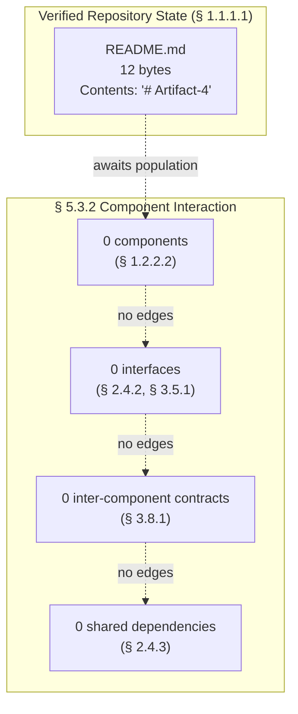

When components are contributed to the repository, the placeholder nodes above should be replaced with concrete component identifiers (drawn from module / package / service names) and labeled edges reflecting actual API calls, event publications, database connections, and shared dependencies.

### 5.3.3 State Transition Diagram

A state-transition diagram conventionally depicts the discrete states that a domain entity, session, or workflow can occupy and the transitions between them. Per § 1.2.2.1 (*Primary System Capabilities*), no stateful behavior is documented. Per § 3.6.1 (*Primary and Secondary Databases*), no database tier is selected from which state could be persisted. Per § 4.4.1 (*State Management*), every state-management dimension (state transitions, persistence points, caching requirements, transaction boundaries, idempotency keys, concurrency control, saga orchestration, event sourcing) is recorded as "None defined." The placeholder state diagram below preserves the syntactic container while recording the verified absence of all states and transitions, following the precedent established in § 4.5.5.

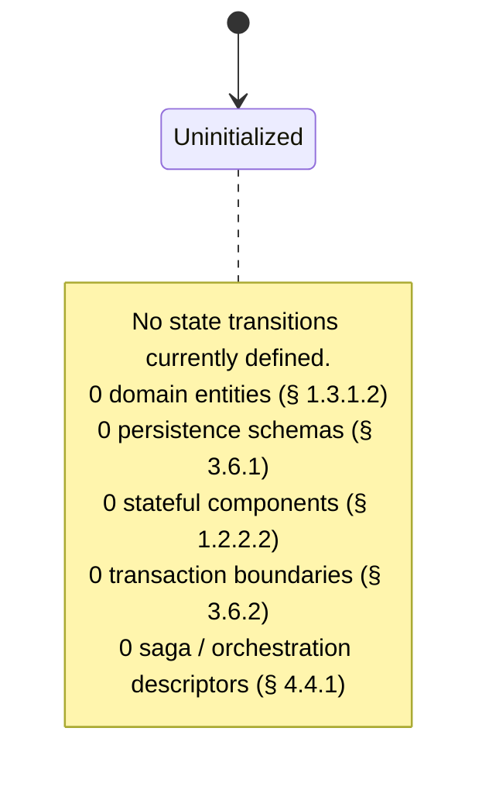

When domain entities, ORM models, session managers, or workflow-orchestration descriptors are contributed, the placeholder above should be replaced with concrete states (e.g., `Created`, `Validated`, `Processing`, `Completed`, `Failed`) and transition edges labeled with the triggering events.

### 5.3.4 Sequence Diagram for Key Flows

A sequence diagram conventionally depicts the chronological exchange of messages between named participants during the execution of a key flow. Per § 1.2.1.3 and § 2.4.2, no integration counterparties are named anywhere in the repository. Per § 3.1.2, the default technology stack — which might otherwise supply candidate participant names — is **explicitly not applied**. Per § 4.5.4 (*Integration Sequence Diagrams*), the placeholder sequence diagram pattern is established and is reproduced below for the architectural context of Section 5.

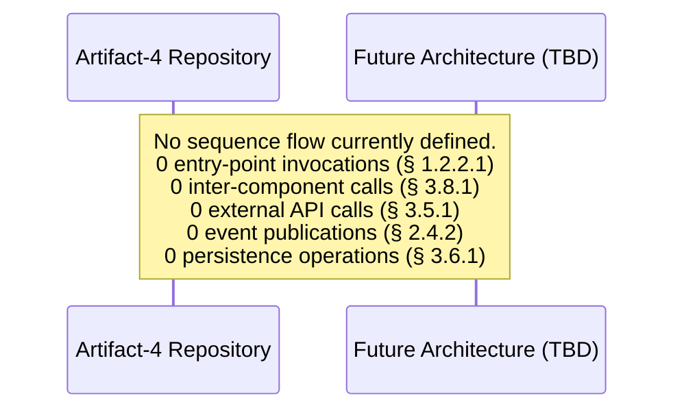

When source code defining entry-point handlers, controllers, services, repositories, or external-system clients is contributed to the repository, the placeholder above should be replaced with concrete participants — e.g., `Client`, `API Gateway`, `Controller`, `Service`, `Repository`, `Database`, `External Provider` — and labeled message arrows reflecting the actual request/response and event-flow patterns.

---

## 5.4 TECHNICAL DECISIONS

### 5.4.1 Architecture Style Decisions and Tradeoffs

An Architecture Style Decisions subsection conventionally records the choice of architectural style (monolithic, layered, hexagonal, microservices, event-driven, serverless, etc.), the principal alternatives considered, the tradeoffs evaluated (complexity, scalability, operability, time-to-market, organizational fit), and the rationale for the chosen option. Per § 1.2.2.3 (*Core Technical Approach*), all eight technical dimensions that would inform such a choice are "Not determined." Per § 1.2.2.2 (*Major System Components*), the repository contains no components to which a style could be applied. No ADR, design document, or commit-history annotation records a style decision.

| Style Decision Dimension | Status | Reference |
|--------------------------|--------|-----------|
| Style chosen | None defined — no decision artifact present | § 1.2.2.3 |
| Alternatives considered | None defined — no decision artifact present | § 1.2.2.3 |
| Tradeoffs evaluated | None defined — no decision artifact present | § 1.2.2.3 |
| Rationale recorded | None defined — no ADR present | § 1.2.2.3 |

### 5.4.2 Communication Pattern Choices

A Communication Pattern Choices subsection conventionally records whether the system favors synchronous or asynchronous communication, request/reply or pub/sub semantics, point-to-point or fan-out distribution, choreographed or orchestrated workflow coordination, and the corresponding protocol selections. Per § 2.4.2 (*Integration Points*), all four integration-point categories are "None defined." Per § 3.5.1 (*External APIs and Integrations*), all seven integration-surface categories are "None defined."

| Communication Decision Dimension | Status | Reference |
|----------------------------------|--------|-----------|
| Synchronous vs. asynchronous balance | None defined — no integration surfaces | § 2.4.2 |
| Request/reply vs. event-driven | None defined — no integration surfaces | § 2.4.2 |
| Point-to-point vs. broadcast | None defined — no messaging infrastructure | § 2.4.2, § 3.5.1 |
| Orchestration vs. choreography | None defined — no workflow descriptors | § 4.4.1 |
| Wire protocol selection | None defined — no protocol artifacts | § 3.5.1 |
| Serialization format selection | None defined — no schema artifacts | § 3.5.1, § 3.6.2 |

### 5.4.3 Data Storage Solution Rationale

A Data Storage Solution Rationale subsection conventionally records the choice of primary store (relational, document, key-value, graph, search, time-series, vector), the choice of secondary or analytical stores, the partitioning and sharding strategy, the consistency model (strong, eventual, causal, snapshot), the durability and replication posture, and the rationale for each choice. Per § 3.6.1 (*Primary and Secondary Databases*), every database tier is recorded as "None defined." Per § 3.6.2 (*Data Persistence Strategy*), every persistence dimension is recorded as "None defined."

| Storage Decision Dimension | Status | Reference |
|----------------------------|--------|-----------|
| Primary store class chosen | None defined — no engine selected | § 3.6.1 |
| Secondary / analytical store chosen | None defined — no engine selected | § 3.6.1 |
| Partitioning / sharding strategy | None defined — no persistence strategy | § 3.6.2 |
| Consistency model | None defined — no transactional model | § 3.6.2 |
| Durability / replication posture | None defined — no replication artifacts | § 3.6.2 |
| Rationale recorded | None defined — no ADR present | § 3.6.1, § 3.6.2 |

### 5.4.4 Caching Strategy Justification

A Caching Strategy Justification subsection conventionally records the tiers at which caching is applied (in-process, distributed, HTTP-response, CDN edge), the eviction and invalidation policies, the consistency tradeoffs accepted, and the rationale for each choice. Per § 3.6.3 (*Caching Solutions*), every cache tier (in-process, distributed, HTTP-response, CDN edge) and the invalidation strategy are each recorded as "None defined."

| Caching Decision Dimension | Status | Reference |
|----------------------------|--------|-----------|
| In-process cache adopted | None defined — no source code | § 3.6.3 |
| Distributed cache adopted | None defined — no infrastructure artifacts | § 3.6.3 |
| HTTP-response cache adopted | None defined — no HTTP configuration | § 3.6.3 |
| CDN edge cache adopted | None defined — no CDN configuration | § 3.5.4, § 3.6.3 |
| Invalidation strategy chosen | None defined — no source code | § 3.6.3 |
| Rationale recorded | None defined — no ADR present | § 3.6.3 |

### 5.4.5 Security Mechanism Selection

A Security Mechanism Selection subsection conventionally records the chosen authentication mechanism (sessions, tokens, OAuth/OIDC, SAML, mTLS), the authorization model (RBAC, ABAC, ReBAC), the encryption posture (TLS configuration, encryption-at-rest, key management), the secrets-management approach, the audit-logging posture, and the rationale for each choice. Per § 2.5.4 (*Security Implications*), all four security dimensions (Authentication/Identity, Authorization/Access control, Data protection/Encryption, Auditing/Compliance) are recorded as "None defined." Per § 3.5.2 (*Authentication and Identity Services*), every identity-capability category is recorded as "None defined." Per § 3.8.2 (*Security Implications of Technology Choices*), "no technology choices have been made" and there are correspondingly "no technology-derived security implications to document at this time."

| Security Decision Dimension | Status | Reference |
|-----------------------------|--------|-----------|
| Authentication mechanism chosen | None defined — no authentication artifacts | § 2.5.4, § 3.5.2 |
| Authorization model chosen | None defined — no RBAC/ABAC artifacts | § 2.5.4 |
| Encryption-in-transit (TLS) posture | None defined — no TLS configuration | § 3.8.2 |
| Encryption-at-rest posture | None defined — no key-management artifacts | § 3.6.2, § 3.8.2 |
| Secrets-management approach | None defined — no secrets-store integration | § 3.5.4, § 3.8.2 |
| Audit-logging posture | None defined — no audit artifacts | § 2.5.4 |
| Rationale recorded | None defined — no ADR present | § 2.5.4 |

### 5.4.6 Architecture Decision Records (ADRs)

An ADR catalog conventionally enumerates each architecturally significant decision as a discrete record bearing an identifier (`ADR-XXX`), a title, a status (Proposed, Accepted, Deprecated, Superseded), the decision context, the considered options, the chosen option, and the consequences. Per § 2.7.2 (*Documented Constraints*), the fabrication of identifiers — extended to ADR identifiers under the same constraint family — is prohibited. The repository contains no `docs/adr/`, `docs/architecture/`, `decisions/`, or equivalent directory. No ADR has been authored.

| ADR Catalog Dimension | Current Value | Reference |
|-----------------------|---------------|-----------|
| Number of ADRs in repository | 0 | § 1.1.1.1 |
| Proposed ADRs | 0 | § 1.1.1.1 |
| Accepted ADRs | 0 | § 1.1.1.1 |
| Superseded ADRs | 0 | § 1.1.1.1 |
| ADR template adopted | None defined | § 1.2.2.3 |

When ADRs are contributed (typically as Markdown files under `docs/adr/` following the Nygard or MADR template), this table should be replaced with a one-row-per-ADR catalog, and each subsection of § 5.4 should cross-reference the corresponding ADR by identifier.

### 5.4.7 Architecture Decision Tree

A decision-tree diagram conventionally depicts the branching of architectural decisions from root concerns (e.g., "monolith or distributed?") through intermediate decisions (e.g., "shared database or database-per-service?") to leaf selections. With zero decisions recorded (per §§ 5.4.1 through 5.4.6), the tree is rendered as a structurally valid placeholder.

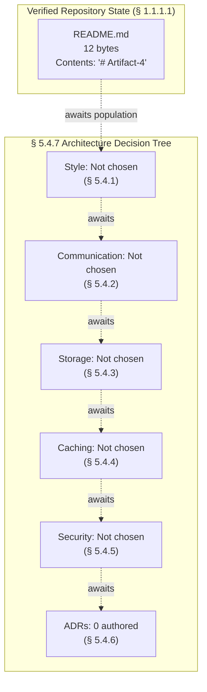

When ADRs are contributed, this diagram should be replaced with a concrete decision tree whose leaves correspond to the accepted options in each ADR.

---

## 5.5 CROSS-CUTTING CONCERNS

### 5.5.1 Monitoring and Observability Approach

A Monitoring and Observability Approach subsection conventionally records the centralized logging platform, the metrics collection and visualization stack, the distributed-tracing implementation, the APM tool, the error/crash-reporting service, the synthetic-monitoring posture, and the real-user-monitoring (RUM) posture. Per § 3.5.3 (*Monitoring and Observability Services*), every observability capability is recorded as "Not present in repository." Per § 2.5.5 (*Maintenance Requirements*), the "Monitoring / Observability" dimension is "Not present in repository."

| Observability Dimension | Status | Reference |
|-------------------------|--------|-----------|
| Centralized logging platform | Not present in repository | § 3.5.3 |
| Metrics collection stack | Not present in repository | § 3.5.3 |
| Distributed tracing implementation | Not present in repository | § 3.5.3 |
| Application Performance Monitoring (APM) | Not present in repository | § 3.5.3 |
| Error / crash reporting service | Not present in repository | § 3.5.3 |
| Synthetic / uptime monitoring | Not present in repository | § 3.5.3 |
| Real User Monitoring (RUM) | Not present in repository | § 3.5.3 |

### 5.5.2 Logging and Tracing Strategy

A Logging and Tracing Strategy subsection conventionally records the structured-logging format (JSON, logfmt), the log-level conventions, the correlation-identifier propagation scheme, the tracing-context-propagation standard (W3C Trace Context, B3, etc.), the retention policy, and the sampling strategy. Per § 2.4.4 (*Common Services*), the "Logging / Observability service" category is "None defined." Per § 3.5.3, no centralized logging, metrics, or tracing service is configured.

| Logging / Tracing Dimension | Status | Reference |
|-----------------------------|--------|-----------|
| Structured-logging format | None defined | § 3.5.3 |
| Log-level conventions | None defined | § 2.4.4 |
| Correlation-identifier propagation | None defined | § 3.5.3 |
| Trace-context propagation standard | None defined | § 3.5.3 |
| Log retention policy | None defined | § 2.5.5 |
| Trace sampling strategy | None defined | § 3.5.3 |

### 5.5.3 Error Handling Patterns

An Error Handling Patterns subsection conventionally records the exception hierarchy or fault taxonomy, the retry and backoff strategy, the circuit-breaker and bulkhead posture, the dead-letter-queue convention, the alert routing and on-call escalation policy, and the compensation/rollback approach. Per § 4.4.2 (*Error Handling*), every error-handling dimension is recorded as "None defined" or "Not present in repository." Per § 4.5.3 (*Error Handling Flowcharts*), the placeholder pattern is established.

| Error Handling Dimension | Status | Reference |
|--------------------------|--------|-----------|
| Exception hierarchy / fault taxonomy | None defined — no source code | § 4.4.2 |
| Retry / backoff strategy | None defined — no retry library configured | § 4.4.2 |
| Circuit-breaker / bulkhead configuration | None defined — no resilience library | § 4.4.2 |
| Dead-letter / parking-lot queue | None defined — no messaging infrastructure | § 4.4.2 |
| Alert routing / on-call escalation | None defined — no observability platform | § 4.4.2, § 3.5.3 |
| Compensation / rollback handlers | None defined — no transactional model | § 4.4.2, § 3.6.2 |

### 5.5.4 Authentication and Authorization Framework

An Authentication and Authorization Framework subsection conventionally records the chosen identity provider, the session or token format, the SSO posture, the MFA policy, the authorization model (RBAC/ABAC/ReBAC), the policy-decision-point (PDP) integration, and the service-to-service authentication mechanism. Per § 3.5.2 (*Authentication and Identity Services*), every identity-capability category is "None defined." Per § 2.5.4 (*Security Implications*), the Authentication/Identity and Authorization/Access-control dimensions are each "None defined."

| AuthN / AuthZ Dimension | Status | Reference |
|-------------------------|--------|-----------|
| Identity provider (IdP) chosen | None defined | § 3.5.2 |
| Session / token format | None defined | § 3.5.2 |
| Single sign-on (SSO) posture | None defined | § 3.5.2 |
| Multi-factor authentication policy | None defined | § 3.5.2 |
| Authorization model (RBAC/ABAC/ReBAC) | None defined | § 2.5.4, § 3.5.2 |
| Policy-decision-point integration | None defined | § 2.5.4 |
| Service-to-service authentication | None defined | § 3.5.2 |

### 5.5.5 Performance Requirements and SLAs

A Performance Requirements and SLAs subsection conventionally records throughput targets, latency / response-time targets, concurrency / load targets, resource-utilization targets, availability SLO/SLA percentages, and the corresponding error budget. Per § 2.5.2 (*Performance Requirements*), every performance dimension is "None defined." Per § 1.2.3.3 (*Key Performance Indicators*), every KPI category (Functional, Performance, Reliability, User Experience) is "None defined." Per § 1.2.3.1 (*Measurable Objectives*), no SLOs or SLAs are documented.

| Performance / SLA Dimension | Status | Reference |
|-----------------------------|--------|-----------|
| Throughput targets | None defined | § 2.5.2, § 1.2.3.3 |
| Latency / response-time targets | None defined | § 2.5.2, § 1.2.3.3 |
| Concurrency / load targets | None defined | § 2.5.2 |
| Resource-utilization targets | None defined | § 2.5.2 |
| Availability SLO / SLA | None defined | § 1.2.3.1 |
| Error budget | None defined | § 1.2.3.1 |
| Capacity-planning assumptions | None defined | § 2.5.3 |

### 5.5.6 Disaster Recovery Procedures

A Disaster Recovery Procedures subsection conventionally records the Recovery Time Objective (RTO), the Recovery Point Objective (RPO), the backup-and-restore policy, the multi-region or multi-zone failover posture, the runbook references, and the periodic recovery-drill schedule. Per § 2.5.5 (*Maintenance Requirements*), the "Operational runbook / playbook" dimension is "Not present in repository." Per § 3.6.2 (*Data Persistence Strategy*), the "Backup / restore policy" dimension is "None defined."

| Disaster-Recovery Dimension | Status | Reference |
|-----------------------------|--------|-----------|
| Recovery Time Objective (RTO) | None defined | § 1.2.3.1 |
| Recovery Point Objective (RPO) | None defined | § 1.2.3.1 |
| Backup / restore policy | None defined | § 3.6.2 |
| Multi-region / multi-zone failover | None defined | § 2.5.3, § 3.5.4 |
| Runbook references | Not present in repository | § 2.5.5 |
| Recovery-drill schedule | None defined | § 2.5.5 |

### 5.5.7 Error Handling Flow Diagram

The error-handling flow diagram conventionally depicts the detection, classification, retry, fallback, notification, and recovery pathways invoked when a process step fails. Per § 4.5.3 (*Error Handling Flowcharts*), this diagram is established as a structurally valid placeholder. The same placeholder is reproduced here in the architectural context of Section 5, contextualized to architectural rather than process concerns.

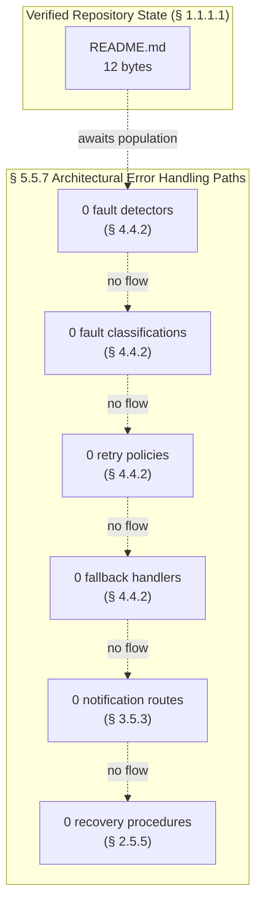

When source code containing exception handlers, retry decorators, circuit-breaker configurations, error-reporting integrations, or operational runbooks is contributed to the repository, the placeholder nodes above should be replaced with concrete fault classes, retry-policy parameters, fallback handler references, alert routes, and recovery procedure links.

---

## 5.6 CONSOLIDATED SYSTEM ARCHITECTURE STATE

### 5.6.1 State Summary Diagram

The following diagram summarizes the consolidated state of Section 5 at the time of this specification's authoring. The diagram preserves the canonical System Architecture substructure while reflecting the verified absence of substantive content in every container. The diagram follows the pattern established in § 1.2.2.2, § 1.3.3, § 2.8, § 3.9.1, and § 4.6.

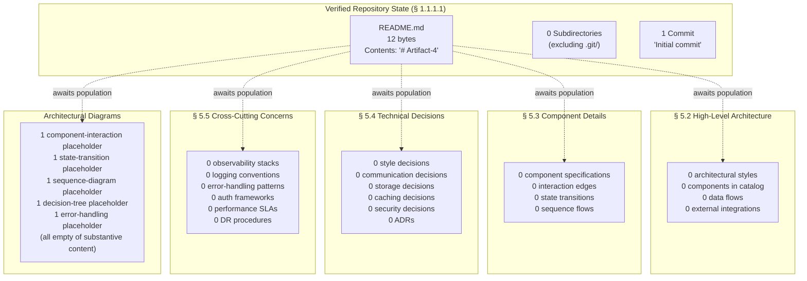

The diagram is intentionally a faithful pictorial counterpart to the textual content of §§ 5.2 through 5.5: every container exists structurally and is positioned as it would be in a populated System Architecture section, but each container holds zero substantive entries. As substantive architectural artifacts are contributed to the repository, the nodes labeled "0 …" should be replaced with concrete style descriptors, component identifiers, decision records, and cross-cutting-concern configurations.

### 5.6.2 Cross-Reference Summary Matrix

The following matrix consolidates every cross-reference made in Section 5 back to the upstream subsections of Sections 1, 2, 3, and 4 that originally established the verified absence:

| Section 5 Sub-Topic | Primary Upstream Reference | Supporting Upstream References |
|---------------------|---------------------------|--------------------------------|
| § 5.2.1.1 Architectural Style | § 1.2.2.3 (8 dimensions Not determined) | § 1.2.2.2, § 3.1.2, § 3.2 |
| § 5.2.1.2 Principles and Patterns | § 1.2.2.1 (no behaviors) | § 1.2.2.2, § 1.2.2.3 |
| § 5.2.1.3 Boundaries and Interfaces | § 1.3.1.2 (no boundaries) | § 1.2.1.3, § 2.4.2, § 2.5.4 |
| § 5.2.2 Core Components | § 1.2.2.2 (no components) | § 2.4.3, § 3.8.1 |
| § 5.2.3 Data Flow Description | § 1.2.1.3 (no integrations) | § 2.4.2, § 3.5.1, § 3.6.1, § 3.6.3 |
| § 5.2.4 External Integration Points | § 3.5.1 (none defined) | § 1.2.1.3, § 2.4.2, § 1.2.3.3 |
| § 5.3.1 Per-Component Specification | § 1.2.2.2 (no components) | § 1.2.2.3, § 3.6.1, § 2.5.3 |
| § 5.3.2 Component Interaction Diagram | § 3.8.1 (zero contracts) | § 1.2.2.2, § 2.4.2, § 2.4.3 |
| § 5.3.3 State Transition Diagram | § 1.2.2.1 (no stateful behavior) | § 3.6.1, § 4.4.1, § 1.3.1.2 |
| § 5.3.4 Sequence Diagram for Key Flows | § 1.2.1.3 (no integrations) | § 2.4.2, § 3.5.1, § 3.1.2 |
| § 5.4.1 Style Decisions | § 1.2.2.3 (Not determined) | § 1.2.2.2 |
| § 5.4.2 Communication Pattern Choices | § 2.4.2 (none defined) | § 3.5.1, § 4.4.1 |
| § 5.4.3 Data Storage Solution Rationale | § 3.6.1 (none defined) | § 3.6.2 |
| § 5.4.4 Caching Strategy Justification | § 3.6.3 (none defined) | § 3.5.4 |
| § 5.4.5 Security Mechanism Selection | § 2.5.4 (none defined) | § 3.5.2, § 3.8.2, § 3.6.2 |
| § 5.4.6 Architecture Decision Records | § 1.1.1.1 (0 ADRs) | § 1.2.2.3, § 2.7.2 |
| § 5.4.7 Architecture Decision Tree | § 5.4.1–5.4.6 (no decisions) | § 1.2.2.3 |
| § 5.5.1 Monitoring and Observability | § 3.5.3 (not present) | § 2.5.5 |
| § 5.5.2 Logging and Tracing Strategy | § 3.5.3 (not present) | § 2.4.4, § 2.5.5 |
| § 5.5.3 Error Handling Patterns | § 4.4.2 (none defined) | § 3.5.3, § 2.5.5 |
| § 5.5.4 AuthN / AuthZ Framework | § 3.5.2 (none defined) | § 2.5.4 |
| § 5.5.5 Performance Requirements and SLAs | § 2.5.2 (none defined) | § 1.2.3.3, § 1.2.3.1 |
| § 5.5.6 Disaster Recovery Procedures | § 2.5.5 (not present) | § 3.6.2, § 2.5.3 |
| § 5.5.7 Error Handling Flow Diagram | § 4.5.3 (placeholder precedent) | § 4.4.2, § 3.5.3, § 2.5.5 |

---

## 5.7 REVISION TRIGGERS FOR SECTION 5

### 5.7.1 Triggers by Subsection

Modeled on the revision-trigger tables in § 1.4.2.2 (*Recommended Revision Triggers*), § 2.7.3 (*Revision Triggers for Section 2*), § 3.10 (*Revision Triggers for Section 3*), and § 4.7 (*Revision Triggers for Section 4*), the following events warrant revision of Section 5.

| Revision Trigger | Subsections Most Affected |
|------------------|---------------------------|
| Source files exposing modules, packages, services, or classes are added | § 5.2.2, § 5.3.1, § 5.3.2 |
| An architectural style document (e.g., "Why microservices," "Why monolith") is contributed | § 5.2.1, § 5.4.1 |
| Architecture Decision Records (ADRs) are authored in `docs/adr/` or equivalent | § 5.4.1–§ 5.4.6 |
| API contracts (OpenAPI, gRPC `.proto`, GraphQL SDL, AsyncAPI) are added | § 5.2.3, § 5.2.4, § 5.3.4 |
| Message-broker topic / queue / event-schema definitions are added | § 5.2.3, § 5.2.4, § 5.4.2 |

| Revision Trigger | Subsections Most Affected |
|------------------|---------------------------|
| Database schemas, migrations, or ORM model definitions are added | § 5.2.3, § 5.3.3, § 5.4.3 |
| Cache configuration (in-process, Redis, Memcached, CDN) is added | § 5.2.3, § 5.4.4 |
| Authentication / authorization configuration (OAuth, OIDC, SAML, RBAC) is added | § 5.4.5, § 5.5.4 |
| Observability integrations (Datadog, Prometheus, OpenTelemetry, Sentry) are configured | § 5.5.1, § 5.5.2 |
| Exception hierarchies, retry libraries, or circuit-breaker descriptors are added | § 5.5.3, § 5.5.7 |
| Operational runbooks, disaster-recovery procedures, or RTO/RPO documentation are contributed | § 5.5.6 |

| Revision Trigger | Subsections Most Affected |
|------------------|---------------------------|
| SLO / SLA / KPI documentation is contributed | § 5.5.5 |
| Infrastructure-as-code artifacts (Terraform, CloudFormation, Helm, Kubernetes manifests) are added | § 5.2.1, § 5.3.1, § 5.5.6 |
| Container orchestration manifests (Kubernetes, ECS, Nomad) are added | § 5.2.1, § 5.5.6 |
| Service-mesh configuration (Istio, Linkerd, Consul Connect) is added | § 5.3.2, § 5.4.2 |
| Secrets-management configuration (Vault, AWS Secrets Manager, etc.) is added | § 5.4.5, § 5.5.4 |

### 5.7.2 Artifact-to-Subsection Mapping

The following inverse mapping lets contributors immediately locate the subsections of Section 5 that require revision when a specific artifact type is contributed:

| Contributed Artifact Type | Subsections Requiring Revision |
|---------------------------|-------------------------------|
| Module / package / service source file | § 5.2.2, § 5.3.1, § 5.3.2, § 5.6 |
| Architectural Decision Record (ADR) | § 5.4.1–§ 5.4.6, § 5.6 |
| API contract (OpenAPI, gRPC `.proto`, GraphQL SDL, AsyncAPI) | § 5.2.3, § 5.2.4, § 5.3.4, § 5.6 |
| Event / message schema (Avro, Protobuf, JSON-Schema) | § 5.2.3, § 5.2.4, § 5.4.2, § 5.6 |
| Database schema / migration / ORM model | § 5.2.3, § 5.3.3, § 5.4.3, § 5.6 |
| Cache configuration (Redis, Memcached, CDN policy) | § 5.2.3, § 5.4.4, § 5.6 |
| Authentication / authorization configuration | § 5.4.5, § 5.5.4, § 5.6 |
| Observability / telemetry configuration | § 5.5.1, § 5.5.2, § 5.6 |
| Exception class, retry decorator, circuit-breaker descriptor | § 5.5.3, § 5.5.7, § 5.6 |
| Operational runbook / disaster-recovery procedure | § 5.5.6, § 5.6 |
| SLO / SLA / KPI documentation | § 5.5.5, § 5.6 |
| Infrastructure-as-code artifact (Terraform / CFN / Helm / K8s) | § 5.2.1, § 5.3.1, § 5.5.6, § 5.6 |
| Service-mesh / orchestration descriptor | § 5.3.2, § 5.4.2, § 5.6 |
| Secrets-management configuration | § 5.4.5, § 5.5.4, § 5.6 |

### 5.7.3 Architecture Decision Version Tracking

Architecture decision version tracking conventionally records, for each `ADR-XXX` identifier, the version at which the decision was introduced, the versions in which it was amended, and the version at which it was deprecated or superseded (if applicable). Mirroring the structure of § 2.7.4 (*Requirement Version Tracking*) and § 4.7.3 (*Workflow Version Tracking*), and with zero ADR identifiers issued in § 5.4.6, no version-tracking entries exist:

| Tracking Dimension | Current Value | Reference |
|--------------------|---------------|-----------|
| ADRs introduced (this version) | 0 | § 5.4.6 |
| ADRs amended (this version) | 0 | § 5.4.6 |
| ADRs superseded / deprecated (this version) | 0 | § 5.4.6 |
| Components introduced (this version) | 0 | § 5.2.2 |
| Cross-cutting integrations introduced (this version) | 0 | § 5.5 |
| Section 5 baseline version | Initial (concurrent with § 1 baseline) | § 1.1.1.1 |

---

## 5.8 REFERENCES

### 5.8.1 Files Examined

- `README.md` — The sole file in the Artifact-4 repository. Examined to confirm its 12-byte size and one-line content (`# Artifact-4`). Establishes that no architectural style document, ADR, component manifest, API contract, schema, observability configuration, or security policy can be derived from any artifact present in the repository. Cited throughout § 5.1, § 5.2, § 5.3, § 5.4, § 5.5, and § 5.6.

### 5.8.2 Folders Examined

- `/` (repository root, depth 0) — Examined to confirm that no subdirectories exist outside `.git/` version-control metadata. Establishes that no `src/`, `app/`, `services/`, `components/`, `lib/`, `modules/`, `pkg/`, or equivalent source directories (which could contain components for § 5.2.2 and § 5.3.1); no `docs/adr/`, `docs/architecture/`, or `decisions/` directories (which could contain ADRs for § 5.4.6); no `contracts/`, `api/`, `proto/`, `schemas/`, or `openapi/` directories (which could contain integration contracts for § 5.2.4 and § 5.3.4); no `infra/`, `terraform/`, `k8s/`, `helm/`, or `deploy/` directories (which could contain deployment topology for § 5.2.1 and § 5.5.6); no `observability/`, `monitoring/`, or `telemetry/` directories (which could contain observability configuration for § 5.5.1 and § 5.5.2); and no `runbooks/`, `playbooks/`, or `ops/` directories (which could contain disaster-recovery procedures for § 5.5.6) are present. Cited throughout § 5.2 and § 5.3.

### 5.8.3 Repository Metadata Consulted

- **Git remote configuration** — Confirms the canonical project URL `https://github.com/ShaliniTest-maker/Artifact-4.git`. Used in § 5.1.2 to anchor the repository-state attestation that governs every Section-5 subsection.
- **Git commit log** — Confirms a single-commit history (hash `3e64ae951eb38821e57b0e58e2d3d83f567c2a64`, message `Initial commit`, date 2026-05-28 16:08:59 +0530). Used to corroborate that no architectural artifact has been introduced in any historical revision of the repository, and that no architectural evolution can be traced.
- **Git author records** — Confirms commit authorship by `ShaliniTest-maker <shaliniguptatest@gmail.com>`. Used in § 5.1.2 to confirm that no additional design contributors are recorded.

### 5.8.4 Cross-Referenced Technical Specification Sections

The following sections of the present Technical Specification are cross-referenced from § 5 to anchor the evidence-based attestations:

- **§ 1.1.1.1 Repository State Snapshot** — Anchors the repository-state attributes table in § 5.1.2 and the consolidated diagram in § 5.6.1.
- **§ 1.2.1.1 Business Context and Market Positioning** — Establishes the absence of compliance / regulatory context relevant to § 5.4.5 and § 5.5.4.
- **§ 1.2.1.3 Integration with Existing Enterprise Landscape** — Establishes the absence of integration counterparties referenced throughout § 5.2.3, § 5.2.4, and § 5.3.4.
- **§ 1.2.2.1 Primary System Capabilities** — Establishes the absence of executable entry points, behaviors, and stateful constructs referenced throughout § 5.2.1, § 5.2.2, § 5.3.3, and § 5.4.1.
- **§ 1.2.2.2 Major System Components** — Establishes the absence of components and modules referenced throughout § 5.2.2, § 5.3.1, § 5.3.2, § 5.4.1, and § 5.5.3.
- **§ 1.2.2.3 Core Technical Approach** — Establishes the absence of language, framework, runtime, build, storage, deployment, testing, and containerization selections referenced throughout § 5.2.1, § 5.4.1, § 5.4.3, and § 5.4.6.
- **§ 1.2.3.1 Measurable Objectives** — Establishes the absence of SLOs and SLAs referenced in § 5.5.5 and § 5.5.6.
- **§ 1.2.3.3 Key Performance Indicators** — Establishes the absence of performance KPIs that would inform § 5.2.4 (SLA Requirements column) and § 5.5.5.
- **§ 1.3.1.2 Implementation Boundaries** — Establishes the absence of system boundaries, user groups, and data domains referenced in § 5.2.1.3 and § 5.3.3.
- **§ 1.3.3 Consolidated Scope Summary** — Provides the diagrammatic precedent for the consolidated-state diagram in § 5.6.1.
- **§ 1.4.1 Evidence-Based Documentation Standard** — Establishes the binding standard reaffirmed in § 5.1.1.
- **§ 1.4.2.1 Explicit Acknowledgment of Gaps** — Establishes the canonical absence vocabulary used uniformly in § 5.
- **§ 1.4.2.2 Recommended Revision Triggers** — Provides the template adapted into § 5.7.1.
- **§ 2.1.3 Treatment of Conventional Subsections** — Establishes the substructure-preservation contract honored by § 5.1.4.
- **§ 2.4.2 Integration Points** — Establishes the absence of integration points referenced in § 5.2.3, § 5.2.4, § 5.3.2, § 5.3.4, and § 5.4.2.
- **§ 2.4.3 Shared Components** — Establishes the absence of shared libraries, data models, UI components, and utilities referenced in § 5.2.2 and § 5.3.2.
- **§ 2.4.4 Common Services** — Establishes the absence of authentication, logging, configuration, and background-job services referenced in § 5.5.2 and § 5.5.4.
- **§ 2.5.1 Technical Constraints** — Establishes the absence of language, framework, runtime, and toolchain constraints referenced in § 5.4.1.
- **§ 2.5.2 Performance Requirements** — Establishes the absence of throughput, latency, concurrency, and resource targets referenced in § 5.5.5.
- **§ 2.5.3 Scalability Considerations** — Establishes the absence of horizontal/vertical scaling, statefulness, and capacity-planning decisions referenced in § 5.3.1, § 5.5.5, and § 5.5.6.
- **§ 2.5.4 Security Implications** — Establishes the absence of authentication, authorization, encryption, and audit posture referenced in § 5.4.5 and § 5.5.4.
- **§ 2.5.5 Maintenance Requirements** — Establishes the absence of testing, CI/CD, observability, and runbook artifacts referenced throughout § 5.5.1, § 5.5.3, and § 5.5.6.
- **§ 2.7.2 Documented Constraints** — Establishes the constraint catalog (no fabrication of identifiers; preservation of canonical substructure) honored throughout § 5.
- **§ 2.7.3 Revision Triggers for Section 2** — Provides the template adapted into § 5.7.1.
- **§ 2.7.4 Requirement Version Tracking** — Provides the template adapted into § 5.7.3 (Architecture Decision Version Tracking).
- **§ 2.8 Consolidated Product Requirements State** — Provides the diagrammatic precedent for the consolidated-state diagram in § 5.6.1.
- **§ 3.1.2 Treatment of the Default Technology Stack** — Establishes the binding non-application of the default stack reaffirmed in § 5.1.3 and observed throughout § 5.2, § 5.3.4, and § 5.4.
- **§ 3.1.3 Canonical Subsection Preservation** — Reaffirms the substructure-preservation contract honored by § 5.1.4.
- **§ 3.5.1 External APIs and Integrations** — Establishes the absence of API surfaces referenced in § 5.2.3, § 5.2.4, § 5.3.4, and § 5.4.2.
- **§ 3.5.2 Authentication and Identity Services** — Establishes the absence of identity capabilities referenced in § 5.4.5 and § 5.5.4.
- **§ 3.5.3 Monitoring and Observability Services** — Establishes the absence of logging, metrics, tracing, APM, and error-reporting services referenced in § 5.5.1, § 5.5.2, § 5.5.3, and § 5.5.7.
- **§ 3.5.4 Cloud Platform Services** — Establishes the absence of cloud compute, storage, CDN, DNS, and secrets-management selections referenced in § 5.4.4, § 5.4.5, and § 5.5.6.
- **§ 3.6.1 Primary and Secondary Databases** — Establishes the absence of database tiers referenced in § 5.2.3, § 5.3.3, and § 5.4.3.
- **§ 3.6.2 Data Persistence Strategy** — Establishes the absence of schema, migration, transactional, and backup posture referenced in § 5.4.3, § 5.5.3, and § 5.5.6.
- **§ 3.6.3 Caching Solutions** — Establishes the absence of in-process, distributed, HTTP-response, and CDN edge caches referenced in § 5.2.3 and § 5.4.4.
- **§ 3.6.4 Object and File Storage Services** — Establishes the absence of blob, NAS, static-asset, and media storage referenced in § 5.2.3.
- **§ 3.8.1 Integration Requirements Between Components** — Establishes the zero-contract state referenced throughout § 5.3.2 and § 5.4.2.
- **§ 3.8.2 Security Implications of Technology Choices** — Establishes the absence of technology-derived security implications referenced in § 5.4.5.
- **§ 3.9.1 State Summary Diagram** — Provides the diagrammatic precedent for the consolidated-state diagram in § 5.6.1.
- **§ 3.10 Revision Triggers for Section 3** — Provides the template adapted into § 5.7.1 and § 5.7.2.
- **§ 4.4.1 State Management** — Establishes the absence of state transitions, persistence points, caches, and transaction boundaries referenced in § 5.3.3.
- **§ 4.4.2 Error Handling** — Establishes the absence of retry, fallback, notification, recovery, exception, dead-letter, circuit-breaker, alert-routing, and compensation mechanisms referenced in § 5.5.3 and § 5.5.7.
- **§ 4.5.3 Error Handling Flowcharts** — Provides the placeholder pattern reproduced in § 5.5.7.
- **§ 4.5.4 Integration Sequence Diagrams** — Provides the placeholder pattern reproduced in § 5.3.4.
- **§ 4.5.5 State Transition Diagrams** — Provides the placeholder pattern reproduced in § 5.3.3.
- **§ 4.6 Consolidated Process Flow State** — Provides the consolidated-state diagram pattern adapted into § 5.6.1.
- **§ 4.7 Revision Triggers for Section 4** — Provides the template adapted into § 5.7.1 and § 5.7.2.

### 5.8.5 External Searches Performed

No external web searches were performed in the authoring of this section. All factual content was derived from artifacts and metadata internal to the Artifact-4 repository and from sections § 1.1 through § 4.8 of the present Technical Specification. Per § 3.1.2, the default technology stack offered as authoring guidance is **explicitly not applied** in any architectural assertion, diagram, table, or decision record within this section, in conformance with the binding evidence-based standard of § 1.4.1.

---

# 6. SYSTEM COMPONENTS DESIGN

## 6.1 Core Services Architecture

### 6.1.1 Applicability Determination

#### 6.1.1.1 Non-Applicability Statement

**Core Services Architecture is not applicable for this system.**

This determination is binding for the Artifact-4 repository in its current verified state and is the unambiguous consequence of applying the conditional logic stated in the Section 6.1 prompt: *"If the system does not require microservices, distributed architecture, or distinct service components, clearly state 'Core Services Architecture is not applicable for this system' and explain why."* The repository contains zero services, zero distinct components, and zero distributed-architecture artifacts; therefore, no service-architecture sub-topic — service boundaries, communication patterns, service discovery, load balancing, circuit breakers, retries/fallbacks, scalability design, or resilience patterns — can be substantively documented at this time.

#### 6.1.1.2 Basis for Non-Applicability

The non-applicability determination rests on five categorically convergent findings from upstream sections of this Technical Specification:

| Finding | Source Section | Implication for § 6.1 |
|---------|----------------|-----------------------|
| Repository contains exactly one file (`README.md`, 12 bytes) and zero subdirectories | § 1.1.1.1 | No source artifacts from which to derive services |
| Zero modules, packages, services, classes, or functions exist | § 1.2.2.2 | No service boundaries can be identified |
| All eight technical-stack dimensions are "Not determined" | § 1.2.2.3 | No deployment target, runtime, or container model |
| No integrations, API contracts, message brokers, databases, or identity providers exist | § 1.2.1.3 | No inter-service communication surface |
| All scalability, performance, error-handling, and DR dimensions are "None defined" | § 2.5.2, § 2.5.3, § 4.4.2, § 5.5.6 | No scalability or resilience posture |

The determination is further reinforced by the explicit prohibition recorded in § 3.1.2 and § 5.1.3 against applying the default technology stack to any architectural assertion, and by the canonical-vocabulary convention in § 1.4.2.1 that requires verified absences to be recorded explicitly using the phrases "Not defined," "Not present in repository," and "Not determined."

#### 6.1.1.3 Repository State Snapshot

The following snapshot is reproduced from § 1.1.1.1 to anchor every assertion in this section to verified repository facts. No claim in § 6.1 may be made that is not traceable to this snapshot or to its downstream consequences in §§ 1.2 through 5.6.

| Attribute | Value | Reference |
|-----------|-------|-----------|
| Repository name | Artifact-4 | § 1.1.1.1 |
| Sole file | `README.md` (12 bytes) | § 1.1.1.1 |
| `README.md` contents | `# Artifact-4` | § 1.1.1.1 |
| Subdirectories (excluding `.git/`) | 0 | § 1.1.1.1 |

| Attribute | Value | Reference |
|-----------|-------|-----------|
| Commit count | 1 (`Initial commit`) | § 1.1.1.1 |
| Architectural components | 0 | § 1.2.2.2 |
| Integration points | 0 | § 1.2.1.3, § 2.4.2 |
| ADRs / decision records | 0 | § 5.4.6 |

---

### 6.1.2 Service Components — Not Applicable

The Service Components sub-domain conventionally documents the boundaries between distinct services, the messaging or RPC channels that connect them, the mechanism by which one service locates another at runtime, the algorithm that distributes traffic across replicas, the safeguards that protect callers from cascading failures, and the policies that govern transient-fault recovery. Each of these dimensions is recorded below as **Not applicable — Not defined**, with traceable references to the upstream sections that established the verified absence.

#### 6.1.2.1 Service Boundaries and Responsibilities

Service boundaries are conventionally derived from named modules, packages, classes, or deployable units that expose well-defined interfaces and own discrete domain responsibilities. Per § 1.2.2.2, the repository contains "no modules, packages, services, classes, functions, or other architectural components." Per § 5.3.1, the Per-Component Specification table contains zero rows across all six conventional dimensions (purpose, technology, interfaces, persistence, scaling, operations). Per § 1.3.1.2 (as referenced from § 5.6.2), system boundaries are "Not defined; no component or service edges exist."

| Boundary Dimension | Status | Reference |
|--------------------|--------|-----------|
| Named services or bounded contexts | None defined | § 1.2.2.2 |
| Domain responsibilities per service | None defined | § 5.3.1 |
| Service-ownership matrix | None defined | § 1.2.2.2, § 5.3.1 |
| Inter-service contract surface | None defined | § 1.3.1.2, § 3.8.1 |

#### 6.1.2.2 Inter-Service Communication Patterns

Inter-service communication patterns are conventionally documented through synchronous-API contracts (REST/GraphQL/gRPC), asynchronous-messaging declarations (broker topics, event schemas), serialization-format choices (JSON/Protobuf/Avro), and choreography-versus-orchestration architectural decisions. Per § 2.4.2, all four conventional integration-point categories — synchronous APIs, asynchronous messaging, persistence interfaces, and third-party SDKs — are recorded as "None defined." Per § 5.4.2 (Communication Pattern Choices, as cataloged in § 5.6.2), every communication-pattern dimension is "None defined."

| Communication Dimension | Status | Reference |
|-------------------------|--------|-----------|
| Synchronous vs. asynchronous balance | None defined | § 2.4.2, § 5.4.2 |
| Request/reply vs. event-driven choice | None defined | § 2.4.2, § 5.4.2 |
| Wire protocol selection (REST/gRPC/AMQP) | None defined | § 3.5.1 |
| Serialization format (JSON/Protobuf/Avro) | None defined | § 5.4.2 |

#### 6.1.2.3 Service Discovery Mechanisms

Service discovery is conventionally implemented through a service registry (Consul, etcd, Eureka), a service mesh (Istio, Linkerd, Consul Connect), DNS-based discovery (Kubernetes Services, AWS Cloud Map), or a load-balancer-mediated endpoint catalog. Per § 1.2.1.3, the repository contains "no integrations, external system references, API contracts, message broker configurations, database connection strings, third-party SDKs, enterprise service bus definitions, or identity provider configurations." Per § 3.8.1 (as cataloged in § 5.6.2), the "Service ↔ service mesh contract" dimension is "None defined."

| Discovery Dimension | Status | Reference |
|---------------------|--------|-----------|
| Service registry technology | None defined | § 1.2.1.3 |
| Service mesh deployment | None defined | § 3.8.1 |
| DNS-based discovery mechanism | None defined | § 1.2.1.3 |
| Endpoint health-check protocol | None defined | § 5.5.1 |

#### 6.1.2.4 Load Balancing Strategy

Load-balancing strategies are conventionally documented through layer-4/layer-7 balancer selections (NGINX, HAProxy, AWS ALB, GCP HTTP(S) LB), algorithm choices (round-robin, least-connections, weighted, IP-hash), session-affinity rules, and health-check intervals. Per § 1.2.2.3, the "Deployment Target" dimension is "Not determined; no infrastructure definitions present." Per § 1.2.2.3, the "Containerization" dimension is "Not determined; no `Dockerfile` or compose files present" — therefore no orchestrator-mediated load balancing (Kubernetes Services, ECS, Nomad) is configured.

| Load-Balancing Dimension | Status | Reference |
|--------------------------|--------|-----------|
| Layer-4 / Layer-7 balancer selection | None defined | § 1.2.2.3 |
| Balancing algorithm | None defined | § 1.2.2.3 |
| Session affinity / sticky sessions | None defined | § 1.2.2.3 |
| Health-check interval / threshold | None defined | § 5.5.1 |

#### 6.1.2.5 Circuit Breaker Patterns

Circuit-breaker patterns are conventionally implemented via resilience libraries (resilience4j, Polly, Hystrix, gobreaker, py-breaker) configured with failure-threshold counters, half-open probe intervals, and per-dependency bulkhead isolation. Per § 4.4.2 (Error Handling), the "Circuit-breaker / bulkhead configuration" dimension is recorded as "None defined — no resilience library configured." Per § 5.5.3 (Error Handling Patterns), the same dimension is recorded as "None defined — no resilience library."

| Circuit-Breaker Dimension | Status | Reference |
|---------------------------|--------|-----------|
| Resilience library selection | None defined | § 4.4.2 |
| Failure-threshold counters | None defined | § 4.4.2 |
| Half-open probe interval | None defined | § 4.4.2 |
| Bulkhead isolation policy | None defined | § 5.5.3 |

#### 6.1.2.6 Retry and Fallback Mechanisms

Retry and fallback mechanisms are conventionally implemented via retry libraries (Tenacity, Polly, Spring Retry, async-retry) with configurable backoff curves (fixed, exponential, jitter), dead-letter-queue declarations for unrecoverable failures, and compensation handlers for distributed-transaction rollback. Per § 4.4.2:

| Retry / Fallback Dimension | Status | Reference |
|----------------------------|--------|-----------|
| Retry library / policy | None defined — no retry library present | § 4.4.2 |
| Backoff strategy (fixed / exponential / jitter) | None defined | § 4.4.2 |
| Fallback handler chain | None defined — no circuit breaker present | § 4.4.2 |
| Dead-letter / parking-lot queue | None defined — no messaging infrastructure | § 4.4.2 |

#### 6.1.2.7 Service Interaction Diagram (Placeholder)

The Service Components prompt requires a service-interaction diagram. With zero services (§ 1.2.2.2), zero communication channels (§ 2.4.2), and zero inter-component contracts (§ 3.8.1), the diagram is rendered as a structurally valid placeholder that preserves the syntactic container, following the precedent established in § 1.2.2.2, § 2.8, § 3.9.1, § 4.5, § 5.3.2, and § 5.5.7.

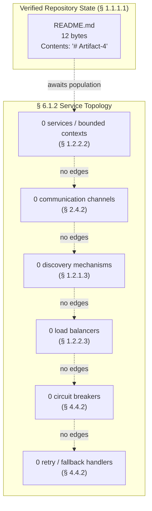

When services are contributed to the repository — i.e., when deployable units with documented interfaces are committed — the placeholder nodes above should be replaced with concrete service identifiers (drawn from module/package/deployment-unit names) and labeled edges reflecting actual REST/gRPC/event-bus contracts, discovery-registry registrations, load-balancer pool memberships, and circuit-breaker boundaries.

---

### 6.1.3 Scalability Design — Not Applicable

The Scalability Design sub-domain conventionally documents the dimensions along which the system can grow to meet increased load — replica-count growth (horizontal), per-instance capacity growth (vertical), the automation that triggers such growth, the rules that allocate finite resources across competing demands, the optimization techniques that defer or eliminate the need for additional resources, and the planning guidelines that translate forecasted demand into provisioned capacity. Each dimension is recorded below as **Not applicable — None defined**.

#### 6.1.3.1 Horizontal and Vertical Scaling Approach

Per § 2.5.3 (Scalability Considerations), every scalability dimension is recorded as "None defined" with references back to § 1.2.2.3 (no deployment target determined) and § 1.2.2.1 (no system capabilities documented). The conventional scaling-axis choice — replicate stateless services horizontally versus enlarge stateful nodes vertically — cannot be made in the absence of any service to scale.

| Scaling Dimension | Status | Reference |
|-------------------|--------|-----------|
| Horizontal scaling approach | None defined | § 2.5.3, § 1.2.2.3 |
| Vertical scaling approach | None defined | § 2.5.3, § 1.2.2.3 |
| Stateful vs. stateless design | None defined | § 2.5.3, § 1.2.2.1 |
| Replica-count baseline / maximum | None defined | § 2.5.3 |

#### 6.1.3.2 Auto-Scaling Triggers and Rules

Auto-scaling triggers are conventionally documented as CPU-utilization thresholds, request-queue-depth thresholds, custom-metric thresholds (e.g., RabbitMQ queue length, Kafka consumer lag), and scheduled scaling windows. Per § 1.2.2.3, no infrastructure definitions are present in the repository. Per § 5.5.1, no metrics-collection stack is configured from which trigger metrics could be sourced.

| Auto-Scaling Dimension | Status | Reference |
|------------------------|--------|-----------|
| CPU / memory utilization triggers | None defined | § 1.2.2.3 |
| Request / queue-depth triggers | None defined | § 1.2.2.3 |
| Custom-metric triggers | None defined | § 5.5.1 |
| Scheduled-scaling windows | None defined | § 1.2.2.3 |

#### 6.1.3.3 Resource Allocation Strategy

Resource-allocation strategies are conventionally documented as CPU/memory request-and-limit pairs (Kubernetes), instance-type selections (EC2, GCE), reserved-vs-spot procurement mixes, and pod-disruption budgets. Per § 1.2.2.3, no containerization is present (no `Dockerfile`, no compose files). Per § 3.5.4 (as cataloged in § 5.6.2 and the context report), all cloud-service categories — Compute, Managed databases, Object storage, CDN, DNS — are "None defined."

| Resource-Allocation Dimension | Status | Reference |
|-------------------------------|--------|-----------|
| Compute resource requests / limits | None defined | § 1.2.2.3 |
| Instance-type / machine-class selection | None defined | § 1.2.2.3 |
| Reserved vs. spot procurement mix | None defined | § 1.2.2.3 |
| Pod-disruption / availability budget | None defined | § 1.2.2.3 |

#### 6.1.3.4 Performance Optimization Techniques

Performance-optimization techniques are conventionally documented as caching tiers (in-process, distributed, CDN), database-query optimization (indexes, denormalization, read replicas), asynchronous processing (background workers, batch pipelines), and client-side rendering optimizations. Per § 4.4.1, every cache tier (in-process, distributed, HTTP-response, CDN edge) is "None defined." Per § 2.5.2, every performance dimension is "None defined."

| Optimization Dimension | Status | Reference |
|------------------------|--------|-----------|
| Caching tiers and invalidation | None defined | § 4.4.1 |
| Query-optimization / read replicas | None defined | § 4.4.1 |
| Asynchronous / batch offloading | None defined | § 2.4.2, § 4.4.1 |
| CDN / edge optimization | None defined | § 4.4.1 |

#### 6.1.3.5 Capacity Planning Guidelines

Capacity-planning guidelines are conventionally documented as forecasted-request-rate-to-replica-count formulas, headroom percentages (e.g., 30% reserved for spikes), peak-hour multipliers, and quarterly review cadences. Per § 1.2.3.1, no measurable objectives, SLOs, or SLAs are documented. Per § 5.5.5, the "Capacity-planning assumptions" dimension is "None defined." Per § 2.5.2, all throughput, latency, concurrency, and resource-utilization targets are "None defined."

| Capacity-Planning Dimension | Status | Reference |
|-----------------------------|--------|-----------|
| Forecasted-demand model | None defined | § 1.2.3.1, § 5.5.5 |
| Headroom / safety-margin percentages | None defined | § 5.5.5 |
| Peak-hour multipliers | None defined | § 2.5.2 |
| Review / replanning cadence | None defined | § 2.5.5 |

#### 6.1.3.6 Scalability Architecture Diagram (Placeholder)

The Scalability Design prompt requires a scalability-architecture diagram. With zero scaling units, zero auto-scaling triggers, zero allocated resources, and zero capacity assumptions, the diagram is rendered as a structurally valid placeholder following the convention established for empty-architecture diagrams across §§ 4.5, 5.3.2, 5.5.7, and 5.6.1.

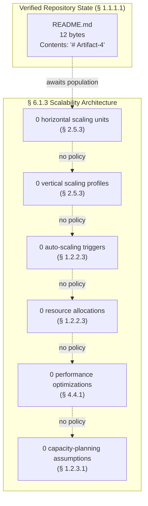

When scalability artifacts are contributed — e.g., Kubernetes HorizontalPodAutoscaler manifests, Terraform Auto Scaling Group definitions, capacity-planning spreadsheets, or load-test result corpora — the placeholder nodes above should be replaced with concrete replica counts, trigger thresholds (CPU %, queue depth), resource request/limit pairs, optimization techniques in use, and forecasted-demand assumptions.

---

### 6.1.4 Resilience Patterns — Not Applicable

The Resilience Patterns sub-domain conventionally documents the safeguards that allow the system to continue operating in the presence of faults — software bugs, hardware failures, network partitions, dependency outages, and capacity exhaustion. Each pattern dimension is recorded below as **Not applicable — None defined**.

#### 6.1.4.1 Fault Tolerance Mechanisms

Fault-tolerance mechanisms are conventionally implemented through redundant component instances, automatic-restart supervisors (systemd, Kubernetes liveness probes, supervisord), graceful-degradation handlers that disable non-essential features under stress, and timeout-and-retry envelopes around remote calls. Per § 4.4.2, every error-handling dimension — retry, fallback, error notification, recovery, exception hierarchy, DLQ, circuit breaker, alert routing, compensation — is recorded as "None defined" or "Not present in repository."

| Fault-Tolerance Dimension | Status | Reference |
|---------------------------|--------|-----------|
| Redundant-instance topology | None defined | § 4.4.2, § 1.2.2.2 |
| Automatic-restart supervision | None defined | § 4.4.2 |
| Timeout / retry envelopes | None defined | § 4.4.2 |
| Graceful-degradation handlers | None defined | § 4.4.2 |

#### 6.1.4.2 Disaster Recovery Procedures

Disaster-recovery procedures are conventionally documented as Recovery Time Objective (RTO) and Recovery Point Objective (RPO) targets, backup-and-restore policies, multi-region failover playbooks, and periodic recovery-drill schedules. Per § 5.5.6 (Disaster Recovery Procedures), every DR dimension is recorded as "None defined" or "Not present in repository." Per § 2.5.5, the "Operational runbook / playbook" dimension is "Not present in repository."

| Disaster-Recovery Dimension | Status | Reference |
|-----------------------------|--------|-----------|
| Recovery Time Objective (RTO) | None defined | § 5.5.6, § 1.2.3.1 |
| Recovery Point Objective (RPO) | None defined | § 5.5.6, § 1.2.3.1 |
| Runbook / playbook references | Not present in repository | § 5.5.6, § 2.5.5 |
| Recovery-drill schedule | None defined | § 5.5.6, § 2.5.5 |

#### 6.1.4.3 Data Redundancy Approach

Data-redundancy approaches are conventionally documented as primary-replica replication topologies, multi-AZ storage configurations, cross-region replication policies, backup-frequency-and-retention windows, and erasure-coding strategies. Per § 5.5.6, the "Backup / restore policy" dimension is "None defined" (referencing § 3.6.2). The context report further confirms that every persistence dimension in § 3.6.2 — schema design, migration framework, transactional consistency, sharding, backup, retention, encryption-at-rest — is recorded as "None defined."

| Data-Redundancy Dimension | Status | Reference |
|---------------------------|--------|-----------|
| Primary-replica replication topology | None defined | § 3.6.2 |
| Multi-AZ storage configuration | None defined | § 3.6.2, § 5.5.6 |
| Cross-region replication policy | None defined | § 3.6.2, § 5.5.6 |
| Backup frequency / retention window | None defined | § 3.6.2, § 5.5.6 |

#### 6.1.4.4 Failover Configurations

Failover configurations are conventionally documented as active-passive versus active-active topologies, leader-election protocols (Raft, Paxos, ZooKeeper-mediated), DNS-failover TTLs, and traffic-shifting weights for blue/green or canary deployments. Per § 5.5.6, the "Multi-region / multi-zone failover" dimension is "None defined" (referencing § 2.5.3 and § 3.5.4). Per § 1.2.1.3, no DNS, identity provider, or third-party SDK configuration is present from which failover routing could be derived.

| Failover Dimension | Status | Reference |
|--------------------|--------|-----------|
| Active-passive vs. active-active topology | None defined | § 5.5.6 |
| Leader-election protocol | None defined | § 5.5.6, § 4.4.1 |
| DNS-failover / traffic-shifting policy | None defined | § 1.2.1.3, § 5.5.6 |
| Blue/green / canary configuration | None defined | § 1.2.2.3 |

#### 6.1.4.5 Service Degradation Policies

Service-degradation policies are conventionally documented as feature-flag-driven shedding of non-essential functionality, load-shedding thresholds at the ingress, read-only modes for write-impaired backends, and cache-only-serving modes for database outages. Per § 4.4.2, fallback processes are "None defined — no circuit breaker or fallback handler present." Per § 5.5.3 (Error Handling Patterns), every error-handling pattern is "None defined." No feature-flag framework is present in the repository per § 1.2.1.3.

| Degradation Policy Dimension | Status | Reference |
|------------------------------|--------|-----------|
| Feature-flag shedding policy | None defined | § 1.2.1.3, § 4.4.2 |
| Ingress load-shedding thresholds | None defined | § 4.4.2 |
| Read-only / cache-only modes | None defined | § 4.4.1, § 5.5.3 |
| Priority-tiering / quota enforcement | None defined | § 5.5.3 |

#### 6.1.4.6 Resilience Pattern Implementation Diagram (Placeholder)

The Resilience Patterns prompt requires a resilience-pattern-implementation diagram. The diagram is rendered as a structurally valid placeholder following the directly analogous precedent established in § 5.5.7 (Error Handling Flow Diagram), contextualized here to the resilience-pattern domain of § 6.1.4.

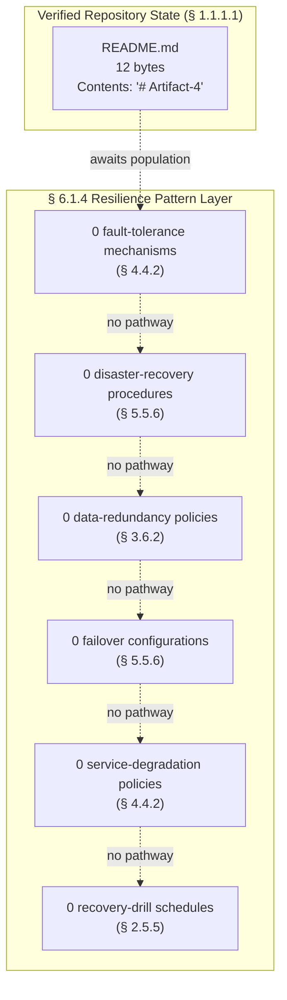

When resilience artifacts are contributed — e.g., circuit-breaker configuration files, retry-policy library settings, multi-region Terraform modules, runbook documents in `docs/runbooks/`, or chaos-engineering test fixtures — the placeholder nodes above should be replaced with concrete library configurations, RTO/RPO values, replication topologies, traffic-shifting weights, degradation feature-flag identifiers, and drill cadence definitions.

---

### 6.1.5 Consolidated Cross-Reference Matrix

The following matrix consolidates every cross-reference made in § 6.1 back to the upstream subsections of Sections 1, 2, 3, 4, and 5 that originally established the verified absence. This matrix mirrors the structure of § 5.6.2 and provides a single point of traceability for every "Not applicable" determination in this section.

| § 6.1 Sub-Topic | Primary Upstream Reference | Supporting References |
|-----------------|---------------------------|-----------------------|
| § 6.1.2.1 Service Boundaries | § 1.2.2.2 (no components) | § 5.3.1, § 1.3.1.2 |
| § 6.1.2.2 Inter-Service Communication | § 2.4.2 (none defined) | § 3.5.1, § 5.4.2 |
| § 6.1.2.3 Service Discovery | § 1.2.1.3 (no integrations) | § 3.8.1, § 5.5.1 |
| § 6.1.2.4 Load Balancing | § 1.2.2.3 (no deployment target) | § 1.2.2.3 (no container) |

| § 6.1 Sub-Topic | Primary Upstream Reference | Supporting References |
|-----------------|---------------------------|-----------------------|
| § 6.1.2.5 Circuit Breakers | § 4.4.2 (no resilience library) | § 5.5.3 |
| § 6.1.2.6 Retry / Fallback | § 4.4.2 (no retry library) | § 5.5.3 |
| § 6.1.3.1 Horizontal / Vertical Scaling | § 2.5.3 (none defined) | § 1.2.2.3, § 1.2.2.1 |
| § 6.1.3.2 Auto-Scaling Triggers | § 1.2.2.3 (no infrastructure) | § 5.5.1 |

| § 6.1 Sub-Topic | Primary Upstream Reference | Supporting References |
|-----------------|---------------------------|-----------------------|
| § 6.1.3.3 Resource Allocation | § 1.2.2.3 (no container model) | § 3.5.4 |
| § 6.1.3.4 Performance Optimization | § 4.4.1 (no cache tiers) | § 2.5.2 |
| § 6.1.3.5 Capacity Planning | § 1.2.3.1 (no SLOs) | § 5.5.5, § 2.5.2 |
| § 6.1.4.1 Fault Tolerance | § 4.4.2 (none defined) | § 1.2.2.2 |

| § 6.1 Sub-Topic | Primary Upstream Reference | Supporting References |
|-----------------|---------------------------|-----------------------|
| § 6.1.4.2 Disaster Recovery | § 5.5.6 (none defined) | § 2.5.5, § 1.2.3.1 |
| § 6.1.4.3 Data Redundancy | § 3.6.2 (no backup policy) | § 5.5.6 |
| § 6.1.4.4 Failover Configurations | § 5.5.6 (no multi-region) | § 1.2.1.3, § 1.2.2.3 |
| § 6.1.4.5 Service Degradation | § 4.4.2 (no fallback) | § 5.5.3, § 1.2.1.3 |

---

### 6.1.6 Revision Triggers

Per the documentation convention established in § 1.4.2.1 and reiterated for Sections 3, 4, and 5 (see § 3.10, § 4.7, § 5.7), this section must be revised when the repository state changes in ways that introduce service-architecture artifacts. The following enumerated triggers govern revision of § 6.1:

#### 6.1.6.1 Service-Components Revision Triggers

| Trigger Event | Required Revision in § 6.1 |
|---------------|----------------------------|
| Source code defining a deployable service is committed | Populate § 6.1.2.1 service-boundary catalog |
| API contract files (OpenAPI, Protobuf, GraphQL SDL) are added | Populate § 6.1.2.2 communication patterns |
| Service registry / mesh configuration is added | Populate § 6.1.2.3 discovery mechanisms |
| Load-balancer or ingress manifest is added | Populate § 6.1.2.4 load-balancing strategy |

#### 6.1.6.2 Resilience and Error-Handling Revision Triggers

| Trigger Event | Required Revision in § 6.1 |
|---------------|----------------------------|
| A resilience library (resilience4j, Polly, etc.) is added | Populate § 6.1.2.5 circuit-breaker configuration |
| A retry library (Tenacity, async-retry, etc.) is added | Populate § 6.1.2.6 retry / fallback configuration |
| Runbook documents are committed under `docs/runbooks/` | Populate § 6.1.4.2 disaster-recovery procedures |
| Multi-region / replication infrastructure is declared | Populate § 6.1.4.3 and § 6.1.4.4 |

#### 6.1.6.3 Scalability Revision Triggers

| Trigger Event | Required Revision in § 6.1 |
|---------------|----------------------------|
| Container orchestration manifests (Kubernetes, ECS) are added | Populate § 6.1.3.1, § 6.1.3.3 |
| Auto-scaling policies (HPA, ASG) are declared | Populate § 6.1.3.2 |
| SLOs / SLAs are formally documented | Populate § 6.1.3.5 capacity-planning guidelines |
| Cache, CDN, or read-replica configuration is added | Populate § 6.1.3.4 performance optimization |

---

### 6.1.7 References

#### 6.1.7.1 Files Examined

- `README.md` — The sole file in the repository (12 bytes, contents `# Artifact-4`); confirmed as the basis for the verified-absence determination underpinning § 6.1.

#### 6.1.7.2 Folders Examined

- Repository root (`/`) — Confirmed to contain exactly one file (`README.md`) and zero subdirectories (excluding `.git/` metadata); this finding is the foundational evidence for the § 6.1.1.1 non-applicability statement.

#### 6.1.7.3 Technical Specification Sections Referenced

- **§ 1.1.1.1** — Repository state snapshot (sole file, commit count, byte size); anchor for all § 6.1 absence claims.
- **§ 1.2.1.3** — Confirmed zero integrations, API contracts, message brokers, databases, and identity providers; basis for § 6.1.2.2, § 6.1.2.3, § 6.1.4.4.
- **§ 1.2.2.1** — Confirmed zero documented behaviors; basis for § 6.1.3.1 stateful/stateless determination.
- **§ 1.2.2.2** — Confirmed zero modules, packages, services, classes, or functions; primary basis for § 6.1.2.1.
- **§ 1.2.2.3** — Confirmed all eight technical-stack dimensions are "Not determined"; basis for § 6.1.2.4, § 6.1.3.1, § 6.1.3.2, § 6.1.3.3.
- **§ 1.2.3.1** — Confirmed no SLOs / SLAs documented; basis for § 6.1.3.5 and § 6.1.4.2 RTO/RPO determinations.
- **§ 1.2.3.3** — Confirmed all KPI categories are "None defined"; supporting basis for § 6.1.3.4 and § 6.1.3.5.
- **§ 1.3.1.2** — Confirmed no system boundaries defined; supporting basis for § 6.1.2.1.
- **§ 1.4.2.1** — Canonical vocabulary for verified absence ("Not defined," "Not present in repository," "Not determined"); applied throughout § 6.1.
- **§ 2.4.2** — Confirmed all four integration-point categories are "None defined"; primary basis for § 6.1.2.2.
- **§ 2.5.2** — Confirmed all performance dimensions are "None defined"; basis for § 6.1.3.4 and § 6.1.3.5.
- **§ 2.5.3** — Confirmed all scalability dimensions are "None defined"; primary basis for § 6.1.3.1.
- **§ 2.5.5** — Confirmed maintenance dimensions including runbook are "Not present in repository"; basis for § 6.1.4.2.
- **§ 3.1.2** — Established non-application of the default technology stack; binding constraint applied throughout § 6.1.
- **§ 3.5.1** — Confirmed all integration-surface categories are "None defined"; supporting basis for § 6.1.2.2.
- **§ 3.5.4** — Confirmed all cloud-service categories are "None defined"; supporting basis for § 6.1.3.3.
- **§ 3.6.2** — Confirmed all persistence dimensions are "None defined"; basis for § 6.1.4.3.
- **§ 3.8.1** — Confirmed zero inter-component contracts; supporting basis for § 6.1.2.1, § 6.1.2.3.
- **§ 4.4.1** — Confirmed all state-management dimensions are "None defined"; supporting basis for § 6.1.3.4, § 6.1.4.4.
- **§ 4.4.2** — Confirmed all error-handling dimensions are "None defined"; primary basis for § 6.1.2.5, § 6.1.2.6, § 6.1.4.1, § 6.1.4.5.
- **§ 4.5** — Established Mermaid placeholder pattern precedent; applied to § 6.1.2.7, § 6.1.3.6, § 6.1.4.6 diagrams.
- **§ 5.1.3** — Reiterated non-application of default technology stack; binding constraint applied throughout § 6.1.
- **§ 5.3.1** — Confirmed Per-Component Specification contains zero rows; supporting basis for § 6.1.2.1.
- **§ 5.3.2** — Established component-interaction placeholder diagram pattern; applied to § 6.1.2.7.
- **§ 5.4.2** — Confirmed all communication-pattern dimensions are "None defined"; supporting basis for § 6.1.2.2.
- **§ 5.5.1** — Confirmed all observability dimensions are "Not present in repository"; supporting basis for § 6.1.2.3, § 6.1.3.2.
- **§ 5.5.3** — Confirmed all error-handling-pattern dimensions are "None defined"; supporting basis for § 6.1.2.5, § 6.1.4.5.
- **§ 5.5.5** — Confirmed all performance / SLA dimensions are "None defined"; supporting basis for § 6.1.3.5.
- **§ 5.5.6** — Confirmed all disaster-recovery dimensions are "None defined" or "Not present in repository"; primary basis for § 6.1.4.2, § 6.1.4.3, § 6.1.4.4.
- **§ 5.5.7** — Established error-handling-flow placeholder diagram pattern; applied to § 6.1.4.6.
- **§ 5.6.1** — Established consolidated state-summary diagram pattern; applied to the overall structure of § 6.1 placeholder diagrams.
- **§ 5.6.2** — Established cross-reference matrix pattern; replicated in § 6.1.5.

## 6.2 Database Design

### 6.2.1 Applicability Determination

#### 6.2.1.1 Non-Applicability Statement

**Database Design is not applicable to this system.**

This determination is binding for the Artifact-4 repository in its current verified state and is the unambiguous consequence of applying the conditional logic stated in the Section 6.2 prompt: *"If the system does not require or direct database or persistent storage interactions are not clearly evident, clearly state 'Database Design is not applicable to this system' and explain why."* The repository contains zero database engines, zero schema definitions, zero migration artifacts, zero ORM models, zero connection-string configurations, zero cache deployments, and zero object/file storage configurations; therefore, no database-design sub-topic — schema design, data management, compliance considerations, or performance optimization — can be substantively documented at this time.

This section follows the documentation precedent established in § 6.1 (*Core Services Architecture*), which provides the canonical pattern for "Not Applicable" determinations in this Technical Specification: a non-applicability statement, a basis for non-applicability with cross-references to upstream sections, a repository-state snapshot, per-dimension tables recording each conventional sub-topic as "None defined," structurally valid Mermaid placeholder diagrams, revision triggers, a consolidated cross-reference matrix, and a comprehensive References subsection.

#### 6.2.1.2 Basis for Non-Applicability

The non-applicability determination rests on six categorically convergent findings from upstream sections of this Technical Specification, every one of which independently establishes the verified absence of database design artifacts:

| Finding | Source Section | Implication for § 6.2 |
|---------|----------------|-----------------------|
| Repository contains exactly one file (`README.md`, 12 bytes) and zero subdirectories | § 1.1.1.1 | No schema files, migration directories, or ORM models exist |
| "Data Storage Strategy" dimension is "Not determined; no schemas or migrations present" | § 1.2.2.3 | No persistence layer has been designed |
| "Data Domains Included" is "Not defined; no schemas, entities, or domain models present" | § 1.3.1.2 | No domain model exists from which to derive entities |
| All nine database tiers (OLTP, OLAP, document, key-value, graph, search, time-series, vector, read-replica) are "None defined" | § 3.6.1 | No engine selection from which to derive design decisions |
| All seven persistence dimensions (schema, migration, consistency, sharding, backup, retention, encryption-at-rest) are "None defined" | § 3.6.2 | No persistence strategy from which to derive policies |
| All six storage-decision dimensions (primary store, secondary store, partitioning, consistency, durability, rationale) are "None defined" | § 5.4.3 | No data-storage rationale recorded in any ADR |

The determination is further reinforced by the explicit non-application of the default technology stack (§ 3.1.2 and § 5.1.3), by the canonical-vocabulary convention recorded in § 1.4.2.1 — which requires verified absences to be documented using the phrases "Not defined," "Not present in repository," and "Not determined" rather than inferred or extrapolated content — and by the evidence-based documentation standard codified in § 1.4.1, which states that every assertion regarding the Artifact-4 system must be grounded in artifacts actually present within the repository.

#### 6.2.1.3 Repository State Snapshot

The following snapshot is reproduced from § 1.1.1.1 and from the persistence-specific findings in § 3.6 to anchor every assertion in this section to verified repository facts. No claim in § 6.2 may be made that is not traceable to this snapshot or to its downstream consequences in §§ 1.2 through 5.6.

| Attribute | Value | Reference |
|-----------|-------|-----------|
| Repository name | Artifact-4 | § 1.1.1.1 |
| Sole file | `README.md` (12 bytes) | § 1.1.1.1 |
| `README.md` contents | `# Artifact-4` | § 1.1.1.1 |
| Subdirectories (excluding `.git/`) | 0 | § 1.1.1.1 |

| Persistence Artifact Category | Count | Reference |
|------------------------------|-------|-----------|
| Schema files (`*.sql`, `*.prisma`, JSON-Schema) | 0 | § 3.6.1, § 3.6.2 |
| Migration directories (Alembic, Flyway, Liquibase, Django, Rails) | 0 | § 3.6.2 |
| ORM model files (SQLAlchemy, TypeORM, Sequelize, ActiveRecord) | 0 | § 1.2.2.2, § 3.6.1 |
| Database connection-string configurations | 0 | § 1.2.1.3, § 3.6.1 |
| Cache configuration files (Redis, Memcached) | 0 | § 3.6.3 |
| Object/file storage manifests (S3, GCS, Azure Blob) | 0 | § 3.6.4 |
| ADRs documenting storage decisions | 0 | § 5.4.3, § 5.4.6 |

---

### 6.2.2 Schema Design — Not Applicable

The Schema Design sub-domain conventionally documents the entities that constitute the logical data model, the relationships and cardinalities that connect them, the indexing decisions that accelerate lookups, the partitioning strategy that distributes data across storage units, the replication topology that protects against single-node failure, and the backup architecture that guarantees recoverability. Each dimension is recorded below as **Not applicable — None defined**, with traceable references to the upstream sections that originally established the verified absence.

#### 6.2.2.1 Entity Relationships

Entity relationships are conventionally documented through entity-relationship diagrams (ERDs) derived from schema files, ORM model declarations, or JSON-Schema definitions, with cardinalities (one-to-one, one-to-many, many-to-many) explicitly modeled and foreign-key constraints enforced. Per § 1.3.1.2, "Data Domains Included" is recorded as "Not defined; no schemas, entities, or domain models present." Per § 3.6.2, "Schema design / data model" is recorded as "None defined." Per § 1.2.2.2, the repository contains "no modules, packages, services, classes, functions, or other architectural components" from which ORM-derived entities could be discovered.

| Entity-Relationship Dimension | Status | Reference |
|-------------------------------|--------|-----------|
| Catalog of named entities | None defined | § 1.3.1.2, § 3.6.2 |
| Cardinality declarations | None defined | § 3.6.2 |
| Foreign-key constraints | None defined | § 3.6.2 |
| Aggregate / bounded-context boundaries | None defined | § 1.3.1.2, § 1.2.2.2 |

#### 6.2.2.2 Data Models and Structures

Data models and structures are conventionally documented through table-definition statements, document-shape specifications, key-value schemas, columnar-family declarations, or graph node/edge typings — each accompanied by attribute lists, data types, nullability constraints, default values, and uniqueness rules. Per § 3.6.1, every database tier (OLTP, OLAP, document, key-value, graph, search, time-series, vector) is "None defined." Per § 3.6.2, the "Schema design / data model" dimension is "None defined."

| Data Model Dimension | Status | Reference |
|----------------------|--------|-----------|
| Table / collection definitions | None defined | § 3.6.1, § 3.6.2 |
| Attribute typing and nullability | None defined | § 3.6.2 |
| Uniqueness and check constraints | None defined | § 3.6.2 |
| Default values and computed columns | None defined | § 3.6.2 |

#### 6.2.2.3 Indexing Strategy

Indexing strategy is conventionally documented through primary-key declarations, secondary-index definitions (B-tree, hash, GIN, GiST, full-text), covering-index choices, partial-index predicates, and unique-index constraints — each justified by anticipated query patterns and write-amplification tradeoffs. Per § 3.6.2, the schema-design dimension is "None defined," and no query patterns have been documented in any upstream section from which index requirements could be inferred. Per § 2.5.2, all performance dimensions are "None defined," precluding any index-design analysis grounded in measured workload.

| Indexing Dimension | Status | Reference |
|--------------------|--------|-----------|
| Primary-key index declarations | None defined | § 3.6.2 |
| Secondary-index definitions (B-tree, hash, GIN, GiST) | None defined | § 3.6.2 |
| Covering / partial / unique indexes | None defined | § 3.6.2 |
| Full-text / vector-similarity indexes | None defined | § 3.6.1, § 3.6.2 |

#### 6.2.2.4 Partitioning Approach

Partitioning approach is conventionally documented through horizontal partitioning rules (range, list, hash), vertical partitioning decisions (column families, table-per-tenant), sharding-key selections, and rebalancing policies. Per § 3.6.2, the "Sharding / partitioning strategy" dimension is recorded as "None defined" (referencing § 2.5.3). Per § 5.4.3, the "Partitioning / sharding strategy" decision dimension is recorded as "None defined — no persistence strategy."

| Partitioning Dimension | Status | Reference |
|------------------------|--------|-----------|
| Horizontal partitioning (range / list / hash) | None defined | § 3.6.2, § 5.4.3 |
| Vertical partitioning (column families, table-per-tenant) | None defined | § 3.6.2 |
| Sharding-key selection | None defined | § 3.6.2, § 5.4.3 |
| Rebalancing / split policy | None defined | § 3.6.2 |

#### 6.2.2.5 Replication Configuration

Replication configuration is conventionally documented through primary-replica topology declarations (single-primary, multi-primary, chain, star), synchronous-versus-asynchronous-replication mode selections, replica-lag thresholds, conflict-resolution rules for multi-primary deployments, and cross-region replication policies. Per § 3.6.2, no replication artifacts exist in the repository. Per § 5.4.3, the "Durability / replication posture" decision dimension is recorded as "None defined — no replication artifacts." Per § 5.5.6 (as referenced from § 6.1.4.3), "Primary-replica replication topology," "Multi-AZ storage configuration," and "Cross-region replication policy" are all "None defined."

| Replication Dimension | Status | Reference |
|-----------------------|--------|-----------|
| Primary-replica topology | None defined | § 3.6.2, § 5.4.3 |
| Synchronous vs. asynchronous mode | None defined | § 3.6.2, § 5.4.3 |
| Multi-AZ / multi-region configuration | None defined | § 5.5.6 |
| Conflict-resolution policy | None defined | § 3.6.2 |

#### 6.2.2.6 Backup Architecture

Backup architecture is conventionally documented through backup-frequency declarations (continuous WAL archiving, hourly snapshots, daily full backups), retention-window policies, off-site / cross-region replication of backups, encryption-of-backups posture, and restore-rehearsal cadences. Per § 3.6.2, the "Backup / restore policy" dimension is "None defined." Per § 5.5.6, all disaster-recovery dimensions including backup are "None defined" or "Not present in repository." Per § 2.5.5, the "Backup / restore policy" maintenance dimension is "Not present in repository."

| Backup Architecture Dimension | Status | Reference |
|-------------------------------|--------|-----------|
| Backup frequency and granularity | None defined | § 3.6.2, § 5.5.6 |
| Retention-window policy | None defined | § 3.6.2 |
| Off-site / cross-region replication of backups | None defined | § 5.5.6 |
| Restore-rehearsal cadence | None defined | § 2.5.5, § 5.5.6 |

#### 6.2.2.7 Database Schema Diagram (Placeholder)

The Database Design prompt requires a database schema diagram. With zero entities (§ 1.3.1.2), zero schemas (§ 3.6.2), and zero ORM models (§ 1.2.2.2), the ERD is rendered as a structurally valid placeholder that preserves the syntactic container while explicitly representing the verified absence, following the precedent established for empty-architecture diagrams in §§ 4.5, 5.3.2, 5.5.7, 5.6.1, and § 6.1.2.7 / § 6.1.3.6 / § 6.1.4.6.

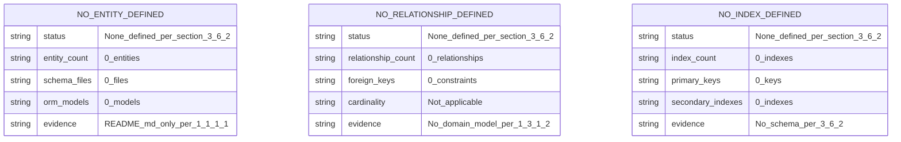

When schema artifacts are contributed to the repository — i.e., when `*.sql`, `*.prisma`, JSON-Schema, or ORM model files (SQLAlchemy, TypeORM, Sequelize, ActiveRecord) are committed — the placeholder entities above should be replaced with concrete entity identifiers drawn from the schema definitions, with attribute lists derived from column/field declarations, with relationship edges reflecting actual foreign-key constraints, and with cardinality labels (`||--o{`, `}o--o{`, etc.) corresponding to the declared multiplicities.

---

### 6.2.3 Data Management — Not Applicable

The Data Management sub-domain conventionally documents the procedures by which schemas evolve over time, the versioning conventions that track such evolution, the policies that govern long-term retention and eventual archival, the mechanisms by which application code stores and retrieves data, and the caching policies that mediate between application and database. Each dimension is recorded below as **Not applicable — None defined**.

#### 6.2.3.1 Migration Procedures

Migration procedures are conventionally implemented through dedicated migration frameworks (Alembic for SQLAlchemy, Flyway and Liquibase for JVM ecosystems, Django and Rails migrations for their respective frameworks, Prisma Migrate for TypeScript, golang-migrate for Go), each providing forward-migration scripts, rollback scripts, and a migration-state tracking table. Per § 3.6.2, the "Migration framework" dimension is "None defined" (referencing § 1.2.2.3). Per § 1.2.2.3, the "Data Storage Strategy" is "Not determined; no schemas or migrations present."

| Migration Procedure Dimension | Status | Reference |
|-------------------------------|--------|-----------|
| Migration framework adopted | None defined | § 1.2.2.3, § 3.6.2 |
| Forward-migration script convention | None defined | § 3.6.2 |
| Rollback-migration script convention | None defined | § 3.6.2 |
| Migration-state tracking table | None defined | § 3.6.2 |

#### 6.2.3.2 Versioning Strategy

Versioning strategy is conventionally documented through schema-version numbering schemes (sequential integers, semantic versions, timestamp-prefixed migration filenames), compatibility guarantees between application and schema versions (backward-compatible, forward-compatible, expand-and-contract), and the policy for retiring obsolete schema versions. Per § 3.6.2, no schema artifacts exist from which a versioning strategy could be derived. Per § 5.4.6, zero ADRs have been authored that could record such a strategy.

| Versioning Strategy Dimension | Status | Reference |
|-------------------------------|--------|-----------|
| Schema-version numbering scheme | None defined | § 3.6.2 |
| Application/schema compatibility policy | None defined | § 3.6.2 |
| Expand-and-contract migration pattern | None defined | § 3.6.2 |
| Schema-version retirement policy | None defined | § 3.6.2, § 5.4.6 |

#### 6.2.3.3 Archival Policies

Archival policies are conventionally documented through hot/warm/cold storage tiering rules, archival-trigger criteria (age-based, access-frequency-based), archival-target selections (cold object storage, glacier-class storage, tape), and archival-restore SLAs. Per § 3.6.2, the "Retention / archival policy" dimension is "None defined" (referencing § 2.5.4). Per § 3.6.4, all object-storage categories (blob/object storage, network-attached file storage, static-asset hosting, media pipeline) are "None defined" — therefore no archival target has been provisioned.

| Archival Policy Dimension | Status | Reference |
|---------------------------|--------|-----------|
| Hot/warm/cold storage tiering | None defined | § 3.6.2, § 3.6.4 |
| Archival-trigger criteria | None defined | § 3.6.2 |
| Archival-target selection | None defined | § 3.6.4 |
| Archival-restore SLA | None defined | § 3.6.2, § 2.5.5 |

#### 6.2.3.4 Data Storage and Retrieval Mechanisms

Data storage and retrieval mechanisms are conventionally documented through ORM/ODM library selections, query-builder usage patterns, raw-SQL escape hatches, prepared-statement strategies, and read-after-write consistency guarantees. Per § 3.6.1, every database tier is "None defined" — therefore no storage mechanism has been selected. Per § 4.4.1 (State Management, as cataloged in the context report), every state-persistence dimension (state transitions, data persistence points, transaction boundaries, idempotency keys, concurrency control, saga orchestration, event-sourcing materializations) is "None defined."

| Storage and Retrieval Dimension | Status | Reference |
|---------------------------------|--------|-----------|
| ORM / ODM library selection | None defined | § 3.6.1, § 1.2.2.2 |
| Query-builder usage pattern | None defined | § 3.6.1 |
| Prepared-statement strategy | None defined | § 3.6.1 |
| Read-after-write consistency guarantee | None defined | § 3.6.2, § 4.4.1 |

#### 6.2.3.5 Caching Policies

Caching policies are conventionally documented through cache-tier deployments (in-process LRU, distributed Redis/Memcached/Hazelcast, HTTP-response cache, CDN edge cache), eviction algorithms (LRU, LFU, TTL-based), invalidation strategies (write-through, write-behind, cache-aside), and consistency tradeoffs accepted. Per § 3.6.3, every cache tier and the invalidation strategy are "None defined." Per § 5.4.4, every caching-decision dimension is "None defined — no source code" or "None defined — no ADR present."

| Caching Policy Dimension | Status | Reference |
|--------------------------|--------|-----------|
| Cache-tier deployment (in-process, distributed, HTTP, CDN) | None defined | § 3.6.3, § 5.4.4 |
| Eviction algorithm (LRU, LFU, TTL) | None defined | § 3.6.3 |
| Invalidation strategy (write-through, write-behind, cache-aside) | None defined | § 3.6.3, § 5.4.4 |
| Consistency tradeoff documented | None defined | § 3.6.3, § 5.4.4 |

#### 6.2.3.6 Data Flow Diagram (Placeholder)

The Database Design prompt requires a data flow diagram. With zero primary data stores (§ 3.6.1), zero cache tiers (§ 3.6.3), zero object/blob storage (§ 3.6.4), and zero data transformation points (per § 5.2.3 as referenced in the context report), the diagram is rendered as a structurally valid placeholder.

```mermaid
flowchart LR
    subgraph RepoStateDF["Verified Repository State (§ 1.1.1.1)"]
        ReadmeDF["README.md<br/>12 bytes<br/>Contents: '# Artifact-4'"]
    end

    subgraph DataFlowLayer["§ 6.2.3 Data Flow Layer"]
        NoSource["0 data sources<br/>(§ 3.6.1)"]
        NoTransform["0 transformation points<br/>(§ 5.2.3)"]
        NoCache["0 cache tiers<br/>(§ 3.6.3)"]
        NoPrimary["0 primary data stores<br/>(§ 3.6.1)"]
        NoReplica["0 read replicas<br/>(§ 3.6.1)"]
        NoArchive["0 archival targets<br/>(§ 3.6.4)"]
    end

    ReadmeDF -.->|"awaits population"| NoSource
    NoSource -.->|"no flow"| NoTransform
    NoTransform -.->|"no flow"| NoCache
    NoCache -.->|"no flow"| NoPrimary
    NoPrimary -.->|"no flow"| NoReplica
    NoPrimary -.->|"no flow"| NoArchive
```

When data-flow artifacts are contributed — e.g., source code that ingests, transforms, persists, or retrieves data; ETL/ELT pipeline definitions; or stream-processing topologies — the placeholder nodes above should be replaced with concrete source identifiers (API endpoints, file uploads, event streams), transformation-step identifiers, cache-tier endpoints, primary and replica database identifiers, and archival-target identifiers, with edges labeled to reflect actual read/write directions and protocols.

---

### 6.2.4 Compliance Considerations — Not Applicable

The Compliance Considerations sub-domain conventionally documents the rules that govern how long data is retained, the policies that guarantee data survives infrastructure failures, the controls that protect personally identifiable and other sensitive information, the audit mechanisms that record who-did-what-when, and the access controls that enforce least-privilege. Each dimension is recorded below as **Not applicable — None defined**.

#### 6.2.4.1 Data Retention Rules

Data retention rules are conventionally documented through per-data-class retention durations (e.g., transaction records held seven years for tax compliance, telemetry held 30 days, PII held only as long as service is active), retention-clock triggers (event of last activity, account-closure date, regulatory date), and end-of-retention disposition (anonymization, deletion, archival). Per § 3.6.2, the "Retention / archival policy" dimension is "None defined." Per § 2.5.4 (Security Implications), the "Auditing / Compliance" dimension is "None defined."

| Retention Rule Dimension | Status | Reference |
|--------------------------|--------|-----------|
| Per-data-class retention duration | None defined | § 3.6.2 |
| Retention-clock trigger | None defined | § 3.6.2 |
| End-of-retention disposition | None defined | § 3.6.2 |
| Regulatory mapping (GDPR, HIPAA, SOX, PCI-DSS) | None defined | § 2.5.4 |

#### 6.2.4.2 Backup and Fault Tolerance Policies

Backup and fault tolerance policies are conventionally documented through Recovery Time Objective (RTO) and Recovery Point Objective (RPO) targets, backup-frequency declarations, redundancy topology (multi-AZ, multi-region), and fault-injection / chaos-engineering test cadences. Per § 3.6.2, the "Backup / restore policy" dimension is "None defined." Per § 5.5.6, every disaster-recovery dimension including RTO, RPO, runbook references, and recovery-drill schedule is "None defined" or "Not present in repository." Per § 1.2.3.1, no SLOs or SLAs are documented from which RTO/RPO could be derived.

| Backup / Fault Tolerance Dimension | Status | Reference |
|------------------------------------|--------|-----------|
| Recovery Time Objective (RTO) | None defined | § 5.5.6, § 1.2.3.1 |
| Recovery Point Objective (RPO) | None defined | § 5.5.6, § 1.2.3.1 |
| Backup frequency and target | None defined | § 3.6.2, § 5.5.6 |
| Multi-AZ / multi-region redundancy | None defined | § 5.5.6 |

#### 6.2.4.3 Privacy Controls

Privacy controls are conventionally documented through PII inventory and classification, data-minimization rules, encryption-at-rest and encryption-in-transit posture, key-management approach, anonymization/pseudonymization techniques, and data-subject-rights (DSR) workflows (right to access, right to erasure, right to portability). Per § 2.5.4, the "Data protection / Encryption" dimension is "None defined." Per § 3.6.2, the "Encryption-at-rest configuration" dimension is "None defined." Per § 5.4.5, every security-mechanism decision dimension is "None defined," including encryption-in-transit, encryption-at-rest, secrets management, and audit logging.

| Privacy Control Dimension | Status | Reference |
|---------------------------|--------|-----------|
| PII inventory and classification | None defined | § 2.5.4 |
| Encryption-at-rest configuration | None defined | § 3.6.2, § 5.4.5 |
| Key-management approach (KMS, HSM) | None defined | § 5.4.5 |
| Data-subject-rights (DSR) workflows | None defined | § 2.5.4 |

#### 6.2.4.4 Audit Mechanisms

Audit mechanisms are conventionally documented through database-level audit-log configuration (e.g., PostgreSQL pgAudit, MySQL audit plugin, SQL Server Audit), application-level audit trails captured to a tamper-evident store, change-data-capture (CDC) streams, and audit-log retention policies. Per § 2.5.4, the "Auditing / Compliance" dimension is "None defined." Per § 5.4.5, the "Audit-logging posture" decision dimension is "None defined — no audit artifacts."

| Audit Mechanism Dimension | Status | Reference |
|---------------------------|--------|-----------|
| Database-level audit logging | None defined | § 2.5.4, § 5.4.5 |
| Application-level audit trail | None defined | § 2.5.4, § 5.4.5 |
| Change-data-capture (CDC) stream | None defined | § 2.4.2, § 3.6.2 |
| Audit-log retention and tamper-evidence | None defined | § 2.5.4 |

#### 6.2.4.5 Access Controls

Access controls are conventionally documented through database-role definitions, row-level-security (RLS) policies, column-level masking rules, network-perimeter restrictions (VPC, security groups, private endpoints), and service-account credential rotation policies. Per § 2.5.4, the "Authorization / Access control" dimension is "None defined." Per § 5.4.5, the "Authorization model chosen" decision dimension is "None defined — no RBAC/ABAC artifacts." Per § 1.2.1.3, no identity-provider configuration is present in the repository.

| Access Control Dimension | Status | Reference |
|--------------------------|--------|-----------|
| Database-role definitions (RBAC) | None defined | § 2.5.4, § 5.4.5 |
| Row-level / column-level security | None defined | § 3.6.2, § 5.4.5 |
| Network-perimeter restrictions | None defined | § 1.2.2.3, § 5.4.5 |
| Service-account credential rotation | None defined | § 5.4.5 |

---

### 6.2.5 Performance Optimization — Not Applicable

The Performance Optimization sub-domain conventionally documents the techniques applied to keep query latency low and throughput high — query-plan optimization, multi-tier caching, connection-pool sizing, read/write traffic splitting across replicas, and batch-processing approaches that defer or aggregate work. Each dimension is recorded below as **Not applicable — None defined**.

#### 6.2.5.1 Query Optimization Patterns

Query optimization patterns are conventionally documented through index-usage analysis, query-plan inspection (EXPLAIN ANALYZE), denormalization decisions, materialized-view definitions, query-hint usage, and slow-query monitoring thresholds. Per § 3.6.2, no schema artifacts exist from which query patterns could be derived. Per § 2.5.2, all performance dimensions (throughput, latency, concurrency, resource utilization) are "None defined." Per § 1.2.2.2, no source code exists in the repository from which queries could be inspected.

| Query Optimization Dimension | Status | Reference |
|------------------------------|--------|-----------|
| Index-usage analysis | None defined | § 3.6.2 |
| Query-plan inspection convention | None defined | § 3.6.2, § 2.5.2 |
| Denormalization / materialized views | None defined | § 3.6.2 |
| Slow-query monitoring threshold | None defined | § 2.5.2, § 5.5.1 |

#### 6.2.5.2 Caching Strategy

Caching strategy at the database layer is conventionally documented through query-result caching (e.g., Redis cache-aside), prepared-statement caching, ORM-level entity caching (e.g., Hibernate second-level cache), and database-buffer-pool sizing. Per § 3.6.3, every cache tier and the invalidation strategy are "None defined." Per § 5.4.4, every caching-decision dimension including in-process cache, distributed cache, HTTP-response cache, CDN edge cache, invalidation strategy, and rationale is "None defined." This subsection records database-layer caching specifically; § 6.1.3.4 records the analogous absence at the service-architecture level.

| Database-Layer Caching Dimension | Status | Reference |
|----------------------------------|--------|-----------|
| Query-result caching (cache-aside) | None defined | § 3.6.3, § 5.4.4 |
| Prepared-statement caching | None defined | § 3.6.3 |
| ORM-level entity caching | None defined | § 3.6.1, § 3.6.3 |
| Database-buffer-pool sizing | None defined | § 3.6.1, § 3.6.2 |

#### 6.2.5.3 Connection Pooling

Connection pooling is conventionally documented through pool-implementation selection (HikariCP, c3p0, pgBouncer, PgPool-II, Odyssey, application-language equivalents), minimum-and-maximum-connection sizing, connection-acquisition-timeout configuration, and connection-validation queries. Per § 3.6.1, no database tier has been selected — therefore no connection-pool selection is possible. Per § 1.2.1.3, no database connection strings exist in the repository.

| Connection Pooling Dimension | Status | Reference |
|------------------------------|--------|-----------|
| Pool implementation selection | None defined | § 3.6.1, § 1.2.1.3 |
| Min / max connection sizing | None defined | § 3.6.1 |
| Acquisition-timeout configuration | None defined | § 3.6.1 |
| Connection-validation query | None defined | § 3.6.1 |

#### 6.2.5.4 Read/Write Splitting

Read/write splitting is conventionally documented through driver-level routing rules that direct write traffic to primaries and read traffic to read-replicas, replica-lag tolerance thresholds, fallback-to-primary policies when replicas are stale, and per-query routing hints. Per § 3.6.1, the "Secondary / read-replica database" tier is "None defined." Per § 5.4.3, the "Secondary / analytical store chosen" decision dimension is "None defined — no engine selected." Per § 5.5.6, "Multi-AZ storage configuration" is "None defined."

| Read/Write Splitting Dimension | Status | Reference |
|--------------------------------|--------|-----------|
| Driver-level routing rules | None defined | § 3.6.1, § 5.4.3 |
| Replica-lag tolerance threshold | None defined | § 3.6.2 |
| Fallback-to-primary policy | None defined | § 3.6.1 |
| Per-query routing hints | None defined | § 3.6.1 |

#### 6.2.5.5 Batch Processing Approach

Batch processing approach is conventionally documented through bulk-insert and bulk-update strategies (multi-row INSERTs, COPY commands, batch APIs), background-job runner selections (Celery, Sidekiq, BullMQ, Hangfire), batch-window scheduling, and idempotency-key conventions for replayable batches. Per § 2.4.2, "Asynchronous messaging" is "None defined" — therefore no batch-job runner is configured. Per § 4.4.1, no state-management or idempotency artifacts exist. Per § 1.2.2.2, no source code exists from which batch entry points could be discovered.

| Batch Processing Dimension | Status | Reference |
|----------------------------|--------|-----------|
| Bulk insert / update strategy | None defined | § 3.6.2, § 1.2.2.2 |
| Background-job runner selection | None defined | § 2.4.2, § 4.4.1 |
| Batch-window scheduling | None defined | § 2.4.2 |
| Idempotency-key convention | None defined | § 4.4.1 |

#### 6.2.5.6 Replication Architecture Diagram (Placeholder)

The Database Design prompt requires a replication architecture diagram. With zero primary databases (§ 3.6.1), zero read replicas (§ 3.6.1), zero multi-AZ or multi-region configurations (§ 5.5.6), and zero replication artifacts (§ 5.4.3), the diagram is rendered as a structurally valid placeholder following the precedent established in § 6.1.

```mermaid
flowchart TB
    subgraph RepoStateRA["Verified Repository State (§ 1.1.1.1)"]
        ReadmeRA["README.md<br/>12 bytes<br/>Contents: '# Artifact-4'"]
    end

    subgraph PrimaryTier["§ 6.2.2.5 Primary Tier"]
        NoPrimaryDB["0 primary databases<br/>(§ 3.6.1)"]
        NoWriteEndpoint["0 write endpoints<br/>(§ 3.6.1)"]
    end

    subgraph ReplicaTier["§ 6.2.2.5 Replica Tier"]
        NoReadReplica["0 read replicas<br/>(§ 3.6.1)"]
        NoStandby["0 hot-standby nodes<br/>(§ 5.5.6)"]
        NoCrossRegion["0 cross-region replicas<br/>(§ 5.5.6)"]
    end

    subgraph BackupTier["§ 6.2.2.6 Backup Tier"]
        NoBackupTarget["0 backup targets<br/>(§ 3.6.2)"]
        NoRetention["0 retention policies<br/>(§ 3.6.2)"]
    end

    ReadmeRA -.->|"awaits population"| NoPrimaryDB
    NoPrimaryDB -.->|"no replication"| NoReadReplica
    NoPrimaryDB -.->|"no replication"| NoStandby
    NoPrimaryDB -.->|"no replication"| NoCrossRegion
    NoWriteEndpoint -.->|"no traffic"| NoPrimaryDB
    NoPrimaryDB -.->|"no snapshot"| NoBackupTarget
    NoBackupTarget -.->|"no schedule"| NoRetention
```

When replication artifacts are contributed — e.g., PostgreSQL streaming-replication configuration, MySQL binary-log replication setup, MongoDB replica-set declarations, AWS RDS Multi-AZ deployments, or Aurora Global Database manifests — the placeholder nodes above should be replaced with concrete primary-instance identifiers, read-replica identifiers (with region and AZ labels), standby-node identifiers, backup-target endpoints (S3 buckets, snapshot stores), and retention-window labels. Edges should be labeled with replication mode (synchronous / asynchronous), lag-tolerance thresholds, and backup-frequency cadence.

---

### 6.2.6 Consolidated Cross-Reference Matrix

The following matrix consolidates every cross-reference made in § 6.2 back to the upstream subsections of Sections 1, 2, 3, 4, and 5 that originally established the verified absence. This matrix mirrors the structure of § 5.6.2 and § 6.1.5 and provides a single point of traceability for every "Not applicable" determination in this section.

| § 6.2 Sub-Topic | Primary Upstream Reference | Supporting References |
|-----------------|----------------------------|-----------------------|
| § 6.2.2.1 Entity Relationships | § 3.6.2 (no schema design) | § 1.3.1.2, § 1.2.2.2 |
| § 6.2.2.2 Data Models and Structures | § 3.6.1 (no engine selected) | § 3.6.2 |
| § 6.2.2.3 Indexing Strategy | § 3.6.2 (no schema design) | § 2.5.2 |
| § 6.2.2.4 Partitioning Approach | § 3.6.2 (no sharding strategy) | § 5.4.3, § 2.5.3 |

| § 6.2 Sub-Topic | Primary Upstream Reference | Supporting References |
|-----------------|----------------------------|-----------------------|
| § 6.2.2.5 Replication Configuration | § 3.6.2 (no replication artifacts) | § 5.4.3, § 5.5.6 |
| § 6.2.2.6 Backup Architecture | § 3.6.2 (no backup policy) | § 5.5.6, § 2.5.5 |
| § 6.2.3.1 Migration Procedures | § 3.6.2 (no migration framework) | § 1.2.2.3 |
| § 6.2.3.2 Versioning Strategy | § 3.6.2 (no schema artifacts) | § 5.4.6 |

| § 6.2 Sub-Topic | Primary Upstream Reference | Supporting References |
|-----------------|----------------------------|-----------------------|
| § 6.2.3.3 Archival Policies | § 3.6.2 (no retention policy) | § 3.6.4, § 2.5.5 |
| § 6.2.3.4 Data Storage / Retrieval | § 3.6.1 (no engine selected) | § 4.4.1, § 1.2.2.2 |
| § 6.2.3.5 Caching Policies | § 3.6.3 (no cache tiers) | § 5.4.4 |
| § 6.2.4.1 Data Retention Rules | § 3.6.2 (no retention policy) | § 2.5.4 |

| § 6.2 Sub-Topic | Primary Upstream Reference | Supporting References |
|-----------------|----------------------------|-----------------------|
| § 6.2.4.2 Backup and Fault Tolerance | § 5.5.6 (no DR posture) | § 3.6.2, § 1.2.3.1 |
| § 6.2.4.3 Privacy Controls | § 2.5.4 (no security policy) | § 3.6.2, § 5.4.5 |
| § 6.2.4.4 Audit Mechanisms | § 2.5.4 (no audit artifacts) | § 5.4.5 |
| § 6.2.4.5 Access Controls | § 2.5.4 (no authorization scheme) | § 5.4.5, § 1.2.1.3 |

| § 6.2 Sub-Topic | Primary Upstream Reference | Supporting References |
|-----------------|----------------------------|-----------------------|
| § 6.2.5.1 Query Optimization | § 3.6.2 (no schemas) | § 2.5.2, § 5.5.1 |
| § 6.2.5.2 Caching Strategy | § 3.6.3 (no cache tiers) | § 5.4.4 |
| § 6.2.5.3 Connection Pooling | § 3.6.1 (no database tiers) | § 1.2.1.3 |
| § 6.2.5.4 Read/Write Splitting | § 3.6.1 (no read replicas) | § 5.4.3, § 5.5.6 |

| § 6.2 Sub-Topic | Primary Upstream Reference | Supporting References |
|-----------------|----------------------------|-----------------------|
| § 6.2.5.5 Batch Processing | § 2.4.2 (no async messaging) | § 4.4.1, § 1.2.2.2 |

---

### 6.2.7 Revision Triggers

Per the documentation convention established in § 1.4.2.1 and reiterated for Sections 3, 4, 5, and 6.1 (see § 3.10, § 4.7, § 5.7, § 6.1.6), this section must be revised when the repository state changes in ways that introduce database-design artifacts. The following enumerated triggers govern revision of § 6.2:

#### 6.2.7.1 Schema and Model Revision Triggers

| Trigger Event | Required Revision in § 6.2 |
|---------------|----------------------------|
| Schema files (`*.sql`, `*.prisma`, JSON-Schema) are committed | Populate § 6.2.2.1, § 6.2.2.2 with concrete ERD and data models |
| ORM model files (SQLAlchemy, TypeORM, Sequelize, ActiveRecord) are committed | Populate § 6.2.2.1 entity catalog and § 6.2.3.4 ORM/ODM selection |
| Index declarations are added to schema files | Populate § 6.2.2.3 with index definitions and rationale |
| Sharding / partitioning configuration is committed | Populate § 6.2.2.4 with partitioning rules and shard-key selection |

#### 6.2.7.2 Data Management Revision Triggers

| Trigger Event | Required Revision in § 6.2 |
|---------------|----------------------------|
| Migration directories (Alembic, Flyway, Liquibase, Django, Rails) are added | Populate § 6.2.3.1 with migration framework and conventions |
| Schema-version numbering scheme is documented | Populate § 6.2.3.2 with versioning strategy |
| Archival pipeline or tiered-storage configuration is added | Populate § 6.2.3.3 with archival rules and targets |
| Cache configuration (Redis, Memcached, Hazelcast) is added | Populate § 6.2.3.5 with cache-tier policies |

#### 6.2.7.3 Compliance Revision Triggers

| Trigger Event | Required Revision in § 6.2 |
|---------------|----------------------------|
| Data-retention policy document is committed | Populate § 6.2.4.1 with per-data-class retention rules |
| Backup automation manifests are committed | Populate § 6.2.4.2 with RTO/RPO and backup architecture |
| Encryption-at-rest or KMS configuration is added | Populate § 6.2.4.3 with privacy controls and key management |
| Audit-logging configuration (pgAudit, application audit) is added | Populate § 6.2.4.4 with audit mechanisms and retention |
| Database-role / RLS / network-perimeter configuration is added | Populate § 6.2.4.5 with access controls and RBAC model |

#### 6.2.7.4 Performance Optimization Revision Triggers

| Trigger Event | Required Revision in § 6.2 |
|---------------|----------------------------|
| Query patterns or EXPLAIN/ANALYZE conventions are documented | Populate § 6.2.5.1 with query optimization patterns |
| Connection pooling library (HikariCP, pgBouncer, etc.) is configured | Populate § 6.2.5.3 with pool sizing and timeout policies |
| Read-replica configuration is committed | Populate § 6.2.5.4 with read/write splitting rules |
| Background-job runner (Celery, Sidekiq, BullMQ) is added | Populate § 6.2.5.5 with batch processing approach |
| Replication topology (streaming, binary-log, replica-set) is configured | Populate § 6.2.2.5 and § 6.2.5.6 replication architecture |

---

### 6.2.8 References

#### 6.2.8.1 Files Examined

- `README.md` — The sole file in the repository (12 bytes, contents `# Artifact-4`); confirmed via direct read to contain no project description, no configuration values, no schema definitions, no connection strings, and no persistence-related content. This file is the basis for the verified-absence determination underpinning § 6.2.

#### 6.2.8.2 Folders Examined

- Repository root (`/`) — Confirmed to contain exactly one file (`README.md`) and zero subdirectories (excluding `.git/` metadata). No `migrations/`, `db/`, `database/`, `schema/`, `models/`, `entities/`, `prisma/`, `alembic/`, `flyway/`, or equivalent directories exist. This finding is the foundational evidence for the § 6.2.1.1 non-applicability statement.

#### 6.2.8.3 Repository Search Operations

- Semantic search for "database schema migration ORM model entity" — 0 matches.
- Semantic search for "configuration file database connection string credentials" — 0 matches.
- Folder search for "database migrations models storage persistence" — 0 matches.
- File-system search for `*.sql`, `*.prisma`, `schema*`, `migration*` patterns — 0 matches.

#### 6.2.8.4 Technical Specification Sections Referenced

- **§ 1.1.1.1** — Repository state snapshot (sole file, commit count, byte size); anchor for all § 6.2 absence claims.
- **§ 1.2.1.3** — Confirmed zero integrations, API contracts, message brokers, databases, identity providers, and third-party SDKs; basis for § 6.2.4.5 access controls and § 6.2.5.3 connection pooling determinations.
- **§ 1.2.2.2** — Confirmed zero modules, packages, services, classes, or functions; basis for § 6.2.2.1 entity-relationship absence and § 6.2.5.1 query-optimization absence.
- **§ 1.2.2.3** — Confirmed "Data Storage Strategy" is "Not determined; no schemas or migrations present"; basis for § 6.2.3.1 migration procedures absence.
- **§ 1.2.3.1** — Confirmed no SLOs / SLAs documented; basis for § 6.2.4.2 RTO/RPO determinations.
- **§ 1.3.1.2** — Confirmed "Data Domains Included" is "Not defined; no schemas, entities, or domain models present"; primary basis for § 6.2.2.1.
- **§ 1.4.1** — Evidence-based documentation standard; binding constraint applied throughout § 6.2.
- **§ 1.4.2.1** — Canonical vocabulary for verified absence ("Not defined," "Not present in repository," "Not determined"); applied throughout § 6.2.
- **§ 2.3.3** — Confirmed "Data Requirements" are "None defined — no schemas present"; supporting basis for § 6.2.2.
- **§ 2.4.2** — Confirmed all four integration-point categories including "Database / persistence interfaces" are "None defined"; supporting basis for § 6.2.5.5.
- **§ 2.5.2** — Confirmed all performance dimensions are "None defined"; supporting basis for § 6.2.5.1.
- **§ 2.5.3** — Confirmed all scalability dimensions are "None defined"; supporting basis for § 6.2.2.4 partitioning approach.
- **§ 2.5.4** — Confirmed all four security dimensions (Authentication, Authorization, Data protection, Auditing) are "None defined"; primary basis for § 6.2.4.1, § 6.2.4.3, § 6.2.4.4, § 6.2.4.5.
- **§ 2.5.5** — Confirmed maintenance dimensions including backup/restore policy are "Not present in repository"; supporting basis for § 6.2.2.6, § 6.2.3.3.
- **§ 2.7.2** — Confirmed prohibition on fabrication of identifiers; binding constraint preventing fabricated entity, schema, or ADR identifiers in § 6.2.
- **§ 3.1.2** — Established non-application of the default technology stack; binding constraint applied throughout § 6.2.
- **§ 3.6.1** — **Primary upstream reference**: confirmed all nine database tiers (Primary OLTP, Secondary / read-replica, Analytical / OLAP, Document, Key-value, Graph, Search index, Time-series, Vector / embedding) are "None defined"; primary basis for § 6.2.2.2, § 6.2.3.4, § 6.2.5.3, § 6.2.5.4.
- **§ 3.6.2** — **Primary upstream reference**: confirmed all seven persistence dimensions (schema design, migration framework, transactional consistency, sharding/partitioning, backup/restore, retention/archival, encryption-at-rest) are "None defined"; primary basis for § 6.2.2.1, § 6.2.2.3, § 6.2.2.4, § 6.2.2.5, § 6.2.2.6, § 6.2.3.1, § 6.2.3.2, § 6.2.3.3, § 6.2.4.1, § 6.2.4.3.
- **§ 3.6.3** — **Primary upstream reference**: confirmed all five cache tiers (in-process, distributed, HTTP-response, CDN edge, invalidation strategy) are "None defined"; primary basis for § 6.2.3.5, § 6.2.5.2.
- **§ 3.6.4** — Confirmed all four object-storage categories (blob/object storage, network-attached file storage, static-asset hosting, media pipeline) are "None defined"; supporting basis for § 6.2.3.3 archival policies.
- **§ 3.8.2** — Confirmed no technology-derived security implications; supporting basis for § 6.2.4.3 privacy controls.
- **§ 4.4.1** — Confirmed all state-management dimensions (state transitions, persistence points, transaction boundaries, idempotency, concurrency control, saga orchestration, event-sourcing) are "None defined"; supporting basis for § 6.2.3.4, § 6.2.5.5.
- **§ 5.1.3** — Reiterated non-application of default technology stack; binding constraint applied throughout § 6.2.
- **§ 5.4.3** — **Primary upstream reference**: confirmed all six storage-decision dimensions (primary store, secondary/analytical store, partitioning/sharding, consistency model, durability/replication posture, rationale) are "None defined"; supporting basis for § 6.2.2.4, § 6.2.2.5, § 6.2.5.4.
- **§ 5.4.4** — Confirmed all six caching-decision dimensions are "None defined"; supporting basis for § 6.2.3.5, § 6.2.5.2.
- **§ 5.4.5** — Confirmed all seven security-mechanism decision dimensions (authentication, authorization, encryption-in-transit, encryption-at-rest, secrets management, audit-logging, rationale) are "None defined"; supporting basis for § 6.2.4.3, § 6.2.4.4, § 6.2.4.5.
- **§ 5.4.6** — Confirmed zero ADRs authored; supporting basis for § 6.2.3.2 versioning strategy and the cross-cutting absence of rationale documents.
- **§ 5.5.1** — Confirmed all observability dimensions are "Not present in repository"; supporting basis for § 6.2.5.1 slow-query monitoring.
- **§ 5.5.6** — **Primary upstream reference**: confirmed all disaster-recovery dimensions (RTO, RPO, runbook references, recovery-drill schedule, backup/restore policy, multi-AZ storage, cross-region replication, multi-region/multi-zone failover) are "None defined" or "Not present in repository"; primary basis for § 6.2.2.5, § 6.2.2.6, § 6.2.4.2.
- **§ 6.1** — **Direct precedent**: established the "Not Applicable" determination pattern for this Technical Specification, including the non-applicability statement, basis-for-non-applicability table, repository-state snapshot, per-dimension tables, Mermaid placeholder diagrams, revision triggers, consolidated cross-reference matrix, and references structure replicated in § 6.2.

## 6.3 Integration Architecture

### 6.3.1 Applicability Determination

#### 6.3.1.1 Non-Applicability Statement

**Integration Architecture is not applicable for this system.**

This determination is binding for the Artifact-4 repository in its current verified state and is the unambiguous consequence of applying the conditional logic stated in the Section 6.3 prompt: *"If the system does not require integration with external systems or services, clearly state 'Integration Architecture is not applicable for this system' and explain why."* The repository contains zero API contracts, zero authentication mechanisms, zero authorization policies, zero message-broker configurations, zero stream-processing topologies, zero batch-processing pipelines, zero third-party SDKs, zero API gateway configurations, and zero external service contracts; therefore, no integration-architecture sub-topic — API design, message processing, or external systems — can be substantively documented at this time.

This section follows the documentation precedent established in § 6.1 (*Core Services Architecture*) and § 6.2 (*Database Design*), each of which was likewise determined "Not Applicable" for the Artifact-4 repository in its current state. Those sections provide the canonical pattern for "Not Applicable" determinations in this Technical Specification: a non-applicability statement, a basis for non-applicability with cross-references to upstream sections, a repository-state snapshot, per-dimension tables recording each conventional sub-topic as "None defined," structurally valid Mermaid placeholder diagrams (flow, architecture, and sequence), a consolidated cross-reference matrix, enumerated revision triggers, and a comprehensive References subsection.

#### 6.3.1.2 Basis for Non-Applicability

The non-applicability determination rests on seven categorically convergent findings from upstream sections of this Technical Specification, every one of which independently establishes the verified absence of integration architecture artifacts:

| Finding | Source Section | Implication for § 6.3 |
|---------|----------------|-----------------------|
| Repository contains exactly one file (`README.md`, 12 bytes) and zero subdirectories | § 1.1.1.1 | No source artifacts from which to derive integrations |
| "No integrations, external system references, API contracts, message broker configurations, database connection strings, third-party SDKs, enterprise service bus definitions, or identity provider configurations exist" | § 1.2.1.3 | Direct upstream declaration of integration absence |
| All four integration-point categories (synchronous APIs, asynchronous messaging, persistence interfaces, third-party SDKs) are "None defined" | § 2.4.2 | No integration points to architect |
| All seven external-integration surfaces are "None defined" | § 3.5.1 | No third-party services to integrate |
| External Integration Points table contains zero data rows | § 5.2.4 | No external system contracts in repository |
| All six communication-pattern decision dimensions are "None defined" | § 5.4.2 | No protocol or pattern selection recorded |
| All seven authentication/authorization framework dimensions are "None defined" | § 5.5.4 | No identity or access-control framework present |

The determination is further reinforced by the explicit non-application of the default technology stack (§ 3.1.2 and § 5.1.3), by the canonical-vocabulary convention recorded in § 1.4.2.1 — which requires verified absences to be documented using the phrases "Not defined," "Not present in repository," and "Not determined" rather than inferred or extrapolated content — and by the evidence-based documentation standard codified in § 1.4.1, which states that every assertion regarding the Artifact-4 system must be grounded in artifacts actually present within the repository.

#### 6.3.1.3 Repository State Snapshot

The following snapshot is reproduced from § 1.1.1.1 and from the integration-specific findings in §§ 1.2.1.3, 2.4.2, 3.5.1, and 5.2.4 to anchor every assertion in this section to verified repository facts. No claim in § 6.3 may be made that is not traceable to this snapshot or to its downstream consequences in §§ 1.2 through 5.6.

| Attribute | Value | Reference |
|-----------|-------|-----------|
| Repository name | Artifact-4 | § 1.1.1.1 |
| Sole file | `README.md` (12 bytes) | § 1.1.1.1 |
| `README.md` contents | `# Artifact-4` | § 1.1.1.1 |
| Subdirectories (excluding `.git/`) | 0 | § 1.1.1.1 |

| Integration Artifact Category | Count | Reference |
|------------------------------|-------|-----------|
| API contract files (OpenAPI/Swagger, gRPC `.proto`, GraphQL SDL, AsyncAPI) | 0 | § 3.5.1, § 5.2.4 |
| Message-broker configurations (Kafka, RabbitMQ, SQS, SNS, EventBridge) | 0 | § 2.4.2, § 3.5.1 |
| Identity-provider configurations (Auth0, Okta, Cognito, Keycloak) | 0 | § 1.2.1.3, § 3.5.2 |
| Third-party SDK invocations | 0 | § 2.4.2, § 3.5.1 |
| Webhook receiver / publisher endpoints | 0 | § 3.5.1, § 4.2.2 |
| API gateway / ingress configurations | 0 | § 1.2.1.3, § 3.5.4 |
| Inter-component integration contracts | 0 | § 3.8.1 |
| External Integration Points table rows | 0 | § 5.2.4 |
| ADRs documenting integration decisions | 0 | § 5.4.6 |

---

### 6.3.2 API Design — Not Applicable

The API Design sub-domain conventionally documents the wire protocols by which clients and downstream services communicate with the system, the cryptographic mechanisms that verify caller identity, the policy frameworks that govern caller authorization, the throttling rules that protect the system from abusive consumption, the lifecycle conventions that permit safe schema evolution, and the documentation standards that allow consumers to discover and integrate with the API surface. Each dimension is recorded below as **Not applicable — None defined**, with traceable references to the upstream sections that originally established the verified absence.

#### 6.3.2.1 Protocol Specifications

Protocol specifications are conventionally documented through wire-protocol selection (REST/HTTP, gRPC/HTTP-2, GraphQL/HTTP, AMQP, MQTT, WebSocket), the corresponding serialization format (JSON, Protobuf, Avro, MessagePack, BSON), HTTP-method semantics for resource-oriented APIs, status-code conventions, and transport-layer security posture (TLS version, cipher suites, mTLS requirements). Per § 5.4.2 (*Communication Pattern Choices*), both the "Wire protocol selection" and "Serialization format selection" decision dimensions are recorded as "None defined." Per § 2.4.2 (*Integration Points*), "Synchronous API endpoints" and "Asynchronous messaging" are both "None defined." Per § 3.5.1 (*External APIs and Integrations*), every protocol-bearing integration surface — outbound REST/GraphQL APIs, inbound webhook receivers, gRPC service interfaces, and message-broker integrations — is "None defined."

| Protocol Specification Dimension | Status | Reference |
|----------------------------------|--------|-----------|
| Wire protocol selection (REST / gRPC / GraphQL / AMQP) | None defined | § 3.5.1, § 5.4.2 |
| Serialization format (JSON / Protobuf / Avro) | None defined | § 5.4.2, § 3.6.2 |
| HTTP-method and status-code conventions | None defined | § 2.4.2, § 3.5.1 |
| Transport-layer security (TLS / mTLS) posture | None defined | § 5.4.5, § 3.8.2 |

#### 6.3.2.2 Authentication Methods

Authentication methods are conventionally documented through the selected identity protocol (OAuth 2.0, OpenID Connect, SAML 2.0, mutual TLS, API keys, HMAC signatures, JSON Web Tokens), the chosen identity provider (Auth0, Okta, AWS Cognito, Azure AD, Keycloak, Google Identity Platform, Firebase Auth), the session or token format (opaque tokens, JWTs, paseto), token-lifetime conventions, refresh-token rotation policies, and multi-factor authentication enforcement rules. Per § 3.5.2 (*Authentication and Identity Services*), every identity-capability category — user authentication / sign-in, single sign-on (SSO), OAuth / OIDC integration, multi-factor authentication, authorization / RBAC, and service-to-service authentication — is recorded as "None defined." Per § 5.4.5 (*Security Mechanism Selection*), the "Authentication mechanism chosen" decision dimension is "None defined — no authentication artifacts." Per § 5.5.4 (*Authentication and Authorization Framework*), every AuthN/AuthZ framework dimension is "None defined."

| Authentication Method Dimension | Status | Reference |
|---------------------------------|--------|-----------|
| Identity provider (IdP) chosen | None defined | § 3.5.2, § 5.5.4 |
| Identity protocol (OAuth 2.0 / OIDC / SAML / mTLS) | None defined | § 3.5.2, § 5.4.5 |
| Session / token format (JWT, opaque, paseto) | None defined | § 5.5.4 |
| Multi-factor authentication policy | None defined | § 3.5.2, § 5.5.4 |

#### 6.3.2.3 Authorization Framework

Authorization frameworks are conventionally documented through the selected authorization model (Role-Based Access Control, Attribute-Based Access Control, Relationship-Based Access Control, Discretionary Access Control), the policy-decision-point (PDP) implementation (Open Policy Agent, Cedar, Casbin, AWS IAM, application-embedded checks), the policy-enforcement-point (PEP) integration pattern (middleware, sidecar, library), and the granularity of permissions (resource-level, field-level, row-level). Per § 5.5.4 (*Authentication and Authorization Framework*), the "Authorization model (RBAC/ABAC/ReBAC)" and "Policy-decision-point integration" dimensions are each "None defined." Per § 5.4.5 (*Security Mechanism Selection*), the "Authorization model chosen" decision dimension is "None defined — no RBAC/ABAC artifacts." Per § 2.5.4 (*Security Implications*, as cataloged in § 5.6.2), the "Authorization / Access control" security dimension is "None defined."

| Authorization Framework Dimension | Status | Reference |
|-----------------------------------|--------|-----------|
| Authorization model (RBAC / ABAC / ReBAC) | None defined | § 5.4.5, § 5.5.4 |
| Policy-decision-point (PDP) implementation | None defined | § 5.5.4 |
| Policy-enforcement-point (PEP) integration | None defined | § 5.5.4 |
| Permission granularity (resource / field / row) | None defined | § 5.4.5 |

#### 6.3.2.4 Rate Limiting Strategy

Rate-limiting strategies are conventionally documented through limiter-implementation selection (NGINX `limit_req`, Redis-cell, Envoy rate-limit filter, API gateway-native limiters such as Kong or AWS API Gateway, application-level libraries), the chosen algorithm (token bucket, leaky bucket, fixed window, sliding window), per-identity scoping (anonymous, per-API-key, per-user, per-IP, per-tenant), the configured quotas (requests per second/minute/hour), and the over-quota response convention (HTTP 429, retry-after header, soft warning, hard rejection). Per § 2.4.2, no API endpoints exist from which rate-limiting requirements could be inferred. Per § 3.5.1, no integration surface exists. Per § 5.2.4 (*External Integration Points*), the table contains zero data rows and no SLA targets that would constrain rate-limit selection.

| Rate Limiting Dimension | Status | Reference |
|-------------------------|--------|-----------|
| Limiter implementation (gateway / proxy / library) | None defined | § 2.4.2, § 3.5.1 |
| Algorithm (token bucket / leaky bucket / window) | None defined | § 2.4.2 |
| Per-identity scoping (key / user / IP / tenant) | None defined | § 5.5.4 |
| Quota values and over-quota response | None defined | § 5.2.4, § 5.5.5 |

#### 6.3.2.5 Versioning Approach

API versioning approaches are conventionally documented through the selected versioning scheme (URI-path versioning such as `/v1/`, custom request-header versioning such as `Accept-Version`, media-type versioning via `Accept` header, query-string versioning, or evolution-only schemes such as GraphQL field deprecations), the compatibility policy (backward-compatible additive changes only, expand-and-contract migrations, breaking-change vintaging), the deprecation timeline, and the retirement notification mechanism. Per § 3.5.1, no API contracts exist in the repository from which a versioning scheme could be derived. Per § 5.4.6 (*Architecture Decision Records*), zero ADRs have been authored that could record a versioning decision.

| Versioning Approach Dimension | Status | Reference |
|-------------------------------|--------|-----------|
| Versioning scheme (URI / header / media-type) | None defined | § 3.5.1, § 5.4.2 |
| Compatibility policy (additive / expand-and-contract) | None defined | § 3.5.1 |
| Deprecation timeline convention | None defined | § 3.5.1 |
| Retirement notification mechanism | None defined | § 5.4.6 |

#### 6.3.2.6 Documentation Standards

API documentation standards are conventionally documented through the selected interface-definition language (OpenAPI 3.x / Swagger 2.0, gRPC `.proto` with `protoc-gen-doc`, GraphQL SDL with introspection, AsyncAPI for event-driven APIs), the chosen documentation portal (Swagger UI, ReDoc, Stoplight, Backstage TechDocs), example-payload conventions, and the publishing pipeline that converts source schemas into developer-portal artifacts. Per § 3.5.1, the repository contains zero API contract files of any kind. Per § 5.2.4, the External Integration Points table contains zero data rows from which documentation requirements could be derived. Per § 1.1.1.1, the sole file in the repository is the 12-byte `README.md` containing only the heading `# Artifact-4`; no developer-facing documentation exists.

| Documentation Standard Dimension | Status | Reference |
|----------------------------------|--------|-----------|
| Interface-definition language (OpenAPI / proto / SDL) | None defined | § 3.5.1, § 5.2.4 |
| Documentation portal (Swagger UI / ReDoc / Stoplight) | None defined | § 3.5.1 |
| Example-payload / schema-fixture convention | None defined | § 3.5.1 |
| Publishing pipeline for developer portal | None defined | § 1.1.1.1, § 3.5.1 |

#### 6.3.2.7 API Architecture Diagram (Placeholder)

The Section 6.3 prompt requires an API architecture diagram. With zero protocol specifications (§ 5.4.2), zero authentication mechanisms (§ 3.5.2), zero authorization models (§ 5.4.5), zero rate-limit configurations (§ 2.4.2), zero versioning schemes (§ 3.5.1), and zero API contract documents (§ 5.2.4), the diagram is rendered as a structurally valid placeholder that preserves the syntactic container, following the precedent established for empty-architecture diagrams in §§ 4.5, 5.3.2, 5.5.7, 5.6.1, 6.1.2.7, 6.1.3.6, 6.1.4.6, 6.2.2.7, 6.2.3.6, and 6.2.5.6.

```mermaid
flowchart TB
    subgraph RepoStateAA["Verified Repository State (§ 1.1.1.1)"]
        ReadmeAA["README.md<br/>12 bytes<br/>Contents: '# Artifact-4'"]
    end

    subgraph APIArchLayer["§ 6.3.2 API Architecture Layer"]
        NoProtocol["0 protocol specifications<br/>(§ 5.4.2)"]
        NoAuthN["0 authentication mechanisms<br/>(§ 3.5.2)"]
        NoAuthZ["0 authorization frameworks<br/>(§ 5.4.5)"]
        NoRateLimit["0 rate-limit configurations<br/>(§ 2.4.2)"]
        NoVersioning["0 versioning schemes<br/>(§ 3.5.1)"]
        NoAPIDocs["0 API contract documents<br/>(§ 5.2.4)"]
    end

    ReadmeAA -.->|"awaits population"| NoProtocol
    NoProtocol -.->|"no policy"| NoAuthN
    NoAuthN -.->|"no policy"| NoAuthZ
    NoAuthZ -.->|"no policy"| NoRateLimit
    NoRateLimit -.->|"no policy"| NoVersioning
    NoVersioning -.->|"no policy"| NoAPIDocs
```

When API contract artifacts are contributed to the repository — i.e., when OpenAPI/Swagger documents, gRPC `.proto` files, GraphQL Schema-Definition-Language files, or AsyncAPI specifications are committed — the placeholder nodes above should be replaced with concrete protocol identifiers, authentication-scheme names (e.g., `oauth2`, `bearerAuth`, `mtls`), authorization-policy references, per-route rate-limit values, version-prefix labels (e.g., `/v1/`, `/v2/`), and links to the developer portal hosting the rendered documentation. Edges should be labeled with the actual request lifecycle (e.g., `TLS → AuthN → AuthZ → Rate Limit → Handler`).

---

### 6.3.3 Message Processing — Not Applicable

The Message Processing sub-domain conventionally documents the architectural patterns by which asynchronous events flow through the system — the brokers that buffer messages between producers and consumers, the topology of topics, queues, and exchanges that structures those flows, the stream-processing pipelines that compute on continuous data, the batch-processing pipelines that aggregate work into scheduled windows, and the error-handling envelope that protects each stage from transient and permanent faults. Each dimension is recorded below as **Not applicable — None defined**.

#### 6.3.3.1 Event Processing Patterns

Event processing patterns are conventionally documented through the selected event-driven architecture style (event notification, event-carried state transfer, event sourcing, CQRS), the publisher–subscriber relationship topology (point-to-point, fan-out, fan-in, content-based routing), the event-schema registry approach (Confluent Schema Registry, AWS Glue Schema Registry, embedded schemas), the delivery-guarantee selection (at-most-once, at-least-once, exactly-once), and the event-ordering guarantees per partition or shard. Per § 2.4.2 (*Integration Points*), "Asynchronous messaging" is recorded as "None defined." Per § 4.2.2 (*Integration Workflows*), "Event processing flows (Kafka / RabbitMQ / SQS / SNS / EventBridge)" is recorded as "None defined." Per § 4.4.1 (*State Management*), "Saga / distributed-transaction orchestration" and "Event-sourcing / CQRS materializations" are each "None defined."

| Event Processing Pattern Dimension | Status | Reference |
|------------------------------------|--------|-----------|
| Event-driven style (notification / sourcing / CQRS) | None defined | § 4.4.1, § 4.2.2 |
| Pub-sub topology (point-to-point / fan-out / routing) | None defined | § 2.4.2, § 4.2.2 |
| Event-schema registry selection | None defined | § 3.5.1, § 4.2.2 |
| Delivery-guarantee semantics (at-most / at-least / exactly-once) | None defined | § 4.4.1, § 5.4.2 |

#### 6.3.3.2 Message Queue Architecture

Message queue architectures are conventionally documented through broker-implementation selection (Apache Kafka, RabbitMQ, AWS SQS, AWS SNS, AWS EventBridge, Google Pub/Sub, Azure Service Bus, NATS, Apache Pulsar), the topology of topics/queues/exchanges, partition or shard counts, replication factors, consumer-group conventions, retention windows, and acknowledgment-mode selections. Per § 2.4.2, "Asynchronous messaging" is "None defined." Per § 3.5.1 (*External APIs and Integrations*), "Message-broker integrations (Kafka, RabbitMQ, SQS, etc.)" is "None defined." Per § 1.2.1.3, the repository contains no message-broker configurations whatsoever.

| Message Queue Architecture Dimension | Status | Reference |
|--------------------------------------|--------|-----------|
| Broker implementation (Kafka / RabbitMQ / SQS) | None defined | § 2.4.2, § 3.5.1 |
| Topic / queue / exchange topology | None defined | § 1.2.1.3, § 3.5.1 |
| Partition / shard count and replication factor | None defined | § 3.5.1 |
| Consumer-group and acknowledgment-mode conventions | None defined | § 4.4.1 |

#### 6.3.3.3 Stream Processing Design

Stream processing designs are conventionally documented through stream-processor selection (Apache Kafka Streams, Apache Flink, Apache Spark Structured Streaming, AWS Kinesis Data Analytics, Google Dataflow, Azure Stream Analytics), the windowing strategy (tumbling, sliding, session-based, global), the state-store backend (RocksDB, in-memory, external store), the watermarking and late-arrival policy, and the exactly-once-processing posture. Per § 2.4.2, no asynchronous messaging exists from which a stream-processing topology could be derived. Per § 4.4.1, "Event-sourcing / CQRS materializations" is "None defined." Per § 1.2.2.2, the repository contains no source code from which stream-processing operators could be discovered.

| Stream Processing Dimension | Status | Reference |
|-----------------------------|--------|-----------|
| Stream-processor framework (Flink / Kafka Streams / Spark) | None defined | § 2.4.2, § 4.2.2 |
| Windowing strategy (tumbling / sliding / session) | None defined | § 4.4.1 |
| State-store backend (RocksDB / in-memory / external) | None defined | § 4.4.1, § 3.6.1 |
| Watermarking and late-arrival policy | None defined | § 4.4.1 |

#### 6.3.3.4 Batch Processing Flows

Batch processing flows are conventionally documented through job-orchestrator selection (Apache Airflow, Prefect, Dagster, AWS Step Functions, Azure Data Factory, Google Cloud Composer), worker-pool selection (Celery, Sidekiq, BullMQ, Hangfire, RQ), scheduling conventions (cron expressions, event-triggered, manual), idempotency-key conventions for replayable batches, and parallelism / concurrency limits. Per § 2.4.4 (*Common Services*), the "Background / Scheduled job service" category is "None defined." Per § 4.2.2 (*Integration Workflows*), "Batch processing sequences" and "File-transfer / SFTP / EDI pipelines" are each "None defined." Per § 4.4.1, "Idempotency keys / deduplication windows" is "None defined."

| Batch Processing Dimension | Status | Reference |
|----------------------------|--------|-----------|
| Job orchestrator (Airflow / Step Functions / Composer) | None defined | § 2.4.4, § 4.2.2 |
| Worker pool / runner (Celery / Sidekiq / BullMQ) | None defined | § 2.4.4 |
| Scheduling convention (cron / event-triggered / manual) | None defined | § 4.2.2 |
| Idempotency-key convention | None defined | § 4.4.1 |

#### 6.3.3.5 Error Handling Strategy

The error-handling strategy for message processing is conventionally documented through dead-letter queue (DLQ) declarations, parking-lot queue routes for messages requiring human intervention, retry-with-backoff envelopes (exponential, jittered, capped), poison-message detection thresholds, alert routing into incident-management platforms (PagerDuty, Opsgenie, VictorOps), and compensation handlers for distributed-transaction rollback. Per § 4.4.2 (*Error Handling*), every error-handling dimension — retry mechanisms, fallback processes, error notification flows, recovery procedures, exception hierarchy, dead-letter queues, circuit-breaker configuration, alert routing, and compensation handlers — is recorded as "None defined" or "Not present in repository." Per § 5.5.3 (*Error Handling Patterns*), every error-handling pattern dimension is "None defined." This subsection records message-processing error handling specifically; § 6.1.2.5, § 6.1.2.6, and § 5.5.7 record the analogous absences at the service-architecture, retry/fallback, and architectural-error-handling levels respectively.

| Message Error-Handling Dimension | Status | Reference |
|----------------------------------|--------|-----------|
| Dead-letter / parking-lot queue declarations | None defined | § 4.4.2, § 5.5.3 |
| Retry-with-backoff envelope (exponential / jittered) | None defined | § 4.4.2, § 5.5.3 |
| Poison-message detection threshold | None defined | § 4.4.2 |
| Compensation / rollback handlers | None defined | § 4.4.2, § 5.5.3 |

#### 6.3.3.6 Message Flow Diagram (Placeholder)

The Section 6.3 prompt requires a message flow diagram. With zero event publishers (§ 2.4.2), zero message brokers (§ 3.5.1), zero stream processors (§ 4.2.2), zero batch processors (§ 2.4.4), and zero DLQ/error queues (§ 4.4.2), the diagram is rendered as a structurally valid placeholder.

```mermaid
flowchart LR
    subgraph RepoStateMF["Verified Repository State (§ 1.1.1.1)"]
        ReadmeMF["README.md<br/>12 bytes<br/>Contents: '# Artifact-4'"]
    end

    subgraph ProducerLayer["§ 6.3.3 Producer Layer"]
        NoPublisher["0 event publishers<br/>(§ 2.4.2)"]
        NoBatchSource["0 batch sources<br/>(§ 4.2.2)"]
    end

    subgraph BrokerLayer["§ 6.3.3 Broker / Stream Layer"]
        NoBroker["0 message brokers<br/>(§ 3.5.1)"]
        NoStream["0 stream processors<br/>(§ 4.2.2)"]
        NoTopic["0 topics / queues / exchanges<br/>(§ 3.5.1)"]
    end

    subgraph ConsumerLayer["§ 6.3.3 Consumer Layer"]
        NoSubscriber["0 event subscribers<br/>(§ 2.4.2)"]
        NoBatchJob["0 batch jobs<br/>(§ 2.4.4)"]
        NoDLQ["0 dead-letter queues<br/>(§ 4.4.2)"]
    end

    ReadmeMF -.->|"awaits population"| NoPublisher
    ReadmeMF -.->|"awaits population"| NoBatchSource
    NoPublisher -.->|"no flow"| NoBroker
    NoBatchSource -.->|"no flow"| NoStream
    NoBroker -.->|"no flow"| NoTopic
    NoStream -.->|"no flow"| NoTopic
    NoTopic -.->|"no flow"| NoSubscriber
    NoTopic -.->|"no flow"| NoBatchJob
    NoSubscriber -.->|"no flow"| NoDLQ
    NoBatchJob -.->|"no flow"| NoDLQ
```

When message-processing artifacts are contributed — e.g., Kafka topic declarations, RabbitMQ exchange-and-binding manifests, AWS SQS/SNS Terraform modules, Airflow DAG files, Celery worker definitions, or Step Functions state-machine definitions — the placeholder nodes above should be replaced with concrete publisher identifiers, broker endpoints (with cluster and region labels), topic/queue names with partition counts, consumer-group identifiers, batch-job names with cron expressions, and DLQ endpoint identifiers. Edges should be labeled with the message schema, the delivery-guarantee posture (at-most-once / at-least-once / exactly-once), and the retention window.

---

### 6.3.4 External Systems — Not Applicable

The External Systems sub-domain conventionally documents the relationships between the system under specification and the third-party platforms it consumes, the legacy systems it bridges to, the ingress infrastructure that fronts its public surface, and the contractual obligations that bind it to external counterparties. Each dimension is recorded below as **Not applicable — None defined**.

#### 6.3.4.1 Third-Party Integration Patterns

Third-party integration patterns are conventionally documented through vendor SDK invocations in source code, configured endpoint URLs for SaaS providers (Stripe, Twilio, SendGrid, Salesforce, HubSpot, Snowflake, etc.), API-key / OAuth-credential management for those providers, anti-corruption-layer adapters that translate between vendor schemas and internal domain models, and webhook receiver endpoints for inbound vendor notifications. Per § 3.5.1 (*External APIs and Integrations*), every category of vendor integration — "Vendor SDK invocations," "Payment / billing services," "Email / notification services" — is "None defined." Per § 1.2.1.3, "no integrations, external system references, ... [or] third-party SDKs ... exist within the repository."

| Third-Party Integration Dimension | Status | Reference |
|-----------------------------------|--------|-----------|
| Vendor SDK invocations | None defined | § 1.2.1.3, § 3.5.1 |
| Payment / billing service integration | None defined | § 3.5.1 |
| Email / notification service integration | None defined | § 3.5.1 |
| Anti-corruption-layer / adapter pattern | None defined | § 1.2.2.2, § 3.5.1 |

#### 6.3.4.2 Legacy System Interfaces

Legacy system interfaces are conventionally documented through database-direct integrations (replication slots, change-data-capture readers), file-transfer pipelines (SFTP, FTPS, EDI, fixed-width flat files), mainframe gateways (MQ Series, CICS Transaction Gateway, IBM Integration Bus), and message-format adapters (COBOL copybook parsers, HL7 v2 ↔ FHIR translators, EDIFACT ↔ JSON converters). Per § 1.2.1.3, the integration posture with any existing enterprise landscape is "wholly undefined." Per § 4.2.2 (*Integration Workflows*), "File-transfer / SFTP / EDI pipelines" is recorded as "None defined." Per § 1.2.1.2 (*Current System Limitations*), no predecessor system is referenced anywhere in the repository — therefore no legacy-bridging requirements have been articulated.

| Legacy Interface Dimension | Status | Reference |
|----------------------------|--------|-----------|
| Database-direct / CDC integration | None defined | § 1.2.1.3, § 4.2.2 |
| File-transfer pipeline (SFTP / FTPS / EDI) | None defined | § 4.2.2 |
| Mainframe gateway (MQ Series / CICS / IIB) | None defined | § 1.2.1.3 |
| Format-translation adapter (COBOL / HL7 / EDIFACT) | None defined | § 1.2.1.3 |

#### 6.3.4.3 API Gateway Configuration

API gateway configuration is conventionally documented through gateway-implementation selection (Kong, AWS API Gateway, Azure API Management, Google Apigee, NGINX Plus, Tyk, Envoy, Istio Gateway), route declarations that map external paths to internal services, request/response transformation policies, the authentication-and-authorization filter chain, observability filter integration, and certificate-management bindings. Per § 1.2.1.3, no enterprise service bus definitions, identity provider configurations, or API gateway artifacts exist in the repository. Per § 3.5.4 (*Cloud Platform Services*), all cloud-service categories — including ingress-adjacent categories such as Compute, DNS / domain management, and Container registry — are "None defined." Per § 3.7 (referenced from § 5.2.1.1), no infrastructure-as-code is present.

| API Gateway Dimension | Status | Reference |
|-----------------------|--------|-----------|
| Gateway implementation (Kong / AWS API GW / Apigee) | None defined | § 1.2.1.3, § 3.5.4 |
| Route declaration catalog | None defined | § 3.5.1, § 5.2.4 |
| Request / response transformation policies | None defined | § 3.5.1 |
| Filter chain (AuthN / AuthZ / observability / TLS) | None defined | § 5.4.5, § 5.5.4 |

#### 6.3.4.4 External Service Contracts

External service contracts are conventionally documented through formal interface-definition artifacts (OpenAPI documents, gRPC `.proto` files, GraphQL Schema-Definition-Language files, AsyncAPI specifications, JSON Schema documents, XML Schema Definitions), accompanied by SLA declarations (availability, latency, throughput targets), versioning agreements, and breaking-change notification protocols. Per § 5.2.4 (*External Integration Points*), the External Integration Points table contains zero data rows. Per § 3.8.1 (*Integration Requirements Between Components*), zero inter-component contracts exist; the table covers seven contract categories (frontend↔backend, backend↔database, backend↔broker, backend↔secrets-store, service↔mesh, container↔orchestrator, pipeline↔registry) and every category is "None defined." Per § 1.2.3.3 and § 5.5.5, no SLA targets are documented.

| External Contract Dimension | Status | Reference |
|-----------------------------|--------|-----------|
| Contract artifact (OpenAPI / proto / SDL / AsyncAPI) | None defined | § 3.5.1, § 5.2.4 |
| SLA declarations (availability / latency / throughput) | None defined | § 5.2.4, § 5.5.5 |
| Versioning agreement with counterparty | None defined | § 3.5.1, § 5.4.6 |
| Breaking-change notification protocol | None defined | § 3.5.1 |

#### 6.3.4.5 Integration Flow Diagram (Placeholder)

The Section 6.3 prompt requires an integration flow diagram. With zero third-party integrations (§ 3.5.1), zero legacy interfaces (§ 1.2.1.3), zero API gateway configurations (§ 1.2.1.3), and zero external service contracts (§ 5.2.4, § 3.8.1), the diagram is rendered as a structurally valid placeholder.

```mermaid
flowchart TB
    subgraph RepoStateIF["Verified Repository State (§ 1.1.1.1)"]
        ReadmeIF["README.md<br/>12 bytes<br/>Contents: '# Artifact-4'"]
    end

    subgraph IngressLayer["§ 6.3.4 Ingress Layer"]
        NoGateway["0 API gateways<br/>(§ 3.5.4)"]
        NoIngress["0 ingress controllers<br/>(§ 1.2.1.3)"]
    end

    subgraph SystemBoundary["§ 6.3.4 Artifact-4 System Boundary"]
        NoService["0 internal services<br/>(§ 1.2.2.2)"]
        NoAdapter["0 anti-corruption-layer adapters<br/>(§ 3.5.1)"]
    end

    subgraph EgressLayer["§ 6.3.4 Egress Layer"]
        NoThirdParty["0 third-party integrations<br/>(§ 3.5.1)"]
        NoLegacy["0 legacy system interfaces<br/>(§ 4.2.2)"]
        NoContract["0 external service contracts<br/>(§ 5.2.4)"]
        NoWebhook["0 webhook publishers / receivers<br/>(§ 3.5.1)"]
    end

    ReadmeIF -.->|"awaits population"| NoGateway
    ReadmeIF -.->|"awaits population"| NoIngress
    NoGateway -.->|"no route"| NoService
    NoIngress -.->|"no route"| NoService
    NoService -.->|"no flow"| NoAdapter
    NoAdapter -.->|"no flow"| NoThirdParty
    NoAdapter -.->|"no flow"| NoLegacy
    NoThirdParty -.->|"no contract"| NoContract
    NoLegacy -.->|"no contract"| NoContract
    NoService -.->|"no flow"| NoWebhook
```

When integration artifacts are contributed — e.g., a `terraform/api-gateway.tf` manifest declaring Kong or AWS API Gateway routes; a `src/integrations/` directory containing vendor SDK adapters; a `contracts/` directory containing OpenAPI documents for outbound REST consumers; or a `webhooks/` directory containing inbound webhook handlers — the placeholder nodes above should be replaced with concrete gateway identifiers, service names, adapter class names, vendor identifiers (e.g., `stripe-payments`, `sendgrid-email`, `twilio-sms`), legacy-system names, and contract-document references. Edges should be labeled with the protocol (REST/HTTPS, gRPC, AMQP, SFTP), the authentication mode (mTLS, API key, OAuth 2.0), and the direction of data flow.

#### 6.3.4.6 Integration Sequence Diagram (Placeholder)

The Section 6.3 prompt requires sequence diagrams for key flows. With zero key flows documented (per § 4.2.2 *Integration Workflows*, where every dimension is "None defined") and zero named participants (per § 1.2.1.3, where no integration counterparties are named anywhere in the repository), the sequence diagram is rendered as a structurally valid placeholder following the direct precedent of § 4.5.4 (*Integration Sequence Diagrams*).

```mermaid
sequenceDiagram
    participant Repo as Artifact-4 Repository
    participant Future as Future Integration Counterparty (TBD)
    Note over Repo,Future: No integration sequence currently defined.<br/>0 protocol specifications (§ 5.4.2)<br/>0 authentication methods (§ 3.5.2)<br/>0 authorization framework rules (§ 5.5.4)<br/>0 inbound APIs (§ 3.5.1)<br/>0 outbound APIs (§ 3.5.1)<br/>0 event publishers / subscribers (§ 2.4.2)<br/>0 batch transfers (§ 2.4.4)<br/>0 external service contracts (§ 5.2.4)<br/>0 API gateway routes (§ 1.2.1.3)
```

When API contracts (OpenAPI, gRPC `.proto`, GraphQL SDL, AsyncAPI), SDK invocations, or webhook handlers are contributed to the repository, this sequence-diagram placeholder should be replaced with concrete participants (e.g., `Client`, `API Gateway`, `Auth Service`, `Internal Service`, `Message Broker`, `External Provider`, `Database`) and labeled message arrows reflecting the actual request/response lifecycle, including authentication exchanges, authorization checks, rate-limit decisions, business-logic dispatch, and downstream propagation to external counterparties.

---

### 6.3.5 Consolidated Cross-Reference Matrix

The following matrix consolidates every cross-reference made in § 6.3 back to the upstream subsections of Sections 1, 2, 3, 4, and 5 that originally established the verified absence. This matrix mirrors the structure of § 5.6.2, § 6.1.5, and § 6.2.6 and provides a single point of traceability for every "Not applicable" determination in this section.

| § 6.3 Sub-Topic | Primary Upstream Reference | Supporting References |
|-----------------|----------------------------|-----------------------|
| § 6.3.2.1 Protocol Specifications | § 5.4.2 (no protocol selection) | § 2.4.2, § 3.5.1 |
| § 6.3.2.2 Authentication Methods | § 3.5.2 (no identity service) | § 5.4.5, § 5.5.4 |
| § 6.3.2.3 Authorization Framework | § 5.5.4 (no AuthZ framework) | § 5.4.5, § 2.5.4 |
| § 6.3.2.4 Rate Limiting Strategy | § 2.4.2 (no API endpoints) | § 3.5.1, § 5.5.5 |

| § 6.3 Sub-Topic | Primary Upstream Reference | Supporting References |
|-----------------|----------------------------|-----------------------|
| § 6.3.2.5 Versioning Approach | § 3.5.1 (no API contracts) | § 5.4.6, § 5.4.2 |
| § 6.3.2.6 Documentation Standards | § 3.5.1 (no contract files) | § 5.2.4, § 1.1.1.1 |
| § 6.3.3.1 Event Processing Patterns | § 2.4.2 (no async messaging) | § 4.2.2, § 4.4.1 |
| § 6.3.3.2 Message Queue Architecture | § 3.5.1 (no broker integrations) | § 2.4.2, § 1.2.1.3 |

| § 6.3 Sub-Topic | Primary Upstream Reference | Supporting References |
|-----------------|----------------------------|-----------------------|
| § 6.3.3.3 Stream Processing Design | § 4.2.2 (no event flows) | § 4.4.1, § 1.2.2.2 |
| § 6.3.3.4 Batch Processing Flows | § 2.4.4 (no job service) | § 4.2.2, § 4.4.1 |
| § 6.3.3.5 Error Handling Strategy | § 4.4.2 (no error handlers) | § 5.5.3 |
| § 6.3.4.1 Third-Party Integration Patterns | § 3.5.1 (no vendor SDKs) | § 1.2.1.3 |

| § 6.3 Sub-Topic | Primary Upstream Reference | Supporting References |
|-----------------|----------------------------|-----------------------|
| § 6.3.4.2 Legacy System Interfaces | § 1.2.1.3 (no integrations) | § 4.2.2, § 1.2.1.2 |
| § 6.3.4.3 API Gateway Configuration | § 1.2.1.3 (no gateway artifacts) | § 3.5.4, § 5.5.4 |
| § 6.3.4.4 External Service Contracts | § 5.2.4 (zero rows) | § 3.8.1, § 3.5.1 |

---

### 6.3.6 Revision Triggers

Per the documentation convention established in § 1.4.2.1 and reiterated for Sections 3, 4, 5, 6.1, and 6.2 (see § 3.10, § 4.7, § 5.7, § 6.1.6, § 6.2.7), this section must be revised when the repository state changes in ways that introduce integration-architecture artifacts. The following enumerated triggers govern revision of § 6.3:

#### 6.3.6.1 API Design Revision Triggers

| Trigger Event | Required Revision in § 6.3 |
|---------------|----------------------------|
| OpenAPI / Swagger contracts are committed | Populate § 6.3.2.1 protocol specifications and § 6.3.2.6 documentation standards |
| gRPC `.proto` files are added | Populate § 6.3.2.1 with protocol selection and § 6.3.4.4 with contract artifacts |
| GraphQL Schema-Definition-Language files are committed | Populate § 6.3.2.1 and § 6.3.4.4 with the GraphQL contract catalog |
| Authentication library / IdP configuration is added (OAuth 2.0, OIDC, JWT validation) | Populate § 6.3.2.2 authentication methods |
| Authorization framework is configured (OPA, Cedar, Casbin, application RBAC) | Populate § 6.3.2.3 authorization framework |
| Rate-limiting middleware is added (NGINX `limit_req`, Redis-cell, Envoy filter) | Populate § 6.3.2.4 rate limiting strategy |
| API-versioning convention is documented or implemented | Populate § 6.3.2.5 versioning approach |

#### 6.3.6.2 Message Processing Revision Triggers

| Trigger Event | Required Revision in § 6.3 |
|---------------|----------------------------|
| Message-broker configuration is added (Kafka, RabbitMQ, SQS, SNS, EventBridge, Pub/Sub) | Populate § 6.3.3.2 message queue architecture |
| Stream-processing framework is configured (Kafka Streams, Flink, Spark Streaming) | Populate § 6.3.3.3 stream processing design |
| Background-job runner is configured (Celery, Sidekiq, BullMQ, Hangfire) | Populate § 6.3.3.4 batch processing flows |
| Event-schema files (Avro, Protobuf, AsyncAPI) are committed | Populate § 6.3.3.1 event processing patterns |
| Dead-letter queue / parking-lot queue declarations are added | Populate § 6.3.3.5 error handling strategy |
| Saga or workflow orchestrator is configured (Temporal, Camunda, Step Functions) | Populate § 6.3.3.1 with orchestration topology |

#### 6.3.6.3 External Systems Revision Triggers

| Trigger Event | Required Revision in § 6.3 |
|---------------|----------------------------|
| Third-party SDK imports appear in source code | Populate § 6.3.4.1 third-party integration patterns |
| API gateway configuration is committed (Kong, AWS API Gateway, Apigee, Envoy) | Populate § 6.3.4.3 API gateway configuration |
| Legacy adapter / anti-corruption-layer code is added | Populate § 6.3.4.2 legacy system interfaces |
| Inbound webhook receiver endpoints are committed | Populate § 6.3.4.1 with inbound integration topology |
| Outbound webhook publishers are configured | Populate § 6.3.4.1 with outbound webhook topology |
| External service contracts (OpenAPI, proto, SDL) for outbound consumption are committed | Populate § 6.3.4.4 external service contracts |
| SLA declarations for external integrations are documented | Populate § 6.3.4.4 with SLA targets |

---

### 6.3.7 References

#### 6.3.7.1 Files Examined

- `README.md` — The sole file in the repository (12 bytes, contents `# Artifact-4`); confirmed via direct read to contain no project description, no API contracts, no integration configuration, no endpoint URLs, no SDK references, no broker connection strings, and no identity-provider settings. This file is the basis for the verified-absence determination underpinning § 6.3.

#### 6.3.7.2 Folders Examined

- Repository root (`/`) — Confirmed to contain exactly one file (`README.md`) and zero subdirectories (excluding `.git/` metadata). No `api/`, `apis/`, `contracts/`, `openapi/`, `proto/`, `protos/`, `graphql/`, `schemas/`, `integrations/`, `adapters/`, `webhooks/`, `events/`, `messaging/`, `brokers/`, `streams/`, `jobs/`, `workflows/`, `gateways/`, `ingress/`, or equivalent directories exist. This finding is the foundational evidence for the § 6.3.1.1 non-applicability statement.

#### 6.3.7.3 Repository Search Operations

- File-system search for API contract patterns (`*.yaml`, `*.yml`, `*.json`, `*.proto`, `*.graphql`, `*.graphqls`, `openapi*`, `swagger*`, `asyncapi*`) — 0 matches outside `.git/` metadata.
- Folder search for integration-related directory names (api, integrations, adapters, webhooks, events, messaging, brokers, streams, gateways) — 0 matches.
- Semantic search for "API endpoint authentication authorization rate limit" — 0 matches.
- Semantic search for "message broker queue topic stream event publisher subscriber" — 0 matches.
- Semantic search for "third-party SDK external service gateway webhook" — 0 matches.

#### 6.3.7.4 Technical Specification Sections Referenced

- **§ 1.1.1.1** — Repository state snapshot (sole file, commit count, byte size); anchor for all § 6.3 absence claims.
- **§ 1.2.1.2** — Confirmed no predecessor system is referenced anywhere in the repository; basis for § 6.3.4.2 legacy-interface absence.
- **§ 1.2.1.3** — **Primary upstream reference**: Confirmed "no integrations, external system references, API contracts, message broker configurations, database connection strings, third-party SDKs, enterprise service bus definitions, or identity provider configurations exist within the repository"; basis for § 6.3.3.2, § 6.3.4.1, § 6.3.4.2, § 6.3.4.3.
- **§ 1.2.2.1** — Confirmed zero documented behaviors; supporting basis for § 6.3.3.4 batch-processing absence.
- **§ 1.2.2.2** — Confirmed zero modules, packages, services, classes, or functions; supporting basis for § 6.3.3.3 and § 6.3.4.5.
- **§ 1.2.2.3** — Confirmed all eight technical-stack dimensions are "Not determined"; supporting basis for § 6.3.4.3 gateway-configuration absence.
- **§ 1.2.3.1** — Confirmed no SLOs / SLAs documented; supporting basis for § 6.3.4.4 SLA-declaration absence.
- **§ 1.2.3.3** — Confirmed all KPI categories are "None defined"; supporting basis for § 6.3.4.4.
- **§ 1.4.1** — Evidence-based documentation standard; binding constraint applied throughout § 6.3.
- **§ 1.4.2.1** — Canonical vocabulary for verified absence ("Not defined," "Not present in repository," "Not determined"); applied throughout § 6.3.
- **§ 2.4.2** — **Primary upstream reference**: Confirmed all four integration-point categories (synchronous APIs, asynchronous messaging, persistence interfaces, third-party SDKs) are "None defined"; primary basis for § 6.3.2.1, § 6.3.3.1, § 6.3.3.2.
- **§ 2.4.4** — Confirmed all four common-service categories are "None defined," including "Background / Scheduled job service"; primary basis for § 6.3.3.4 batch processing absence.
- **§ 2.5.4** — Confirmed all four security dimensions are "None defined"; supporting basis for § 6.3.2.2, § 6.3.2.3.
- **§ 2.7.2** — Documented constraints prohibiting fabrication of identifiers; binding constraint preventing fabricated API, broker, or contract identifiers in § 6.3.
- **§ 3.1.2** — Established non-application of the default technology stack (Python/Flask, MongoDB, Auth0, AWS, etc.); binding constraint applied throughout § 6.3.
- **§ 3.5.1** — **Primary upstream reference**: Confirmed all seven external-integration surfaces (outbound REST/GraphQL APIs, inbound webhook receivers, gRPC service interfaces, message-broker integrations, vendor SDK invocations, payment/billing services, email/notification services) are "None defined"; primary basis for § 6.3.2.1, § 6.3.2.5, § 6.3.2.6, § 6.3.3.2, § 6.3.4.1, § 6.3.4.4.
- **§ 3.5.2** — **Primary upstream reference**: Confirmed every identity-capability category (sign-in, SSO, OAuth/OIDC, MFA, RBAC, service-to-service authentication) is "None defined"; primary basis for § 6.3.2.2.
- **§ 3.5.4** — Confirmed all cloud-platform service categories are "None defined"; supporting basis for § 6.3.4.3 API gateway configuration absence.
- **§ 3.8.1** — Confirmed zero inter-component contracts exist across all seven contract categories; supporting basis for § 6.3.4.4 external service contracts absence.
- **§ 3.8.2** — Confirmed no technology-derived security implications; supporting basis for § 6.3.2.1 TLS posture absence.
- **§ 4.2.2** — **Primary upstream reference**: Confirmed every integration-workflow dimension (data flow between systems, API interactions, event processing flows, batch processing sequences, inbound/outbound webhooks, file-transfer pipelines, vendor SDK invocations) is "None defined"; primary basis for § 6.3.3.1, § 6.3.3.3, § 6.3.4.2.
- **§ 4.4.1** — Confirmed every state-management dimension is "None defined"; supporting basis for § 6.3.3.1, § 6.3.3.4.
- **§ 4.4.2** — **Primary upstream reference**: Confirmed every error-handling dimension is "None defined" or "Not present in repository"; primary basis for § 6.3.3.5 message processing error handling.
- **§ 4.5.4** — Established the integration sequence-diagram placeholder pattern using `sequenceDiagram` syntax with `Repo` and `Future` participants; directly applied to § 6.3.4.6.
- **§ 5.1.3** — Reiterated non-application of default technology stack; binding constraint applied throughout § 6.3.
- **§ 5.2.1.3** — Confirmed all system-boundary and major-interface dimensions are "Not defined"; supporting basis for § 6.3.4.5.
- **§ 5.2.3** — Confirmed every data-flow dimension is "None defined"; supporting basis for § 6.3.3.6 message flow diagram placeholder.
- **§ 5.2.4** — **Primary upstream reference**: Confirmed the External Integration Points table contains zero data rows; primary basis for § 6.3.4.4 external service contracts absence and § 6.3.2.6 documentation standards absence.
- **§ 5.4.2** — **Primary upstream reference**: Confirmed all six communication-pattern decision dimensions (synchronous vs. async, request/reply vs. event-driven, point-to-point vs. broadcast, orchestration vs. choreography, wire protocol, serialization format) are "None defined"; primary basis for § 6.3.2.1, § 6.3.3.1.
- **§ 5.4.5** — **Primary upstream reference**: Confirmed all seven security-mechanism decision dimensions (authentication, authorization, TLS, encryption-at-rest, secrets management, audit logging, rationale) are "None defined"; primary basis for § 6.3.2.2, § 6.3.2.3, § 6.3.4.3.
- **§ 5.4.6** — Confirmed zero ADRs authored; supporting basis for § 6.3.2.5 versioning approach absence.
- **§ 5.5.3** — Confirmed all error-handling pattern dimensions are "None defined"; supporting basis for § 6.3.3.5.
- **§ 5.5.4** — **Primary upstream reference**: Confirmed every authentication-and-authorization framework dimension (IdP, session/token format, SSO, MFA, authorization model, PDP integration, service-to-service auth) is "None defined"; primary basis for § 6.3.2.2, § 6.3.2.3, § 6.3.4.3.
- **§ 5.5.5** — Confirmed every performance / SLA dimension is "None defined"; supporting basis for § 6.3.2.4 rate-limiting and § 6.3.4.4 SLA absence.
- **§ 5.5.7** — Established the architectural error-handling-flow placeholder pattern; supporting precedent for § 6.3.3.6.
- **§ 6.1** — **Direct precedent**: Established the "Not Applicable" determination pattern for this Technical Specification, including the non-applicability statement, basis-for-non-applicability table, repository-state snapshot, per-dimension tables, Mermaid placeholder diagrams (flowchart with `RepoState` and topology subgraphs), revision triggers, consolidated cross-reference matrix, and references structure replicated in § 6.3.
- **§ 6.2** — **Direct precedent**: Reaffirmed the "Not Applicable" determination pattern with additional precedent for multi-tier placeholder flowcharts (primary/replica/backup tier subgraphs); structurally replicated in § 6.3.3.6 (producer/broker/consumer layers) and § 6.3.4.5 (ingress/system-boundary/egress layers).

## 6.4 Security Architecture

### 6.4.1 Applicability Determination

#### 6.4.1.1 Non-Applicability Statement

**Detailed Security Architecture is not applicable for this system.**

This determination is binding for the Artifact-4 repository in its current verified state and is the unambiguous consequence of applying the conditional logic stated in the Section 6.4 prompt: *"If the system does not require specific security considerations beyond standard practices, clearly state 'Detailed Security Architecture is not applicable for this system' and explain which standard security practices will be followed instead."* The repository contains zero authentication mechanisms, zero authorization policies, zero identity-provider configurations, zero secrets-management artifacts, zero encryption configurations (in-transit or at-rest), zero audit-logging configurations, zero security policy documents, zero RBAC/ABAC/ReBAC artifacts, zero password-policy documents, and zero compliance/regulatory framework references; therefore, no security-architecture sub-topic — authentication framework, authorization system, or data protection — can be substantively documented at this time.

This section follows the documentation precedent established in § 6.1 (*Core Services Architecture*), § 6.2 (*Database Design*), and § 6.3 (*Integration Architecture*), each of which was likewise determined "Not Applicable" for the Artifact-4 repository in its current state. Those sections provide the canonical pattern for "Not Applicable" determinations in this Technical Specification: a non-applicability statement, a basis for non-applicability with cross-references to upstream sections, a repository-state snapshot, an explicit enumeration of standard practices that will apply upon population, per-dimension tables recording each conventional sub-topic as "None defined," structurally valid Mermaid placeholder diagrams (authentication flow, authorization flow, and security zone), a consolidated cross-reference matrix, enumerated revision triggers, and a comprehensive References subsection.

#### 6.4.1.2 Basis for Non-Applicability

The non-applicability determination rests on eight categorically convergent findings from upstream sections of this Technical Specification, every one of which independently establishes the verified absence of security architecture artifacts:

| Finding | Source Section | Implication for § 6.4 |
|---------|----------------|-----------------------|
| Repository contains exactly one file (`README.md`, 12 bytes) and zero subdirectories | § 1.1.1.1 | No source artifacts from which to derive security mechanisms |
| All four security dimensions (Authentication, Authorization, Data protection, Auditing) are "None defined" | § 2.5.4 | No security posture has been defined |
| All six identity capabilities (sign-in, SSO, OAuth/OIDC, MFA, RBAC, S2S auth) are "None defined" | § 3.5.2 | No identity service has been integrated |
| All eight security-implication categories are "Not applicable" or "None defined" | § 3.8.2 | No technology-derived security implications exist |
| All seven security-mechanism decision dimensions are "None defined" | § 5.4.5 | No security decisions have been recorded |
| All seven AuthN/AuthZ framework dimensions are "None defined" | § 5.5.4 | No authentication or authorization framework exists |
| Secrets management and IAM platform categories are "None defined" | § 3.5.4 | No secrets store or identity platform configured |
| All inter-component contracts including backend ↔ secrets-store are "None defined" | § 3.8.1 | No security-bearing integration contracts exist |

The determination is further reinforced by the explicit non-application of the default technology stack (§ 3.1.2 and § 5.1.3) — which explicitly prohibits using Auth0 as an authentication example, OAuth/OIDC as a default authentication protocol, or any other security technology naming derived from the authoring guidance — by the canonical-vocabulary convention recorded in § 1.4.2.1 which requires verified absences to be documented using the phrases "Not defined," "Not present in repository," and "Not determined" rather than inferred or extrapolated content, and by the evidence-based documentation standard codified in § 1.4.1, which states that every assertion regarding the Artifact-4 system must be grounded in artifacts actually present within the repository.

#### 6.4.1.3 Repository State Snapshot

The following snapshot is reproduced from § 1.1.1.1 and from the security-specific findings in §§ 2.5.4, 3.5.2, 3.5.4, 3.8.2, 5.4.5, and 5.5.4 to anchor every assertion in this section to verified repository facts. No claim in § 6.4 may be made that is not traceable to this snapshot or to its downstream consequences in §§ 1.2 through 6.3.

| Attribute | Value | Reference |
|-----------|-------|-----------|
| Repository name | Artifact-4 | § 1.1.1.1 |
| Sole file | `README.md` (12 bytes) | § 1.1.1.1 |
| `README.md` contents | `# Artifact-4` | § 1.1.1.1 |
| Subdirectories (excluding `.git/`) | 0 | § 1.1.1.1 |

| Security Artifact Category | Count | Reference |
|----------------------------|-------|-----------|
| Authentication mechanism files | 0 | § 2.5.4, § 3.5.2 |
| Authorization policy files (RBAC/ABAC/ReBAC) | 0 | § 2.5.4, § 5.4.5 |
| Identity provider configurations | 0 | § 1.2.1.3, § 3.5.2 |
| Secrets-management configurations (Vault, AWS SM, KMS) | 0 | § 3.5.4, § 5.4.5 |
| Encryption configurations (TLS / at-rest) | 0 | § 3.6.2, § 3.8.2 |
| Audit / logging configurations | 0 | § 2.5.4, § 5.4.5 |
| Password policy documents | 0 | § 2.5.4, § 3.5.2 |
| Compliance / regulatory framework references | 0 | § 2.5.4, § 3.8.2 |
| Security ADRs | 0 | § 5.4.6 |

#### 6.4.1.4 Standard Security Practices Applicable Upon Repository Population

The Section 6.4 prompt instructs that where Detailed Security Architecture is determined not applicable, the documentation must "explain which standard security practices will be followed instead." Because the Artifact-4 repository contains no source code, no configuration files, no infrastructure manifests, and no deployment artifacts of any kind, none of the practices enumerated below has been instantiated; each entry below represents a standard, industry-recognized practice that **will become applicable upon contribution of code, configuration, or infrastructure** to the repository. Per the evidence-based documentation standard of § 1.4.1 and the prohibition on fabricated identifiers in § 2.7.2, no specific technology selection (e.g., a particular identity provider, key-management service, or compliance framework) is asserted in this subsection — only the principle or practice category is recorded.

| Standard Practice Category | Principle / Practice | Current Instantiation Status |
|----------------------------|----------------------|------------------------------|
| Defense in depth | Layered controls across perimeter, network, host, application, and data | Not yet instantiated |
| Principle of least privilege | Minimum permissions granted to identities and services | Not yet instantiated |
| Secure defaults | Configuration ships in a secure state without requiring hardening | Not yet instantiated |
| Fail-safe defaults | Access denied unless explicitly granted | Not yet instantiated |

| Standard Practice Category | Principle / Practice | Current Instantiation Status |
|----------------------------|----------------------|------------------------------|
| Encryption in transit | TLS for all network communications | Not yet instantiated |
| Encryption at rest | Cryptographic protection of persisted data | Not yet instantiated |
| Secrets management | Externalized secrets via dedicated store (no secrets in source) | Not yet instantiated |
| Audit logging | Tamper-evident records of security-relevant events | Not yet instantiated |

| Standard Practice Category | Principle / Practice | Current Instantiation Status |
|----------------------------|----------------------|------------------------------|
| Input validation | Server-side validation of all untrusted inputs | Not yet instantiated |
| Output encoding | Context-appropriate encoding to prevent injection | Not yet instantiated |
| Dependency hygiene | Regular dependency updates and CVE scanning | Not yet instantiated |
| Separation of concerns | Authentication, authorization, and data access decoupled | Not yet instantiated |

The practices enumerated above are industry-recognized standards (e.g., OWASP Top 10 mitigations, NIST SP 800-53 control families, CIS Benchmarks) that **become evaluable only when concrete artifacts exist** in the repository. Until source code, deployment manifests, or security policy artifacts are committed, the practices cannot be instantiated, audited, or measured. Each practice will be revisited in the relevant subsection of § 6.4 upon the corresponding revision trigger (§ 6.4.6).

---

### 6.4.2 Authentication Framework — Not Applicable

The Authentication Framework sub-domain conventionally documents the mechanisms by which the system establishes and verifies the identity of human users and service principals — the identity-management approach, the multi-factor authentication policy, the session-management strategy, the token-handling lifecycle, and the password-policy controls. Each dimension is recorded below as **Not applicable — None defined**, with traceable references to the upstream sections that originally established the verified absence.

#### 6.4.2.1 Identity Management

Identity management is conventionally documented through the selected identity provider (IdP) integration model (federated IdP, embedded identity store, hybrid), the user-provisioning lifecycle (just-in-time provisioning, SCIM-driven synchronization, manual provisioning), the directory or user-store schema, the identity-lifecycle events (account creation, modification, deactivation, deletion, archival), and the service-principal management strategy. Per § 3.5.2 (*Authentication and Identity Services*), every identity-capability category — user authentication / sign-in, single sign-on (SSO), OAuth / OIDC integration, multi-factor authentication, authorization / RBAC, and service-to-service authentication — is recorded as "None defined." Per § 5.5.4 (*Authentication and Authorization Framework*), the "Identity provider (IdP) chosen" dimension is "None defined." Per § 1.2.1.3, the repository contains no identity-provider configurations of any kind.

| Identity Management Dimension | Status | Reference |
|-------------------------------|--------|-----------|
| Identity provider (IdP) chosen | None defined | § 3.5.2, § 5.5.4 |
| User provisioning lifecycle (JIT / SCIM / manual) | None defined | § 3.5.2 |
| Directory / user-store schema | None defined | § 1.2.1.3, § 3.5.2 |
| Service-principal management | None defined | § 3.5.2, § 5.5.4 |

#### 6.4.2.2 Multi-Factor Authentication

Multi-factor authentication is conventionally documented through the second-factor types accepted (TOTP, push notification, hardware security key, WebAuthn/FIDO2, SMS one-time password, email magic link), the enforcement scope (always-on, risk-based step-up, role-based requirement), the device-trust and remember-this-device policy, the fallback / recovery flow (backup codes, support-assisted recovery), and the MFA-bypass auditing posture. Per § 3.5.2, "Multi-factor authentication" is recorded as "None defined." Per § 5.5.4, "Multi-factor authentication policy" is "None defined."

| Multi-Factor Authentication Dimension | Status | Reference |
|---------------------------------------|--------|-----------|
| Second-factor types accepted | None defined | § 3.5.2 |
| Enforcement scope (always-on / step-up / role-based) | None defined | § 3.5.2, § 5.5.4 |
| Device-trust / remember-this-device policy | None defined | § 5.5.4 |
| Fallback / recovery flow | None defined | § 5.5.4 |

#### 6.4.2.3 Session Management

Session management is conventionally documented through the session-state model (stateful server-side sessions, stateless token-based sessions, hybrid), the session-store backend (in-memory, distributed cache, encrypted cookie), the session-lifetime configuration (absolute timeout, idle timeout, sliding renewal), the cookie-attribute posture (`HttpOnly`, `Secure`, `SameSite`), and the session-revocation mechanism. Per § 5.5.4, the "Session / token format" dimension is "None defined." Per § 1.2.2.2, the repository contains no source code in which session-handling logic could exist. Per § 3.6.3, no cache tier from which a session store could be derived has been configured.

| Session Management Dimension | Status | Reference |
|------------------------------|--------|-----------|
| Session-state model (stateful / stateless / hybrid) | None defined | § 5.5.4 |
| Session-store backend | None defined | § 3.6.3, § 5.5.4 |
| Session-lifetime configuration | None defined | § 5.5.4 |
| Session-revocation mechanism | None defined | § 5.5.4 |

#### 6.4.2.4 Token Handling

Token handling is conventionally documented through the token-format selection (opaque tokens, JSON Web Tokens, paseto tokens, SAML assertions), the signing-key management (symmetric HMAC, asymmetric RSA/ECDSA, key rotation cadence), the token-claim catalog (issuer, audience, subject, expiration, custom claims), the token-storage convention on the client side (HttpOnly cookies, secure storage, in-memory only), and the token-revocation strategy (introspection endpoint, denylist, short-lived tokens with refresh rotation). Per § 5.5.4, the "Session / token format" dimension is "None defined." Per § 5.4.5, the "Authentication mechanism chosen" decision dimension is "None defined — no authentication artifacts." Per § 6.3.2.2, the "Identity protocol (OAuth 2.0 / OIDC / SAML / mTLS)" is "None defined."

| Token Handling Dimension | Status | Reference |
|--------------------------|--------|-----------|
| Token format (opaque / JWT / paseto / SAML) | None defined | § 5.5.4 |
| Signing-key management and rotation | None defined | § 5.4.5 |
| Token-claim catalog | None defined | § 5.5.4 |
| Token-revocation strategy | None defined | § 5.5.4 |

#### 6.4.2.5 Password Policies

Password policies are conventionally documented through complexity requirements (minimum length, character-class requirements), entropy thresholds, breached-password screening (e.g., Have I Been Pwned integration), credential-rotation requirements, password-history depth, account-lockout thresholds after failed attempts, and the hashing algorithm used for stored passwords (bcrypt, scrypt, Argon2). Per § 2.5.4, the "Authentication / Identity" dimension is "None defined." Per § 3.5.2, the identity-capability categories including user authentication / sign-in are "None defined."

| Password Policy Dimension | Status | Reference |
|---------------------------|--------|-----------|
| Complexity / length requirements | None defined | § 2.5.4, § 3.5.2 |
| Breached-password screening | None defined | § 3.5.2 |
| Account-lockout / throttling thresholds | None defined | § 2.5.4, § 3.5.2 |
| Password-hashing algorithm (bcrypt / scrypt / Argon2) | None defined | § 5.4.5 |

#### 6.4.2.6 Authentication Flow Diagram (Placeholder)

The Section 6.4 prompt requires an authentication flow diagram. With zero identity-management mechanisms (§ 3.5.2), zero MFA policies (§ 5.5.4), zero session-management implementations (§ 5.5.4), zero token-handling specifications (§ 5.4.5), and zero password policies (§ 2.5.4), the diagram is rendered as a structurally valid placeholder that preserves the syntactic container, following the precedent established for empty-architecture diagrams in §§ 4.5, 5.3.2, 5.5.7, 5.6.1, 6.1.2.7, 6.1.3.6, 6.1.4.6, 6.2.2.7, 6.2.3.6, 6.2.5.6, 6.3.2.7, 6.3.3.6, 6.3.4.5, and 6.3.4.6.

```mermaid
flowchart TB
    subgraph RepoStateAF["Verified Repository State (§ 1.1.1.1)"]
        ReadmeAF["README.md<br/>12 bytes<br/>Contents: '# Artifact-4'"]
    end

    subgraph AuthNLayer["§ 6.4.2 Authentication Framework Layer"]
        NoIdentity["0 identity management mechanisms<br/>(§ 3.5.2)"]
        NoMFA["0 multi-factor authentication policies<br/>(§ 5.5.4)"]
        NoSession["0 session management implementations<br/>(§ 5.5.4)"]
        NoToken["0 token-handling specifications<br/>(§ 5.4.5)"]
        NoPassword["0 password policies<br/>(§ 2.5.4)"]
        NoCredential["0 credential validation handlers<br/>(§ 3.5.2)"]
    end

    ReadmeAF -.->|"awaits population"| NoIdentity
    NoIdentity -.->|"no flow"| NoCredential
    NoCredential -.->|"no flow"| NoPassword
    NoPassword -.->|"no flow"| NoMFA
    NoMFA -.->|"no flow"| NoToken
    NoToken -.->|"no flow"| NoSession
```

When authentication artifacts are contributed to the repository — i.e., when source code implementing credential validation, identity-provider client configurations (OAuth/OIDC, SAML, mTLS), session-management middleware, token-issuance libraries, or password-hashing utilities is committed — the placeholder nodes above should be replaced with concrete IdP identifiers, MFA-factor types, session-store endpoints, token-format declarations, and password-policy parameters. Edges should be labeled with the actual authentication lifecycle (e.g., `Credential Submission → Validation → MFA Challenge → Token Issuance → Session Establishment`).

---

### 6.4.3 Authorization System — Not Applicable

The Authorization System sub-domain conventionally documents the mechanisms by which the system decides whether an authenticated principal is permitted to perform a requested action on a requested resource — the role-based access control model, the permission management lifecycle, the resource-authorization granularity, the policy-enforcement-point integration, and the audit-logging posture for authorization decisions. Each dimension is recorded below as **Not applicable — None defined**.

#### 6.4.3.1 Role-Based Access Control

Role-based access control (RBAC) is conventionally documented through the role-catalog definition (role identifiers, role hierarchies, role-inheritance graphs), the role-assignment lifecycle (assignment events, expiration policies, just-in-time elevation), the role-to-permission mapping, and the role-management interface (administrative API, declarative manifests, identity-provider-managed claims). Per § 5.4.5 (*Security Mechanism Selection*), the "Authorization model chosen" decision dimension is "None defined — no RBAC/ABAC artifacts." Per § 5.5.4 (*Authentication and Authorization Framework*), the "Authorization model (RBAC/ABAC/ReBAC)" dimension is "None defined." Per § 2.5.4, the "Authorization / Access control" security dimension is "None defined."

| RBAC Dimension | Status | Reference |
|----------------|--------|-----------|
| Role catalog and hierarchy | None defined | § 5.4.5, § 5.5.4 |
| Role-assignment lifecycle | None defined | § 5.5.4 |
| Role-to-permission mapping | None defined | § 5.4.5 |
| Role-management interface | None defined | § 5.5.4 |

#### 6.4.3.2 Permission Management

Permission management is conventionally documented through the permission-catalog structure (verb-object pairs, scope-prefixed permission strings, hierarchical permission trees), the permission-assignment model (direct user grant, role-mediated grant, group-mediated grant), the permission-delegation policy, and the permission-revocation cadence. Per § 5.4.5, no authorization artifacts exist in the repository. Per § 5.5.4, no policy framework has been instantiated. Per § 1.2.2.2, the repository contains no source code in which permission checks could be embedded.

| Permission Management Dimension | Status | Reference |
|---------------------------------|--------|-----------|
| Permission-catalog structure | None defined | § 5.4.5 |
| Permission-assignment model | None defined | § 5.5.4 |
| Permission-delegation policy | None defined | § 5.5.4 |
| Permission-revocation cadence | None defined | § 5.4.5 |

#### 6.4.3.3 Resource Authorization

Resource authorization is conventionally documented through the resource-identification convention (URN, URI, opaque identifier), the authorization-granularity selection (resource-level, field-level, row-level, attribute-level), the resource-ownership model (single-owner, shared-ownership, tenant-scoped), and the cross-resource policy-composition rules (allow-overrides-deny, deny-overrides-allow, first-applicable). Per § 5.4.5, the "Authorization model chosen" decision dimension is "None defined." Per § 6.2.4.5 (*Access Controls* in *Database Design*), "Row-level / column-level security" is "None defined." Per § 6.3.2.3, the "Permission granularity (resource / field / row)" dimension is "None defined."

| Resource Authorization Dimension | Status | Reference |
|----------------------------------|--------|-----------|
| Resource-identification convention | None defined | § 5.4.5 |
| Authorization granularity (resource / field / row) | None defined | § 6.3.2.3, § 6.2.4.5 |
| Resource-ownership model | None defined | § 5.5.4 |
| Cross-resource policy composition | None defined | § 5.5.4 |

#### 6.4.3.4 Policy Enforcement Points

Policy enforcement points (PEPs) are conventionally documented through the PEP-integration pattern (request-level middleware, service-mesh sidecar, library-level interceptor, gateway-level filter, database-level row-security), the policy-decision-point (PDP) implementation that the PEP consults, the PEP-to-PDP communication protocol, and the PEP-failure posture (fail-open vs. fail-closed). Per § 5.5.4, "Policy-decision-point integration" is "None defined." Per § 6.3.4.3 (*API Gateway Configuration*), the "Filter chain (AuthN / AuthZ / observability / TLS)" is "None defined." Per § 3.8.1, the "Service ↔ service mesh contract" is "None defined."

| Policy Enforcement Dimension | Status | Reference |
|------------------------------|--------|-----------|
| PEP integration pattern | None defined | § 5.5.4, § 6.3.4.3 |
| PDP implementation | None defined | § 5.5.4 |
| PEP-to-PDP communication protocol | None defined | § 5.5.4 |
| PEP-failure posture (fail-open / fail-closed) | None defined | § 5.5.4 |

#### 6.4.3.5 Audit Logging

Audit logging for authorization is conventionally documented through the audit-event taxonomy (authentication success/failure, authorization grant/deny, privilege escalation, configuration change), the audit-log target (centralized SIEM, append-only object store, database audit table, tamper-evident ledger), the audit-log retention period, the integrity controls (digital signatures, hash chains, write-once storage), and the access controls protecting the audit log itself. Per § 5.4.5, the "Audit-logging posture" decision dimension is "None defined — no audit artifacts." Per § 2.5.4, "Auditing / Compliance" is "None defined." Per § 6.2.4.4 (*Audit Mechanisms* in *Database Design*), every database-level and application-level audit mechanism is "None defined."

| Audit Logging Dimension | Status | Reference |
|-------------------------|--------|-----------|
| Audit-event taxonomy | None defined | § 5.4.5, § 6.2.4.4 |
| Audit-log target / sink | None defined | § 5.4.5, § 6.2.4.4 |
| Audit-log retention period | None defined | § 2.5.4, § 6.2.4.4 |
| Audit-log integrity controls | None defined | § 6.2.4.4 |

#### 6.4.3.6 Authorization Flow Diagram (Placeholder)

The Section 6.4 prompt requires an authorization flow diagram. With zero RBAC roles (§ 5.5.4), zero permissions (§ 5.4.5), zero resource-authorization policies (§ 6.3.2.3), zero policy enforcement points (§ 5.5.4), and zero audit logging integrations (§ 5.4.5), the diagram is rendered as a structurally valid placeholder.

```mermaid
flowchart LR
    subgraph RepoStateAZ["Verified Repository State (§ 1.1.1.1)"]
        ReadmeAZ["README.md<br/>12 bytes<br/>Contents: '# Artifact-4'"]
    end

    subgraph SubjectLayer["§ 6.4.3 Subject Layer"]
        NoPrincipal["0 authenticated principals<br/>(§ 3.5.2)"]
        NoRole["0 role assignments<br/>(§ 5.5.4)"]
    end

    subgraph DecisionLayer["§ 6.4.3 Policy Decision Layer"]
        NoPEP["0 policy enforcement points<br/>(§ 5.5.4)"]
        NoPDP["0 policy decision points<br/>(§ 5.5.4)"]
        NoPolicy["0 authorization policies<br/>(§ 5.4.5)"]
    end

    subgraph ResourceLayer["§ 6.4.3 Resource Layer"]
        NoResource["0 protected resources<br/>(§ 6.2.4.5)"]
        NoPermission["0 permission grants<br/>(§ 5.4.5)"]
        NoAudit["0 audit log sinks<br/>(§ 5.4.5)"]
    end

    ReadmeAZ -.->|"awaits population"| NoPrincipal
    NoPrincipal -.->|"no flow"| NoRole
    NoRole -.->|"no flow"| NoPEP
    NoPEP -.->|"no consult"| NoPDP
    NoPDP -.->|"no evaluation"| NoPolicy
    NoPolicy -.->|"no decision"| NoPEP
    NoPEP -.->|"no enforcement"| NoResource
    NoResource -.->|"no check"| NoPermission
    NoPEP -.->|"no record"| NoAudit
```

When authorization artifacts are contributed — e.g., role and permission catalogs in declarative form, Open Policy Agent (OPA) Rego policies, Casbin model and policy files, application-embedded authorization checks, service-mesh authorization-policy CRDs, or database row-level-security definitions — the placeholder nodes above should be replaced with concrete role identifiers, PEP names (middleware classes, sidecar containers, gateway filters), PDP endpoints, policy-document references, resource-type catalogs, and audit-log-sink identifiers. Edges should be labeled with the actual authorization lifecycle (e.g., `Authenticated Request → PEP Interception → PDP Query → Policy Evaluation → Decision → Enforcement → Audit Record`).

---

### 6.4.4 Data Protection — Not Applicable

The Data Protection sub-domain conventionally documents the cryptographic and operational controls that protect data confidentiality and integrity throughout its lifecycle — the encryption standards in use, the key-management architecture, the data-masking rules for sensitive fields, the secure-communication posture, and the compliance controls that map technical mechanisms to regulatory obligations. Each dimension is recorded below as **Not applicable — None defined**.

#### 6.4.4.1 Encryption Standards

Encryption standards are conventionally documented through the symmetric-cipher selection (AES-128, AES-256, ChaCha20-Poly1305), the asymmetric-cipher selection (RSA-2048, RSA-4096, ECDSA P-256, Ed25519), the hash-function selection (SHA-256, SHA-384, BLAKE3), the mode-of-operation selection (GCM, CBC, CTR), and the FIPS-validation posture for cryptographic modules. Per § 3.8.2 (*Security Implications of Technology Choices*), the "Encryption-in-transit (TLS configuration)" and "Encryption-at-rest (database / object store)" categories are each "None defined." Per § 5.4.5 (*Security Mechanism Selection*), the "Encryption-in-transit (TLS) posture" and "Encryption-at-rest posture" decision dimensions are "None defined." Per § 3.6.2, the "Encryption-at-rest configuration" persistence dimension is "None defined."

| Encryption Standard Dimension | Status | Reference |
|-------------------------------|--------|-----------|
| Symmetric cipher / mode selection | None defined | § 3.8.2, § 5.4.5 |
| Asymmetric cipher selection | None defined | § 3.8.2, § 5.4.5 |
| Hash function selection | None defined | § 5.4.5 |
| FIPS-validation posture | None defined | § 3.8.2 |

#### 6.4.4.2 Key Management

Key management is conventionally documented through the key-management service (KMS) selection (AWS KMS, GCP KMS, Azure Key Vault, HashiCorp Vault, on-premises HSM), the key-hierarchy structure (master keys, key-encryption keys, data-encryption keys), the key-rotation cadence (automatic time-based, manual, on-demand), the key-storage posture (HSM-backed, software-only, BYOK), and the key-recovery / escrow policy. Per § 3.5.4 (*Cloud Platform Services*), the "Secrets management (e.g., AWS SM, HashiCorp Vault)" category is "None defined." Per § 5.4.5, the "Secrets-management approach" decision dimension is "None defined — no secrets-store integration." Per § 6.2.4.3 (*Privacy Controls* in *Database Design*), "Key-management approach (KMS, HSM)" is "None defined."

| Key Management Dimension | Status | Reference |
|--------------------------|--------|-----------|
| KMS / HSM selection | None defined | § 3.5.4, § 5.4.5 |
| Key hierarchy structure | None defined | § 5.4.5, § 6.2.4.3 |
| Key rotation cadence | None defined | § 5.4.5 |
| Key recovery / escrow policy | None defined | § 5.4.5 |

#### 6.4.4.3 Data Masking Rules

Data masking rules are conventionally documented through the sensitive-data inventory (PII, PHI, PCI, intellectual property, credentials), the masking-strategy selection per data class (static masking, dynamic masking, format-preserving encryption, tokenization, full redaction), the masking-trigger conditions (role-based, environment-based, query-based), the unmasking authorization path, and the masking-implementation point (application layer, database layer, view layer, ETL layer). Per § 6.2.4.3, "PII inventory and classification" is "None defined." Per § 2.5.4, "Data protection / Encryption" is "None defined." Per § 1.3.1.2 and § 6.2.2.1, no entity catalog or domain model exists from which sensitive-data classifications could be derived.

| Data Masking Dimension | Status | Reference |
|------------------------|--------|-----------|
| Sensitive-data inventory and classification | None defined | § 6.2.4.3, § 2.5.4 |
| Masking-strategy selection per data class | None defined | § 2.5.4 |
| Masking-trigger conditions | None defined | § 5.5.4 |
| Masking-implementation point | None defined | § 6.2.4.3 |

#### 6.4.4.4 Secure Communication

Secure communication is conventionally documented through the transport-layer-security protocol selection (TLS 1.2, TLS 1.3, mTLS for service-to-service), the certificate-management approach (public CA via Let's Encrypt or commercial vendor, private CA, service-mesh-issued certificates), the cipher-suite policy (modern, intermediate, custom allow-list), the HTTP security-header policy (HSTS, CSP, X-Frame-Options, Referrer-Policy), and the network-segmentation posture (VPC, security groups, private endpoints, zero-trust network access). Per § 3.8.2, the "Encryption-in-transit (TLS configuration)" category is "None defined." Per § 5.4.5, the "Encryption-in-transit (TLS) posture" is "None defined." Per § 6.3.2.1, the "Transport-layer security (TLS / mTLS) posture" is "None defined." Per § 1.2.2.3, no deployment target or network topology is determined.

| Secure Communication Dimension | Status | Reference |
|--------------------------------|--------|-----------|
| TLS version and cipher-suite policy | None defined | § 3.8.2, § 6.3.2.1 |
| Certificate-management approach | None defined | § 5.4.5 |
| HTTP security-header policy | None defined | § 3.8.2 |
| Network-segmentation / zero-trust posture | None defined | § 1.2.2.3, § 6.2.4.5 |

#### 6.4.4.5 Compliance Controls

Compliance controls are conventionally documented through the applicable regulatory frameworks (SOC 2 Type II, HIPAA, GDPR, PCI-DSS, ISO 27001, FedRAMP), the control-mapping matrix that links technical mechanisms to regulatory requirements, the evidence-collection and attestation pipeline, the data-subject-rights (DSR) workflow for privacy regulations, and the periodic-assessment cadence. Per § 2.5.4, "Auditing / Compliance" is "None defined." Per § 3.8.2, "Compliance / regulatory alignment (SOC 2, HIPAA, GDPR, PCI-DSS)" is "None defined." Per § 6.2.4.1, "Regulatory mapping (GDPR, HIPAA, SOX, PCI-DSS)" is "None defined." Per § 6.2.4.3, "Data-subject-rights (DSR) workflows" is "None defined."

| Compliance Control Dimension | Status | Reference |
|------------------------------|--------|-----------|
| Applicable regulatory framework | None defined | § 2.5.4, § 3.8.2 |
| Control-mapping matrix | None defined | § 3.8.2, § 6.2.4.1 |
| Data-subject-rights (DSR) workflow | None defined | § 6.2.4.3 |
| Periodic-assessment cadence | None defined | § 2.5.4 |

The following compliance-requirements table records, for completeness and for each regulatory framework conventionally evaluated, the verified-absence status:

| Regulatory Framework | Applicability Status | Reference |
|----------------------|----------------------|-----------|
| SOC 2 Type II | Not applicable — no controls instantiated | § 3.8.2 |
| HIPAA | Not applicable — no PHI processing | § 6.2.4.1, § 3.8.2 |
| GDPR | Not applicable — no personal-data processing | § 6.2.4.1, § 3.8.2 |
| PCI-DSS | Not applicable — no payment data processing | § 6.2.4.1, § 3.8.2 |
| ISO 27001 | Not applicable — no ISMS established | § 2.5.4 |
| FedRAMP | Not applicable — no federal-data processing | § 2.5.4 |

#### 6.4.4.6 Security Zone Diagram (Placeholder)

The Section 6.4 prompt requires a security zone diagram. With zero trust boundaries (§ 1.3.1.2), zero network segments (§ 1.2.2.3), zero ingress / egress controls (§ 6.3.4.3), zero identity-bearing zones (§ 3.5.2), and zero data-classification zones (§ 6.2.4.3), the diagram is rendered as a structurally valid placeholder.

```mermaid
flowchart TB
    subgraph RepoStateSZ["Verified Repository State (§ 1.1.1.1)"]
        ReadmeSZ["README.md<br/>12 bytes<br/>Contents: '# Artifact-4'"]
    end

    subgraph UntrustedZone["§ 6.4.4 Untrusted Zone (Public)"]
        NoExternalClient["0 external clients<br/>(§ 6.3.4.1)"]
        NoPublicEndpoint["0 public endpoints<br/>(§ 3.5.1)"]
    end

    subgraph PerimeterZone["§ 6.4.4 Perimeter Zone (DMZ)"]
        NoGateway["0 API gateways<br/>(§ 6.3.4.3)"]
        NoWAF["0 web application firewalls<br/>(§ 3.5.4)"]
        NoTLSTermination["0 TLS termination points<br/>(§ 6.4.4.4)"]
    end

    subgraph TrustedZone["§ 6.4.4 Trusted Zone (Internal)"]
        NoApp["0 application services<br/>(§ 1.2.2.2)"]
        NoPEP["0 policy enforcement points<br/>(§ 6.4.3.4)"]
    end

    subgraph DataZone["§ 6.4.4 Data Zone (Restricted)"]
        NoDB["0 databases<br/>(§ 3.6.1)"]
        NoSecrets["0 secrets stores<br/>(§ 3.5.4)"]
        NoKMS["0 key management services<br/>(§ 6.4.4.2)"]
    end

    NoExternalClient -.->|"no traffic"| NoPublicEndpoint
    NoPublicEndpoint -.->|"no traffic"| NoGateway
    NoGateway -.->|"no filter"| NoWAF
    NoWAF -.->|"no decryption"| NoTLSTermination
    NoTLSTermination -.->|"no route"| NoApp
    NoApp -.->|"no check"| NoPEP
    NoPEP -.->|"no access"| NoDB
    NoPEP -.->|"no access"| NoSecrets
    NoSecrets -.->|"no key request"| NoKMS
    ReadmeSZ -.->|"awaits population"| NoExternalClient
```

The following security-control matrix records, for each conventional security-zone control category, the verified-absence status:

| Security Control Category | Zone Applied | Status |
|---------------------------|--------------|--------|
| Web Application Firewall (WAF) | Perimeter Zone | Not defined |
| TLS Termination | Perimeter Zone | Not defined |
| Authentication Filter | Perimeter / Trusted Zone | Not defined |
| Authorization Filter (PEP) | Trusted Zone | Not defined |

| Security Control Category | Zone Applied | Status |
|---------------------------|--------------|--------|
| Network Segmentation | All Zones | Not defined |
| Secrets Vault Access | Data Zone | Not defined |
| Encryption-at-Rest | Data Zone | Not defined |
| Audit Logging | All Zones | Not defined |

When security-zone artifacts are contributed — e.g., VPC and security-group Terraform modules, Kubernetes NetworkPolicy CRDs, service-mesh authorization policies, WAF rule sets, KMS key-policy documents, or zero-trust-network-access configurations — the placeholder nodes above should be replaced with concrete zone identifiers (VPC IDs, subnet IDs, namespace names), control-implementation names (e.g., specific WAF rule sets, specific TLS termination endpoints, specific PEP implementations), and labeled edges representing actual permitted traffic flows with associated protocols, authentication modes, and encryption mechanisms.

---

### 6.4.5 Consolidated Cross-Reference Matrix

The following matrix consolidates every cross-reference made in § 6.4 back to the upstream subsections of Sections 1, 2, 3, 4, 5, and 6 that originally established the verified absence. This matrix mirrors the structure of § 5.6.2, § 6.1.5, § 6.2.6, and § 6.3.5 and provides a single point of traceability for every "Not applicable" determination in this section.

| § 6.4 Sub-Topic | Primary Upstream Reference | Supporting References |
|-----------------|----------------------------|-----------------------|
| § 6.4.2.1 Identity Management | § 3.5.2 (no identity service) | § 5.5.4, § 1.2.1.3 |
| § 6.4.2.2 Multi-Factor Authentication | § 3.5.2 (MFA none defined) | § 5.5.4 |
| § 6.4.2.3 Session Management | § 5.5.4 (no session/token format) | § 3.6.3, § 1.2.2.2 |
| § 6.4.2.4 Token Handling | § 5.5.4 (no token format) | § 5.4.5, § 6.3.2.2 |

| § 6.4 Sub-Topic | Primary Upstream Reference | Supporting References |
|-----------------|----------------------------|-----------------------|
| § 6.4.2.5 Password Policies | § 2.5.4 (no authentication) | § 3.5.2, § 5.4.5 |
| § 6.4.3.1 Role-Based Access Control | § 5.4.5 (no RBAC artifacts) | § 5.5.4, § 2.5.4 |
| § 6.4.3.2 Permission Management | § 5.4.5 (no authZ artifacts) | § 5.5.4, § 1.2.2.2 |
| § 6.4.3.3 Resource Authorization | § 5.4.5 (no authZ model) | § 6.3.2.3, § 6.2.4.5 |

| § 6.4 Sub-Topic | Primary Upstream Reference | Supporting References |
|-----------------|----------------------------|-----------------------|
| § 6.4.3.4 Policy Enforcement Points | § 5.5.4 (no PDP integration) | § 6.3.4.3, § 3.8.1 |
| § 6.4.3.5 Audit Logging | § 5.4.5 (no audit posture) | § 2.5.4, § 6.2.4.4 |
| § 6.4.4.1 Encryption Standards | § 3.8.2 (no TLS / no at-rest) | § 5.4.5, § 3.6.2 |
| § 6.4.4.2 Key Management | § 5.4.5 (no secrets-store) | § 3.5.4, § 6.2.4.3 |

| § 6.4 Sub-Topic | Primary Upstream Reference | Supporting References |
|-----------------|----------------------------|-----------------------|
| § 6.4.4.3 Data Masking Rules | § 6.2.4.3 (no PII inventory) | § 2.5.4, § 1.3.1.2 |
| § 6.4.4.4 Secure Communication | § 3.8.2 (no TLS configuration) | § 5.4.5, § 6.3.2.1 |
| § 6.4.4.5 Compliance Controls | § 2.5.4 (no auditing) | § 3.8.2, § 6.2.4.1 |

---

### 6.4.6 Revision Triggers

Per the documentation convention established in § 1.4.2.1 and reiterated for Sections 3, 4, 5, 6.1, 6.2, and 6.3 (see § 3.10, § 4.7, § 5.7, § 6.1.6, § 6.2.7, § 6.3.6), this section must be revised when the repository state changes in ways that introduce security-architecture artifacts. The following enumerated triggers govern revision of § 6.4:

#### 6.4.6.1 Authentication Framework Revision Triggers

| Trigger Event | Required Revision in § 6.4 |
|---------------|----------------------------|
| Identity-provider configuration is added (OAuth/OIDC client, SAML SP, OIDC discovery) | Populate § 6.4.2.1 identity management |
| MFA library or configuration is added (TOTP, WebAuthn/FIDO2, push providers) | Populate § 6.4.2.2 multi-factor authentication |
| Session-management middleware is added (cookie-session, server-side session store) | Populate § 6.4.2.3 session management |
| Token-issuance / token-validation library is added (JWT signing, paseto, opaque) | Populate § 6.4.2.4 token handling |
| Password-hashing or password-policy library is added (bcrypt, scrypt, Argon2) | Populate § 6.4.2.5 password policies |

#### 6.4.6.2 Authorization System Revision Triggers

| Trigger Event | Required Revision in § 6.4 |
|---------------|----------------------------|
| Role / permission catalog is committed (declarative or code) | Populate § 6.4.3.1 and § 6.4.3.2 |
| Authorization policy framework is configured (OPA, Cedar, Casbin, app RBAC) | Populate § 6.4.3.1 and § 6.4.3.4 |
| Resource-level / row-level / field-level security is configured | Populate § 6.4.3.3 resource authorization |
| Service-mesh authorization-policy CRDs are committed | Populate § 6.4.3.4 policy enforcement points |
| Audit-logging library or sink configuration is added | Populate § 6.4.3.5 audit logging |

#### 6.4.6.3 Data Protection Revision Triggers

| Trigger Event | Required Revision in § 6.4 |
|---------------|----------------------------|
| TLS or mTLS configuration is committed (ingress, mesh, application) | Populate § 6.4.4.1 and § 6.4.4.4 |
| Encryption-at-rest configuration is committed (database encryption, KMS bindings) | Populate § 6.4.4.1 and § 6.4.4.2 |
| KMS / HSM / Vault integration is added (AWS KMS, GCP KMS, Azure Key Vault, HashiCorp Vault) | Populate § 6.4.4.2 key management |
| Data-masking / tokenization library is configured | Populate § 6.4.4.3 data masking rules |
| Security-header middleware is configured (HSTS, CSP, X-Frame-Options) | Populate § 6.4.4.4 secure communication |

#### 6.4.6.4 Compliance Revision Triggers

| Trigger Event | Required Revision in § 6.4 |
|---------------|----------------------------|
| Compliance framework is formally adopted (SOC 2, HIPAA, GDPR, PCI-DSS, ISO 27001) | Populate § 6.4.4.5 compliance controls |
| Data-subject-rights workflow is implemented (access, erasure, portability) | Populate § 6.4.4.5 with DSR workflow |
| Control-mapping matrix linking technical mechanisms to regulations is committed | Populate § 6.4.4.5 with control-mapping matrix |
| Periodic-assessment evidence-collection pipeline is configured | Populate § 6.4.4.5 with assessment cadence |
| Threat model or security ADR is authored | Populate the relevant § 6.4 subsection and § 5.4.5 / § 5.4.6 |

---

### 6.4.7 References

#### 6.4.7.1 Files Examined

- `README.md` — The sole file in the repository (12 bytes, contents `# Artifact-4`); confirmed via direct read to contain no authentication mechanism declarations, no authorization policies, no encryption configuration, no secrets references, no compliance attestations, no threat models, and no security-related content of any kind. This file is the basis for the verified-absence determination underpinning § 6.4.

#### 6.4.7.2 Folders Examined

- Repository root (`/`) — Confirmed to contain exactly one file (`README.md`) and zero subdirectories (excluding `.git/` metadata). No `security/`, `auth/`, `authn/`, `authz/`, `identity/`, `iam/`, `rbac/`, `permissions/`, `policies/`, `secrets/`, `vault/`, `kms/`, `crypto/`, `tls/`, `certs/`, `compliance/`, `audit/`, or equivalent directories exist. This finding is the foundational evidence for the § 6.4.1.1 non-applicability statement.

#### 6.4.7.3 Repository Search Operations

- Semantic search for "authentication authorization security configuration files" — 0 matches.
- Semantic search for "encryption secrets key management password policy" — 0 matches.
- Folder search for "security auth identity access control middleware" — 0 matches.
- File-system check for `.blitzyignore` files — 0 matches.

#### 6.4.7.4 Technical Specification Sections Referenced

- **§ 1.1.1.1** — Repository state snapshot (sole file, commit count, byte size); anchor for all § 6.4 absence claims.
- **§ 1.2.1.1** — Confirmed the repository is a pre-implementation placeholder; supporting basis for § 6.4.4.5 compliance-controls absence.
- **§ 1.2.1.3** — Confirmed "no integrations, external system references, API contracts, message broker configurations, database connection strings, third-party SDKs, enterprise service bus definitions, or identity provider configurations exist within the repository"; primary basis for § 6.4.2.1 identity-management absence.
- **§ 1.2.2.2** — Confirmed zero modules, packages, services, classes, or functions; supporting basis for § 6.4.2.3, § 6.4.3.2.
- **§ 1.2.2.3** — Confirmed all eight technical-stack dimensions are "Not determined"; supporting basis for § 6.4.4.4 network-segmentation absence.
- **§ 1.3.1.2** — Confirmed no data domains, schemas, entities, or domain models present; supporting basis for § 6.4.4.3 sensitive-data-inventory absence.
- **§ 1.4.1** — Evidence-based documentation standard; binding constraint applied throughout § 6.4.
- **§ 1.4.2.1** — Canonical vocabulary for verified absence ("Not defined," "Not present in repository," "Not determined"); applied throughout § 6.4.
- **§ 2.5.4** — **Primary upstream reference**: Confirmed all four security dimensions (Authentication/Identity, Authorization/Access control, Data protection/Encryption, Auditing/Compliance) are "None defined"; primary basis for § 6.4.2.5, § 6.4.3.1, § 6.4.3.5, § 6.4.4.3, § 6.4.4.5.
- **§ 2.7.2** — Documented constraints prohibiting fabrication of identifiers; binding constraint preventing fabricated IdP, role, permission, or compliance-framework identifiers in § 6.4.
- **§ 3.1.2** — Established non-application of the default technology stack (Python/Flask, MongoDB, Auth0, AWS, etc.); binding constraint applied throughout § 6.4, explicitly prohibiting use of Auth0, OAuth/OIDC default examples, or any other security technology naming derived from the authoring guidance.
- **§ 3.5.2** — **Primary upstream reference**: Confirmed every identity-capability category (user authentication / sign-in, SSO, OAuth/OIDC, MFA, RBAC, service-to-service authentication) is "None defined"; primary basis for § 6.4.2.1, § 6.4.2.2, § 6.4.2.5.
- **§ 3.5.4** — Confirmed all cloud-platform service categories including secrets management and IAM platform are "None defined"; primary basis for § 6.4.4.2 key-management absence.
- **§ 3.6.2** — Confirmed encryption-at-rest configuration is "None defined"; supporting basis for § 6.4.4.1 encryption-standards absence.
- **§ 3.8.1** — Confirmed all inter-component contracts including backend ↔ secrets-store are "None defined"; supporting basis for § 6.4.3.4 PEP-integration absence.
- **§ 3.8.2** — **Primary upstream reference**: Confirmed all eight security-implication categories (language memory-safety, framework CVE surface, transitive vulnerabilities, TLS configuration, encryption-at-rest, secrets-management posture, identity-provider trust boundaries, compliance / regulatory alignment) are "Not applicable" or "None defined"; primary basis for § 6.4.4.1, § 6.4.4.4, § 6.4.4.5.
- **§ 4.4.2** — Confirmed all error-handling dimensions are "None defined"; supporting basis for § 6.4.3.4 PEP-failure-posture absence.
- **§ 4.5** — Established Mermaid placeholder pattern precedent; applied to § 6.4.2.6, § 6.4.3.6, § 6.4.4.6 diagrams.
- **§ 5.1.3** — Reiterated non-application of default technology stack and explicit prohibition on introducing fabricated component names; binding constraint applied throughout § 6.4.
- **§ 5.4.5** — **Primary upstream reference**: Confirmed all seven security-mechanism decision dimensions (authentication mechanism chosen, authorization model chosen, encryption-in-transit posture, encryption-at-rest posture, secrets-management approach, audit-logging posture, rationale recorded) are "None defined"; primary basis for § 6.4.2.4, § 6.4.3.1, § 6.4.3.2, § 6.4.3.5, § 6.4.4.1, § 6.4.4.2, § 6.4.4.4.
- **§ 5.4.6** — Confirmed zero ADRs have been authored; supporting basis for the absence of recorded security rationale in § 6.4.
- **§ 5.5.4** — **Primary upstream reference**: Confirmed every authentication-and-authorization framework dimension (IdP chosen, session/token format, SSO posture, MFA policy, authorization model, PDP integration, service-to-service auth) is "None defined"; primary basis for § 6.4.2.1, § 6.4.2.2, § 6.4.2.3, § 6.4.2.4, § 6.4.3.1, § 6.4.3.4.
- **§ 5.5.7** — Established the architectural error-handling-flow placeholder pattern; supporting precedent for § 6.4 placeholder diagrams.
- **§ 6.1** — **Direct precedent**: Established the "Not Applicable" determination pattern for this Technical Specification (non-applicability statement, basis-for-non-applicability table, repository-state snapshot, per-dimension tables, Mermaid placeholder diagrams, consolidated cross-reference matrix, revision triggers, and references structure); structurally replicated in § 6.4.
- **§ 6.2** — **Direct precedent**: Reaffirmed the "Not Applicable" determination pattern; § 6.2.4 (Compliance Considerations) provides direct cross-references for § 6.4.3.5 audit mechanisms, § 6.4.4.3 privacy controls, and § 6.4.4.5 compliance controls.
- **§ 6.3** — **Direct precedent**: Reaffirmed the "Not Applicable" determination pattern; § 6.3.2.2 (Authentication Methods), § 6.3.2.3 (Authorization Framework), and § 6.3.4.3 (API Gateway Configuration) provide direct cross-references for § 6.4.2.1, § 6.4.3.1, and § 6.4.3.4 respectively.

## 6.5 Monitoring and Observability

### 6.5.1 Applicability Determination

#### 6.5.1.1 Non-Applicability Statement

**Detailed Monitoring Architecture is not applicable for this system.**

This determination is binding for the Artifact-4 repository in its current verified state and is the unambiguous consequence of applying the conditional logic stated in the Section 6.5 prompt: *"If the system does not require specific monitoring beyond basic health checks, clearly state 'Detailed Monitoring Architecture is not applicable for this system' and explain which basic monitoring practices will be followed instead."* The repository contains zero centralized logging configurations, zero metrics collection stacks, zero distributed tracing implementations, zero Application Performance Monitoring (APM) integrations, zero error/crash reporting services, zero synthetic-monitoring probes, zero Real User Monitoring (RUM) deployments, zero alerting rules, zero on-call escalation policies, zero runbook documents, zero Service-Level Objectives (SLOs), zero Service-Level Agreements (SLAs), and zero dashboard definitions; therefore, no monitoring or observability sub-topic — metrics collection, log aggregation, distributed tracing, alert management, dashboard design, health checks, performance metrics, business metrics, SLA monitoring, capacity tracking, alert routing, escalation procedures, runbooks, post-mortem processes, or improvement tracking — can be substantively documented at this time.

This section follows the documentation precedent established in § 6.1 (*Core Services Architecture*), § 6.2 (*Database Design*), § 6.3 (*Integration Architecture*), and § 6.4 (*Security Architecture*), each of which was likewise determined "Not Applicable" for the Artifact-4 repository in its current state. Those sections provide the canonical pattern for "Not Applicable" determinations in this Technical Specification: a non-applicability statement, a basis for non-applicability with cross-references to upstream sections, a repository-state snapshot, an explicit enumeration of standard practices that will apply upon population, per-dimension tables recording each conventional sub-topic as "None defined" or "Not present in repository," structurally valid Mermaid placeholder diagrams (monitoring architecture, alert flow, and dashboard layout), a consolidated cross-reference matrix, enumerated revision triggers, and a comprehensive References subsection.

#### 6.5.1.2 Basis for Non-Applicability

The non-applicability determination rests on eight categorically convergent findings from upstream sections of this Technical Specification, every one of which independently establishes the verified absence of monitoring and observability artifacts:

| Finding | Source Section | Implication for § 6.5 |
|---------|----------------|-----------------------|
| Repository contains exactly one file (`README.md`, 12 bytes) and zero subdirectories | § 1.1.1.1 | No source artifacts from which to derive instrumentation |
| All seven observability capabilities are "Not present in repository" | § 3.5.3 | No monitoring stack of any kind is configured |
| All seven observability dimensions are "Not present in repository" | § 5.5.1 | No monitoring/observability approach has been defined |
| All six logging/tracing strategy dimensions are "None defined" | § 5.5.2 | No structured-logging format, log-level convention, or trace propagation standard exists |
| All seven performance / SLA dimensions are "None defined" | § 5.5.5 | No SLOs, SLAs, error budgets, or capacity-planning assumptions |
| "Monitoring / Observability" and "Operational runbook / playbook" are "Not present in repository" | § 2.5.5 | No maintenance posture, no runbook references |
| "Alert routing / on-call escalation" is "None defined" and "Error notification flows" is "Not present in repository" | § 4.4.2 | No incident-response infrastructure exists |
| All four KPI categories (Functional, Performance, Reliability, User Experience) are "None defined" | § 1.2.3.3 | No business or product metrics to instrument |

The determination is further reinforced by the explicit non-application of the default technology stack (§ 3.1.2 and § 5.1.3) — which explicitly prohibits using Prometheus, Grafana, Datadog, PagerDuty, OpenTelemetry, Sentry, or any other observability technology naming derived from the authoring guidance as if adopted — by the canonical-vocabulary convention recorded in § 1.4.2.1 which requires verified absences to be documented using the phrases "Not defined," "Not present in repository," and "Not determined" rather than inferred or extrapolated content, by the constraint on fabrication of identifiers in § 2.7.2 (no fabricated alert IDs, metric IDs, SLO IDs, runbook IDs, or dashboard IDs), and by the evidence-based documentation standard codified in § 1.4.1, which states that every assertion regarding the Artifact-4 system must be grounded in artifacts actually present within the repository.

#### 6.5.1.3 Repository State Snapshot

The following snapshot is reproduced from § 1.1.1.1 and from the observability-specific findings in §§ 2.5.5, 3.5.3, 4.4.2, 5.5.1, 5.5.2, 5.5.5, and 5.5.6 to anchor every assertion in this section to verified repository facts. No claim in § 6.5 may be made that is not traceable to this snapshot or to its downstream consequences in §§ 1.2 through 6.4.

| Attribute | Value | Reference |
|-----------|-------|-----------|
| Repository name | Artifact-4 | § 1.1.1.1 |
| Sole file | `README.md` (12 bytes) | § 1.1.1.1 |
| `README.md` contents | `# Artifact-4` | § 1.1.1.1 |
| Subdirectories (excluding `.git/`) | 0 | § 1.1.1.1 |

| Monitoring / Observability Artifact Category | Count | Reference |
|----------------------------------------------|-------|-----------|
| Centralized logging configurations (Fluent Bit, Logstash, Vector, etc.) | 0 | § 3.5.3, § 5.5.1 |
| Metrics collection scrape configs / exporters | 0 | § 3.5.3, § 5.5.1 |
| Distributed tracing instrumentation declarations | 0 | § 3.5.3, § 5.5.2 |
| Application Performance Monitoring (APM) agent configurations | 0 | § 3.5.3, § 5.5.1 |
| Error / crash reporting SDK integrations | 0 | § 3.5.3, § 4.4.2 |
| Synthetic monitoring / uptime probe definitions | 0 | § 3.5.3, § 5.5.1 |
| Real User Monitoring (RUM) script declarations | 0 | § 3.5.3, § 5.5.1 |

| Monitoring / Observability Artifact Category | Count | Reference |
|----------------------------------------------|-------|-----------|
| Health-check endpoint declarations (liveness / readiness / startup) | 0 | § 1.2.2.2, § 5.5.1 |
| Alerting-rule files (alertmanager YAML, monitor JSON, etc.) | 0 | § 4.4.2, § 5.5.3 |
| Dashboard definition files (Grafana JSON, Datadog dashboards, etc.) | 0 | § 3.5.3, § 5.5.1 |
| Service-Level Objective (SLO) definitions | 0 | § 1.2.3.1, § 5.5.5 |
| Service-Level Agreement (SLA) declarations | 0 | § 1.2.3.1, § 5.5.5 |
| Runbook / playbook documents (Markdown, Confluence, etc.) | 0 | § 2.5.5, § 5.5.6 |
| Post-mortem records | 0 | § 5.5.6, § 5.4.6 |
| On-call rotation / escalation policy documents | 0 | § 4.4.2, § 5.5.3 |

#### 6.5.1.4 Basic Monitoring Practices Applicable Upon Repository Population

The Section 6.5 prompt instructs that where Detailed Monitoring Architecture is determined not applicable, the documentation must "explain which basic monitoring practices will be followed instead." Because the Artifact-4 repository contains no source code, no configuration files, no infrastructure manifests, and no deployment artifacts of any kind, none of the practices enumerated below has been instantiated; each entry below represents a standard, industry-recognized practice that **will become applicable upon contribution of code, configuration, or infrastructure** to the repository. Per the evidence-based documentation standard of § 1.4.1 and the prohibition on fabricated identifiers in § 2.7.2, no specific technology selection (e.g., a particular metrics platform, log aggregator, tracing backend, alerting service, or incident-management vendor) is asserted in this subsection — only the principle or practice category is recorded.

The following four tables enumerate, by category, the basic monitoring and observability practices that conventionally apply to runtime systems and that will become applicable to Artifact-4 once implementation artifacts are contributed:

**Foundational Instrumentation Practices**

| Standard Practice Category | Principle / Practice | Current Instantiation Status |
|----------------------------|----------------------|------------------------------|
| Health endpoint pattern | Liveness, readiness, and startup probes exposed at well-known paths | Not yet instantiated |
| Structured logging | Machine-readable log format (JSON, logfmt) with consistent field schema | Not yet instantiated |
| Log levels | Conventional severity taxonomy (DEBUG / INFO / WARN / ERROR / FATAL) | Not yet instantiated |
| Correlation identifiers | Request/trace ID propagation through call chains | Not yet instantiated |

**Observability Pillars and Methodologies**

| Standard Practice Category | Principle / Practice | Current Instantiation Status |
|----------------------------|----------------------|------------------------------|
| Three pillars of observability | Logs, metrics, and traces collected and correlated | Not yet instantiated |
| Golden signals | Latency, traffic, errors, saturation monitored per service | Not yet instantiated |
| USE method | Utilization, saturation, errors for each resource | Not yet instantiated |
| RED method | Rate, errors, duration for each request-driven service | Not yet instantiated |

**Collection, Propagation, and Aggregation Practices**

| Standard Practice Category | Principle / Practice | Current Instantiation Status |
|----------------------------|----------------------|------------------------------|
| Trace-context standard | W3C Trace Context propagation across service boundaries | Not yet instantiated |
| Centralized log aggregation | Logs shipped to a central index for search and analysis | Not yet instantiated |
| Time-series metrics | Numeric measurements collected at regular intervals | Not yet instantiated |
| Alert deduplication and routing | Multiple firing alerts grouped into single notifications and routed by responsibility | Not yet instantiated |

**SLA, Incident-Response, and Improvement Practices**

| Standard Practice Category | Principle / Practice | Current Instantiation Status |
|----------------------------|----------------------|------------------------------|
| SLI / SLO / error budgets | Service-level indicators measured against documented objectives with error-budget accounting | Not yet instantiated |
| Runbook-driven response | Incident response procedures captured as runbooks linked from alerts | Not yet instantiated |
| Blameless post-mortems | Systematic incident review focusing on systemic improvement rather than individual fault | Not yet instantiated |
| Improvement tracking | Action items from post-mortems tracked to completion in an issue tracker | Not yet instantiated |

The practices enumerated above are industry-recognized standards (e.g., Google SRE Golden Signals, Brendan Gregg's USE method, Tom Wilkie's RED method, W3C Trace Context specification, OpenTelemetry semantic conventions, and blameless post-mortem culture) that **become evaluable only when concrete artifacts exist** in the repository. Until source code, deployment manifests, instrumentation libraries, alerting rules, runbook documents, or SLO declarations are committed, the practices cannot be instantiated, measured, or audited. Each practice will be revisited in the relevant subsection of § 6.5 upon the corresponding revision trigger (§ 6.5.6).

---

### 6.5.2 Monitoring Infrastructure — Not Applicable

The Monitoring Infrastructure sub-domain conventionally documents the mechanical components of an observability platform — the agents that collect metrics, the pipelines that aggregate logs, the propagation chain that carries distributed-trace context, the rule engines that fire alerts, and the visualization surface that renders all of this for human operators. Each dimension is recorded below as **Not applicable — Not present in repository**, with traceable references to the upstream sections that originally established the verified absence.

#### 6.5.2.1 Metrics Collection

Metrics collection is conventionally documented through the selected time-series database (Prometheus, VictoriaMetrics, InfluxDB, Datadog, New Relic, Dynatrace, AWS CloudWatch Metrics, Google Cloud Monitoring), the metric-exposition format (Prometheus exposition, OpenMetrics, StatsD, OTLP), the metric-type taxonomy (counter, gauge, histogram, summary), the scrape-interval and retention configuration, and the cardinality-control posture. Per § 3.5.3 (*Monitoring and Observability Services*), the "Metrics collection (e.g., Prometheus, Datadog)" capability is recorded as "Not present in repository." Per § 5.5.1 (*Monitoring and Observability Approach*), the "Metrics collection stack" dimension is "Not present in repository." Per § 1.2.2.2, the repository contains no source code in which metric emitters could be instrumented.

| Metrics Collection Dimension | Status | Reference |
|------------------------------|--------|-----------|
| Time-series database selection | Not present in repository | § 3.5.3, § 5.5.1 |
| Metric-exposition format (OpenMetrics / StatsD / OTLP) | None defined | § 5.5.1, § 5.5.2 |
| Metric-type taxonomy (counter / gauge / histogram) | None defined | § 1.2.2.2, § 5.5.1 |
| Scrape-interval and retention configuration | None defined | § 2.5.5, § 5.5.1 |

The following metric-definitions table records — for each conventional metric category that a runtime system would expose — the verified-absence status:

| Metric Category | Example Conventional Metric | Status |
|-----------------|------------------------------|--------|
| Request-rate metric | `http_requests_total` (counter, per route) | None defined |
| Request-latency metric | `http_request_duration_seconds` (histogram) | None defined |
| Error-rate metric | `http_requests_failed_total` (counter, per status class) | None defined |
| Saturation metric | `process_cpu_seconds_total`, `process_resident_memory_bytes` | None defined |

#### 6.5.2.2 Log Aggregation

Log aggregation is conventionally documented through the centralized logging platform selection (Elasticsearch / OpenSearch with Logstash or Fluentd, Splunk, Grafana Loki, Datadog Logs, Sumo Logic, Graylog, AWS CloudWatch Logs, Google Cloud Logging), the log-shipping agent (Fluent Bit, Vector, Filebeat, Promtail), the structured-log schema (JSON field catalog, logfmt key conventions), the log-level conventions, the retention windows per log class, and the index/storage-tiering policy. Per § 3.5.3, the "Centralized logging (e.g., ELK, Splunk, Loki)" capability is "Not present in repository." Per § 5.5.2 (*Logging and Tracing Strategy*), every logging dimension — structured-logging format, log-level conventions, correlation-identifier propagation, log retention policy — is "None defined." Per § 2.4.4 (*Common Services*), the "Logging / Observability service" category is "None defined."

| Log Aggregation Dimension | Status | Reference |
|---------------------------|--------|-----------|
| Centralized logging platform | Not present in repository | § 3.5.3, § 5.5.1 |
| Log-shipping agent | None defined | § 5.5.1, § 2.4.4 |
| Structured-log schema (JSON / logfmt) | None defined | § 5.5.2 |
| Log-level conventions | None defined | § 5.5.2, § 2.4.4 |

| Log Aggregation Dimension | Status | Reference |
|---------------------------|--------|-----------|
| Correlation-identifier propagation | None defined | § 5.5.2 |
| Log retention policy | None defined | § 5.5.2, § 2.5.5 |
| Index / storage-tiering policy | None defined | § 5.5.2 |
| Sensitive-data redaction policy | None defined | § 5.5.2, § 6.4.4.3 |

#### 6.5.2.3 Distributed Tracing

Distributed tracing is conventionally documented through the tracing-backend selection (Jaeger, Grafana Tempo, AWS X-Ray, Google Cloud Trace, Datadog APM, Honeycomb, Lightstep), the instrumentation framework (OpenTelemetry SDK, Zipkin Brave, Jaeger client libraries), the trace-context propagation standard (W3C Trace Context, B3, X-Amzn-Trace-Id), the sampling strategy (head-based, tail-based, probabilistic, rate-limited), and the span-attribute schema (OpenTelemetry semantic conventions or custom catalog). Per § 3.5.3, the "Distributed tracing (e.g., Jaeger, Tempo, X-Ray)" capability is "Not present in repository." Per § 5.5.2, the "Trace-context propagation standard" and "Trace sampling strategy" dimensions are each "None defined."

| Distributed Tracing Dimension | Status | Reference |
|-------------------------------|--------|-----------|
| Tracing backend (Jaeger / Tempo / X-Ray) | Not present in repository | § 3.5.3, § 5.5.1 |
| Instrumentation framework (OTel / Brave / Jaeger) | None defined | § 5.5.2 |
| Trace-context propagation standard (W3C / B3) | None defined | § 5.5.2 |
| Trace sampling strategy (head / tail / probabilistic) | None defined | § 5.5.2 |

#### 6.5.2.4 Alert Management

Alert management is conventionally documented through the alerting rule engine (Prometheus Alertmanager, Grafana Alerting, Datadog Monitors, New Relic Alerts, AWS CloudWatch Alarms), the rule-definition format (PromQL expressions with for-clauses, custom DSL, click-through wizard), the alert-grouping and deduplication policy, the notification channel matrix (email, Slack, PagerDuty, Opsgenie, VictorOps, SMS, webhook), and the alert-severity taxonomy (P1/P2/P3/P4 or sev1/sev2/sev3). Per § 4.4.2 (*Error Handling*), the "Alert routing / on-call escalation" dimension is "None defined — no observability platform configured" and the "Error notification flows" dimension is "Not present in repository — no error-reporting service configured." Per § 5.5.3 (*Error Handling Patterns*), the same dimension is "None defined — no observability platform."

| Alert Management Dimension | Status | Reference |
|----------------------------|--------|-----------|
| Alerting rule engine | Not present in repository | § 3.5.3, § 4.4.2 |
| Rule-definition format (PromQL / DSL / wizard) | None defined | § 4.4.2, § 5.5.3 |
| Alert grouping / deduplication policy | None defined | § 4.4.2, § 5.5.3 |
| Notification channel matrix | None defined | § 4.4.2, § 5.5.3 |

The following alert-threshold matrix records — for each conventional alert category — the verified-absence status:

| Alert Category | Conventional Threshold Surface | Status |
|----------------|--------------------------------|--------|
| High error rate | Error-rate exceeds rolling-window threshold | None defined |
| High latency | p95 / p99 latency exceeds budget | None defined |
| Resource saturation | CPU / memory / disk above threshold for duration | None defined |
| Health-probe failure | Liveness or readiness probe failing for duration | None defined |

| Alert Category | Conventional Threshold Surface | Status |
|----------------|--------------------------------|--------|
| Traffic anomaly | Request volume outside expected band | None defined |
| Dependency failure | Downstream call error rate above threshold | None defined |
| Queue depth | Message queue depth exceeds threshold | None defined |
| Certificate expiry | TLS certificate within renewal window | None defined |

#### 6.5.2.5 Dashboard Design

Dashboard design is conventionally documented through the visualization platform selection (Grafana, Datadog Dashboards, Kibana, New Relic One, Splunk Dashboard Studio, AWS CloudWatch Dashboards, Google Cloud Monitoring Dashboards), the dashboard-as-code posture (JSON exports under version control, Terraform-managed dashboards, Jsonnet/Grafonnet definitions), the dashboard taxonomy (service overview, infrastructure overview, business KPIs, on-call triage), the panel-type conventions (time-series, stat, gauge, heat map, table), and the variable / template-binding scheme. Per § 3.5.3, no APM or monitoring platform — from which dashboards would be derived — is "present in repository." Per § 5.5.1, every observability dimension is "Not present in repository."

| Dashboard Design Dimension | Status | Reference |
|----------------------------|--------|-----------|
| Visualization platform (Grafana / Kibana / Datadog) | Not present in repository | § 3.5.3, § 5.5.1 |
| Dashboard-as-code posture | None defined | § 3.7, § 5.5.1 |
| Dashboard taxonomy (service / infra / KPI / triage) | None defined | § 5.5.1, § 1.2.3.3 |
| Panel-type conventions and variable bindings | None defined | § 5.5.1 |

#### 6.5.2.6 Monitoring Architecture Diagram (Placeholder)

The Section 6.5 prompt requires a monitoring architecture diagram. With zero instrumentation libraries (§ 5.5.2), zero collection agents (§ 3.5.3), zero storage backends (§ 3.5.3), zero visualization platforms (§ 5.5.1), and zero alerting engines (§ 4.4.2), the diagram is rendered as a structurally valid placeholder that preserves the syntactic container, following the precedent established for empty-architecture diagrams in §§ 4.5, 5.3.2, 5.5.7, 5.6.1, 6.1.2.7, 6.1.3.6, 6.1.4.6, 6.2.2.7, 6.2.3.6, 6.2.5.6, 6.3.2.7, 6.3.3.6, 6.3.4.5, 6.4.2.6, 6.4.3.6, and 6.4.4.6.

```mermaid
flowchart TB
    subgraph RepoStateMA["Verified Repository State (§ 1.1.1.1)"]
        ReadmeMA["README.md<br/>12 bytes<br/>Contents: '# Artifact-4'"]
    end

    subgraph InstrumentationLayer["§ 6.5.2 Instrumentation Layer"]
        NoInstr["0 instrumentation libraries<br/>(§ 5.5.2)"]
        NoHealthEP["0 health-check endpoints<br/>(§ 5.5.1)"]
    end

    subgraph CollectionLayer["§ 6.5.2 Collection Layer"]
        NoMetricAgent["0 metrics scrape agents<br/>(§ 3.5.3)"]
        NoLogAgent["0 log-shipping agents<br/>(§ 3.5.3)"]
        NoTraceAgent["0 trace collectors<br/>(§ 3.5.3)"]
    end

    subgraph StorageLayer["§ 6.5.2 Storage Layer"]
        NoTSDB["0 time-series databases<br/>(§ 3.5.3)"]
        NoLogStore["0 centralized log indices<br/>(§ 3.5.3)"]
        NoTraceStore["0 trace storage backends<br/>(§ 3.5.3)"]
    end

    subgraph AlertingLayer["§ 6.5.2 Alerting Layer"]
        NoRule["0 alerting rule engines<br/>(§ 4.4.2)"]
        NoNotify["0 notification channels<br/>(§ 4.4.2)"]
    end

    subgraph VisualizationLayer["§ 6.5.2 Visualization Layer"]
        NoDashboard["0 dashboards<br/>(§ 5.5.1)"]
        NoQuery["0 ad-hoc query consoles<br/>(§ 5.5.1)"]
    end

    ReadmeMA -.->|"awaits population"| NoInstr
    NoInstr -.->|"no emission"| NoMetricAgent
    NoInstr -.->|"no emission"| NoLogAgent
    NoInstr -.->|"no emission"| NoTraceAgent
    NoHealthEP -.->|"no probe"| NoMetricAgent
    NoMetricAgent -.->|"no ingest"| NoTSDB
    NoLogAgent -.->|"no ingest"| NoLogStore
    NoTraceAgent -.->|"no ingest"| NoTraceStore
    NoTSDB -.->|"no query"| NoRule
    NoLogStore -.->|"no query"| NoRule
    NoTraceStore -.->|"no query"| NoDashboard
    NoTSDB -.->|"no query"| NoDashboard
    NoLogStore -.->|"no query"| NoQuery
    NoRule -.->|"no fire"| NoNotify
```

When monitoring infrastructure artifacts are contributed to the repository — i.e., when instrumentation libraries are imported in source code (OpenTelemetry SDKs, Micrometer, Prometheus client libraries, structured-logging libraries), scrape configurations or agent manifests are committed (Prometheus `scrape_configs`, Fluent Bit pipelines, OpenTelemetry Collector configurations), storage backends are provisioned (Prometheus, Loki, Tempo, Elasticsearch as Terraform/Helm resources), alerting rule files are added (Alertmanager YAML, Grafana alert JSON), and dashboard definitions are committed (Grafana JSON, Datadog dashboard JSON) — the placeholder nodes above should be replaced with concrete library identifiers, agent endpoints, storage-backend FQDNs, alerting-rule names, notification-channel identifiers, and dashboard URLs. Edges should be labeled with the actual data lifecycle (e.g., `Application → OTel SDK → OTel Collector → TSDB → Alert Rule → Notification → On-Call`).

---

### 6.5.3 Observability Patterns — Not Applicable

The Observability Patterns sub-domain conventionally documents the operational signals that the system exposes to confirm its own health and performance — the lightweight checks consumed by orchestrators and load balancers, the time-series measurements characterizing latency and throughput, the business-domain metrics aligned with product KPIs, the comparison of measured behavior to Service-Level Objectives, and the capacity-utilization tracking that informs scaling decisions. Each dimension is recorded below as **Not applicable — None defined**.

#### 6.5.3.1 Health Checks

Health checks are conventionally documented through endpoint-path conventions (`/healthz`, `/livez`, `/readyz`, `/startupz`, `/ping`, `/status`), the probe taxonomy (liveness, readiness, startup), the orchestrator integration (Kubernetes probe declarations with `httpGet`/`tcpSocket`/`exec`, AWS ELB health checks, GCP backend health checks), the dependency-aggregation policy (check fails if any downstream dependency is unreachable vs. checks only verify local liveness), and the probe-interval / timeout / failure-threshold configuration. Per § 1.2.2.2, the repository contains no source code in which health endpoints could be implemented. Per § 1.2.2.3, no containerization or deployment target is determined, so no orchestrator probe declarations could exist. Per § 5.5.1, the "Synthetic / uptime monitoring" dimension is "Not present in repository."

| Health Check Dimension | Status | Reference |
|------------------------|--------|-----------|
| Endpoint path convention (`/healthz` / `/livez` / `/readyz`) | None defined | § 1.2.2.2, § 5.5.1 |
| Probe taxonomy (liveness / readiness / startup) | None defined | § 1.2.2.3, § 5.5.1 |
| Orchestrator integration (K8s probes / ELB / backend HC) | None defined | § 1.2.2.3, § 3.5.4 |
| Dependency-aggregation policy | None defined | § 5.5.1, § 5.5.3 |

| Health Check Dimension | Status | Reference |
|------------------------|--------|-----------|
| Probe interval / timeout / failure threshold | None defined | § 1.2.2.3, § 5.5.5 |
| Synthetic uptime probes (Pingdom / StatusCake / cloud-native) | Not present in repository | § 3.5.3, § 5.5.1 |
| Status-page publication | None defined | § 3.5.3, § 1.2.3.3 |
| Cross-region probe topology | None defined | § 3.5.4, § 5.5.6 |

#### 6.5.3.2 Performance Metrics

Performance metrics are conventionally documented through the request-rate metric (requests-per-second per route), the latency-distribution metric (p50/p95/p99 histograms), the error-rate metric (failed-requests-per-second per status class), the saturation metric (CPU/memory/disk/network utilization), the dependency-call metric (external call latency and error rate), and the throughput-versus-utilization curve. Per § 2.5.2 (*Performance Requirements*), every performance dimension is "None defined." Per § 5.5.5 (*Performance Requirements and SLAs*), every performance / SLA dimension — throughput targets, latency / response-time targets, concurrency / load targets, resource-utilization targets — is "None defined." Per § 1.2.3.3, all four KPI categories are "None defined."

| Performance Metric Dimension | Status | Reference |
|------------------------------|--------|-----------|
| Request-rate metric (req/s per route) | None defined | § 2.5.2, § 5.5.5 |
| Latency-distribution metric (p50/p95/p99) | None defined | § 2.5.2, § 5.5.5 |
| Error-rate metric (failed req/s per status class) | None defined | § 4.4.2, § 5.5.3 |
| Saturation metric (CPU / memory / disk / net) | None defined | § 2.5.2, § 5.5.5 |

| Performance Metric Dimension | Status | Reference |
|------------------------------|--------|-----------|
| Dependency-call metric (external call latency / errors) | None defined | § 2.4.2, § 3.5.1 |
| Queue-depth metric (broker queue length) | None defined | § 3.5.1, § 6.3.3.2 |
| Database-query metric (query duration / pool utilization) | None defined | § 3.6.2, § 6.2 |
| Cache-hit-ratio metric | None defined | § 3.6.3, § 4.4.1 |

#### 6.5.3.3 Business Metrics

Business metrics are conventionally documented through the product-KPI catalog (active users, conversion rate, revenue per request, feature-adoption rate), the funnel-stage instrumentation (event-tracking points within user journeys), the cohort-analysis dimensions (acquisition channel, geographic region, customer tier), the A/B-experiment metric definitions, and the business-event emission contract (event schema, ingestion endpoint, retention). Per § 1.2.3.3 (*Key Performance Indicators*), every KPI category — Functional, Performance, Reliability, User Experience — is "None defined." Per § 1.2.3.1 (*Measurable Objectives*), no measurable objectives are documented. Per § 2.2.2, the Feature Catalog contains zero features from which business metrics could be derived.

| Business Metric Dimension | Status | Reference |
|---------------------------|--------|-----------|
| Product-KPI catalog | None defined | § 1.2.3.3, § 2.2.2 |
| Funnel-stage instrumentation | None defined | § 1.2.3.3, § 2.2.2 |
| Cohort-analysis dimensions | None defined | § 1.2.3.3 |
| A/B-experiment metric definitions | None defined | § 1.2.3.3, § 2.2.2 |

| Business Metric Dimension | Status | Reference |
|---------------------------|--------|-----------|
| Business-event emission contract | None defined | § 2.4.2, § 6.3.3.1 |
| Customer-tier / segment dimension labels | None defined | § 1.2.3.3 |
| Revenue / monetization metric | None defined | § 1.2.3.3, § 2.2.2 |
| Feature-adoption / activation metric | None defined | § 2.2.2, § 1.2.3.3 |

#### 6.5.3.4 SLA Monitoring

SLA monitoring is conventionally documented through the Service-Level Indicator (SLI) catalog (availability percentage, latency percentile, error rate, freshness), the Service-Level Objective (SLO) declarations that bound each SLI (e.g., 99.9% availability, p99 latency under 500ms, error rate under 0.1%), the Service-Level Agreement (SLA) commitments that bind the SLOs contractually to consumers, the error-budget accounting policy, and the burn-rate alerting strategy (multi-window multi-burn-rate alerts per Google SRE Workbook). Per § 1.2.3.1, no SLOs or SLAs are documented. Per § 5.5.5, every SLA dimension — availability SLO/SLA, error budget — is "None defined." Per § 5.2.4 (*External Integration Points*), the External Integration Points table contains zero data rows and no SLA targets that would constrain integration-level SLO selection.

| SLA Monitoring Dimension | Status | Reference |
|--------------------------|--------|-----------|
| Service-Level Indicator (SLI) catalog | None defined | § 1.2.3.1, § 5.5.5 |
| Service-Level Objective (SLO) declarations | None defined | § 1.2.3.1, § 5.5.5 |
| Service-Level Agreement (SLA) commitments | None defined | § 1.2.3.1, § 5.5.5 |
| Error-budget accounting policy | None defined | § 1.2.3.1, § 5.5.5 |

| SLA Monitoring Dimension | Status | Reference |
|--------------------------|--------|-----------|
| Burn-rate alerting strategy | None defined | § 4.4.2, § 5.5.5 |
| SLA-breach escalation policy | None defined | § 4.4.2, § 5.5.6 |
| SLA-report publication cadence | None defined | § 1.2.3.1, § 2.5.5 |
| Customer-facing SLA dashboard | None defined | § 5.5.1, § 1.2.3.3 |

The following SLA requirements table records — for each conventional SLA dimension — the verified-absence status:

| SLA Dimension | Conventional Target Surface | Status |
|---------------|------------------------------|--------|
| Availability | Percentage of successful requests over rolling window | None defined |
| Latency | Maximum p95 / p99 response time | None defined |
| Throughput | Minimum sustained request rate | None defined |
| Durability | Maximum acceptable data loss | None defined |

| SLA Dimension | Conventional Target Surface | Status |
|---------------|------------------------------|--------|
| Recovery Time Objective (RTO) | Maximum acceptable outage duration | None defined |
| Recovery Point Objective (RPO) | Maximum acceptable data-loss window | None defined |
| Time-to-acknowledge (TTA) | Maximum time from alert fire to acknowledgment | None defined |
| Time-to-resolve (TTR) | Maximum time from incident open to resolution | None defined |

#### 6.5.3.5 Capacity Tracking

Capacity tracking is conventionally documented through the resource-utilization metric catalog (CPU, memory, disk, network, database connections, thread pools), the headroom-percentage policy (e.g., 30% reserved for spike capacity), the forecasted-demand model (linear regression on historical traffic, seasonal-trend decomposition, manual quarterly projection), the capacity-planning review cadence, and the capacity-driven scaling-trigger thresholds. Per § 5.5.5, the "Capacity-planning assumptions" dimension is "None defined." Per § 2.5.3 (*Scalability Considerations*), all scalability dimensions are "None defined." Per § 6.1.3.5 (*Capacity Planning Guidelines*), every capacity-planning dimension is "None defined."

| Capacity Tracking Dimension | Status | Reference |
|-----------------------------|--------|-----------|
| Resource-utilization metric catalog | None defined | § 2.5.2, § 5.5.5 |
| Headroom-percentage policy | None defined | § 5.5.5, § 6.1.3.5 |
| Forecasted-demand model | None defined | § 1.2.3.1, § 6.1.3.5 |
| Review / replanning cadence | None defined | § 2.5.5, § 6.1.3.5 |

| Capacity Tracking Dimension | Status | Reference |
|-----------------------------|--------|-----------|
| Capacity-driven scaling triggers | None defined | § 2.5.3, § 6.1.3.2 |
| Database storage / IOPS projection | None defined | § 3.6.2, § 6.2 |
| Connection-pool sizing model | None defined | § 3.6.2, § 6.2 |
| Cost-versus-capacity dashboard | None defined | § 3.5.4, § 5.5.1 |

#### 6.5.3.6 Dashboard Layout Diagram (Placeholder)

The Section 6.5 prompt requires dashboard layout diagrams. With zero service overview dashboards (§ 5.5.1), zero infrastructure overview dashboards (§ 5.5.1), zero business KPI dashboards (§ 1.2.3.3), zero capacity dashboards (§ 6.1.3.5), zero on-call triage dashboards (§ 4.4.2), and zero SLO dashboards (§ 5.5.5), the diagram is rendered as a structurally valid placeholder representing the conventional panel layout that a populated observability platform would expose.

```mermaid
flowchart TB
    subgraph RepoStateDL["Verified Repository State (§ 1.1.1.1)"]
        ReadmeDL["README.md<br/>12 bytes<br/>Contents: '# Artifact-4'"]
    end

    subgraph ServiceHealthDash["§ 6.5.3 Service Health Dashboard (Conventional)"]
        NoREDPanels["0 RED-method panels<br/>(§ 5.5.5)"]
        NoHealthPanels["0 health-probe panels<br/>(§ 5.5.1)"]
        NoErrorPanels["0 error-rate panels<br/>(§ 4.4.2)"]
    end

    subgraph InfraDash["§ 6.5.3 Infrastructure Dashboard (Conventional)"]
        NoUSEPanels["0 USE-method panels<br/>(§ 5.5.5)"]
        NoSatPanels["0 saturation panels<br/>(§ 5.5.5)"]
        NoCapPanels["0 capacity panels<br/>(§ 6.1.3.5)"]
    end

    subgraph BizDash["§ 6.5.3 Business KPI Dashboard (Conventional)"]
        NoKPIPanels["0 KPI panels<br/>(§ 1.2.3.3)"]
        NoFunnelPanels["0 funnel-stage panels<br/>(§ 2.2.2)"]
    end

    subgraph SLODash["§ 6.5.3 SLO / SLA Dashboard (Conventional)"]
        NoSLIPanels["0 SLI panels<br/>(§ 5.5.5)"]
        NoBudgetPanels["0 error-budget panels<br/>(§ 5.5.5)"]
        NoBurnPanels["0 burn-rate panels<br/>(§ 5.5.5)"]
    end

    ReadmeDL -.->|"awaits population"| NoREDPanels
    ReadmeDL -.->|"awaits population"| NoUSEPanels
    ReadmeDL -.->|"awaits population"| NoKPIPanels
    ReadmeDL -.->|"awaits population"| NoSLIPanels
    NoREDPanels -.->|"no link"| NoHealthPanels
    NoHealthPanels -.->|"no link"| NoErrorPanels
    NoUSEPanels -.->|"no link"| NoSatPanels
    NoSatPanels -.->|"no link"| NoCapPanels
    NoKPIPanels -.->|"no link"| NoFunnelPanels
    NoSLIPanels -.->|"no link"| NoBudgetPanels
    NoBudgetPanels -.->|"no link"| NoBurnPanels
```

When dashboard artifacts are contributed — e.g., Grafana dashboard JSON files committed under `dashboards/`, Datadog dashboard exports, CloudWatch dashboard Terraform resources, Kibana saved-object exports, or dashboard-as-code repositories using Jsonnet/Grafonnet — the placeholder panels above should be replaced with concrete panel titles (e.g., `Request Rate by Route`, `p99 Latency`, `Error Budget Remaining`), associated PromQL/LogQL/TraceQL queries, threshold annotations referenced from the alert-rule files, and cross-links between dashboards (e.g., from the Service Health dashboard to the underlying SLO dashboard to the relevant runbook).

---

### 6.5.4 Incident Response — Not Applicable

The Incident Response sub-domain conventionally documents the human and automated processes triggered when an alert fires — the routing of pages to on-call responders, the escalation chain when initial responders fail to acknowledge, the runbook references that guide diagnostic and remediation actions, the structured retrospective that follows incident resolution, and the action-item tracking that converts post-mortem findings into systemic improvement. Each dimension is recorded below as **Not applicable — None defined**.

#### 6.5.4.1 Alert Routing

Alert routing is conventionally documented through the incident-management platform selection (PagerDuty, Opsgenie, VictorOps, Splunk On-Call, AWS Incident Manager, Squadcast, Better Stack), the routing-rule taxonomy (by service ownership, by severity, by time-of-day, by alert category), the silencing / inhibition policy, the page-acknowledgment timeout, and the team-roster integration (LDAP/SCIM-synced rotation, manual override capability). Per § 4.4.2 (*Error Handling*), the "Alert routing / on-call escalation" dimension is "None defined — no observability platform configured" and the "Error notification flows" dimension is "Not present in repository — no error-reporting service configured." Per § 5.5.3 (*Error Handling Patterns*), the same dimensions are recorded as "None defined."

| Alert Routing Dimension | Status | Reference |
|-------------------------|--------|-----------|
| Incident-management platform | Not present in repository | § 3.5.3, § 4.4.2 |
| Routing-rule taxonomy (service / severity / time / category) | None defined | § 4.4.2, § 5.5.3 |
| Silencing / inhibition policy | None defined | § 4.4.2, § 5.5.3 |
| Page-acknowledgment timeout | None defined | § 4.4.2, § 5.5.5 |

| Alert Routing Dimension | Status | Reference |
|-------------------------|--------|-----------|
| Team-roster integration | None defined | § 3.5.2, § 4.4.2 |
| Service-ownership matrix | None defined | § 6.1.2.1, § 4.4.2 |
| Cross-team handoff policy | None defined | § 4.4.2 |
| Customer-impact notification routing | None defined | § 4.4.2, § 1.1.3 |

#### 6.5.4.2 Escalation Procedures

Escalation procedures are conventionally documented through the multi-tier escalation chain (primary on-call → secondary on-call → engineering manager → director / VP), the tier-transition timeout policy (e.g., 15 minutes unacknowledged → escalate to tier 2), the severity-conditional escalation rules (P1 incidents trigger immediate notification of multiple tiers in parallel), the executive-notification trigger (e.g., P1 with customer impact > N minutes), and the war-room / bridge convening protocol. Per § 5.5.6 (*Disaster Recovery Procedures*), the "Runbook references" dimension is "Not present in repository." Per § 4.4.2, no escalation policy exists. Per § 1.1.3, no stakeholder roles beyond the commit author are documented from which an escalation chain could be derived.

| Escalation Procedure Dimension | Status | Reference |
|--------------------------------|--------|-----------|
| Multi-tier escalation chain | None defined | § 4.4.2, § 1.1.3 |
| Tier-transition timeout policy | None defined | § 4.4.2, § 5.5.6 |
| Severity-conditional escalation rules | None defined | § 4.4.2, § 5.5.3 |
| Executive-notification trigger | None defined | § 4.4.2, § 1.1.3 |

| Escalation Procedure Dimension | Status | Reference |
|--------------------------------|--------|-----------|
| War-room / bridge convening protocol | None defined | § 5.5.6, § 4.4.2 |
| Status-update cadence during incident | None defined | § 4.4.2, § 5.5.6 |
| Customer-communication template | None defined | § 4.4.2, § 1.1.3 |
| Regulatory-notification trigger | None defined | § 6.4.4.5, § 4.4.2 |

#### 6.5.4.3 Runbooks

Runbooks are conventionally documented through the runbook-repository convention (e.g., Markdown documents under `docs/runbooks/`, a Confluence space, a Notion workspace, GitOps-managed runbook YAML), the per-alert runbook-link convention (each alerting rule annotated with `runbook_url`), the runbook structure template (symptoms / impact / diagnostic steps / remediation steps / verification / escalation), the runbook-review cadence (e.g., quarterly review of accuracy), and the runbook-automation posture (manual checklist, semi-automated with shell snippets, fully automated remediation triggered by alert). Per § 2.5.5 (*Maintenance Requirements*), the "Operational runbook / playbook" dimension is "Not present in repository." Per § 5.5.6, the "Runbook references" dimension is "Not present in repository." Per § 6.1.4.2 (*Disaster Recovery Procedures*), "Runbook / playbook references" is "Not present in repository."

| Runbook Dimension | Status | Reference |
|-------------------|--------|-----------|
| Runbook-repository convention | Not present in repository | § 2.5.5, § 5.5.6 |
| Per-alert runbook-link convention | None defined | § 4.4.2, § 5.5.3 |
| Runbook structure template | None defined | § 2.5.5, § 5.5.6 |
| Runbook-review cadence | None defined | § 2.5.5, § 5.5.6 |

| Runbook Dimension | Status | Reference |
|-------------------|--------|-----------|
| Runbook-automation posture | None defined | § 2.5.5, § 4.4.2 |
| Recovery-drill schedule | None defined | § 2.5.5, § 5.5.6 |
| Disaster-recovery playbook | None defined | § 5.5.6, § 6.1.4.2 |
| Service-specific operational guide | None defined | § 6.1.2.1, § 2.5.5 |

#### 6.5.4.4 Post-Mortem Processes

Post-mortem processes are conventionally documented through the post-mortem trigger criteria (e.g., P1/P2 incident, customer-impacting incident, near-miss reported), the post-mortem template (timeline of events / contributing factors / root-cause analysis / impact assessment / corrective and preventive actions), the blameless-culture principles statement, the post-mortem-review meeting cadence, and the public-facing post-mortem publication policy. Per § 5.5.6, no incident-response procedures are documented. Per § 5.4.6 (*Architecture Decision Records*), zero ADRs have been authored, and by extension no post-incident architectural decisions have been recorded. Per § 1.1.1.1, only a single `Initial commit` exists in the repository, so no historical incident-driven changes are available for analysis.

| Post-Mortem Dimension | Status | Reference |
|-----------------------|--------|-----------|
| Post-mortem trigger criteria | None defined | § 4.4.2, § 5.5.6 |
| Post-mortem template | None defined | § 5.5.6, § 5.4.6 |
| Blameless-culture principles statement | None defined | § 5.5.6, § 2.5.5 |
| Post-mortem review cadence | None defined | § 2.5.5, § 5.5.6 |

| Post-Mortem Dimension | Status | Reference |
|-----------------------|--------|-----------|
| Public post-mortem publication policy | None defined | § 1.1.3, § 5.5.6 |
| Timeline-reconstruction tooling | None defined | § 3.5.3, § 5.5.6 |
| Root-cause-analysis methodology (5 Whys / Ishikawa / CAST) | None defined | § 5.5.6 |
| Customer-impact assessment template | None defined | § 1.1.3, § 5.5.6 |

#### 6.5.4.5 Improvement Tracking

Improvement tracking is conventionally documented through the action-item issue-tracker convention (e.g., post-mortem creates labeled issues in Jira, GitHub Issues, Linear, ClickUp), the action-item severity / priority taxonomy, the action-item review cadence (e.g., weekly operational review of open items), the SLA for action-item closure (e.g., P1 corrective actions within 30 days), and the trend-analysis posture (e.g., quarterly review of recurring incident categories). Per § 5.4.6, zero ADRs have been authored and no architectural-improvement records exist. Per § 1.1.1.1, no issue-tracker references are present in the repository. Per § 2.5.5, no operational posture is established from which an improvement-tracking process could be derived.

| Improvement Tracking Dimension | Status | Reference |
|--------------------------------|--------|-----------|
| Action-item issue-tracker convention | None defined | § 1.1.1.1, § 5.4.6 |
| Action-item severity / priority taxonomy | None defined | § 5.4.6, § 5.5.6 |
| Action-item review cadence | None defined | § 2.5.5, § 5.5.6 |
| Action-item closure SLA | None defined | § 5.5.5, § 5.5.6 |

| Improvement Tracking Dimension | Status | Reference |
|--------------------------------|--------|-----------|
| Trend-analysis cadence | None defined | § 1.2.3.3, § 5.5.6 |
| Architecture Decision Record (ADR) pipeline | None defined | § 5.4.6 |
| Reliability-engineering OKR linkage | None defined | § 1.2.3.1, § 5.4.6 |
| Cross-incident pattern catalog | None defined | § 5.5.6, § 5.4.6 |

#### 6.5.4.6 Alert Flow Diagram (Placeholder)

The Section 6.5 prompt requires an alert flow diagram. With zero detection rules (§ 4.4.2), zero routing policies (§ 5.5.3), zero notification channels (§ 4.4.2), zero escalation tiers (§ 1.1.3), zero acknowledgment protocols (§ 4.4.2), and zero resolution / post-mortem processes (§ 5.5.6), the diagram is rendered as a structurally valid placeholder that preserves the syntactic container, following the precedent established for empty-architecture diagrams in §§ 4.5, 5.5.7, 6.1.4.6, 6.3.3.6, 6.4.2.6, and 6.4.3.6.

```mermaid
flowchart LR
    subgraph RepoStateAF["Verified Repository State (§ 1.1.1.1)"]
        ReadmeAF["README.md<br/>12 bytes<br/>Contents: '# Artifact-4'"]
    end

    subgraph DetectionLayer["§ 6.5.4 Detection Layer"]
        NoSignal["0 monitored signals<br/>(§ 3.5.3)"]
        NoRule["0 alerting rules<br/>(§ 4.4.2)"]
    end

    subgraph RoutingLayer["§ 6.5.4 Routing Layer"]
        NoRouter["0 routing engines<br/>(§ 4.4.2)"]
        NoSeverity["0 severity classifications<br/>(§ 5.5.3)"]
    end

    subgraph NotificationLayer["§ 6.5.4 Notification Layer"]
        NoChannel["0 notification channels<br/>(§ 4.4.2)"]
        NoOnCall["0 on-call rotations<br/>(§ 4.4.2)"]
    end

    subgraph EscalationLayer["§ 6.5.4 Escalation Layer"]
        NoTier["0 escalation tiers<br/>(§ 1.1.3)"]
        NoExec["0 executive-notification triggers<br/>(§ 4.4.2)"]
    end

    subgraph ResolutionLayer["§ 6.5.4 Acknowledgment / Resolution Layer"]
        NoAck["0 acknowledgment protocols<br/>(§ 4.4.2)"]
        NoRunbook["0 runbook procedures<br/>(§ 2.5.5)"]
        NoResolve["0 resolution workflows<br/>(§ 5.5.6)"]
    end

    subgraph LearningLayer["§ 6.5.4 Learning Layer"]
        NoPostMortem["0 post-mortem records<br/>(§ 5.5.6)"]
        NoAction["0 action-item trackers<br/>(§ 5.4.6)"]
    end

    ReadmeAF -.->|"awaits population"| NoSignal
    NoSignal -.->|"no eval"| NoRule
    NoRule -.->|"no fire"| NoRouter
    NoRouter -.->|"no classify"| NoSeverity
    NoSeverity -.->|"no dispatch"| NoChannel
    NoChannel -.->|"no page"| NoOnCall
    NoOnCall -.->|"no escalate"| NoTier
    NoTier -.->|"no escalate"| NoExec
    NoOnCall -.->|"no acknowledge"| NoAck
    NoAck -.->|"no lookup"| NoRunbook
    NoRunbook -.->|"no execute"| NoResolve
    NoResolve -.->|"no retrospective"| NoPostMortem
    NoPostMortem -.->|"no track"| NoAction
    NoAction -.->|"no improve"| NoRule
```

When incident-response artifacts are contributed — e.g., Alertmanager routing trees (`route:` configurations with team-based matchers), PagerDuty service mappings and escalation policies, Opsgenie team rosters, runbook documents committed under `docs/runbooks/` with `runbook_url` annotations on alert rules, post-mortem templates in `docs/postmortems/`, or action-item issue labels in GitHub/Jira — the placeholder nodes above should be replaced with concrete signal names, rule expressions, routing-tree branch identifiers, severity labels (P1/P2/P3/P4), channel identifiers (Slack channel names, PagerDuty service keys, email distribution lists), on-call rotation names, escalation-policy step durations, runbook URLs, and post-mortem document identifiers. Edges should be labeled with the actual transition latency budgets (e.g., `Rule Fire → Page (≤ 30s)`, `Page Unacknowledged → Escalate (≤ 15min)`).

---

### 6.5.5 Consolidated Cross-Reference Matrix

The following matrix consolidates every cross-reference made in § 6.5 back to the upstream subsections of Sections 1, 2, 3, 4, 5, and 6 that originally established the verified absence. This matrix mirrors the structure of § 5.6.2, § 6.1.5, § 6.2.6, § 6.3.5, and § 6.4.5 and provides a single point of traceability for every "Not applicable" determination in this section.

**Monitoring Infrastructure Cross-References**

| § 6.5 Sub-Topic | Primary Upstream Reference | Supporting References |
|-----------------|----------------------------|-----------------------|
| § 6.5.2.1 Metrics Collection | § 3.5.3 (no metrics stack) | § 5.5.1, § 1.2.2.2 |
| § 6.5.2.2 Log Aggregation | § 3.5.3 (no logging platform) | § 5.5.2, § 2.4.4 |
| § 6.5.2.3 Distributed Tracing | § 3.5.3 (no tracing backend) | § 5.5.2 |
| § 6.5.2.4 Alert Management | § 4.4.2 (no alert routing) | § 5.5.3, § 3.5.3 |
| § 6.5.2.5 Dashboard Design | § 3.5.3 (no visualization platform) | § 5.5.1, § 1.2.3.3 |

**Observability Patterns Cross-References**

| § 6.5 Sub-Topic | Primary Upstream Reference | Supporting References |
|-----------------|----------------------------|-----------------------|
| § 6.5.3.1 Health Checks | § 5.5.1 (no synthetic monitoring) | § 1.2.2.2, § 1.2.2.3 |
| § 6.5.3.2 Performance Metrics | § 5.5.5 (no performance targets) | § 2.5.2, § 1.2.3.3 |
| § 6.5.3.3 Business Metrics | § 1.2.3.3 (no KPIs) | § 2.2.2, § 1.2.3.1 |
| § 6.5.3.4 SLA Monitoring | § 5.5.5 (no SLOs/SLAs) | § 1.2.3.1, § 5.2.4 |
| § 6.5.3.5 Capacity Tracking | § 5.5.5 (no capacity assumptions) | § 2.5.3, § 6.1.3.5 |

**Incident Response Cross-References**

| § 6.5 Sub-Topic | Primary Upstream Reference | Supporting References |
|-----------------|----------------------------|-----------------------|
| § 6.5.4.1 Alert Routing | § 4.4.2 (no alert routing) | § 5.5.3, § 3.5.3 |
| § 6.5.4.2 Escalation Procedures | § 4.4.2 (none defined) | § 5.5.6, § 1.1.3 |
| § 6.5.4.3 Runbooks | § 2.5.5 (no runbook) | § 5.5.6, § 6.1.4.2 |
| § 6.5.4.4 Post-Mortem Processes | § 5.5.6 (no DR procedures) | § 5.4.6, § 1.1.1.1 |
| § 6.5.4.5 Improvement Tracking | § 5.4.6 (no ADRs) | § 1.1.1.1, § 2.5.5 |

---

### 6.5.6 Revision Triggers

Per the documentation convention established in § 1.4.2.1 and reiterated for Sections 3, 4, 5, 6.1, 6.2, 6.3, and 6.4 (see § 3.10, § 4.7, § 5.7, § 6.1.6, § 6.2.7, § 6.3.6, § 6.4.6), this section must be revised when the repository state changes in ways that introduce monitoring, observability, or incident-response artifacts. The following enumerated triggers govern revision of § 6.5:

#### 6.5.6.1 Monitoring Infrastructure Revision Triggers

| Trigger Event | Required Revision in § 6.5 |
|---------------|----------------------------|
| Instrumentation library is imported in source code (OpenTelemetry SDK, Micrometer, Prometheus client) | Populate § 6.5.2.1 metrics collection |
| Structured-logging library is configured (logback, log4j2, pino, structlog, zap) | Populate § 6.5.2.2 log aggregation |
| Metrics scrape configuration or exporter manifest is committed | Populate § 6.5.2.1 with scrape targets and intervals |
| Log-shipping agent configuration is committed (Fluent Bit, Vector, Filebeat, Promtail) | Populate § 6.5.2.2 with shipping topology |

| Trigger Event | Required Revision in § 6.5 |
|---------------|----------------------------|
| Tracing instrumentation is configured (OTel SDK, Zipkin Brave, Jaeger client) | Populate § 6.5.2.3 distributed tracing |
| Alerting rule files are committed (Alertmanager YAML, Grafana alert JSON, Datadog monitor JSON) | Populate § 6.5.2.4 alert management |
| Dashboard definitions are committed (Grafana JSON, Datadog dashboard JSON, dashboards-as-code) | Populate § 6.5.2.5 dashboard design |
| OpenTelemetry Collector configuration is committed | Populate § 6.5.2.1, § 6.5.2.2, and § 6.5.2.3 |

#### 6.5.6.2 Observability Patterns Revision Triggers

| Trigger Event | Required Revision in § 6.5 |
|---------------|----------------------------|
| Health-check endpoint is implemented in source code | Populate § 6.5.3.1 health checks |
| Kubernetes probe declarations or load-balancer health checks are committed | Populate § 6.5.3.1 with orchestrator integration |
| Performance-budget or load-test fixtures are added | Populate § 6.5.3.2 performance metrics |
| Business-event emission contract is documented or implemented | Populate § 6.5.3.3 business metrics |

| Trigger Event | Required Revision in § 6.5 |
|---------------|----------------------------|
| SLO / SLA documents are committed | Populate § 6.5.3.4 SLA monitoring |
| Error-budget policy is documented | Populate § 6.5.3.4 with error-budget accounting |
| Capacity-planning spreadsheet or forecasting model is committed | Populate § 6.5.3.5 capacity tracking |
| Synthetic / uptime probe configuration is committed | Populate § 6.5.3.1 with synthetic monitoring |

#### 6.5.6.3 Incident Response Revision Triggers

| Trigger Event | Required Revision in § 6.5 |
|---------------|----------------------------|
| Incident-management platform configuration is committed (PagerDuty Terraform, Opsgenie YAML) | Populate § 6.5.4.1 alert routing |
| On-call rotation / escalation policy is documented | Populate § 6.5.4.1 and § 6.5.4.2 |
| Runbook documents are committed under `docs/runbooks/` or equivalent | Populate § 6.5.4.3 runbooks |
| Per-alert `runbook_url` annotations are added to alert rules | Populate § 6.5.4.3 with runbook-link convention |

| Trigger Event | Required Revision in § 6.5 |
|---------------|----------------------------|
| Post-mortem template is committed (e.g., `docs/postmortems/template.md`) | Populate § 6.5.4.4 post-mortem processes |
| First post-mortem document is committed | Populate § 6.5.4.4 with retrospective record |
| Improvement-tracking convention is documented (issue labels, board, ADR template) | Populate § 6.5.4.5 improvement tracking |
| Stakeholder roster is documented (product owner, on-call leads, exec escalation) | Populate § 6.5.4.2 and § 6.5.4.1 |

#### 6.5.6.4 SLA and Capacity Revision Triggers

| Trigger Event | Required Revision in § 6.5 |
|---------------|----------------------------|
| Availability SLO/SLA percentage is documented | Populate § 6.5.3.4 with availability target |
| Latency budget (p95 / p99) is documented | Populate § 6.5.3.4 with latency target |
| Error budget and burn-rate alerts are configured | Populate § 6.5.3.4 with burn-rate alerting |
| Customer SLA contract is documented | Populate § 6.5.3.4 with SLA commitments |
| Headroom-percentage policy is documented | Populate § 6.5.3.5 with headroom policy |
| Resource-utilization scaling triggers are configured | Populate § 6.5.3.5 with scaling triggers |

---

### 6.5.7 References

#### 6.5.7.1 Files Examined

- `README.md` — The sole file in the repository (12 bytes, contents `# Artifact-4`); confirmed via direct read to contain no logging configuration, no metrics declarations, no tracing instrumentation, no alerting rules, no dashboard definitions, no health-check endpoints, no SLO/SLA declarations, no runbook references, no post-mortem records, and no monitoring-related content of any kind. This file is the basis for the verified-absence determination underpinning § 6.5.

#### 6.5.7.2 Folders Examined

- Repository root (`/`) — Confirmed to contain exactly one file (`README.md`) and zero subdirectories (excluding `.git/` metadata). No `monitoring/`, `observability/`, `metrics/`, `logging/`, `logs/`, `tracing/`, `telemetry/`, `alerts/`, `alerting/`, `dashboards/`, `grafana/`, `prometheus/`, `runbooks/`, `playbooks/`, `postmortems/`, `incidents/`, `slo/`, `sla/`, `oncall/`, or equivalent directories exist. This finding is the foundational evidence for the § 6.5.1.1 non-applicability statement.

#### 6.5.7.3 Repository Search Operations

- File-system search for monitoring-related file patterns (`*.alert.yaml`, `alertmanager*.yml`, `prometheus*.yml`, `*-dashboard.json`, `runbook*.md`, `slo*.yaml`, `postmortem*.md`) — 0 matches outside `.git/` metadata.
- Folder search for observability-related directory names (monitoring, observability, metrics, logging, tracing, alerts, dashboards, runbooks, postmortems, slo, oncall) — 0 matches.
- Semantic search for "logging metrics tracing alerting dashboard configuration" — 0 matches.
- Semantic search for "SLO SLA error budget capacity planning runbook" — 0 matches.
- Semantic search for "on-call escalation incident response post-mortem" — 0 matches.
- File-system check for `.blitzyignore` files — 0 matches.

#### 6.5.7.4 Technical Specification Sections Referenced

- **§ 1.1.1.1** — Repository state snapshot (sole file, commit count, byte size); anchor for all § 6.5 absence claims.
- **§ 1.1.3** — Confirmed only the commit author is identifiable from repository metadata; no product owner, on-call lead, or executive stakeholder documented; basis for § 6.5.4.1 alert-routing and § 6.5.4.2 escalation absences.
- **§ 1.2.2.1** — Confirmed zero documented behaviors; supporting basis for § 6.5.3.1 health-check absence.
- **§ 1.2.2.2** — Confirmed zero modules, packages, services, classes, or functions; basis for § 6.5.2.1 metrics-collection absence (no emitter sites) and § 6.5.3.1 health-check absence (no endpoint sites).
- **§ 1.2.2.3** — Confirmed all eight technical-stack dimensions are "Not determined"; basis for § 6.5.3.1 orchestrator-probe absence and § 6.5.2.5 dashboard-platform absence.
- **§ 1.2.3.1** — **Primary upstream reference**: Confirmed no measurable objectives, SLOs, or SLAs are documented; primary basis for § 6.5.3.4 SLA monitoring and § 6.5.3.5 capacity tracking absences.
- **§ 1.2.3.3** — **Primary upstream reference**: Confirmed all four KPI categories (Functional, Performance, Reliability, User Experience) are "None defined"; primary basis for § 6.5.3.3 business-metrics absence.
- **§ 1.4.1** — Evidence-based documentation standard; binding constraint applied throughout § 6.5.
- **§ 1.4.2.1** — Canonical vocabulary for verified absence ("Not defined," "Not present in repository," "Not determined"); applied throughout § 6.5.
- **§ 2.2.2** — Confirmed the Feature Catalog contains zero features; supporting basis for § 6.5.3.3 business-metrics absence.
- **§ 2.4.2** — Confirmed all four integration-point categories are "None defined"; supporting basis for § 6.5.3.2 dependency-call-metric absence.
- **§ 2.4.4** — Confirmed "Logging / Observability service" category is "None defined"; supporting basis for § 6.5.2.2 log aggregation absence.
- **§ 2.5.2** — Confirmed all performance dimensions are "None defined"; supporting basis for § 6.5.3.2 performance-metric absence.
- **§ 2.5.3** — Confirmed all scalability dimensions are "None defined"; supporting basis for § 6.5.3.5 capacity-tracking absence.
- **§ 2.5.5** — **Primary upstream reference**: Confirmed "Monitoring / Observability" and "Operational runbook / playbook" dimensions are "Not present in repository"; primary basis for § 6.5.2 monitoring-infrastructure absence and § 6.5.4.3 runbook absence.
- **§ 2.7.2** — Documented constraints prohibiting fabrication of identifiers; binding constraint preventing fabricated alert IDs, metric IDs, SLO IDs, runbook IDs, dashboard IDs, post-mortem IDs in § 6.5.
- **§ 3.1.2** — Established non-application of the default technology stack (Python/Flask, MongoDB, Auth0, AWS, etc.); binding constraint applied throughout § 6.5, explicitly prohibiting use of Prometheus, Grafana, Datadog, PagerDuty, OpenTelemetry, Sentry, or any other observability technology naming derived from the authoring guidance as if adopted.
- **§ 3.5.1** — Confirmed all external-integration surfaces are "None defined"; supporting basis for § 6.5.3.2 dependency-call-metric absence.
- **§ 3.5.2** — Confirmed every identity-capability is "None defined"; supporting basis for § 6.5.4.1 team-roster-integration absence.
- **§ 3.5.3** — **Primary upstream reference**: Confirmed every observability capability (centralized logging, metrics collection, distributed tracing, APM, error/crash reporting, synthetic monitoring, RUM) is "Not present in repository"; primary basis for § 6.5.2.1, § 6.5.2.2, § 6.5.2.3, § 6.5.2.4, § 6.5.2.5.
- **§ 3.5.4** — Confirmed all cloud-platform service categories are "None defined"; supporting basis for § 6.5.3.1 orchestrator-integration absence.
- **§ 3.6.1, § 3.6.2, § 3.6.3** — Confirmed all database, persistence, and cache tiers are "None defined"; supporting basis for § 6.5.3.2 database-metric and cache-hit-ratio absences.
- **§ 3.7** — Confirmed no CI/CD pipeline or infrastructure-as-code present; supporting basis for § 6.5.2.5 dashboard-as-code absence.
- **§ 4.4.2** — **Primary upstream reference**: Confirmed every error-handling dimension including "Alert routing / on-call escalation" ("None defined") and "Error notification flows" ("Not present in repository") is recorded as absent; primary basis for § 6.5.2.4 alert management, § 6.5.4.1 alert routing, and § 6.5.4.2 escalation procedures.
- **§ 4.5** — Established Mermaid placeholder pattern precedent; applied to § 6.5.2.6, § 6.5.3.6, § 6.5.4.6 diagrams.
- **§ 5.1.3** — Reiterated non-application of default technology stack; binding constraint applied throughout § 6.5.
- **§ 5.2.4** — Confirmed External Integration Points table contains zero rows and no SLA targets; supporting basis for § 6.5.3.4 SLA-monitoring absence.
- **§ 5.4.6** — Confirmed zero ADRs have been authored; primary basis for § 6.5.4.5 improvement-tracking absence.
- **§ 5.5.1** — **Primary upstream reference**: Confirmed every observability dimension (centralized logging platform, metrics collection stack, distributed tracing implementation, APM, error/crash reporting service, synthetic/uptime monitoring, RUM) is "Not present in repository"; primary basis for § 6.5.2.1, § 6.5.2.2, § 6.5.2.3, § 6.5.2.5.
- **§ 5.5.2** — **Primary upstream reference**: Confirmed every logging/tracing dimension (structured-logging format, log-level conventions, correlation-identifier propagation, trace-context propagation standard, log retention policy, trace sampling strategy) is "None defined"; primary basis for § 6.5.2.2 and § 6.5.2.3.
- **§ 5.5.3** — Confirmed all error-handling pattern dimensions are "None defined"; supporting basis for § 6.5.2.4 alert management and § 6.5.4.1 alert routing.
- **§ 5.5.5** — **Primary upstream reference**: Confirmed every performance / SLA dimension (throughput targets, latency / response-time targets, concurrency / load targets, resource-utilization targets, availability SLO/SLA, error budget, capacity-planning assumptions) is "None defined"; primary basis for § 6.5.3.2, § 6.5.3.4, § 6.5.3.5.
- **§ 5.5.6** — **Primary upstream reference**: Confirmed every disaster-recovery dimension including "Runbook references" ("Not present in repository") and "Recovery-drill schedule" ("None defined") is recorded as absent; primary basis for § 6.5.4.3 runbooks, § 6.5.4.4 post-mortem processes.
- **§ 5.5.7** — Established the architectural error-handling-flow placeholder pattern; supporting precedent for § 6.5.4.6 alert flow diagram.
- **§ 5.6.1** — Established consolidated state-summary diagram pattern; applied to the overall structure of § 6.5 placeholder diagrams.
- **§ 5.6.2** — Established cross-reference matrix pattern; replicated in § 6.5.5.
- **§ 6.1** — **Direct precedent**: Established the "Not Applicable" determination pattern for this Technical Specification, including the non-applicability statement, basis-for-non-applicability table, repository-state snapshot, per-dimension tables, Mermaid placeholder diagrams, consolidated cross-reference matrix, revision triggers, and References subsection structure; structurally replicated in § 6.5. § 6.1.3.5 (capacity planning) and § 6.1.4.2 (disaster recovery) provide direct cross-references for § 6.5.3.5 and § 6.5.4.3 respectively.
- **§ 6.2** — **Direct precedent**: Reaffirmed the "Not Applicable" determination pattern; structurally replicated in § 6.5.
- **§ 6.3** — **Direct precedent**: Reaffirmed the "Not Applicable" determination pattern with multi-layer placeholder flowcharts (producer/broker/consumer, ingress/system-boundary/egress layers); structurally replicated in the multi-layer placeholder flowcharts of § 6.5.2.6 (instrumentation/collection/storage/alerting/visualization layers) and § 6.5.4.6 (detection/routing/notification/escalation/resolution/learning layers).
- **§ 6.4** — **Direct precedent**: Reaffirmed the "Not Applicable" determination pattern with the "Standard Practices Applicable Upon Repository Population" subsection (§ 6.4.1.4); directly replicated in § 6.5.1.4 as the "Basic Monitoring Practices Applicable Upon Repository Population" subsection.

## 6.6 Testing Strategy

### 6.6.1 Applicability Determination

#### 6.6.1.1 Non-Applicability Statement

**Detailed Testing Strategy is not applicable for this system.**

This determination is binding for the Artifact-4 repository in its current verified state and is the unambiguous consequence of applying the conditional logic stated explicitly in the Section 6.6 prompt: *"If the system is a simple library, tool, or does not require comprehensive testing, clearly state 'Detailed Testing Strategy is not applicable for this system' and explain why, then document only the basic unit testing approach that will be used."* The repository contains zero source files, zero test files, zero test framework configurations, zero test runner declarations, zero code coverage configurations, zero mock library integrations, zero test fixture or factory definitions, zero end-to-end framework installations, zero load- or stress-testing tool configurations, zero contract-testing configurations, zero security-testing tool integrations, zero mutation-testing configurations, zero CI/CD workflow files that could schedule test execution, and zero test-report directories or coverage artifacts; therefore, no testing-strategy sub-topic — unit testing, integration testing, end-to-end testing, test automation, or quality metrics — can be substantively documented at this time.

This section follows the documentation precedent established in § 6.1 (*Core Services Architecture*), § 6.2 (*Database Design*), § 6.3 (*Integration Architecture*), § 6.4 (*Security Architecture*), and § 6.5 (*Monitoring and Observability*), each of which was likewise determined "Not Applicable" for the Artifact-4 repository in its current state. Those sections provide the canonical pattern for "Not Applicable" determinations in this Technical Specification: a non-applicability statement, a basis for non-applicability with cross-references to upstream sections, a repository-state snapshot, an explicit enumeration of standard practices that will apply upon population, per-dimension tables recording each conventional sub-topic as "None defined" or "Not present in repository," structurally valid Mermaid placeholder diagrams (test execution flow, test environment architecture, and test data flow), a consolidated cross-reference matrix, enumerated revision triggers, and a comprehensive References subsection.

#### 6.6.1.2 Basis for Non-Applicability

The non-applicability determination rests on twelve categorically convergent findings from upstream sections of this Technical Specification, every one of which independently establishes the verified absence of testing artifacts and the verified absence of all preconditions upon which a testing strategy could be founded:

| Finding | Source Section | Implication for § 6.6 |
|---------|----------------|-----------------------|
| Repository contains exactly one file (`README.md`, 12 bytes) and zero subdirectories | § 1.1.1.1 | No source code to test; no test infrastructure |
| "Testing Strategy" technical dimension is "Not determined; no test files present" | § 1.2.2.3 | Direct upstream declaration of testing absence |
| Programming language, framework, runtime, and build manager are all "Not determined" | § 1.2.2.3 | No language-bound test framework selectable |
| "Test strategy / coverage targets" maintenance dimension is "Not determined" | § 2.5.5 | No coverage thresholds documented |
| "CI/CD pipeline" is "Not present in repository" | § 2.5.5 | No automated test execution configured |
| Containerization is "Not determined; no Dockerfile or compose files present" | § 1.2.2.3 | No containerized test environment exists |
| All four performance dimensions (throughput, latency, concurrency, resource utilization) are "None defined" | § 2.5.2 | No performance test thresholds derivable |
| All four KPI categories (Functional, Performance, Reliability, User Experience) are "None defined" | § 1.2.3.3 | No quality metrics defined |

| Finding | Source Section | Implication for § 6.6 |
|---------|----------------|-----------------------|
| All four security dimensions are "None defined" | § 2.5.4 | No security testing requirements derivable |
| Feature Catalog contains zero features | § 2.2.2 | No features to test; no E2E scenarios derivable |
| Zero modules, packages, services, classes, or functions exist | § 1.2.2.2 | No code units to unit-test |
| Zero integration points, API contracts, or schemas exist | § 2.4.2, § 3.5.1, § 3.6.1 | No integration testing surface |

The determination is further reinforced by the explicit non-application of the default technology stack (§ 3.1.2 and § 5.1.3) — which explicitly prohibits naming specific testing frameworks such as pytest, Jest, Mocha, JUnit, RSpec, Cypress, Playwright, Selenium, k6, JMeter, Locust, Gatling, Pact, Stryker, SonarQube, Codecov, or any other testing technology derived from the authoring guidance as if adopted — by the canonical-vocabulary convention recorded in § 1.4.2.1 which requires verified absences to be documented using the phrases "Not defined," "Not present in repository," and "Not determined" rather than inferred or extrapolated content, by the constraint on fabrication of identifiers in § 2.7.2 (no fabricated test IDs, suite IDs, coverage IDs, quality-gate IDs, or test-environment IDs), and by the evidence-based documentation standard codified in § 1.4.1, which states that every assertion regarding the Artifact-4 system must be grounded in artifacts actually present within the repository.

#### 6.6.1.3 Repository State Snapshot

The following snapshot is reproduced from § 1.1.1.1 and from the testing-specific findings in §§ 1.2.2.2, 1.2.2.3, 2.5.5, 3.5.3, 3.7.1, 3.7.4, and 5.5.1 to anchor every assertion in this section to verified repository facts. No claim in § 6.6 may be made that is not traceable to this snapshot or to its downstream consequences in §§ 1.2 through 6.5.

| Attribute | Value | Reference |
|-----------|-------|-----------|
| Repository name | Artifact-4 | § 1.1.1.1 |
| Sole file | `README.md` (12 bytes) | § 1.1.1.1 |
| `README.md` contents | `# Artifact-4` | § 1.1.1.1 |
| Subdirectories (excluding `.git/`) | 0 | § 1.1.1.1 |

The following table enumerates each conventional testing artifact category and records its verified-absence status within the repository:

| Testing Artifact Category | Count | Reference |
|---------------------------|-------|-----------|
| Test source files (`*_test.py`, `*.test.js`, `*.spec.ts`, `*Test.java`, `*_test.go`, `*.spec.rb`) | 0 | § 1.1.1.1, § 1.2.2.2 |
| Test framework configuration (e.g., `pytest.ini`, `jest.config.js`, `karma.conf.js`, `mocha.opts`) | 0 | § 3.7.1 |
| Test runner configuration (e.g., `tox.ini`, `nox.py`, `noxfile.py`, `Rakefile`) | 0 | § 3.7.1 |
| Code coverage configuration (e.g., `.coveragerc`, coverage stanza in `jest.config.js`, `nyc.config.js`) | 0 | § 3.7.1 |

| Testing Artifact Category | Count | Reference |
|---------------------------|-------|-----------|
| Test fixtures / factories (e.g., `conftest.py`, `*.fixture.*`, `factories.py`) | 0 | § 1.2.2.2 |
| Mocking-library configurations or directories | 0 | § 1.2.2.2 |
| End-to-end framework configurations (e.g., Cypress, Playwright, Selenium, Puppeteer) | 0 | § 1.2.2.2 |
| Load-testing tool configurations (e.g., k6, JMeter, Locust, Gatling) | 0 | § 2.5.2 |

| Testing Artifact Category | Count | Reference |
|---------------------------|-------|-----------|
| Mutation-testing configurations (e.g., Stryker, Pitest, mutmut) | 0 | § 3.7.1 |
| Contract-testing configurations (e.g., Pact, Spring Cloud Contract) | 0 | § 3.5.1 |
| Security-testing tool integrations (e.g., OWASP ZAP, Snyk, Bandit) | 0 | § 2.5.4 |
| CI/CD test-stage workflow files (GitHub Actions, GitLab CI, CircleCI, etc.) | 0 | § 3.7.4 |

| Testing Artifact Category | Count | Reference |
|---------------------------|-------|-----------|
| Test-report directories (`coverage/`, `test-results/`, `reports/`, `junit/`) | 0 | § 1.1.1.1 |
| Test environment manifests (`docker-compose.test.yml`, Testcontainers configurations) | 0 | § 1.2.2.3 |
| Quality-gate configuration files (e.g., `sonar-project.properties`, `codecov.yml`) | 0 | § 2.5.5 |
| Performance-budget files (e.g., `lighthouse-budget.json`, `performance.json`) | 0 | § 2.5.2 |

#### 6.6.1.4 Standard Testing Practices Applicable Upon Repository Population

The Section 6.6 prompt instructs that where Detailed Testing Strategy is determined not applicable, the documentation must "document only the basic unit testing approach that will be used." Because the Artifact-4 repository contains no source code, no configuration files, no infrastructure manifests, and no deployment artifacts of any kind, none of the practices enumerated below has been instantiated; each entry below represents a standard, industry-recognized practice that **will become applicable upon contribution of code, configuration, or infrastructure** to the repository. Per the evidence-based documentation standard of § 1.4.1 and the prohibition on fabricated identifiers in § 2.7.2, no specific technology selection (e.g., a particular test framework, mocking library, coverage tool, CI/CD platform, or quality-gate platform) is asserted in this subsection — only the principle or practice category is recorded.

The following four tables enumerate, by category, the basic testing practices that conventionally apply to runtime software systems and that will become applicable to Artifact-4 once implementation artifacts are contributed:

**Test Pyramid and Organization Practices**

| Standard Practice Category | Principle / Practice | Current Instantiation Status |
|----------------------------|----------------------|------------------------------|
| Test pyramid methodology | Many fast unit tests at the base, fewer integration tests in the middle, fewest end-to-end tests at the top | Not yet instantiated |
| F.I.R.S.T principles | Fast, Independent, Repeatable, Self-validating, Timely tests | Not yet instantiated |
| AAA pattern | Arrange-Act-Assert structure within each test case | Not yet instantiated |
| Given-When-Then specification | Behavior-driven format for scenario description | Not yet instantiated |

**Test Doubles and Isolation Practices**

| Standard Practice Category | Principle / Practice | Current Instantiation Status |
|----------------------------|----------------------|------------------------------|
| Test-double taxonomy (Meszaros) | Distinct use of dummies, stubs, spies, mocks, and fakes per purpose | Not yet instantiated |
| Dependency injection for testability | Collaborators supplied externally to enable substitution | Not yet instantiated |
| Hermetic test execution | Tests run without reliance on external networks, services, or shared state | Not yet instantiated |
| Deterministic test data | Fixtures yield stable, repeatable inputs free of timing or randomness | Not yet instantiated |

**Coverage and Quality Practices**

| Standard Practice Category | Principle / Practice | Current Instantiation Status |
|----------------------------|----------------------|------------------------------|
| Statement and branch coverage | Coverage measured across executed statements and conditional branches | Not yet instantiated |
| Risk-based coverage prioritization | Coverage targets weighted by component criticality and change frequency | Not yet instantiated |
| Quality-gate enforcement | Defined thresholds that builds must satisfy before merge or release | Not yet instantiated |
| Continuous test execution | Tests executed on every commit and pull request via automation | Not yet instantiated |

**Defect Prevention and Improvement Practices**

| Standard Practice Category | Principle / Practice | Current Instantiation Status |
|----------------------------|----------------------|------------------------------|
| Regression suite maintenance | New defects accompanied by reproducing tests that remain in the suite | Not yet instantiated |
| Flaky test quarantine | Non-deterministic tests isolated, investigated, and either repaired or removed | Not yet instantiated |
| Test-code review parity | Test code reviewed with the same rigor as production code | Not yet instantiated |
| Mutation-testing feedback (optional) | Coverage augmented by tests that detect injected faults | Not yet instantiated |

The practices enumerated above are industry-recognized standards (e.g., Mike Cohn's test pyramid, Robert C. Martin's F.I.R.S.T principles, Gerard Meszaros's *xUnit Test Patterns* test-double taxonomy, Kent Beck's Test-Driven Development cycle, Dan North's Behavior-Driven Development format, ISO/IEC/IEEE 29119 software-testing standards, and the SonarQube and DORA-metric quality-gate philosophies) that **become evaluable only when concrete artifacts exist** in the repository. Until source code, test files, test-framework configurations, mocking libraries, coverage tools, CI/CD test workflows, or quality-gate definitions are committed, the practices cannot be instantiated, measured, or audited. Each practice will be revisited in the relevant subsection of § 6.6 upon the corresponding revision trigger (§ 6.6.6).

---

### 6.6.2 Testing Approach — Not Applicable

The Testing Approach sub-domain conventionally documents the foundational layers of a system's test suite — the unit tests that exercise individual code units in isolation, the integration tests that verify cooperation between components and external dependencies, and the end-to-end tests that confirm system-level behavior against user journeys. Each dimension is recorded below as **Not applicable — None defined**, with traceable references to the upstream sections that originally established the verified absence.

#### 6.6.2.1 Unit Testing

Unit testing is conventionally documented through the selected unit-test framework (pytest, unittest, Jest, Mocha, Jasmine, JUnit, TestNG, RSpec, Minitest, Go's `testing`, xUnit.net, NUnit), the test organization structure (sibling `test/` directories, `__tests__/` directories, parallel `tests/` trees, suffix-based file conventions such as `*_test.go`), the mocking strategy and library (unittest.mock, jest.mock, Mockito, Sinon, gomock, Moq), the code-coverage tool and target threshold, the test-naming conventions (descriptive sentences, `should_…_when_…`, behavior-prefixed names), and the test-data management approach (inline fixtures, factory functions, parametrized inputs). Per § 1.2.2.3 (*Core Technical Approach*), the "Testing Strategy" technical dimension is explicitly recorded as "Not determined; no test files present." Per § 2.5.5 (*Maintenance Requirements*), the "Test strategy / coverage targets" maintenance dimension is "Not determined." Per § 1.2.2.2, the repository contains no modules, packages, services, classes, or functions in which unit-test subjects could exist.

| Unit Testing Dimension | Status | Reference |
|------------------------|--------|-----------|
| Unit-test framework selection | Not determined | § 1.2.2.3, § 2.5.5 |
| Test organization structure (`test/`, `__tests__/`, suffix convention) | None defined | § 1.1.1.1, § 1.2.2.2 |
| Mocking strategy and library | None defined | § 1.2.2.2 |
| Code-coverage tool selection | None defined | § 2.5.5, § 3.7.1 |

| Unit Testing Dimension | Status | Reference |
|------------------------|--------|-----------|
| Code-coverage target threshold | Not determined | § 2.5.5, § 1.2.3.3 |
| Test naming convention | None defined | § 1.2.2.2 |
| Test data management (fixtures, factories, parametrization) | None defined | § 1.2.2.2 |
| Assertion-library convention | None defined | § 1.2.2.2 |

The following unit-testing capability matrix records — for each conventional unit-testing capability that a populated codebase would exercise — the verified-absence status:

| Unit Testing Capability | Conventional Surface | Status |
|-------------------------|----------------------|--------|
| Pure-function tests | Isolated input-output verification | None defined |
| Class / object tests | Behavior of methods on instantiated subjects | None defined |
| Boundary-value tests | Edge conditions of input domains | None defined |
| Exception-path tests | Verification of raised errors and failure modes | None defined |

#### 6.6.2.2 Integration Testing

Integration testing is conventionally documented through the service-integration test approach (in-process module integration, out-of-process service integration via HTTP/gRPC, multi-service integration with test orchestration), the API testing strategy (request/response assertions, schema-conformance testing, contract testing), the database integration approach (transactional test rollback, ephemeral test database per run, Testcontainers-backed databases, in-memory database substitutes), the external-service mocking strategy (HTTP recording/replay such as VCR or WireMock, service virtualization, stubbed clients), and the test environment management posture (per-test setup/teardown, shared environment with isolation, on-demand provisioning). Per § 2.4.2 (*Integration Points*), all four integration-point categories are "None defined." Per § 3.5.1 (*Third-Party Services*), every external integration surface is "None defined." Per § 3.6.1 (*Databases and Storage*), no database technology is selected. Per § 3.6.2 (*Persistence Strategy*), every persistence dimension including schema definitions is "None defined."

| Integration Testing Dimension | Status | Reference |
|-------------------------------|--------|-----------|
| Service integration test approach | None defined | § 2.4.2, § 1.2.2.2 |
| API testing strategy | None defined | § 3.5.1, § 6.3.2 |
| Database integration testing approach | None defined | § 3.6.1, § 3.6.2 |
| External-service mocking strategy | None defined | § 3.5.1, § 6.3.3 |

| Integration Testing Dimension | Status | Reference |
|-------------------------------|--------|-----------|
| Test environment management | None defined | § 1.2.2.3, § 3.7.3 |
| Contract-testing framework | Not present in repository | § 3.5.1, § 6.3.2 |
| Schema-conformance verification | None defined | § 3.6.2, § 3.5.1 |
| Message-broker integration tests | None defined | § 3.5.1, § 6.3.3 |

The following integration-testing scope matrix records — for each conventional integration boundary — the verified-absence status:

| Integration Boundary | Conventional Test Type | Status |
|----------------------|------------------------|--------|
| Application ↔ Database | Repository / DAO integration tests | None defined |
| Application ↔ Cache | Cache-aside flow integration tests | None defined |
| Application ↔ External HTTP API | Client/adapter integration tests | None defined |
| Application ↔ Message Broker | Producer / consumer integration tests | None defined |

#### 6.6.2.3 End-to-End Testing

End-to-end (E2E) testing is conventionally documented through the E2E test scenarios derived from user journeys, the UI-automation approach (browser automation via Cypress / Playwright / Selenium / Puppeteer, mobile UI automation via Appium / Espresso / XCUITest, headless terminal automation), the test data setup and teardown convention (per-scenario seeding, environment-wide fixtures, idempotent cleanup), the performance-testing requirements (throughput, latency, concurrency, resource utilization budgets), and the cross-browser / cross-device testing strategy (browser matrix coverage, device-cloud integration, accessibility verification). Per § 2.2.2 (*Feature Catalog*), the catalog contains zero features. Per § 2.3.1 (*Functional Requirements Table*), the requirements table contains zero rows. Per § 1.2.2.1 (*Primary System Capabilities*), the repository defines no system capabilities. Per § 2.5.2 (*Performance Requirements*), all four performance dimensions are "None defined."

| End-to-End Testing Dimension | Status | Reference |
|------------------------------|--------|-----------|
| E2E test scenarios (derived from user journeys) | None defined | § 2.2.2, § 2.3.1 |
| UI automation framework | Not present in repository | § 1.2.2.1, § 1.2.2.2 |
| Test data setup / teardown convention | None defined | § 3.6.2, § 6.2 |
| Performance test thresholds | None defined | § 2.5.2, § 5.5.5 |

| End-to-End Testing Dimension | Status | Reference |
|------------------------------|--------|-----------|
| Cross-browser test matrix | None defined | § 1.2.2.3 |
| Mobile / device test matrix | None defined | § 1.2.2.3 |
| Accessibility (WCAG) verification | None defined | § 1.2.3.3 |
| Visual-regression strategy | None defined | § 1.2.2.1 |

The following E2E scenario matrix records — for each conventional user-journey category — the verified-absence status:

| Scenario Category | Conventional Verification Goal | Status |
|-------------------|---------------------------------|--------|
| Happy-path traversal | Primary user journey completes successfully | None defined |
| Error-path traversal | Error states render correctly and recoverably | None defined |
| Edge-case traversal | Boundary inputs handled across the full journey | None defined |
| Cross-feature integration | Multiple features composed in a single journey | None defined |

#### 6.6.2.4 Test Execution Flow Diagram (Placeholder)

The Section 6.6 prompt requires a test execution flow diagram. With zero test triggers (§ 3.7.4), zero test-selection logic (§ 1.2.2.2), zero unit tests (§ 1.2.2.3), zero integration tests (§ 2.4.2), zero end-to-end tests (§ 2.2.2), and zero reporting destinations (§ 5.5.1), the diagram is rendered as a structurally valid placeholder that preserves the syntactic container, following the precedent established for empty-architecture diagrams in §§ 4.5, 5.3.2, 5.5.7, 5.6.1, 6.1.2.7, 6.2.2.7, 6.3.2.7, 6.4.2.6, 6.4.3.6, 6.4.4.6, 6.5.2.6, 6.5.3.6, and 6.5.4.6.

```mermaid
flowchart TB
    subgraph RepoStateTE["Verified Repository State (§ 1.1.1.1)"]
        ReadmeTE["README.md<br/>12 bytes<br/>Contents: '# Artifact-4'"]
    end

    subgraph TriggerLayer["§ 6.6.2 Test Trigger Layer"]
        NoCommitTrigger["0 commit / push triggers<br/>(§ 3.7.4)"]
        NoSchedule["0 scheduled triggers<br/>(§ 3.7.4)"]
        NoManual["0 manual / on-demand triggers<br/>(§ 3.7.4)"]
    end

    subgraph SelectionLayer["§ 6.6.2 Test Selection Layer"]
        NoDiscovery["0 test-discovery rules<br/>(§ 1.2.2.2)"]
        NoFilter["0 test-filter expressions<br/>(§ 1.2.2.2)"]
        NoShard["0 shard / parallelization rules<br/>(§ 3.7.4)"]
    end

    subgraph ExecutionLayer["§ 6.6.2 Test Execution Layer"]
        NoUnit["0 unit tests<br/>(§ 1.2.2.3)"]
        NoIntegration["0 integration tests<br/>(§ 2.4.2)"]
        NoE2E["0 end-to-end tests<br/>(§ 2.2.2)"]
    end

    subgraph ReportingLayer["§ 6.6.2 Reporting Layer"]
        NoResults["0 result aggregators<br/>(§ 5.5.1)"]
        NoCoverage["0 coverage reports<br/>(§ 2.5.5)"]
        NoArtifacts["0 test artifacts<br/>(§ 1.1.1.1)"]
    end

    subgraph DecisionLayer["§ 6.6.2 Pass / Fail Decision Layer"]
        NoGate["0 quality gates<br/>(§ 2.5.5)"]
        NoBlock["0 merge / release blockers<br/>(§ 3.7.4)"]
    end

    ReadmeTE -.->|"awaits population"| NoCommitTrigger
    NoCommitTrigger -.->|"no event"| NoDiscovery
    NoSchedule -.->|"no event"| NoDiscovery
    NoManual -.->|"no event"| NoDiscovery
    NoDiscovery -.->|"no selection"| NoFilter
    NoFilter -.->|"no batching"| NoShard
    NoShard -.->|"no dispatch"| NoUnit
    NoShard -.->|"no dispatch"| NoIntegration
    NoShard -.->|"no dispatch"| NoE2E
    NoUnit -.->|"no emission"| NoResults
    NoIntegration -.->|"no emission"| NoResults
    NoE2E -.->|"no emission"| NoResults
    NoUnit -.->|"no instrumentation"| NoCoverage
    NoResults -.->|"no upload"| NoArtifacts
    NoCoverage -.->|"no evaluation"| NoGate
    NoResults -.->|"no evaluation"| NoGate
    NoGate -.->|"no enforcement"| NoBlock
```

When test-execution artifacts are contributed to the repository — i.e., when CI/CD workflow files declare test jobs (GitHub Actions, GitLab CI, CircleCI, Jenkins pipeline stages), when test-framework runners are configured (pytest invocations, `npm test` scripts, `mvn test` goals, `go test ./...` directives), when test-discovery rules are applied (test-file glob patterns, tag-based selectors), when shard or matrix-strategy configurations are committed for parallel execution, and when reporting destinations are integrated (JUnit XML upload, Codecov, SonarQube, build-system test summaries) — the placeholder nodes above should be replaced with concrete trigger identifiers (workflow names, schedule expressions, manual `workflow_dispatch` inputs), test-discovery patterns, shard counts, test-framework runner commands, result-format identifiers, coverage-tool identifiers, and quality-gate evaluation results. Edges should be labeled with the actual execution lifecycle (e.g., `Push Event → Discovery → Filter → Shard → Unit Suite → Integration Suite → E2E Suite → JUnit Report → Coverage Upload → Gate Evaluation → Merge Decision`).

---

### 6.6.3 Test Automation — Not Applicable

The Test Automation sub-domain conventionally documents the operational machinery by which test suites are executed automatically and consistently — the CI/CD platform integration, the trigger taxonomy that determines when tests run, the parallelization model that controls runtime duration, the reporting destinations that capture results, and the policies governing failed and flaky test outcomes. Each dimension is recorded below as **Not applicable — Not present in repository**.

#### 6.6.3.1 CI/CD Integration

CI/CD integration for testing is conventionally documented through the selected continuous-integration platform (GitHub Actions, GitLab CI/CD, CircleCI, Azure Pipelines, Bitbucket Pipelines, Jenkins, Drone, Buildkite), the pipeline-stage taxonomy (lint, build, unit test, integration test, E2E test, security scan, deploy), the artifact-promotion policy across environments, the secret-management integration for tests requiring credentials, and the build-cache strategy for accelerating test runs. Per § 3.7.4 (*CI/CD*), every CI/CD platform candidate is recorded as "Not present in repository," including GitHub Actions (`.github/workflows/*.yml`), GitLab CI/CD (`.gitlab-ci.yml`), Azure Pipelines (`azure-pipelines.yml`), CircleCI (`.circleci/config.yml`), Bitbucket Pipelines (`bitbucket-pipelines.yml`), Jenkins (`Jenkinsfile`), Drone (`.drone.yml`), and Buildkite (`.buildkite/pipeline.yml`). Per § 2.5.5, "CI/CD pipeline" is "Not present in repository."

| CI/CD Integration Dimension | Status | Reference |
|-----------------------------|--------|-----------|
| Continuous-integration platform | Not present in repository | § 3.7.4, § 2.5.5 |
| Pipeline-stage taxonomy | None defined | § 3.7.4 |
| Artifact-promotion policy | None defined | § 3.7.4, § 2.5.5 |
| Secret-management integration for tests | None defined | § 3.7.4, § 6.4.4.2 |

#### 6.6.3.2 Automated Test Triggers

Automated test triggers are conventionally documented through the event taxonomy that initiates test execution (push to branch, pull-request open / update / synchronize, scheduled cron, manual dispatch, release tag, deployment hook, upstream-repository trigger), the per-trigger test-scope mapping (e.g., fast unit suite on every push, full E2E suite on pull-request synchronize, nightly security scan on schedule), the branch-protection policy that links trigger outcomes to merge eligibility, and the cancellation policy for superseded runs. Per § 3.7.4, no CI/CD workflow files exist that could declare triggers. Per § 1.1.1.1, only a single `Initial commit` exists in the repository; no push-triggered, schedule-triggered, or PR-triggered automation has been exercised.

| Automated Test Trigger Dimension | Status | Reference |
|----------------------------------|--------|-----------|
| Push / branch trigger configuration | Not present in repository | § 3.7.4 |
| Pull-request trigger configuration | Not present in repository | § 3.7.4 |
| Scheduled / cron trigger configuration | Not present in repository | § 3.7.4 |
| Manual / on-demand dispatch trigger | Not present in repository | § 3.7.4 |

| Automated Test Trigger Dimension | Status | Reference |
|----------------------------------|--------|-----------|
| Per-trigger test-scope mapping | None defined | § 3.7.4 |
| Branch-protection policy linkage | None defined | § 3.7.4, § 1.1.1.1 |
| Run-cancellation / concurrency policy | None defined | § 3.7.4 |
| Cross-repository trigger linkage | None defined | § 3.7.4 |

#### 6.6.3.3 Parallel Test Execution

Parallel test execution is conventionally documented through the parallelization model (process-level parallelism within a single runner, sharded execution across multiple runners, matrix-strategy fan-out by environment/version combination), the test-affinity and isolation policy (per-shard database, per-shard temporary directories, per-shard environment variables), the load-balancing approach (split-by-test-count, split-by-historical-timing, split-by-file), the maximum-concurrency limit, and the resource-quota allocation per parallel worker. Per § 3.7.4, no CI/CD platform is configured that could host parallel execution. Per § 1.2.2.3, no containerization or deployment target is determined that could provide isolated parallel test environments.

| Parallel Test Execution Dimension | Status | Reference |
|-----------------------------------|--------|-----------|
| Parallelization model (process / shard / matrix) | None defined | § 3.7.4, § 1.2.2.3 |
| Test-affinity / isolation policy | None defined | § 1.2.2.3, § 3.7.3 |
| Load-balancing approach | None defined | § 3.7.4 |
| Maximum-concurrency limit | None defined | § 2.5.3, § 3.7.4 |

#### 6.6.3.4 Test Reporting

Test reporting is conventionally documented through the report-format selection (JUnit XML, TAP, Allure, HTML reports, Cucumber JSON), the report-destination selection (CI/CD-native dashboards, Codecov, SonarQube/SonarCloud, Test Analytics platforms, custom dashboards), the report-retention policy, the failure-context capture (screenshots, video, request/response logs, stack traces, environment metadata), and the notification policy linking test results to stakeholder channels (Slack, email, GitHub status checks). Per § 5.5.1 (*Monitoring and Observability Approach*), every observability dimension is "Not present in repository," including the platforms that would host test-reporting integrations. Per § 3.5.3 (*Monitoring and Observability Services*), no logging, metrics, tracing, or visualization platform is configured.

| Test Reporting Dimension | Status | Reference |
|--------------------------|--------|-----------|
| Report-format selection (JUnit XML / TAP / Allure / HTML) | None defined | § 3.7.4, § 5.5.1 |
| Report-destination platform | Not present in repository | § 5.5.1, § 3.5.3 |
| Report-retention policy | None defined | § 2.5.5, § 5.5.2 |
| Failure-context capture (screenshots / logs / metadata) | None defined | § 4.4.2, § 5.5.2 |

| Test Reporting Dimension | Status | Reference |
|--------------------------|--------|-----------|
| Notification channel matrix | None defined | § 4.4.2, § 6.5.4.1 |
| Coverage-report publication | None defined | § 2.5.5, § 5.5.1 |
| Test-execution-trend dashboard | None defined | § 5.5.1, § 1.2.3.3 |
| Per-PR status-check integration | None defined | § 3.7.4 |

#### 6.6.3.5 Failed and Flaky Test Handling

Failed and flaky test handling is conventionally documented through the failed-test response policy (immediate build failure, allow-list of expected failures, soft-fail with reporting), the retry policy (zero retries, fixed retry count, exponential backoff retry), the flaky-test detection mechanism (statistical historical analysis, repeated re-run detection, tagging by flake-rate threshold), the flaky-test quarantine convention (move to skipped, tag with `@flaky`, route to dedicated suite), and the flake-investigation workflow (issue creation, owner assignment, resolution SLA). Per § 4.4.2 (*Error Handling*), every error-handling dimension including alert routing and error notification flows is recorded as absent. Per § 5.5.6 (*Disaster Recovery Procedures*), no runbook references or improvement-tracking processes exist that could capture flake investigation workflows.

| Failed / Flaky Test Handling Dimension | Status | Reference |
|----------------------------------------|--------|-----------|
| Failed-test response policy | None defined | § 4.4.2, § 3.7.4 |
| Retry policy (count / backoff / conditions) | None defined | § 4.4.2, § 5.5.3 |
| Flaky-test detection mechanism | None defined | § 5.5.5, § 3.7.4 |
| Flaky-test quarantine convention | None defined | § 5.5.6, § 2.5.5 |

| Failed / Flaky Test Handling Dimension | Status | Reference |
|----------------------------------------|--------|-----------|
| Flake-investigation workflow | None defined | § 5.5.6, § 5.4.6 |
| Flake-rate threshold for action | None defined | § 1.2.3.3, § 5.5.5 |
| Triage and ownership routing | None defined | § 1.1.3, § 6.5.4.1 |
| Post-mortem trigger for systemic flake | None defined | § 5.5.6, § 6.5.4.4 |

#### 6.6.3.6 Test Environment Architecture Diagram (Placeholder)

The Section 6.6 prompt requires a test environment architecture diagram. With zero source artifacts (§ 1.2.2.2), zero build tooling (§ 3.7.1), zero test-runner containers (§ 3.7.3), zero stubbed external services (§ 3.5.1), zero ephemeral databases (§ 3.6.1), and zero CI/CD runners (§ 3.7.4), the diagram is rendered as a structurally valid multi-layer placeholder.

```mermaid
flowchart TB
    subgraph RepoStateEA["Verified Repository State (§ 1.1.1.1)"]
        ReadmeEA["README.md<br/>12 bytes<br/>Contents: '# Artifact-4'"]
    end

    subgraph SourceLayer["§ 6.6.3 Source Layer"]
        NoProdSrc["0 production source files<br/>(§ 1.2.2.2)"]
        NoTestSrc["0 test source files<br/>(§ 1.2.2.2)"]
        NoFixture["0 fixture / factory files<br/>(§ 1.2.2.2)"]
    end

    subgraph BuildLayer["§ 6.6.3 Build / Dependency Layer"]
        NoBuildTool["0 build manifests<br/>(§ 1.2.2.3)"]
        NoDeps["0 declared dependencies<br/>(§ 3.4)"]
        NoTestRunner["0 test-runner installations<br/>(§ 3.7.1)"]
    end

    subgraph RuntimeLayer["§ 6.6.3 Test Runtime Layer"]
        NoRunner["0 test executors<br/>(§ 3.7.4)"]
        NoMock["0 mock / stub harnesses<br/>(§ 1.2.2.2)"]
        NoCoverageAgent["0 coverage agents<br/>(§ 2.5.5)"]
    end

    subgraph ExternalLayer["§ 6.6.3 External Service Layer (Stubbed)"]
        NoStubAPI["0 stubbed HTTP APIs<br/>(§ 3.5.1)"]
        NoStubDB["0 ephemeral databases<br/>(§ 3.6.1)"]
        NoStubBroker["0 stubbed message brokers<br/>(§ 3.5.1)"]
        NoStubIdP["0 stubbed identity providers<br/>(§ 3.5.2)"]
    end

    subgraph InfraLayer["§ 6.6.3 Infrastructure Layer"]
        NoContainer["0 test containers<br/>(§ 1.2.2.3)"]
        NoNetwork["0 isolated test networks<br/>(§ 1.2.2.3)"]
        NoVolume["0 ephemeral volumes<br/>(§ 1.2.2.3)"]
    end

    subgraph OutputLayer["§ 6.6.3 Output / Reporting Layer"]
        NoJUnit["0 JUnit / TAP / Allure reports<br/>(§ 3.7.4)"]
        NoCovReport["0 coverage reports<br/>(§ 2.5.5)"]
        NoLog["0 test logs<br/>(§ 5.5.2)"]
    end

    ReadmeEA -.->|"awaits population"| NoProdSrc
    NoProdSrc -.->|"no input"| NoTestSrc
    NoTestSrc -.->|"no consumption"| NoFixture
    NoBuildTool -.->|"no resolution"| NoDeps
    NoDeps -.->|"no installation"| NoTestRunner
    NoTestRunner -.->|"no invocation"| NoRunner
    NoFixture -.->|"no provision"| NoMock
    NoRunner -.->|"no instrumentation"| NoCoverageAgent
    NoMock -.->|"no intercept"| NoStubAPI
    NoMock -.->|"no intercept"| NoStubDB
    NoMock -.->|"no intercept"| NoStubBroker
    NoMock -.->|"no intercept"| NoStubIdP
    NoContainer -.->|"no host"| NoRunner
    NoNetwork -.->|"no isolation"| NoStubAPI
    NoVolume -.->|"no persistence"| NoStubDB
    NoRunner -.->|"no emission"| NoJUnit
    NoCoverageAgent -.->|"no emission"| NoCovReport
    NoRunner -.->|"no emission"| NoLog
```

When test-environment artifacts are contributed — e.g., a `docker-compose.test.yml` file declaring service dependencies for integration tests, Testcontainers configurations for ephemeral databases, WireMock or HTTP-recording fixtures for external-API stubs, GitHub Actions runner specifications (`runs-on:` declarations) for CI execution context, or environment-isolation manifests (Kubernetes Namespaces, ephemeral preview environments) — the placeholder nodes above should be replaced with concrete container image identifiers, network identifiers, volume identifiers, stub-service endpoints, and emission paths for reports and logs. Edges should be labeled with the actual environment-provisioning lifecycle (e.g., `Image Pull → Container Start → Dependency Wait → Test Run → Report Collection → Container Teardown`).

---

### 6.6.4 Quality Metrics — Not Applicable

The Quality Metrics sub-domain conventionally documents the quantitative measures by which the testing program's health and a release's fitness are judged — the code-coverage targets that bound expected test thoroughness, the test-success-rate thresholds that gate progress, the performance-test thresholds derived from non-functional requirements, the quality gates that automate merge and release decisions, and the documentation requirements that guarantee maintainability of the testing program itself. Each dimension is recorded below as **Not applicable — None defined**.

#### 6.6.4.1 Code Coverage Targets

Code coverage targets are conventionally documented through the coverage-metric taxonomy (statement, branch, function, line, condition, MC/DC), the global-target threshold percentage, the per-package or per-module differentiated targets, the new-code-coverage policy (e.g., 80% coverage required for added lines), and the coverage-trend policy (ratchet upward, do-not-decrease). Per § 2.5.5, "Test strategy / coverage targets" is "Not determined." Per § 1.2.3.3, all four KPI categories are "None defined," and no functional or reliability KPIs exist from which coverage targets could be derived. Per § 1.2.2.2, the repository contains no executable code whose coverage could be measured.

| Code Coverage Dimension | Status | Reference |
|-------------------------|--------|-----------|
| Coverage-metric taxonomy (statement / branch / function / line) | None defined | § 2.5.5, § 1.2.2.2 |
| Global target threshold | Not determined | § 2.5.5, § 1.2.3.3 |
| Per-package / per-module differentiated targets | None defined | § 1.2.2.2 |
| New-code coverage policy | None defined | § 2.5.5 |

| Code Coverage Dimension | Status | Reference |
|-------------------------|--------|-----------|
| Coverage-trend policy (ratchet / non-regression) | None defined | § 2.5.5 |
| Excluded paths / generated-code exclusions | None defined | § 1.2.2.2 |
| Mutation-coverage augmentation | None defined | § 3.7.1 |
| Coverage-aggregation across suites | None defined | § 2.5.5 |

#### 6.6.4.2 Test Success Rate Requirements

Test success rate requirements are conventionally documented through the per-build success-rate threshold (e.g., 100% of declared tests must pass for the build to succeed), the per-suite tolerance policy (which suites are mandatory vs. advisory), the historical success-rate target (e.g., main-branch success rate above 95% rolling 7 days), the flaky-test impact policy (whether flakes count against the success rate), and the success-rate alerting threshold. Per § 1.2.3.3, no reliability KPIs are defined. Per § 5.5.5 (*Performance Requirements and SLAs*), no availability or reliability targets are defined that would constrain test success-rate selection. Per § 2.5.5, no maintenance posture defines a build-stability expectation.

| Test Success Rate Dimension | Status | Reference |
|-----------------------------|--------|-----------|
| Per-build success-rate threshold | None defined | § 1.2.3.3, § 2.5.5 |
| Per-suite tolerance policy | None defined | § 2.5.5 |
| Historical success-rate target (rolling window) | None defined | § 5.5.5, § 1.2.3.3 |
| Flaky-test impact on success rate | None defined | § 5.5.6, § 2.5.5 |

#### 6.6.4.3 Performance Test Thresholds

Performance test thresholds are conventionally documented through the load profile (concurrent users, requests per second, transactions per second), the latency budget (p50, p95, p99 limits per critical endpoint), the throughput floor (minimum requests-per-second sustained under load), the resource-utilization ceiling (CPU, memory, network), and the soak-test duration that the system must withstand without degradation. Per § 2.5.2 (*Performance Requirements*), every performance dimension — throughput targets, latency / response-time targets, concurrency / load targets, resource-utilization targets — is "None defined." Per § 5.5.5, the same dimensions plus availability SLO/SLA, error budget, and capacity-planning assumptions are "None defined." Per § 1.2.3.3, no Performance KPIs are defined.

| Performance Test Threshold Dimension | Status | Reference |
|--------------------------------------|--------|-----------|
| Load profile (concurrent users / RPS / TPS) | None defined | § 2.5.2, § 5.5.5 |
| Latency budget (p50 / p95 / p99) | None defined | § 2.5.2, § 5.5.5 |
| Throughput floor (minimum sustained) | None defined | § 2.5.2, § 5.5.5 |
| Resource-utilization ceiling (CPU / memory / network) | None defined | § 2.5.2, § 5.5.5 |

| Performance Test Threshold Dimension | Status | Reference |
|--------------------------------------|--------|-----------|
| Soak-test duration | None defined | § 2.5.2, § 5.5.5 |
| Stress-test break-point definition | None defined | § 2.5.3, § 5.5.5 |
| Spike-test ramp profile | None defined | § 2.5.3, § 5.5.5 |
| Performance-regression budget (build-over-build) | None defined | § 2.5.2, § 1.2.3.3 |

#### 6.6.4.4 Quality Gates

Quality gates are conventionally documented through the gate-evaluation platform (CI-native pass/fail, SonarQube/SonarCloud quality profile, Codecov status check, custom gate scripts), the gate-condition catalog (coverage threshold, test pass rate, lint clean, security scan clean, performance budget met, dependency CVE budget), the gate-binding policy (gating merge, gating deploy, advisory-only), and the gate-override authorization (who can bypass a failing gate, with what justification, with what audit trail). Per § 2.5.5, no CI/CD pipeline exists in which quality gates could be embedded. Per § 5.4.5 (*Security Mechanism Selection*) and § 5.4.6 (*Architecture Decision Records*), no decisions or ADRs exist recording quality-gate selection.

| Quality Gate Dimension | Status | Reference |
|------------------------|--------|-----------|
| Gate-evaluation platform | Not present in repository | § 2.5.5, § 3.7.4 |
| Gate-condition catalog | None defined | § 2.5.5, § 1.2.3.3 |
| Gate-binding policy (merge / deploy / advisory) | None defined | § 3.7.4, § 2.5.5 |
| Gate-override authorization | None defined | § 1.1.3, § 5.4.6 |

The following gate-condition matrix records — for each conventional quality-gate category — the verified-absence status:

| Gate Condition Category | Conventional Threshold Surface | Status |
|-------------------------|---------------------------------|--------|
| Code coverage gate | Minimum coverage percentage | None defined |
| Test-success gate | All declared tests must pass | None defined |
| Static-analysis gate | Lint / type-check / SAST clean | None defined |
| Security-scan gate | Vulnerability count under threshold | None defined |

| Gate Condition Category | Conventional Threshold Surface | Status |
|-------------------------|---------------------------------|--------|
| Dependency-CVE gate | High/critical CVE count at zero | None defined |
| Performance-budget gate | Latency / size budgets met | None defined |
| License-compliance gate | Disallowed license absent | None defined |
| Documentation-coverage gate | Public APIs documented | None defined |

#### 6.6.4.5 Documentation Requirements

Testing documentation requirements are conventionally documented through the test-plan deliverable (scope, approach, schedule, resources, risks), the per-feature test-case documentation (preconditions, steps, expected results, traceability to requirements), the test-strategy maintenance cadence (review on major release, quarterly review), the test-result reporting cadence and audience, and the contributor-facing test-writing guidelines (style guide, naming convention, fixture-organization guide). Per § 2.3.1 (*Functional Requirements Table*), zero functional requirements exist for which test cases could be authored. Per § 1.2.2.1, no system capabilities are documented from which test plans could be derived. Per § 2.5.5, no operational documentation is established.

| Documentation Requirement Dimension | Status | Reference |
|-------------------------------------|--------|-----------|
| Test-plan deliverable | None defined | § 2.5.5, § 1.2.2.1 |
| Per-feature test-case documentation | None defined | § 2.2.2, § 2.3.1 |
| Test-strategy maintenance cadence | None defined | § 2.5.5 |
| Test-result reporting cadence | None defined | § 2.5.5, § 5.5.1 |

| Documentation Requirement Dimension | Status | Reference |
|-------------------------------------|--------|-----------|
| Contributor-facing test-writing guidelines | None defined | § 3.7.1, § 2.5.5 |
| Test-case-to-requirement traceability matrix | None defined | § 2.3.1, § 2.6 |
| Test-environment runbook | None defined | § 2.5.5, § 6.5.4.3 |
| Onboarding documentation for test program | None defined | § 1.1.3, § 2.5.5 |

#### 6.6.4.6 Test Data Flow Diagram (Placeholder)

The Section 6.6 prompt requires a test data flow diagram. With zero test data sources (§ 1.2.2.2), zero seeding routines (§ 3.6.2), zero test inputs (§ 1.2.2.1), zero assertion frameworks (§ 1.2.2.2), zero teardown routines (§ 3.6.2), and zero output artifacts (§ 1.1.1.1), the diagram is rendered as a structurally valid multi-layer placeholder.

```mermaid
flowchart LR
    subgraph RepoStateTD["Verified Repository State (§ 1.1.1.1)"]
        ReadmeTD["README.md<br/>12 bytes<br/>Contents: '# Artifact-4'"]
    end

    subgraph SourceDataLayer["§ 6.6.4 Test Data Source Layer"]
        NoFixtureSrc["0 fixture files<br/>(§ 1.2.2.2)"]
        NoFactory["0 factory functions<br/>(§ 1.2.2.2)"]
        NoBuilder["0 data builders<br/>(§ 1.2.2.2)"]
        NoSeed["0 seed scripts<br/>(§ 3.6.2)"]
    end

    subgraph SetupDataLayer["§ 6.6.4 Setup Layer"]
        NoDBSeed["0 database seed operations<br/>(§ 3.6.2)"]
        NoMockData["0 mock data injections<br/>(§ 6.3.3)"]
        NoEnvData["0 environment variable seeds<br/>(§ 1.2.2.3)"]
    end

    subgraph ExecutionDataLayer["§ 6.6.4 Execution Layer"]
        NoInputs["0 test inputs<br/>(§ 1.2.2.1)"]
        NoSubject["0 systems under test<br/>(§ 1.2.2.2)"]
        NoOutputs["0 observed outputs<br/>(§ 1.2.2.2)"]
    end

    subgraph VerificationLayer["§ 6.6.4 Verification Layer"]
        NoAssert["0 assertion expressions<br/>(§ 1.2.2.2)"]
        NoExpected["0 expected-value references<br/>(§ 1.2.2.2)"]
        NoSnapshot["0 snapshot baselines<br/>(§ 1.2.2.2)"]
    end

    subgraph TeardownLayer["§ 6.6.4 Teardown Layer"]
        NoDBClean["0 database cleanup operations<br/>(§ 3.6.2)"]
        NoFileClean["0 file-system cleanup operations<br/>(§ 1.2.2.3)"]
        NoMockReset["0 mock-state reset operations<br/>(§ 1.2.2.2)"]
    end

    subgraph ArtifactLayer["§ 6.6.4 Artifact Layer"]
        NoResultRecord["0 result records<br/>(§ 3.7.4)"]
        NoCovRecord["0 coverage records<br/>(§ 2.5.5)"]
        NoLogRecord["0 log records<br/>(§ 5.5.2)"]
    end

    ReadmeTD -.->|"awaits population"| NoFixtureSrc
    NoFixtureSrc -.->|"no instantiation"| NoFactory
    NoFactory -.->|"no construction"| NoBuilder
    NoBuilder -.->|"no emission"| NoSeed
    NoSeed -.->|"no application"| NoDBSeed
    NoFactory -.->|"no injection"| NoMockData
    NoSeed -.->|"no application"| NoEnvData
    NoDBSeed -.->|"no preparation"| NoInputs
    NoMockData -.->|"no preparation"| NoInputs
    NoEnvData -.->|"no preparation"| NoInputs
    NoInputs -.->|"no invocation"| NoSubject
    NoSubject -.->|"no production"| NoOutputs
    NoOutputs -.->|"no comparison"| NoAssert
    NoAssert -.->|"no reference"| NoExpected
    NoAssert -.->|"no reference"| NoSnapshot
    NoAssert -.->|"no cleanup"| NoDBClean
    NoAssert -.->|"no cleanup"| NoFileClean
    NoAssert -.->|"no cleanup"| NoMockReset
    NoAssert -.->|"no record"| NoResultRecord
    NoSubject -.->|"no record"| NoCovRecord
    NoSubject -.->|"no record"| NoLogRecord
```

When test-data artifacts are contributed — e.g., fixture files (`conftest.py`, `__fixtures__/`, `spec/factories/`, `testdata/`), factory libraries (FactoryBoy, Factory Bot, factory.ts), data builders, seed scripts for ephemeral databases (Flyway / Liquibase test profiles, Knex seed files, SQLAlchemy fixtures), snapshot baselines, or per-suite teardown utilities — the placeholder nodes above should be replaced with concrete fixture identifiers, factory class names, seeding-script paths, assertion-library identifiers, and cleanup-routine identifiers. Edges should be labeled with the actual test-data lifecycle (e.g., `Factory Build → Database Seed → SUT Invocation → Output Capture → Assertion → Snapshot Compare → Database Truncate → Mock Reset → Result Upload`).

---

### 6.6.5 Consolidated Cross-Reference Matrix

The following matrix consolidates every cross-reference made in § 6.6 back to the upstream subsections of Sections 1, 2, 3, 4, 5, and 6 that originally established the verified absence. This matrix mirrors the structure of § 5.6.2, § 6.1.5, § 6.2.6, § 6.3.5, § 6.4.5, and § 6.5.5 and provides a single point of traceability for every "Not applicable" determination in this section.

**Testing Approach Cross-References**

| § 6.6 Sub-Topic | Primary Upstream Reference | Supporting References |
|-----------------|----------------------------|-----------------------|
| § 6.6.2.1 Unit Testing | § 1.2.2.3 (Testing Strategy = Not determined) | § 1.2.2.2, § 2.5.5 |
| § 6.6.2.2 Integration Testing | § 2.4.2 (no integration points) | § 3.5.1, § 3.6.2 |
| § 6.6.2.3 End-to-End Testing | § 2.2.2 (no features) | § 2.3.1, § 1.2.2.1 |
| § 6.6.2.4 Test Execution Flow | § 3.7.4 (no CI/CD platform) | § 1.2.2.2, § 5.5.1 |

**Test Automation Cross-References**

| § 6.6 Sub-Topic | Primary Upstream Reference | Supporting References |
|-----------------|----------------------------|-----------------------|
| § 6.6.3.1 CI/CD Integration | § 3.7.4 (no CI/CD platform) | § 2.5.5 |
| § 6.6.3.2 Automated Test Triggers | § 3.7.4 (no workflow files) | § 1.1.1.1 |
| § 6.6.3.3 Parallel Test Execution | § 3.7.4 (no CI/CD platform) | § 1.2.2.3, § 2.5.3 |
| § 6.6.3.4 Test Reporting | § 5.5.1 (no observability) | § 3.5.3, § 4.4.2 |
| § 6.6.3.5 Failed and Flaky Test Handling | § 4.4.2 (no error handling) | § 5.5.6, § 5.5.5 |

**Quality Metrics Cross-References**

| § 6.6 Sub-Topic | Primary Upstream Reference | Supporting References |
|-----------------|----------------------------|-----------------------|
| § 6.6.4.1 Code Coverage Targets | § 2.5.5 (Test strategy = Not determined) | § 1.2.3.3, § 1.2.2.2 |
| § 6.6.4.2 Test Success Rate Requirements | § 1.2.3.3 (no KPIs) | § 2.5.5, § 5.5.5 |
| § 6.6.4.3 Performance Test Thresholds | § 2.5.2 (no performance dims) | § 5.5.5, § 1.2.3.3 |
| § 6.6.4.4 Quality Gates | § 2.5.5 (no CI/CD pipeline) | § 1.2.3.3, § 3.7.4 |
| § 6.6.4.5 Documentation Requirements | § 2.5.5 (no operational docs) | § 2.3.1, § 2.6 |

**Security Testing Cross-References**

| § 6.6 Sub-Topic | Primary Upstream Reference | Supporting References |
|-----------------|----------------------------|-----------------------|
| Security testing integration | § 2.5.4 (no security dims) | § 3.8.2, § 6.4 |
| Vulnerability scanning gates | § 3.8.2 (no compliance posture) | § 6.4.4.5, § 2.5.5 |
| Secrets-leakage detection | § 3.5.4 (no secrets store) | § 6.4.4.2, § 3.7.4 |
| Penetration testing scope | § 6.4 (no security architecture) | § 2.5.4, § 3.8.2 |

---

### 6.6.6 Revision Triggers

Per the documentation convention established in § 1.4.2.1 and reiterated for Sections 3, 4, 5, 6.1, 6.2, 6.3, 6.4, and 6.5 (see § 3.10, § 4.7, § 5.7, § 6.1.6, § 6.2.7, § 6.3.6, § 6.4.6, § 6.5.6), this section must be revised when the repository state changes in ways that introduce testing artifacts. The following enumerated triggers govern revision of § 6.6:

#### 6.6.6.1 Unit Testing Revision Triggers

| Trigger Event | Required Revision in § 6.6 |
|---------------|----------------------------|
| Test framework dependency is declared (in `requirements.txt`, `package.json`, `pom.xml`, `Gemfile`, `go.mod`, `Cargo.toml`, etc.) | Populate § 6.6.2.1 unit-test framework selection |
| First unit-test file is committed (e.g., under `tests/`, `__tests__/`, `spec/`, `test/`, or following a suffix convention) | Populate § 6.6.2.1 test organization structure |
| Test-framework configuration file is committed (`pytest.ini`, `jest.config.js`, `phpunit.xml`, `karma.conf.js`, etc.) | Populate § 6.6.2.1 with configuration details |
| Mocking-library dependency is declared | Populate § 6.6.2.1 mocking strategy |
| Code-coverage tool is configured (`.coveragerc`, coverage stanza in `jest.config.js`, `nyc.config.js`) | Populate § 6.6.2.1 and § 6.6.4.1 |

#### 6.6.6.2 Integration Testing Revision Triggers

| Trigger Event | Required Revision in § 6.6 |
|---------------|----------------------------|
| API contract files are committed (OpenAPI / Swagger, gRPC `.proto`, GraphQL SDL) | Populate § 6.6.2.2 API testing strategy |
| Database migration or schema files are committed | Populate § 6.6.2.2 database integration approach |
| Integration test directory is created (e.g., `tests/integration/`, `it/`) | Populate § 6.6.2.2 service-integration approach |
| Contract-testing tool configuration is added (Pact, Spring Cloud Contract) | Populate § 6.6.2.2 with contract testing |
| Test-container framework configuration is added (Testcontainers, dockertest) | Populate § 6.6.2.2 and § 6.6.3.6 |

#### 6.6.6.3 End-to-End Testing Revision Triggers

| Trigger Event | Required Revision in § 6.6 |
|---------------|----------------------------|
| E2E framework configuration is added (Cypress, Playwright, Selenium, Puppeteer, Appium) | Populate § 6.6.2.3 UI automation approach |
| Browser-automation drivers are declared | Populate § 6.6.2.3 cross-browser test matrix |
| E2E test scenario files are committed | Populate § 6.6.2.3 E2E scenarios |
| Visual-regression tooling is configured (Percy, Chromatic, BackstopJS) | Populate § 6.6.2.3 visual-regression strategy |
| Accessibility-verification tooling is configured (axe-core, Pa11y, Lighthouse a11y) | Populate § 6.6.2.3 accessibility verification |

#### 6.6.6.4 Test Automation Revision Triggers

| Trigger Event | Required Revision in § 6.6 |
|---------------|----------------------------|
| CI/CD pipeline configuration file is committed (`.github/workflows/*.yml`, `.gitlab-ci.yml`, etc.) | Populate § 6.6.3.1 CI/CD integration |
| Test stage is added to CI pipeline | Populate § 6.6.3.2 automated test triggers |
| Parallel-execution / matrix-strategy configuration is added | Populate § 6.6.3.3 parallel test execution |
| Test-reporting integration is configured (Codecov, SonarQube, JUnit XML upload) | Populate § 6.6.3.4 test reporting |
| Retry / re-run policy is configured for test steps | Populate § 6.6.3.5 failed and flaky test handling |

#### 6.6.6.5 Quality Metrics Revision Triggers

| Trigger Event | Required Revision in § 6.6 |
|---------------|----------------------------|
| Code-coverage threshold is documented or configured (in coverage tool, in CI workflow, in `sonar-project.properties`) | Populate § 6.6.4.1 code coverage targets |
| Quality-gate configuration is committed (`sonar-project.properties`, `codecov.yml`, branch-protection rules) | Populate § 6.6.4.4 quality gates |
| Performance-budget file is committed (`lighthouse-budget.json`, `performance.json`, k6 thresholds) | Populate § 6.6.4.3 performance test thresholds |
| SLO/SLA document specifying quality targets is contributed | Populate § 6.6.4.2 test success rate requirements |
| Test-writing or testing-strategy documentation is committed (e.g., `docs/testing.md`, `CONTRIBUTING.md` testing section) | Populate § 6.6.4.5 documentation requirements |

#### 6.6.6.6 Security Testing Revision Triggers

| Trigger Event | Required Revision in § 6.6 |
|---------------|----------------------------|
| Static Application Security Testing (SAST) tool is configured (e.g., Bandit, SpotBugs, Semgrep, CodeQL) | Populate § 6.6.5 security-testing references and § 6.6.4.4 quality gates |
| Dynamic Application Security Testing (DAST) tool is configured (e.g., OWASP ZAP, Burp Suite) | Populate § 6.6.5 with DAST scope |
| Dependency-vulnerability scanner is configured (Snyk, Dependabot, Renovate, OWASP Dependency-Check) | Populate § 6.6.4.4 CVE gate |
| Secrets-scanning tool is configured (truffleHog, gitleaks, GitHub secret scanning) | Populate § 6.6.5 secrets-leakage detection |
| Penetration-test scope is documented | Populate § 6.6.5 penetration testing scope |

---

### 6.6.7 References

#### 6.6.7.1 Files Examined

- `README.md` — The sole file in the repository (12 bytes, contents `# Artifact-4`); confirmed via direct read to contain no test code, no test-framework configuration, no coverage configuration, no CI/CD workflow declarations, no quality-gate definitions, no test-data fixtures, no performance-budget declarations, and no testing-related content of any kind. This file is the basis for the verified-absence determination underpinning § 6.6.

#### 6.6.7.2 Folders Examined

- Repository root (`/`) — Confirmed to contain exactly one file (`README.md`) and zero subdirectories (excluding `.git/` metadata). No `tests/`, `test/`, `__tests__/`, `spec/`, `e2e/`, `integration/`, `unit/`, `acceptance/`, `fixtures/`, `factories/`, `cypress/`, `playwright/`, `selenium/`, `qa/`, `coverage/`, `test-results/`, `reports/`, `.github/`, `.circleci/`, `.gitlab-ci/`, `.buildkite/`, or equivalent directories exist. This finding is the foundational evidence for the § 6.6.1.1 non-applicability statement.

#### 6.6.7.3 Repository Search Operations

- File-system search for testing-related file patterns (`*_test.py`, `*.test.js`, `*.spec.ts`, `*Test.java`, `*_test.go`, `*.spec.rb`, `pytest.ini`, `jest.config.*`, `karma.conf.*`, `mocha.opts`, `tox.ini`, `noxfile.py`, `.coveragerc`, `nyc.config.*`, `conftest.py`, `factories.py`, `cypress.config.*`, `playwright.config.*`, `wdio.conf.*`) — 0 matches outside `.git/` metadata.
- File-system search for CI/CD test-stage file patterns (`.github/workflows/*.yml`, `.gitlab-ci.yml`, `azure-pipelines.yml`, `.circleci/config.yml`, `bitbucket-pipelines.yml`, `Jenkinsfile`, `.drone.yml`, `.buildkite/pipeline.yml`) — 0 matches.
- File-system search for quality-metrics file patterns (`sonar-project.properties`, `codecov.yml`, `.codeclimate.yml`, `lighthouse-budget.json`, `performance.json`) — 0 matches.
- Folder search for testing-related directory names (tests, test, __tests__, spec, e2e, integration, unit, acceptance, fixtures, factories, cypress, playwright, qa, coverage, reports) — 0 matches.
- Semantic search for "test framework configuration unit integration end-to-end" — 0 matches.
- Semantic search for "coverage quality gate threshold pipeline" — 0 matches.
- Semantic search for "mock stub fixture factory snapshot" — 0 matches.
- File-system check for `.blitzyignore` files — 0 matches.

#### 6.6.7.4 Technical Specification Sections Referenced

- **§ 1.1.1.1** — Repository state snapshot (sole file, commit count, byte size); anchor for all § 6.6 absence claims.
- **§ 1.1.3** — Confirmed only the commit author is identifiable from repository metadata; supporting basis for § 6.6.3.5 triage and ownership routing absence and § 6.6.4.4 gate-override authorization absence.
- **§ 1.2.1.1** — Confirmed the repository is a pre-implementation placeholder; supporting basis for § 6.6.4.5 documentation absence.
- **§ 1.2.2.1** — Confirmed zero documented behaviors; supporting basis for § 6.6.2.3 E2E scenario absence and § 6.6.4.5 test-plan absence.
- **§ 1.2.2.2** — **Primary upstream reference**: Confirmed zero modules, packages, services, classes, or functions exist; primary basis for § 6.6.2.1 unit-testing absence (no code units to test), § 6.6.2.2 integration-testing absence (no components to integrate), and § 6.6.4.1 coverage absence (no code to cover).
- **§ 1.2.2.3** — **Primary upstream reference**: Confirmed all eight technical-stack dimensions are "Not determined," including the direct statement *"Testing Strategy: Not determined; no test files present"*; primary basis for § 6.6.2.1 unit-test framework absence, § 6.6.3.6 test-environment absence, and § 6.6.6 revision-trigger framing.
- **§ 1.2.3.1** — Confirmed no measurable objectives, SLOs, or SLAs are documented; supporting basis for § 6.6.4.2 success-rate target absence and § 6.6.4.3 performance-threshold absence.
- **§ 1.2.3.3** — **Primary upstream reference**: Confirmed all four KPI categories (Functional, Performance, Reliability, User Experience) are "None defined"; primary basis for § 6.6.4.1 coverage-target absence, § 6.6.4.2 success-rate absence, and § 6.6.4.4 quality-gate absence.
- **§ 1.4.1** — Evidence-based documentation standard; binding constraint applied throughout § 6.6.
- **§ 1.4.2.1** — Canonical vocabulary for verified absence ("Not defined," "Not present in repository," "Not determined"); applied throughout § 6.6.
- **§ 2.2.2** — Confirmed the Feature Catalog contains zero features; primary basis for § 6.6.2.3 E2E scenarios absence.
- **§ 2.3.1** — Confirmed the Functional Requirements Table contains zero rows; supporting basis for § 6.6.2.3 E2E scenarios absence and § 6.6.4.5 per-feature test-case absence.
- **§ 2.4.2** — Confirmed all four integration-point categories are "None defined"; primary basis for § 6.6.2.2 integration-testing absence.
- **§ 2.5.2** — **Primary upstream reference**: Confirmed all performance dimensions (throughput, latency, concurrency, resource utilization) are "None defined"; primary basis for § 6.6.4.3 performance test threshold absence.
- **§ 2.5.3** — Confirmed all scalability dimensions are "None defined"; supporting basis for § 6.6.3.3 parallel-execution maximum-concurrency absence and § 6.6.4.3 stress-test absence.
- **§ 2.5.4** — Confirmed all four security dimensions are "None defined"; primary basis for § 6.6.5 security-testing references absence.
- **§ 2.5.5** — **Primary upstream reference**: Confirmed "Test strategy / coverage targets" is "Not determined," "CI/CD pipeline" is "Not present in repository," and "Operational runbook / playbook" is "Not present in repository"; primary basis for § 6.6.3.1 CI/CD-integration absence, § 6.6.4.1 coverage-target absence, and § 6.6.4.5 documentation absence.
- **§ 2.6** — Supporting basis for § 6.6.4.5 traceability matrix absence.
- **§ 2.7.2** — Documented constraints prohibiting fabrication of identifiers; binding constraint preventing fabricated test IDs, suite IDs, coverage IDs, quality-gate IDs, or test-environment IDs in § 6.6.
- **§ 3.1.2** — Established non-application of the default technology stack (Python/Flask, MongoDB, Auth0, AWS, etc.); binding constraint applied throughout § 6.6, explicitly prohibiting use of pytest, Jest, Mocha, JUnit, RSpec, Cypress, Playwright, Selenium, k6, JMeter, Locust, SonarQube, Codecov, or any other testing technology naming derived from the authoring guidance as if adopted.
- **§ 3.4** — Confirmed no declared dependencies exist; supporting basis for § 6.6.3.6 build/dependency layer absence.
- **§ 3.5.1** — Confirmed every external integration surface is "None defined"; supporting basis for § 6.6.2.2 API testing strategy absence and § 6.6.3.6 stubbed-external-services absence.
- **§ 3.5.2** — Confirmed every identity-capability is "None defined"; supporting basis for § 6.6.3.6 stubbed-identity-provider absence.
- **§ 3.5.3** — Confirmed every observability capability is "Not present in repository"; supporting basis for § 6.6.3.4 test reporting-destination absence.
- **§ 3.5.4** — Confirmed all cloud-platform service categories including secrets management are "None defined"; supporting basis for § 6.6.3.1 secret-management-integration absence.
- **§ 3.6.1** — Confirmed no database technology is selected; supporting basis for § 6.6.2.2 database integration absence and § 6.6.3.6 ephemeral-database absence.
- **§ 3.6.2** — Confirmed every persistence dimension is "None defined"; supporting basis for § 6.6.2.2 database integration absence and § 6.6.4.6 seeding/teardown absence.
- **§ 3.7.1** — Confirmed absence of all linters, formatters, type checkers, and git-hook frameworks; supporting basis for § 6.6.2.1 test-framework configuration absence, § 6.6.3.6 test-runner-installation absence, and § 6.6.4.5 contributor-guidelines absence.
- **§ 3.7.3** — Confirmed no containerization (Dockerfile, docker-compose) is present; supporting basis for § 6.6.3.3 parallel-isolation absence and § 6.6.3.6 test-container absence.
- **§ 3.7.4** — **Primary upstream reference**: Confirmed every CI/CD platform candidate (GitHub Actions, GitLab CI/CD, Azure Pipelines, CircleCI, Bitbucket Pipelines, Jenkins, Drone, Buildkite) is "Not present in repository"; primary basis for § 6.6.3.1 CI/CD integration absence, § 6.6.3.2 automated test triggers absence, § 6.6.3.3 parallel test execution absence, and § 6.6.4.4 quality gate absence.
- **§ 3.8.2** — Confirmed all eight security-implication categories are "Not applicable" or "None defined"; supporting basis for § 6.6.5 security-testing references absence.
- **§ 4.4.2** — Confirmed every error-handling dimension is "None defined"; primary basis for § 6.6.3.5 failed and flaky test handling absence.
- **§ 4.5** — Established Mermaid placeholder pattern precedent; applied to § 6.6.2.4, § 6.6.3.6, § 6.6.4.6 diagrams.
- **§ 5.1.3** — Reiterated non-application of default technology stack; binding constraint applied throughout § 6.6.
- **§ 5.4.5** — Confirmed all seven security-mechanism decision dimensions are "None defined"; supporting basis for § 6.6.4.4 quality gate absence and § 6.6.5 security-testing references absence.
- **§ 5.4.6** — Confirmed zero ADRs have been authored; supporting basis for § 6.6.4.4 gate-override authorization absence.
- **§ 5.5.1** — Confirmed every observability dimension is "Not present in repository"; primary basis for § 6.6.3.4 test reporting-destination absence.
- **§ 5.5.2** — Confirmed every logging / tracing dimension is "None defined"; supporting basis for § 6.6.3.4 failure-context-capture absence and § 6.6.4.6 log-record absence.
- **§ 5.5.3** — Confirmed all error-handling pattern dimensions are "None defined"; supporting basis for § 6.6.3.5 retry-policy absence.
- **§ 5.5.5** — Confirmed every performance / SLA dimension is "None defined"; supporting basis for § 6.6.4.2 success-rate target absence and § 6.6.4.3 performance test threshold absence.
- **§ 5.5.6** — Confirmed every disaster-recovery dimension is "Not present in repository"; supporting basis for § 6.6.3.5 flaky-test-quarantine absence and § 6.6.6 revision-trigger framing.
- **§ 5.5.7** — Established the architectural error-handling-flow placeholder pattern; supporting precedent for § 6.6 placeholder diagrams.
- **§ 5.6.1** — Established consolidated state-summary diagram pattern; applied to the overall structure of § 6.6 placeholder diagrams.
- **§ 5.6.2** — Established cross-reference matrix pattern; replicated in § 6.6.5.
- **§ 6.1** — **Direct precedent**: Established the "Not Applicable" determination pattern for this Technical Specification (non-applicability statement, basis-for-non-applicability table, repository-state snapshot, per-dimension tables, Mermaid placeholder diagrams, consolidated cross-reference matrix, revision triggers, and References subsection structure); structurally replicated in § 6.6.
- **§ 6.2** — **Direct precedent**: Reaffirmed the "Not Applicable" determination pattern; structurally replicated in § 6.6.
- **§ 6.3** — **Direct precedent**: Reaffirmed the "Not Applicable" determination pattern with multi-layer placeholder flowcharts; structurally replicated in § 6.6.2.4, § 6.6.3.6, and § 6.6.4.6 multi-layer placeholder flowcharts.
- **§ 6.4** — **Direct precedent**: Reaffirmed the "Not Applicable" determination pattern with the "Standard Practices Applicable Upon Repository Population" subsection (§ 6.4.1.4); directly modeled by § 6.6.1.4 "Standard Testing Practices Applicable Upon Repository Population." § 6.4.4.5 (compliance controls) provides direct cross-reference for § 6.6.5 security-testing references.
- **§ 6.5** — **Direct precedent**: Most recent precedent; reaffirmed the "Not Applicable" determination pattern with multi-layer placeholder diagrams and the "Basic Practices Applicable Upon Repository Population" subsection (§ 6.5.1.4); directly modeled by § 6.6.1.4 "Standard Testing Practices Applicable Upon Repository Population." § 6.5.4.1 (alert routing) and § 6.5.4.3 (runbooks) provide direct cross-reference for § 6.6.3.5 triage routing and § 6.6.4.5 documentation respectively.

# 7. User Interface Design

> **No user interface required.**

The Artifact-4 repository defines no user interface of any kind. The remainder of this section formally documents the basis for this determination, maps the section-prompt's required subsections against the verified repository state, and records the revision triggers that would prompt this section to be re-authored once user-interface artifacts are contributed.

## 7.1 APPLICABILITY DETERMINATION

### 7.1.1 Section Status

This section is marked **Not Applicable** in conformance with the section-prompt's explicit instruction:

> *"If the project doesn't define a user interface (UI), leave the section empty with the note 'No user interface required'."*

The placeholder note "No user interface required" stands as the authoritative content of this section. The supplementary subsections below exist solely to (a) document the evidence supporting this determination, (b) demonstrate that each required subtopic of the section prompt was systematically evaluated, and (c) provide forward-looking revision triggers so that this section can be authored coherently once a UI is introduced.

### 7.1.2 Authoritative Determination Statement

The Artifact-4 repository, at the time of this specification's authoring, contains exactly one file (`README.md`, twelve bytes, with the single-line content `# Artifact-4`) and zero subdirectories. There are no source files, no framework configuration files, no static assets, no component/page/view directories, no design-system files, no API contracts, and no user-role definitions. Consequently:

- **No UI exists to document.**
- **No UI is in scope to be designed.**
- **No UI artifacts exist in the repository to reference.**

### 7.1.3 Scope of This Section's Documentation

| Documentation Dimension | Treatment in This Section |
|-------------------------|---------------------------|
| Description of an existing UI | Not applicable — no UI exists |
| Specification of a planned UI | Not applicable — no UI is specified by the repository |
| Justification of UI absence | Documented in § 7.2 and § 7.3 |
| Mapping of required subtopics to repository state | Documented in § 7.4 |
| Future-state guidance | Documented in § 7.5 |

## 7.2 EVIDENCE OF ABSENCE

### 7.2.1 Repository Artifact Inventory

The repository root, inspected at depth zero, contains exactly the following artifact inventory:

| Path | Type | Size | Status |
|------|------|------|--------|
| `README.md` | File | ~12 bytes | UNCHANGED |
| *(no other files)* | — | — | — |
| *(no subdirectories)* | — | — | — |

No conventional UI-related directories are present, including but not limited to: `src/`, `app/`, `frontend/`, `ui/`, `web/`, `client/`, `pages/`, `components/`, `views/`, `templates/`, `screens/`, `public/`, `assets/`, `static/`, `styles/`, or `design/`.

### 7.2.2 README.md Content Verification

The sole file in the repository, `README.md`, contains a single Markdown level-one heading and nothing more:

```
# Artifact-4

```

This content establishes only a repository identifier. It does not contain:

- A project description that mentions a user interface
- Screenshots, mockups, or design references
- Links to external design artifacts (e.g., Figma, Sketch, Adobe XD, InVision)
- Framework mentions (e.g., React, Vue, Angular, Svelte, Next.js)
- CSS-framework mentions (e.g., Tailwind, Bootstrap, Material UI, Chakra UI)
- Mobile/cross-platform framework mentions (e.g., React Native, Flutter, SwiftUI, Jetpack Compose)
- Build-tool mentions (e.g., Vite, Webpack, esbuild, Rollup, Parcel)
- Demo URLs, deployment URLs, or storefront links

### 7.2.3 Categories of Absent UI Artifacts

The following categories of artifacts — each of which would be expected to be present in any repository that defines a user interface — are **all absent** from Artifact-4:

| Artifact Category | Representative Examples | Present? |
|-------------------|------------------------|----------|
| UI framework configuration | `next.config.js`, `vite.config.ts`, `angular.json`, `nuxt.config.ts`, `svelte.config.js` | No |
| Component / page source files | `*.jsx`, `*.tsx`, `*.vue`, `*.svelte`, `*.component.ts`, `*.html` templates | No |
| Static assets | `*.html`, `*.css`, `*.scss`, `*.less`, fonts, images, icons | No |
| Routing definitions | `routes.ts`, `App.tsx` route trees, `router/index.js`, `pages/` filesystem routes | No |
| Design-system files | `theme.ts`, `tokens.json`, `tailwind.config.js`, Storybook configs | No |
| Mobile project structure | `ios/`, `android/`, `App.tsx`, `pubspec.yaml`, `Info.plist`, `AndroidManifest.xml` | No |
| Mockups / design references | `*.fig`, `*.sketch`, `*.xd`, `designs/`, `mockups/`, embedded screenshots | No |
| UI test artifacts | `*.spec.tsx`, `cypress/`, `playwright/`, `e2e/`, `__snapshots__/` | No |
| Build / bundler outputs | `dist/`, `build/`, `out/`, `.next/`, `public/build/` | No |

## 7.3 CROSS-REFERENCE TO TECHNICAL SPECIFICATION

The absence of a user interface is corroborated by multiple thematically distinct sections of this Technical Specification. The cross-references below ensure that the determination in § 7.1.1 is consistent with the rest of the document.

### 7.3.1 System Overview Confirmation (§ 1.2)

Section 1.2.2.1 (*Primary System Capabilities*) states that the repository defines "no system capabilities," explicitly enumerating "no executable entry points, no service definitions, **no user interfaces**, no command-line tools, no library exports, and no documented behaviors." Section 1.2.3.3 (*Key Performance Indicators*) records the **User Experience** KPI category as "None defined."

### 7.3.2 Scope Confirmation (§ 1.3)

Section 1.3.1.1 (*Core Features and Functionalities*) records "Primary User Workflows" as "None defined." Section 1.3.1.2 (*Implementation Boundaries*) records "User Groups Covered" as "Not defined; no user roles documented." Section 1.3.2.4 (*Unsupported Use Cases*) states that "No use cases — supported or unsupported — are described in the repository."

A user interface, by definition, requires (a) at least one user role, (b) at least one workflow that role performs, and (c) at least one screen or surface on which that workflow occurs. All three prerequisites are explicitly absent.

### 7.3.3 Architectural Boundary Confirmation (§ 5.2)

Section 5.2.1.3 (*System Boundaries and Major Interfaces*) records the following entry in the boundaries table:

| Boundary / Interface Dimension | Status | Reference |
|--------------------------------|--------|-----------|
| User-facing interface boundary | Not defined — no UI / CLI artifacts | § 1.2.2.1 |

Section 5.2.2 (*Core Components*) records zero data rows in the components table, on the basis that "no modules, packages, services, classes, functions, or other architectural components" exist. No UI component, view-controller, or front-end module is therefore architecturally defined.

### 7.3.4 Technology-Stack Confirmation (§ 3.3)

Section 3.3.1 (*Core Framework Inventory*) explicitly records:

| Component | Core Framework | Version |
|-----------|----------------|---------|
| Web frontend framework | None defined | Not applicable |
| Mobile / cross-platform framework | None defined | Not applicable |

Section 3.3.2 (*Supporting Library Inventory*) records "Validation / schema enforcement" as "None defined," which corroborates that no client-side input-validation library or schema-binding mechanism exists.

### 7.3.5 Consolidated Cross-Reference Matrix

The matrix below consolidates the cross-references that mutually corroborate the "No user interface required" determination. Every cited section independently confirms an aspect of the UI's absence.

| Aspect of UI Absence | Confirming Section | Verbatim Status |
|----------------------|--------------------|--------------------|
| No user interfaces exist as a system capability | § 1.2.2.1 | "no user interfaces" |
| No User Experience KPIs are defined | § 1.2.3.3 | "User Experience: None defined" |
| No primary user workflows are defined | § 1.3.1.1 | "Primary User Workflows: None defined" |
| No user groups are documented | § 1.3.1.2 | "User Groups Covered: Not defined" |
| No use cases are described | § 1.3.2.4 | "No use cases ... are described" |
| No user-facing interface boundary exists | § 5.2.1.3 | "Not defined — no UI / CLI artifacts" |
| No web frontend framework is defined | § 3.3.1 | "Web frontend framework: None defined" |
| No mobile / cross-platform framework is defined | § 3.3.1 | "Mobile / cross-platform framework: None defined" |
| No validation / schema enforcement library is defined | § 3.3.2 | "Validation / schema enforcement: None defined" |

### 7.3.6 Consolidated Absence Diagram

The diagram below summarizes the absence of every required UI artifact, with reference back to the confirming specification sections.

```mermaid
flowchart TB
    subgraph RepositoryState["Artifact-4 Repository State"]
        Root["Repository Root<br/>1 file, 0 subdirectories"]
        Readme["README.md<br/>Contents: '# Artifact-4'"]
        Root --> Readme
    end

    subgraph UIRequirements["Section 7 Required Subtopics"]
        Tech["Core UI Technologies"]
        UseCases["UI Use Cases"]
        Boundary["UI / Backend Boundaries"]
        Schemas["UI Schemas"]
        Screens["Screens"]
        Interactions["User Interactions"]
        Visual["Visual Design"]
    end

    subgraph Confirmations["Cross-Referenced Confirmations"]
        Cap["§ 1.2.2.1<br/>'no user interfaces'"]
        Scope["§ 1.3.1.2<br/>no user groups"]
        Arch["§ 5.2.1.3<br/>no UI boundary"]
        Frame["§ 3.3.1<br/>no frontend framework"]
        Cases["§ 1.3.2.4<br/>no use cases"]
    end

    RepositoryState -.->|"Yields"| Determination{{"No UI Required"}}
    UIRequirements -.->|"All Absent"| Determination
    Confirmations -.->|"Corroborate"| Determination
```

## 7.4 SECTION-PROMPT COVERAGE MATRIX

The section prompt enumerates seven specific subtopics that must be documented if a UI exists. Each subtopic is evaluated below against the verified repository state, with the corroborating specification reference provided.

### 7.4.1 Required Subsections vs. Repository State

| Section-Prompt Subtopic | Repository Status | Corroborating Reference |
|-------------------------|-------------------|-------------------------|
| Core UI technologies involved | None — no frontend or mobile framework declared | § 3.3.1 |
| UI use cases | None — no use cases documented | § 1.3.2.4 |
| UI / backend interaction boundaries | None — no user-facing or system-to-system boundary defined | § 5.2.1.3, § 1.2.1.3 |
| UI schemas | None — no validation/schema enforcement defined | § 3.3.2 |
| Screens required | None — no screen, page, view, or template files present | § 7.2.3 (this section) |
| User interactions | None — no primary user workflows; no user groups | § 1.3.1.1, § 1.3.1.2 |
| Visual design considerations | None — no design system, style guide, or mockup artifacts | § 7.2.3 (this section) |

### 7.4.2 Core UI Technologies

**Not applicable.** Section 3.3.1 records "Web frontend framework: None defined" and "Mobile / cross-platform framework: None defined." No JavaScript, TypeScript, HTML, CSS, JSX/TSX, Vue SFC, Svelte component, or mobile-framework source file exists in the repository to identify an adopted technology.

### 7.4.3 UI Use Cases

**Not applicable.** Section 1.3.2.4 (*Unsupported Use Cases*) states that "No use cases — supported or unsupported — are described in the repository." Section 1.3.1.1 records "Primary User Workflows: None defined." Without use cases or workflows, no user-interface use case can be enumerated.

### 7.4.4 UI / Backend Interaction Boundaries

**Not applicable.** Section 5.2.1.3 records the "User-facing interface boundary" as "Not defined — no UI / CLI artifacts." Section 1.2.1.3 (*Integration with Existing Enterprise Landscape*) confirms that "No integrations, external system references, API contracts, message broker configurations, database connection strings, third-party SDKs, enterprise service bus definitions, or identity provider configurations exist." There is consequently no backend with which a UI could interact, and no contract (REST, GraphQL, gRPC, WebSocket, Server-Sent Events) governing such interaction.

### 7.4.5 UI Schemas

**Not applicable.** Section 3.3.2 (*Supporting Library Inventory*) records "Validation / schema enforcement" as "None defined." No form schema, request/response schema, view-model schema, or state-shape schema exists in the repository. There are no JSON Schema, Zod, Yup, Joi, Pydantic, class-validator, or analogous schema definitions.

### 7.4.6 Screens Required

**Not applicable.** Zero screen, page, view, route, layout, or template files exist in the repository (see § 7.2.3). No `pages/` directory follows a filesystem-routing convention; no `App.tsx`/`App.vue`/`main.dart` root-component file is present; no `index.html` static entry point exists.

### 7.4.7 User Interactions

**Not applicable.** Section 1.3.1.2 records "User Groups Covered: Not defined; no user roles documented." Without any documented user role, no user interaction (click, tap, keystroke, gesture, voice command, etc.) can be specified. Section 1.3.1.1 confirms that no primary user workflows are defined, eliminating the possibility of multi-step interaction sequences.

### 7.4.8 Visual Design Considerations

**Not applicable.** No design system files, style guides, design tokens, theme configurations, color palettes, typography specifications, spacing scales, accessibility (WCAG/ARIA) guidelines, or mockup/wireframe references exist in the repository. No external design-tool references (Figma, Sketch, Adobe XD, InVision, Penpot) appear in the `README.md` or anywhere else in the repository.

## 7.5 REVISION TRIGGERS

This section will require substantive authoring — replacing the current "No user interface required" determination with full UI specification content — when any of the conditions below becomes true. The triggers are aligned with the broader revision-trigger conventions used in §§ 3.10, 4.7, and 5.7 of this specification.

### 7.5.1 Conditions Triggering Re-Authoring

| Trigger Condition | Required Action |
|-------------------|-----------------|
| A frontend framework configuration file (`next.config.js`, `vite.config.ts`, `angular.json`, etc.) is committed | Author § 7.2 (*Core UI Technologies*) reflecting the adopted framework, language, and bundler |
| A mobile/cross-platform framework manifest (`pubspec.yaml`, native project skeleton, etc.) is committed | Author § 7.2 (*Core UI Technologies*) and § 7.7 (*Visual Design*) reflecting platform-specific design guidelines |
| User roles or personas are added to § 1.3.1.2 | Author § 7.3 (*UI Use Cases*) and § 7.6 (*User Interactions*) for each role |
| API contracts (OpenAPI, GraphQL SDL, gRPC `.proto`) are committed | Author § 7.4 (*UI / Backend Interaction Boundaries*) reflecting concrete endpoints and message shapes |
| Schema-definition files (JSON Schema, Zod schemas, etc.) are committed | Author § 7.5 (*UI Schemas*) reflecting form, request, and view-model schemas |
| Screen / page / view source files (`*.tsx`, `*.vue`, `*.svelte`, etc.) are committed | Author § 7.6 (*Screens Required*) with one row per screen, plus navigation diagram |
| Design-system files, theme tokens, or mockup references are committed | Author § 7.8 (*Visual Design Considerations*) including color, typography, spacing, accessibility |

### 7.5.2 Recommended Authoring Workflow on Trigger Activation

When any trigger listed in § 7.5.1 fires, the recommended authoring workflow is:

1. **Re-run the source-tree inventory** (§ 7.2.1) to capture all newly added UI artifacts.
2. **Update the cross-reference matrix** (§ 7.3.5) so that each row now points to a section that records concrete content rather than absence.
3. **Replace the "No user interface required" notice in § 7.1.1** with a one-paragraph executive summary of the UI's scope (platforms supported, dominant framework, target user roles).
4. **Convert § 7.4 from a "coverage-matrix" perspective into the conventional Section-7 structure**, with each subtopic (Core UI Technologies, UI Use Cases, UI/Backend Interaction Boundaries, UI Schemas, Screens Required, User Interactions, Visual Design Considerations) authored as its own second-order subsection.
5. **Add a screen-navigation diagram** (Mermaid `flowchart` or `stateDiagram`) once at least two screens exist.
6. **Add a sequence diagram per primary user workflow** (Mermaid `sequenceDiagram`) once at least one workflow is documented.
7. **Re-verify alignment** with §§ 1.2, 1.3, 3.3, and 5.2 to ensure that the broader specification has been updated in lockstep.

### 7.5.3 Suggested Future-State Section Outline

When this section is re-authored, the following outline is recommended for consistency with industry conventions and with the section-prompt's required subtopics:

```
7. USER INTERFACE DESIGN
  7.1 OVERVIEW
    7.1.1 UI Scope and Target Platforms
    7.1.2 Target User Roles
  7.2 CORE UI TECHNOLOGIES
    7.2.1 Frontend Framework
    7.2.2 Styling and Design System
    7.2.3 State Management and Data Fetching
  7.3 UI USE CASES
    7.3.1 Use-Case Catalog
    7.3.2 Use-Case-to-Screen Mapping
  7.4 UI / BACKEND INTERACTION BOUNDARIES
    7.4.1 API Contract Inventory
    7.4.2 Authentication and Session Handling
    7.4.3 Error Handling and Loading States
  7.5 UI SCHEMAS
    7.5.1 Form and Input Schemas
    7.5.2 View-Model / State Schemas
    7.5.3 Request / Response Schemas
  7.6 SCREENS REQUIRED
    7.6.1 Screen Inventory
    7.6.2 Navigation Map
  7.7 USER INTERACTIONS
    7.7.1 Interaction Patterns per Screen
    7.7.2 Keyboard, Touch, and Accessibility Interactions
  7.8 VISUAL DESIGN CONSIDERATIONS
    7.8.1 Design Tokens and Theming
    7.8.2 Typography and Iconography
    7.8.3 Accessibility (WCAG / ARIA) Compliance
    7.8.4 Responsive and Adaptive Behavior
  7.9 REFERENCES
```

## 7.6 REFERENCES

### 7.6.1 Files Examined

- `README.md` — Verified as the sole content artifact of the repository; confirmed to contain only the heading `# Artifact-4` with no UI-related references, framework mentions, screenshots, or design links.

### 7.6.2 Folders Explored

- `` (repository root, depth 0) — Verified to contain exactly one file (`README.md`) and zero subdirectories; confirmed absence of any UI-conventional directory (`src/`, `app/`, `frontend/`, `ui/`, `web/`, `client/`, `pages/`, `components/`, `views/`, `templates/`, `screens/`, `public/`, `assets/`, `static/`).

### 7.6.3 Technical Specification Sections Cross-Referenced

- **§ 1.2 SYSTEM OVERVIEW** — Provides the authoritative statement of "no user interfaces" (§ 1.2.2.1), the absence of User Experience KPIs (§ 1.2.3.3), and the "Not determined" status of all eight technical dimensions (§ 1.2.2.3).
- **§ 1.3 SCOPE** — Confirms no primary user workflows (§ 1.3.1.1), no user groups (§ 1.3.1.2), and no documented use cases (§ 1.3.2.4).
- **§ 2.2 FEATURE CATALOG** — Confirms zero features cataloged, which implies zero user-facing features.
- **§ 3.3 FRAMEWORKS AND LIBRARIES** — Provides the explicit "None defined" status for "Web frontend framework" and "Mobile / cross-platform framework" (§ 3.3.1), and for "Validation / schema enforcement" (§ 3.3.2).
- **§ 5.2 HIGH-LEVEL ARCHITECTURE** — Provides the explicit "Not defined — no UI / CLI artifacts" status for the user-facing interface boundary (§ 5.2.1.3) and the zero-row Core Components table (§ 5.2.2).

# 8. Infrastructure

Section 8 documents the verified state of the Artifact-4 deployment infrastructure as of the latest commit (`3e64ae951eb38821e57b0e58e2d3d83f567c2a64`, dated 28 May 2026). Every claim in this section is anchored to the repository-state snapshot recorded in § 1.1.1.1 and to the upstream verified absences documented in §§ 3.5.4 (*Cloud Platform Services*), 3.7.3 (*Containerization*), 3.7.4 (*Continuous Integration and Continuous Deployment*), 5.5 (*Cross-Cutting Concerns*), and 6.5 (*Monitoring and Observability*). The section follows the canonical "Not Applicable" determination pattern established in § 6.1 (*Core Services Architecture*) and reaffirmed in §§ 6.2 (*Database Design*), 6.3 (*Integration Architecture*), 6.4 (*Security Architecture*), 6.5 (*Monitoring and Observability*), and 6.6 (*Testing Strategy*) — adapted to the explicit conditional logic contained in the Section 8 prompt that prescribes documenting "only the minimal build and distribution requirements" when detailed infrastructure architecture is not applicable.

## 8.1 Applicability Determination

### 8.1.1 Non-Applicability Statement

**Detailed Infrastructure Architecture is not applicable for this system.**

This determination is binding for the Artifact-4 repository in its current verified state and is the unambiguous consequence of applying the conditional logic stated explicitly in the Section 8 prompt: *"If the system is a standalone application or library that does not require deployment infrastructure, clearly state 'Detailed Infrastructure Architecture is not applicable for this system' and explain why, then document only the minimal build and distribution requirements."* The repository contains zero source code, zero compilable or interpretable artifacts, zero infrastructure-as-code definitions (Terraform, Pulumi, AWS CDK, Bicep, ARM, CloudFormation), zero container artifacts (`Dockerfile`, `Containerfile`, `docker-compose.yml`, `.dockerignore`), zero orchestration manifests (Kubernetes YAML, Helm charts, Kustomize overlays, Nomad job specs, ECS task definitions), zero CI/CD workflow files (across all eleven candidate platforms enumerated in § 3.7.4), zero cloud-provider configurations, zero deployment scripts, zero environment configuration files, zero secrets-management declarations, and zero monitoring or alerting artifacts; therefore, no infrastructure sub-topic — deployment environment, cloud services, containerization, orchestration, CI/CD pipeline, or infrastructure monitoring — can be substantively documented at this time.

The system at present cannot be characterized as either an application or a library in any operational sense — it is a named repository awaiting substantive contribution, as established categorically in § 1.1.1 (*Project Overview*), where the repository is described as existing in a "pre-implementation placeholder state." Because no implementation exists, the question of whether the system "requires" deployment infrastructure cannot be answered on substantive grounds; the question is moot until contribution occurs. Per the Section 8 prompt's conditional directive, the remainder of this section documents only the minimal build and distribution requirements (recorded in § 8.1.5) and preserves the prompt-mandated substructure with each conventional sub-topic explicitly marked "Not applicable" with traceable upstream references.

### 8.1.2 Basis for Non-Applicability

The non-applicability determination rests on thirteen categorically convergent findings from upstream sections of this Technical Specification. Each independently establishes the verified absence of infrastructure artifacts and the verified absence of all preconditions upon which an infrastructure architecture could be founded:

| Finding | Source Section | Implication for § 8 |
|---------|----------------|---------------------|
| Repository contains exactly one file (`README.md`, 12 bytes) and zero subdirectories outside `.git/` | § 1.1.1.1 | No infrastructure artifacts of any kind to deploy, provision, or operate |
| "Deployment Target" technical dimension is "Not determined; no infrastructure definitions present" | § 1.2.2.3 | No target environment to provision or characterize |
| "Containerization" technical dimension is "Not determined; no `Dockerfile` or compose files present" | § 1.2.2.3 | No container image to build, version, or scan |
| "Build / Package Manager" and "Runtime Environment" technical dimensions are "Not determined" | § 1.2.2.3 | No build environment baseline derivable |
| All eight cloud-platform service categories are "None defined" | § 3.5.4 | No cloud services to integrate, provision, or monitor |
| All eleven CI/CD platform candidates are "Not present in repository" | § 3.7.4 | No build, test, or deployment pipeline of any kind |
| All IaC and configuration-management candidates (Terraform, Pulumi, CDK, Ansible, Chef, Puppet) are "Not present in repository" | § 3.7.4 | No declarative infrastructure definitions exist |
| All containerization artifacts (`Dockerfile`, compose files, Kubernetes manifests, Helm charts) are "Not present in repository" | § 3.7.3 | No containerization layer of any kind |
| All four performance dimensions (throughput, latency, concurrency, resource utilization) are "None defined" | § 2.5.2 | No basis for resource sizing or capacity planning |
| All scalability dimensions are "None defined" | § 2.5.3 | No basis for auto-scaling or horizontal/vertical scaling derivation |
| All security dimensions are "None defined" | § 2.5.4 | No basis for security controls, IAM, or compliance posture |

| Finding | Source Section | Implication for § 8 |
|---------|----------------|---------------------|
| "Monitoring / Observability" is "Not present in repository" across every dimension | § 5.5.1, § 2.5.5 | No infrastructure-monitoring posture defined |
| "Backup / restore policy" and "Runbook references" are "None defined" / "Not present in repository" | § 5.5.6, § 3.6.2 | No backup, disaster-recovery, or operational-runbook artifacts |
| Zero Architecture Decision Records authored | § 5.4.6 | No infrastructure decisions formally documented |

The determination is further reinforced by the explicit non-application of the default technology stack (§ 3.1.2 and § 5.1.3) — which explicitly prohibits naming AWS, Azure, GCP, Docker, Kubernetes, Terraform, GitHub Actions, GitLab CI, Jenkins, Argo CD, Flux, Helm, or any other infrastructure technology derived from the authoring guidance as if adopted — by the canonical-vocabulary convention recorded in § 1.4.2.1 (which requires verified absences to be documented using the phrases "Not defined," "Not present in repository," and "Not determined" rather than inferred or extrapolated content), by the constraint on fabrication of identifiers in § 2.7.2 (no fabricated cloud account IDs, region codes, ARNs, project IDs, cluster names, namespace identifiers, pipeline IDs, runner labels, IaC module names, Helm chart names, or environment identifiers), and by the evidence-based documentation standard codified in § 1.4.1.

### 8.1.3 Repository State Snapshot

The following snapshot is reproduced from § 1.1.1.1 and from the infrastructure-specific findings in §§ 1.2.2.3, 2.5.2, 2.5.3, 2.5.5, 3.5.4, 3.7.3, 3.7.4, 5.5.1, 5.5.5, and 5.5.6 to anchor every assertion in this section to verified repository facts. No claim in § 8 may be made that is not traceable to this snapshot or to its downstream consequences in §§ 1.2 through 6.6.

| Attribute | Value | Reference |
|-----------|-------|-----------|
| Repository name | Artifact-4 | § 1.1.1.1 |
| Sole file | `README.md` (12 bytes) | § 1.1.1.1 |
| `README.md` contents | `# Artifact-4` | § 1.1.1.1 |
| Subdirectories (excluding `.git/`) | 0 | § 1.1.1.1 |

The following table enumerates each conventional infrastructure-artifact category and records its verified-absence status within the repository:

| Infrastructure Artifact Category | Count | Reference |
|----------------------------------|-------|-----------|
| Infrastructure-as-Code definitions (`*.tf`, `*.tfvars`, Pulumi programs, CDK apps, CloudFormation templates, Bicep, ARM) | 0 | § 3.7.4 |
| Configuration-management playbooks (Ansible playbooks, Chef recipes, Puppet manifests, Salt states) | 0 | § 3.7.4 |
| `Dockerfile` / `Containerfile` build manifests | 0 | § 3.7.3 |
| Multi-container orchestration (`docker-compose.yml`, `compose.yaml`) | 0 | § 3.7.3 |

| Infrastructure Artifact Category | Count | Reference |
|----------------------------------|-------|-----------|
| Container build-context exclusions (`.dockerignore`) | 0 | § 3.7.3 |
| Kubernetes manifests under `k8s/`, `manifests/`, `deploy/` | 0 | § 3.7.3 |
| Helm charts (`Chart.yaml`, `values.yaml`, `templates/`) | 0 | § 3.7.3 |
| Kustomize overlays (`kustomization.yaml`) | 0 | § 3.7.3 |

| Infrastructure Artifact Category | Count | Reference |
|----------------------------------|-------|-----------|
| CI/CD workflow files (`.github/workflows/*.yml`, `.gitlab-ci.yml`, `Jenkinsfile`, `azure-pipelines.yml`, `.circleci/config.yml`, `bitbucket-pipelines.yml`, `.drone.yml`, `.buildkite/pipeline.yml`) | 0 | § 3.7.4 |
| GitOps engine declarations (Argo CD `Application`, Flux `Kustomization`) | 0 | § 3.7.4 |
| Cloud-provider configuration files (`aws-config.json`, `.azure/`, `.gcloud/`) | 0 | § 3.5.4 |
| Container registry declarations | 0 | § 3.5.4 |

| Infrastructure Artifact Category | Count | Reference |
|----------------------------------|-------|-----------|
| Environment variable templates (`.env.example`, `.env.template`) | 0 | § 3.7.1 |
| Secrets-management configurations (HashiCorp Vault, AWS Secrets Manager, GCP Secret Manager, Azure Key Vault) | 0 | § 3.5.4 |
| Monitoring agent configurations (Prometheus scrape configs, OpenTelemetry Collector configs, Datadog agent configs) | 0 | § 3.5.3, § 5.5.1 |
| Network topology definitions (VPC, subnet, security-group, NACL, DNS-zone configurations) | 0 | § 3.5.4 |

| Infrastructure Artifact Category | Count | Reference |
|----------------------------------|-------|-----------|
| Build scripts (`Makefile`, `build.sh`, `scripts/`) | 0 | § 3.7.2 |
| Release artifact definitions (binary archives, container image references, package registry manifests) | 0 | § 3.7.2, § 3.4 |
| Cost-allocation tag definitions and budget alert configurations | 0 | § 3.5.4 |
| Backup-policy declarations and disaster-recovery runbooks | 0 | § 3.6.2, § 5.5.6 |

### 8.1.4 Standard Infrastructure Practices Applicable Upon Repository Population

The Section 8 prompt instructs that where Detailed Infrastructure Architecture is determined not applicable, the documentation must "document only the minimal build and distribution requirements." Because the Artifact-4 repository contains no source code, no configuration files, no infrastructure manifests, and no deployment artifacts of any kind, none of the practices enumerated below has been instantiated; each entry represents a standard, industry-recognized practice that **will become applicable upon contribution of code, configuration, or infrastructure** to the repository. Per the evidence-based documentation standard of § 1.4.1 and the prohibition on fabricated identifiers in § 2.7.2, no specific technology selection (e.g., a particular cloud provider, container engine, orchestrator, IaC tool, CI/CD platform, or monitoring vendor) is asserted in this subsection — only the principle or practice category is recorded.

**IaC and Configuration Management Practices**

| Standard Practice Category | Principle / Practice | Current Instantiation Status |
|----------------------------|----------------------|------------------------------|
| Infrastructure-as-Code | Declarative provisioning under version control with state tracking | Not yet instantiated |
| GitOps reconciliation | Continuous reconciliation of declared state to live state | Not yet instantiated |
| Immutable infrastructure | Rebuild-not-modify discipline; ephemeral compute replaced on change | Not yet instantiated |
| Externalized configuration | Configuration injected via environment variables per Twelve-Factor App III | Not yet instantiated |

**Deployment Pattern Practices**

| Standard Practice Category | Principle / Practice | Current Instantiation Status |
|----------------------------|----------------------|------------------------------|
| Blue/green deployment | Parallel environment cutover with instant rollback by traffic shift | Not yet instantiated |
| Canary deployment | Progressive traffic shifting with automated regression detection | Not yet instantiated |
| Rolling update | Incremental replacement of instances with health-check gating | Not yet instantiated |
| Feature-flag decoupling | Separation of deploy event from release event via runtime flags | Not yet instantiated |

**Resilience, Recovery, and Capacity Practices**

| Standard Practice Category | Principle / Practice | Current Instantiation Status |
|----------------------------|----------------------|------------------------------|
| Multi-AZ / multi-region replication | Redundancy across failure domains for availability | Not yet instantiated |
| RTO / RPO discipline | Documented recovery-time and recovery-point objectives with corresponding mechanisms | Not yet instantiated |
| Automated backup with point-in-time recovery | Periodic and continuous backup with verified restore procedures | Not yet instantiated |
| Disaster-recovery drills | Periodic game-days and chaos exercises validating recovery procedures | Not yet instantiated |

**Observability, Security, and Cost Practices**

| Standard Practice Category | Principle / Practice | Current Instantiation Status |
|----------------------------|----------------------|------------------------------|
| Three pillars of observability | Logs, metrics, traces collected and correlated across infrastructure | Not yet instantiated |
| Golden Signals monitoring | Latency, traffic, errors, saturation per Google SRE methodology | Not yet instantiated |
| USE method | Utilization, saturation, errors per resource per Brendan Gregg methodology | Not yet instantiated |
| FinOps cost-allocation | Tagging discipline supporting chargeback and showback | Not yet instantiated |

The practices enumerated above are industry-recognized standards (e.g., the Twelve-Factor App methodology, NIST SP 800-145 cloud-computing taxonomy, CNCF Cloud Native Trail Map, OpenTelemetry semantic conventions, the AWS / Azure / GCP Well-Architected Frameworks, ISO/IEC 27001 controls, CIS Benchmarks, the FinOps Foundation Framework, and Google SRE / Brendan Gregg observability methodologies) that **become evaluable only when concrete artifacts exist** in the repository. Until source code, container manifests, IaC definitions, CI/CD workflows, deployment scripts, or monitoring configurations are committed, none of these practices can be instantiated, measured, or audited. Each practice will be revisited in the relevant subsection of § 8 upon the corresponding revision trigger (§ 8.11).

### 8.1.5 Minimum Build and Distribution Requirements

Per the Section 8 prompt's explicit directive that, when Detailed Infrastructure Architecture is not applicable, the documentation must "document only the minimal build and distribution requirements," this subsection enumerates the complete set of build and distribution requirements that currently apply to the Artifact-4 repository.

For Artifact-4 in its verified state at commit `3e64ae9…`, the minimum build and distribution requirements are categorically minimal:

- **Source distribution mechanism**: The repository itself, hosted at `github.com/ShaliniTest-maker/Artifact-4` per § 1.1.1.1, constitutes the sole distribution mechanism. The 12-byte `README.md` file (sole repository content) may be consumed directly via any text reader or via the hosting provider's web user interface.
- **Build prerequisites**: None — no compilable, interpretable, transpilable, or otherwise processable source exists; no package manifest declares dependencies; no build script defines build steps (§ 3.7.2); no asset pipeline transforms input artifacts to output artifacts.
- **Runtime prerequisites**: None — no executable code, binary, script, container image, or interpretable program exists that would require a runtime environment (§ 1.2.2.3).
- **Distribution channel**: GitHub (the repository's hosting platform, per § 1.1.1.1). No package registry publication is configured (no npm, PyPI, Maven Central, RubyGems, crates.io, Go module proxy, Docker Hub, GitHub Packages, or other registry references exist).
- **Versioning scheme**: The only available version identifier is the Git commit hash `3e64ae951eb38821e57b0e58e2d3d83f567c2a64` from the single `Initial commit` (§ 1.1.1.1). No semantic-versioning tags, no release artifacts, no changelog, and no version manifest exist.

The following table consolidates the verified build and distribution state:

| Distribution Dimension | Current State | Reference |
|------------------------|---------------|-----------|
| Distribution mechanism | Git clone from `github.com/ShaliniTest-maker/Artifact-4` | § 1.1.1.1 |
| Build prerequisites | None — no source code present | § 1.1.1.1, § 1.2.2.2 |
| Runtime prerequisites | None — no executable artifacts | § 1.2.2.3 |
| Package registry publication | Not present in repository | § 3.4, § 3.5.4 |

| Distribution Dimension | Current State | Reference |
|------------------------|---------------|-----------|
| Versioning scheme | Git commit hash `3e64ae9…` only | § 1.1.1.1 |
| Release artifact | None — no binary, archive, image, or package | § 3.4, § 3.7.3 |
| Container image registry | None — no container artifacts to publish | § 3.5.4, § 3.7.3 |
| Changelog / release notes | Not present in repository | § 1.1.1.1 |

---

## 8.2 Deployment Environment — Not Applicable

The Deployment Environment sub-domain conventionally documents the substrate on which workloads execute — the environment type and topology, the geographic distribution model, the resource baseline that supports operational requirements, and the configuration / promotion / recovery posture that governs operational change. Each dimension is recorded below as **Not applicable**, with traceable references to the upstream sections that originally established the verified absence.

### 8.2.1 Target Environment Assessment

Target Environment Assessment is conventionally documented through the environment-type classification (on-premises, single-cloud, hybrid, multi-cloud), the geographic-distribution requirement set (single-region, multi-region active-active, multi-region active-passive, regulatory-driven data residency), the resource-requirements baseline (compute units, memory footprint, persistent and ephemeral storage allocation, network bandwidth and ingress / egress budgets), and the compliance and regulatory requirements set (GDPR, HIPAA, PCI-DSS, SOC 2, FedRAMP, ISO 27001, regional data-residency mandates). Per § 1.2.2.3 (*Core Technical Approach*), the "Deployment Target" dimension is recorded as "Not determined; no infrastructure definitions present." Per § 2.5.2 (*Performance Requirements*), every performance dimension is "None defined." Per § 2.5.3 (*Scalability Considerations*), every scalability dimension is "None defined." Per § 2.5.4 (*Security Implications*), every security dimension including "Auditing / Compliance" is "None defined."

| Target Environment Dimension | Status | Reference |
|------------------------------|--------|-----------|
| Environment type (on-premises / cloud / hybrid / multi-cloud) | Not determined | § 1.2.2.3, § 3.5.4 |
| Geographic distribution requirements | None defined | § 2.5.3, § 3.5.4 |
| Compute requirements (vCPU / instance class) | None defined | § 2.5.2, § 1.2.2.3 |
| Memory requirements | None defined | § 2.5.2, § 1.2.2.3 |

| Target Environment Dimension | Status | Reference |
|------------------------------|--------|-----------|
| Storage requirements (persistent / ephemeral / object) | None defined | § 2.5.2, § 3.6 |
| Network requirements (bandwidth / ingress / egress) | None defined | § 2.5.2, § 3.5.4 |
| Compliance / regulatory requirements | None defined | § 2.5.4, § 6.4 |
| Data-residency constraints | None defined | § 2.5.4, § 6.4 |

### 8.2.2 Environment Management

Environment Management is conventionally documented through the Infrastructure-as-Code approach (Terraform, Pulumi, AWS CDK, Bicep, ARM templates, CloudFormation), the configuration-management strategy (Ansible, Chef, Puppet, Salt, cloud-init), the environment-promotion strategy (dev / staging / production with documented promotion gates and named environment topologies), and the backup-and-disaster-recovery plan (RPO/RTO commitments, backup schedules, replication topology, failover procedures, drill cadence). Per § 3.7.4, every IaC and configuration-management candidate (Terraform, Pulumi, CDK, Ansible, Chef, Puppet) is "Not present in repository." Per § 5.5.6 (*Disaster Recovery Procedures*), every DR dimension is "None defined" or "Not present in repository." Per § 3.6.2 (*Data Persistence Strategy*), the "Backup / restore policy" dimension is "None defined."

| Environment Management Dimension | Status | Reference |
|----------------------------------|--------|-----------|
| Infrastructure-as-Code (IaC) approach | Not present in repository | § 3.7.4, § 5.5.6 |
| Configuration management strategy | Not present in repository | § 3.7.4 |
| Environment promotion strategy (dev / staging / prod) | None defined | § 3.7.4, § 2.5.5 |
| Backup strategy | None defined | § 3.6.2, § 5.5.6 |

| Environment Management Dimension | Status | Reference |
|----------------------------------|--------|-----------|
| Disaster-recovery plan | Not present in repository | § 5.5.6 |
| Recovery Time Objective (RTO) | None defined | § 1.2.3.1, § 5.5.6 |
| Recovery Point Objective (RPO) | None defined | § 1.2.3.1, § 5.5.6 |
| Multi-region / multi-zone failover | None defined | § 2.5.3, § 5.5.6 |

### 8.2.3 Infrastructure Architecture Diagram (Placeholder)

The Section 8 prompt requires an infrastructure architecture diagram. With zero environments (§ 3.7.4), zero network topologies (§ 3.5.4), zero compute units (§ 3.5.4, § 3.7.3), zero storage backends (§ 3.6), zero edge components (§ 3.5.4), and zero security primitives (§ 3.5.4, § 6.4), the diagram is rendered as a structurally valid placeholder that preserves the syntactic container, following the precedent established for empty-architecture diagrams in §§ 4.5, 5.3.2, 5.5.7, 5.6.1, 6.1.2.7, 6.2.2.7, 6.3.2.7, 6.4.2.6, 6.5.2.6, and 6.6.2.4.

```mermaid
flowchart TB
    subgraph RepoStateIA["Verified Repository State (§ 1.1.1.1)"]
        ReadmeIA["README.md<br/>12 bytes<br/>Contents: '# Artifact-4'"]
    end

    subgraph EnvironmentLayer["§ 8.2 Environment Layer"]
        NoEnv["0 declared environments<br/>(§ 3.7.4)"]
        NoIaC["0 IaC modules<br/>(§ 3.7.4)"]
    end

    subgraph NetworkLayer["§ 8.2 Network Layer"]
        NoVPC["0 VPCs / VNETs<br/>(§ 3.5.4)"]
        NoSubnet["0 subnets<br/>(§ 3.5.4)"]
        NoACL["0 security groups / NACLs<br/>(§ 3.5.4)"]
    end

    subgraph ComputeLayer["§ 8.2 Compute Layer"]
        NoVM["0 virtual machines<br/>(§ 3.5.4)"]
        NoContainer["0 containers<br/>(§ 3.7.3)"]
        NoServerless["0 serverless functions<br/>(§ 3.5.4)"]
    end

    subgraph StorageLayer["§ 8.2 Storage Layer"]
        NoDB["0 managed databases<br/>(§ 3.6)"]
        NoObjectStore["0 object stores<br/>(§ 3.5.4)"]
        NoCache["0 caches<br/>(§ 3.6)"]
    end

    subgraph EdgeLayer["§ 8.2 Edge Layer"]
        NoCDN["0 CDN distributions<br/>(§ 3.5.4)"]
        NoDNS["0 DNS zones<br/>(§ 3.5.4)"]
        NoLB["0 load balancers<br/>(§ 3.5.4)"]
    end

    subgraph SecurityLayer["§ 8.2 Security Layer"]
        NoIAM["0 IAM policies<br/>(§ 3.5.4)"]
        NoSecrets["0 secrets-store entries<br/>(§ 3.5.4)"]
        NoKMS["0 KMS / encryption keys<br/>(§ 3.5.4)"]
    end

    ReadmeIA -.->|"awaits population"| NoEnv
    NoEnv -.->|"no provisioning"| NoIaC
    NoIaC -.->|"no provisioning"| NoVPC
    NoVPC -.->|"no segmentation"| NoSubnet
    NoSubnet -.->|"no isolation"| NoACL
    NoSubnet -.->|"no placement"| NoVM
    NoSubnet -.->|"no placement"| NoContainer
    NoSubnet -.->|"no placement"| NoServerless
    NoVM -.->|"no attachment"| NoDB
    NoContainer -.->|"no attachment"| NoObjectStore
    NoServerless -.->|"no attachment"| NoCache
    NoLB -.->|"no traffic"| NoVM
    NoCDN -.->|"no caching"| NoLB
    NoDNS -.->|"no resolution"| NoLB
    NoIAM -.->|"no enforcement"| NoVM
    NoSecrets -.->|"no injection"| NoContainer
    NoKMS -.->|"no encryption"| NoDB
```

When infrastructure artifacts are contributed to the repository — i.e., when IaC modules declare named environments, when network topology definitions describe VPCs, subnets, and security groups, when compute resources (virtual machines, container clusters, serverless functions) are provisioned, when storage backends are declared, when edge components (CDN, DNS, load balancers) are integrated, and when security primitives (IAM, secrets stores, KMS keys) are configured — the placeholder nodes above should be replaced with concrete environment identifiers, resource ARNs/IDs, capacity figures (instance types, replica counts, storage sizes), and edge configurations. Edges should be labeled with the actual data and traffic flow (e.g., `Client → CDN → Load Balancer → Container Replica → Database Read Replica`, `Service → Secrets Store → Encrypted Connection → KMS`).

---

## 8.3 Cloud Services — Not Applicable

The Section 8 prompt states: *"If the system does not use cloud services, clearly state why and skip this section."* Because the verified-absence determination in § 3.5.4 establishes that all eight cloud-platform service categories (compute, managed databases, object storage, CDN, DNS, secrets management, IAM, container registry) are "None defined," and because the Section 8 prompt also requires consistency with the canonical "Not Applicable" pattern preserving the prompt-mandated substructure, this section is documented with a brief non-applicability statement followed by per-dimension tables affirming verified absence with traceable upstream references.

**Cloud services are not applicable for this system.** No cloud-provider selection is recorded, no managed-service consumption is declared, no cloud-resource provisioning artifacts exist, and no cloud-cost commitments are documented.

### 8.3.1 Cloud Provider Selection and Justification

Cloud provider selection is conventionally documented through the chosen cloud provider (AWS, Azure, GCP, Oracle Cloud, IBM Cloud, Alibaba Cloud, DigitalOcean, Linode, OVHcloud, or hybrid/multi-cloud combinations), the justification narrative (regulatory alignment, existing organizational commitments, cost modeling, feature-parity analysis, geographic coverage, partner ecosystem), and the account / subscription / project topology under that provider. Per § 1.2.2.3, the "Deployment Target" dimension is "Not determined; no infrastructure definitions present." Per § 3.5.4, all cloud-service categories are "None defined." Per § 3.1.2 and § 5.1.3, the default technology stack (which references AWS as a candidate cloud provider) is explicitly **not** adopted.

| Cloud Provider Dimension | Status | Reference |
|--------------------------|--------|-----------|
| Cloud provider selection | None defined | § 1.2.2.3, § 3.5.4 |
| Provider-selection justification | Not applicable — no provider selected | § 3.5.4 |
| Account / subscription / project topology | None defined | § 3.5.4 |
| Multi-cloud or hybrid posture | None defined | § 1.2.2.3, § 3.5.4 |

### 8.3.2 Core Services and High Availability Design

Core cloud services are conventionally documented through a catalog of provisioned services with versions (e.g., managed Kubernetes service version, managed database engine version, object-storage tier, CDN configuration version, DNS service tier), the high-availability design (multi-AZ deployment, multi-region replication, active-active vs. active-passive failover, RPO/RTO derived from cloud-native primitives), and the corresponding service-tier selection (e.g., reserved-capacity, savings plans, spot pricing). Per § 3.5.4, every cloud-service category — compute (VM / serverless / container), managed databases, object storage, CDN, DNS, secrets management, IAM, container registry — is "None defined." Per § 5.5.5 (*Performance Requirements and SLAs*), every availability and capacity-planning dimension is "None defined."

| Core Service / HA Dimension | Status | Reference |
|------------------------------|--------|-----------|
| Compute service (VM / serverless / managed container) | None defined | § 3.5.4, § 1.2.2.3 |
| Managed database service | None defined | § 3.5.4, § 3.6 |
| Object storage service | None defined | § 3.5.4 |
| CDN service | None defined | § 3.5.4 |

| Core Service / HA Dimension | Status | Reference |
|------------------------------|--------|-----------|
| DNS / domain management | None defined | § 3.5.4 |
| Secrets-management service | None defined | § 3.5.4, § 2.5.4 |
| Identity / IAM platform | None defined | § 3.5.4, § 3.5.2 |
| Container registry | None defined | § 3.5.4, § 3.7.3 |

| Core Service / HA Dimension | Status | Reference |
|------------------------------|--------|-----------|
| Multi-AZ deployment topology | None defined | § 2.5.3, § 5.5.6 |
| Multi-region replication topology | None defined | § 2.5.3, § 5.5.6 |
| Active-active vs. active-passive posture | None defined | § 5.5.6 |
| Availability SLO / SLA target | None defined | § 5.5.5, § 1.2.3.1 |

### 8.3.3 Cost Optimization and Security & Compliance

Cost optimization for cloud workloads is conventionally documented through the cost-allocation tagging scheme (per environment, per service, per team, per cost center), the reserved-instance / savings-plan commitments (one-year / three-year terms, payment options), the spot / preemptible / interruptible usage policy, the budget-alert thresholds, and the rightsizing-review cadence. Security and compliance considerations are conventionally documented through the encryption-at-rest and encryption-in-transit posture, the IAM principal-of-least-privilege model, the network-perimeter posture (VPC isolation, private endpoints, egress restrictions), the audit-logging posture (cloud-native audit trails), and the compliance-framework alignment (SOC 2, ISO 27001, HIPAA, PCI-DSS, FedRAMP). Per § 3.5.4, no cloud commitments exist. Per § 2.5.4, every security dimension is "None defined." Per § 6.4 (*Security Architecture*, recorded as "Not Applicable"), no security architecture is established.

| Cost / Security Dimension | Status | Reference |
|---------------------------|--------|-----------|
| Cost-allocation tagging scheme | None defined | § 3.5.4 |
| Reserved-instance / savings-plan commitments | None defined | § 3.5.4 |
| Spot / preemptible usage policy | None defined | § 3.5.4 |
| Budget alerts and thresholds | None defined | § 3.5.4, § 5.5.1 |

| Cost / Security Dimension | Status | Reference |
|---------------------------|--------|-----------|
| Encryption-at-rest posture | None defined | § 2.5.4, § 6.4 |
| Encryption-in-transit posture | None defined | § 2.5.4, § 6.4 |
| IAM principal-of-least-privilege model | None defined | § 2.5.4, § 3.5.4 |
| Compliance-framework alignment | None defined | § 2.5.4, § 6.4 |

---

## 8.4 Containerization — Not Applicable

The Section 8 prompt states: *"If the system does not use containers, clearly state why and skip this section."* Because the verified-absence determination in § 3.7.3 establishes that every containerization artifact (`Dockerfile` / `Containerfile`, `docker-compose.yml`, `.dockerignore`, base image policy, container registry target, Kubernetes manifests, Helm charts) is "Not present in repository," and because § 1.2.2.3 records the "Containerization" technical dimension as "Not determined; no `Dockerfile` or compose files present," this section is documented with a brief non-applicability statement followed by per-dimension tables affirming verified absence.

**Containerization is not applicable for this system.** No container-image build manifests exist, no container-runtime selection is recorded, no image registry is configured, and no base-image policy is articulated.

### 8.4.1 Container Platform and Image Strategy

Container platform selection is conventionally documented through the container-runtime selection (Docker Engine, containerd, CRI-O, Podman, BuildKit, Buildah), the base-image strategy (official upstream images, distroless images, scratch + statically linked binaries, multi-stage builds with minimal final images, OCI-compliant images), and the image versioning approach (semantic versioning, content-addressable digests, mutable `latest` tags, immutable per-commit tags, calendar versioning). Per § 3.7.3, every containerization artifact is "Not present in repository." Per § 1.2.2.3, the "Containerization" dimension is "Not determined; no `Dockerfile` or compose files present." Per § 3.5.4, the "Container registry" category is "None defined." Per § 3.1.2 and § 5.1.3, the default technology stack (which references Docker as a candidate runtime) is explicitly **not** adopted.

| Container Platform / Image Dimension | Status | Reference |
|--------------------------------------|--------|-----------|
| Container platform / runtime selection | Not present in repository | § 3.7.3, § 1.2.2.3 |
| Base image strategy | None defined | § 3.7.3 |
| Image versioning approach | None defined | § 3.7.3 |
| Image registry target | None defined | § 3.5.4, § 3.7.3 |

### 8.4.2 Build Optimization and Security Scanning

Build optimization for container images is conventionally documented through the layer-caching strategy (build-cache mounts, registry-backed cache, multi-stage build separation), the size-reduction posture (minimal base images, vendored dependency layers, removed build tooling in final stage), and the build-acceleration mechanism (parallel multi-arch builds, BuildKit features, remote build farms). Image security scanning is conventionally documented through the vulnerability-scanning tool selection (Trivy, Grype, Clair, Snyk Container, AWS Inspector, GCP Container Analysis), the scan-trigger taxonomy (build-time, pre-push, registry-side periodic), the vulnerability-budget policy (zero critical/high CVEs at promotion gate), and the image-signing posture (Sigstore Cosign, Notary). Per § 3.7.3, no container build, registry, or scanning tooling is present. Per § 2.5.4, every security dimension including auditing/compliance is "None defined."

| Build / Security Dimension | Status | Reference |
|----------------------------|--------|-----------|
| Build optimization technique | None defined | § 3.7.3, § 3.7.2 |
| Layer-caching strategy | None defined | § 3.7.3 |
| Multi-stage build posture | None defined | § 3.7.3 |
| Multi-architecture build matrix | None defined | § 3.7.3, § 1.2.2.3 |

| Build / Security Dimension | Status | Reference |
|----------------------------|--------|-----------|
| Vulnerability scanning tool | Not present in repository | § 3.7.3, § 2.5.4 |
| Scan-trigger taxonomy (build / pre-push / periodic) | None defined | § 3.7.3, § 3.7.4 |
| Vulnerability-budget policy | None defined | § 2.5.4, § 6.4 |
| Image-signing posture (Cosign / Notary) | None defined | § 3.7.3, § 2.5.4 |

---

## 8.5 Orchestration — Not Applicable

The Section 8 prompt states: *"If the system does not require orchestration, clearly state why and skip this section."* Because the verified-absence determination in § 3.7.3 establishes that no Kubernetes manifests, no Helm charts, no Kustomize overlays, and no equivalent orchestration artifacts exist, and because § 3.5.4 records the "Compute (VM / serverless / container)" category as "None defined," this section is documented with a brief non-applicability statement followed by per-dimension tables affirming verified absence.

**Orchestration is not applicable for this system.** No orchestrator selection is recorded, no cluster architecture is defined, no service deployment strategy is articulated, and no auto-scaling or resource-allocation policy is established.

### 8.5.1 Orchestration Platform and Cluster Architecture

Orchestration platform selection is conventionally documented through the chosen orchestrator (Kubernetes [managed: EKS / GKE / AKS / DOKS / OpenShift; self-managed: kubeadm, Rancher, Talos], Amazon ECS, HashiCorp Nomad, Docker Swarm, Apache Mesos), the cluster topology (control-plane redundancy, worker node pool taxonomy, multi-cluster federation), and the cluster-lifecycle management approach (managed control plane, GitOps-managed cluster manifests, cluster-API-driven provisioning). Per § 3.7.3, every Kubernetes-related artifact is "Not present in repository." Per § 3.7.4, every GitOps engine candidate (Argo CD, Flux) is "Not present in repository." Per § 1.2.2.3, the "Deployment Target" is "Not determined."

| Orchestration / Cluster Dimension | Status | Reference |
|-----------------------------------|--------|-----------|
| Orchestration platform selection | Not present in repository | § 3.7.3, § 3.7.4 |
| Cluster topology (control plane / worker pools) | None defined | § 3.7.3 |
| Multi-cluster federation posture | None defined | § 3.7.3, § 2.5.3 |
| Cluster-lifecycle management approach | None defined | § 3.7.4, § 3.7.3 |

### 8.5.2 Service Deployment Strategy and Auto-Scaling

Service deployment strategy is conventionally documented through the deployment primitive selection (Kubernetes Deployment, StatefulSet, DaemonSet, Job, CronJob; ECS Service; Nomad job), the deployment update strategy (rolling update with `maxSurge` / `maxUnavailable`, blue/green via two services + traffic-shift, canary via service-mesh percentage routing or Argo Rollouts / Flagger), and the rollback mechanism (`kubectl rollout undo`, GitOps revert, immutable previous-version preservation). Auto-scaling configuration is conventionally documented through the horizontal scaling controller (Kubernetes HPA, KEDA, ECS service auto-scaling), the vertical scaling controller (Kubernetes VPA), the cluster-level autoscaler (Kubernetes Cluster Autoscaler, Karpenter), the scaling-metric taxonomy (CPU utilization, memory utilization, custom metrics, queue depth, request rate), and the scaling boundaries (min/max replicas, step sizes, cooldown intervals). Per § 3.7.3, no orchestration artifacts exist. Per § 2.5.3, every scalability dimension — horizontal scaling, vertical scaling, stateful vs. stateless design, capacity planning assumptions — is "None defined." Per § 2.5.2, every performance dimension is "None defined."

| Service Deployment / Auto-Scaling Dimension | Status | Reference |
|----------------------------------------------|--------|-----------|
| Deployment primitive selection | None defined | § 3.7.3, § 3.7.4 |
| Deployment update strategy (rolling / blue-green / canary) | None defined | § 3.7.4, § 2.5.5 |
| Rollback mechanism | None defined | § 3.7.4, § 5.5.6 |
| Service-mesh integration (Istio / Linkerd / Consul) | None defined | § 3.5.1, § 3.5.4 |

| Service Deployment / Auto-Scaling Dimension | Status | Reference |
|----------------------------------------------|--------|-----------|
| Horizontal auto-scaling configuration | None defined | § 2.5.3, § 3.7.3 |
| Vertical auto-scaling configuration | None defined | § 2.5.3, § 3.7.3 |
| Cluster-level autoscaler configuration | None defined | § 2.5.3, § 3.7.3 |
| Scaling metric taxonomy (CPU / memory / custom / queue) | None defined | § 2.5.2, § 2.5.3 |

### 8.5.3 Resource Allocation Policies

Resource allocation policies are conventionally documented through the per-workload resource requests and limits (CPU millicores, memory megabytes, ephemeral storage), the namespace-level quotas and limit ranges, the priority and pre-emption classes, the node selectors / affinities / anti-affinities / tolerations, and the pod-disruption budgets. Per § 3.7.3, no orchestration manifests exist. Per § 2.5.2, every resource-utilization target is "None defined." Per § 2.5.3, no scalability or capacity-planning baseline exists.

| Resource Allocation Dimension | Status | Reference |
|-------------------------------|--------|-----------|
| Per-workload CPU / memory requests and limits | None defined | § 2.5.2, § 3.7.3 |
| Namespace quotas and limit ranges | None defined | § 3.7.3 |
| Priority and pre-emption classes | None defined | § 3.7.3, § 2.5.3 |
| Node selectors / affinities / tolerations | None defined | § 3.7.3, § 2.5.3 |

| Resource Allocation Dimension | Status | Reference |
|-------------------------------|--------|-----------|
| Pod-disruption budgets | None defined | § 3.7.3, § 5.5.6 |
| Storage class and persistent volume policy | None defined | § 3.6, § 3.7.3 |
| Network policies (ingress / egress restrictions) | None defined | § 3.5.4, § 6.4 |
| Service account / RBAC bindings | None defined | § 3.5.2, § 2.5.4 |

---

## 8.6 CI/CD Pipeline — Not Applicable

The CI/CD Pipeline sub-domain conventionally documents the automated machinery by which source-code changes traverse from commit to running production system — the build pipeline that compiles, tests, and packages artifacts; the deployment pipeline that promotes artifacts through environments to production. Each dimension is recorded below as **Not applicable**, with traceable references to the upstream verified-absence determinations.

Per § 3.7.4 (*Continuous Integration and Continuous Deployment*), every CI/CD platform candidate — GitHub Actions (`.github/workflows/*.yml`), GitLab CI/CD (`.gitlab-ci.yml`), Azure Pipelines (`azure-pipelines.yml`), CircleCI (`.circleci/config.yml`), Bitbucket Pipelines (`bitbucket-pipelines.yml`), Jenkins (`Jenkinsfile`), Drone (`.drone.yml`), Buildkite (`.buildkite/pipeline.yml`), Argo / Flux GitOps engines, Terraform / Pulumi / CDK, and Ansible / Chef / Puppet — is "Not present in repository." Per § 2.5.5, the "CI/CD pipeline" dimension is "Not present in repository."

### 8.6.1 Build Pipeline

The Build Pipeline conventionally documents the source-control triggers that initiate builds (push events, pull-request open / update / synchronize, schedule triggers, manual dispatch, release tags, upstream-trigger forwards), the build environment requirements (runner OS and version, runner pool topology, hosted-vs-self-hosted runner choice, available toolchain catalog), the dependency-management approach (lockfile-based reproducibility, dependency cache key strategy, private package registry credentials, vulnerability scanning of dependencies), the artifact generation and storage approach (build outputs, container images, archive bundles, package registries, artifact retention), and the quality gates (lint pass, type-check pass, unit-test pass, coverage threshold, security-scan clean, dependency-CVE budget, license compliance). Per § 3.7.4, every CI platform is absent. Per § 3.7.2, no build system (Make, Just, Task, npm scripts, Gradle, Maven, Bazel, polyglot orchestrators) is present. Per § 3.4 (*Open Source Dependencies*), no dependency manifests of any ecosystem exist.

| Build Pipeline Dimension | Status | Reference |
|--------------------------|--------|-----------|
| Source-control triggers | Not present in repository | § 3.7.4, § 1.1.1.1 |
| Build environment requirements | None defined | § 3.7.2, § 1.2.2.3 |
| Runner pool topology | None defined | § 3.7.4 |
| Toolchain availability declaration | None defined | § 3.7.1, § 3.7.2 |

| Build Pipeline Dimension | Status | Reference |
|--------------------------|--------|-----------|
| Dependency management | None defined | § 3.4 |
| Dependency lockfile reproducibility | None defined | § 3.4 |
| Dependency-cache strategy | None defined | § 3.7.4, § 3.4 |
| Private package registry credentials | None defined | § 3.4, § 3.5.4 |

| Build Pipeline Dimension | Status | Reference |
|--------------------------|--------|-----------|
| Artifact generation and storage | None defined | § 3.7.4, § 3.7.2 |
| Artifact retention policy | None defined | § 3.7.4 |
| Quality gates (lint / type / test / coverage / SAST) | None defined | § 2.5.5, § 3.7.4 |
| License-compliance gate | None defined | § 3.4, § 2.5.4 |

### 8.6.2 Deployment Pipeline

The Deployment Pipeline conventionally documents the deployment strategy selection (blue/green topology with traffic-shift cutover, canary deployment with progressive traffic shifting and automated regression detection, rolling update with health-check gating, recreate strategy for non-redundant workloads), the environment-promotion workflow (automated promotion on green build, manual approval gates, change-advisory-board review, time-window deployment windows, freeze policies), the rollback procedures (automated rollback on metric regression, manual `rollback` command, version-pin revert via GitOps), the post-deployment validation (smoke tests, synthetic checks, canary-analysis statistical methods, observability-driven validation), and the release-management process (semantic versioning, release notes, changelog automation, communication cadence). Per § 3.7.4, no CI/CD pipeline of any kind exists. Per § 5.5.6, no rollback procedures or runbooks are recorded. Per § 5.5.1, no observability platform exists to support post-deployment validation. Per § 5.4.6, no Architecture Decision Records have been authored that would record release-management decisions.

| Deployment Pipeline Dimension | Status | Reference |
|-------------------------------|--------|-----------|
| Deployment strategy (blue-green / canary / rolling) | None defined | § 3.7.4, § 2.5.5 |
| Environment-promotion workflow | None defined | § 3.7.4, § 2.5.5 |
| Manual-approval gates | None defined | § 3.7.4 |
| Deployment-window / freeze policy | None defined | § 3.7.4 |

| Deployment Pipeline Dimension | Status | Reference |
|-------------------------------|--------|-----------|
| Rollback procedures | None defined | § 3.7.4, § 5.5.6 |
| Automated regression detection | None defined | § 5.5.1, § 6.5 |
| Post-deployment validation (smoke / synthetic / canary) | None defined | § 3.7.4, § 5.5.1 |
| Release management process | None defined | § 3.7.4, § 5.4.6 |

| Deployment Pipeline Dimension | Status | Reference |
|-------------------------------|--------|-----------|
| Semantic-versioning policy | None defined | § 3.4, § 1.1.1.1 |
| Release-notes / changelog automation | None defined | § 3.7.4, § 1.1.1.1 |
| Communication / notification cadence | None defined | § 4.4.2, § 6.5.4.1 |
| Audit-trail emission for deployments | None defined | § 5.5.1, § 2.5.4 |

### 8.6.3 Deployment Workflow Diagram (Placeholder)

The Section 8 prompt requires a deployment workflow diagram. With zero source-commit triggers (§ 3.7.4), zero build steps (§ 3.7.2, § 3.7.4), zero artifact emissions (§ 3.7.4), zero deploy targets (§ 1.2.2.3, § 3.7.4), zero post-deploy checks (§ 5.5.1), and zero rollback paths (§ 5.5.6), the diagram is rendered as a structurally valid multi-layer placeholder.

```mermaid
flowchart LR
    subgraph RepoStateDW["Verified Repository State (§ 1.1.1.1)"]
        ReadmeDW["README.md<br/>12 bytes<br/>Contents: '# Artifact-4'"]
    end

    subgraph SourceLayer["§ 8.6 Source Layer"]
        NoCommit["0 source commits<br/>triggering CI (§ 3.7.4)"]
        NoPR["0 pull-request events<br/>(§ 3.7.4)"]
        NoTag["0 release tags<br/>(§ 3.7.4)"]
    end

    subgraph BuildLayer["§ 8.6 Build Layer"]
        NoBuildStep["0 build steps<br/>(§ 3.7.2)"]
        NoTest["0 test stages<br/>(§ 3.7.4)"]
        NoScan["0 security scans<br/>(§ 2.5.4)"]
    end

    subgraph ArtifactLayer["§ 8.6 Artifact Layer"]
        NoBinary["0 build artifacts<br/>(§ 3.7.4)"]
        NoImage["0 container images<br/>(§ 3.7.3)"]
        NoPackage["0 published packages<br/>(§ 3.4)"]
    end

    subgraph DeployLayer["§ 8.6 Deploy Layer"]
        NoTarget["0 deploy targets<br/>(§ 1.2.2.3)"]
        NoStrategy["0 deployment strategies<br/>(§ 3.7.4)"]
        NoApproval["0 approval gates<br/>(§ 3.7.4)"]
    end

    subgraph VerifyLayer["§ 8.6 Verification Layer"]
        NoSmoke["0 smoke checks<br/>(§ 5.5.1)"]
        NoCanaryAnalysis["0 canary analyses<br/>(§ 5.5.1)"]
        NoMetric["0 post-deploy metric checks<br/>(§ 6.5)"]
    end

    subgraph RollbackLayer["§ 8.6 Rollback Layer"]
        NoRollback["0 rollback procedures<br/>(§ 5.5.6)"]
        NoRevert["0 GitOps reverts<br/>(§ 3.7.4)"]
    end

    ReadmeDW -.->|"awaits population"| NoCommit
    NoCommit -.->|"no trigger"| NoBuildStep
    NoPR -.->|"no trigger"| NoBuildStep
    NoTag -.->|"no trigger"| NoBuildStep
    NoBuildStep -.->|"no execution"| NoTest
    NoBuildStep -.->|"no execution"| NoScan
    NoTest -.->|"no emission"| NoBinary
    NoBuildStep -.->|"no emission"| NoImage
    NoBuildStep -.->|"no emission"| NoPackage
    NoBinary -.->|"no promotion"| NoTarget
    NoImage -.->|"no promotion"| NoTarget
    NoPackage -.->|"no promotion"| NoTarget
    NoTarget -.->|"no orchestration"| NoStrategy
    NoStrategy -.->|"no gate"| NoApproval
    NoApproval -.->|"no validation"| NoSmoke
    NoSmoke -.->|"no validation"| NoCanaryAnalysis
    NoCanaryAnalysis -.->|"no validation"| NoMetric
    NoMetric -.->|"no recovery"| NoRollback
    NoRollback -.->|"no recovery"| NoRevert
```

When CI/CD artifacts are contributed — i.e., when a CI workflow file declares `on:` triggers for push, pull-request, schedule, or manual dispatch events, when build jobs declare runner specifications and toolchain installations, when test and scan stages emit pass/fail signals, when artifact-upload steps publish to package registries or container registries, when deploy jobs target specific environments via IaC apply or `kubectl apply`, when verification jobs invoke smoke tests or canary-analysis routines, and when rollback procedures are defined for failure scenarios — the placeholder nodes above should be replaced with concrete workflow names, job identifiers, runner labels, artifact identifiers, environment names, deployment-strategy identifiers, validation-check names, and rollback-procedure references. Edges should be labeled with the actual workflow lifecycle (e.g., `Push → Build → Unit Tests → Integration Tests → Container Build → SAST Scan → Image Push → Staging Deploy → Smoke Test → Manual Approval → Production Canary → Canary Analysis → Full Rollout → Post-Deploy Validation`).

### 8.6.4 Environment Promotion Flow (Placeholder)

The Section 8 prompt requires an environment promotion flow diagram. With zero declared environments (§ 3.7.4), zero promotion gates (§ 3.7.4, § 2.5.5), zero approval workflows (§ 3.7.4), zero environment-isolation primitives (§ 3.5.4), and zero release-management process (§ 5.4.6), the diagram is rendered as a structurally valid placeholder using `stateDiagram-v2` to convey the conventional dev → staging → production promotion lifecycle as a state machine that has not yet transitioned from its initial uninitialized state.

```mermaid
stateDiagram-v2
    [*] --> Uninitialized

    state Uninitialized {
        [*] --> NoEnvironments
        NoEnvironments --> NoPromotion
        NoPromotion --> NoApproval
        NoApproval --> NoRelease
    }

    note right of Uninitialized
        Verified Repository State (§ 1.1.1.1)
        README.md: 12 bytes
        Contents: '# Artifact-4'

        Environment Counts (§ 3.7.4):
          Development : 0
          Staging     : 0
          Production  : 0

        Promotion Mechanism Counts:
          IaC promotion workflows : 0 (§ 3.7.4)
          GitOps reconcilers      : 0 (§ 3.7.4)
          Manual approval gates   : 0 (§ 3.7.4)
          Change-advisory reviews : 0 (§ 5.4.6)

        Release Management:
          Versioning scheme    : commit hash only (§ 1.1.1.1)
          Release notes        : Not present (§ 1.1.1.1)
          Communication policy : None defined (§ 4.4.2)
    end note
```

When environment-promotion artifacts are contributed — i.e., when named environment configurations are declared (e.g., dev / staging / prod with distinct IaC variable sets, distinct Kubernetes namespaces, distinct cloud-provider accounts), when promotion workflows describe the artifact and configuration flow between environments, when approval gates are encoded in workflow files or change-management tools, and when a release-management process governs versioning and communication — the `Uninitialized` state above should be replaced with a populated state diagram showing the `Development → Staging → Production` transition flow with concrete approval-gate names, promotion-trigger conditions, and rollback transitions. Each state node should reference the IaC module or workflow file that materializes that environment.

---

## 8.7 Infrastructure Monitoring — Not Applicable

The Infrastructure Monitoring sub-domain conventionally documents the operational instrumentation that confirms infrastructure health, captures performance signals, manages cost, enforces security posture, and supports compliance auditing. Each dimension is recorded below as **Not applicable**, with traceable references to the verified-absence determinations recorded in § 5.5.1 (*Monitoring and Observability Approach*), § 3.5.3 (*Monitoring and Observability Services*), and § 6.5 (*Monitoring and Observability*, recorded as "Not Applicable").

### 8.7.1 Resource and Performance Monitoring

Resource monitoring is conventionally documented through the resource-utilization metric catalog (CPU, memory, disk, network, IOPS, connection-pool depth), the metric-collection cadence (scrape interval, push frequency), the metric-retention tiers (high-resolution hot retention, downsampled long-term retention), and the resource-threshold alerting policy. Performance metrics collection is conventionally documented through the request-rate, latency-distribution, error-rate, and saturation metrics per Brendan Gregg's USE method and Google SRE's Golden Signals. Per § 5.5.1, every observability dimension — centralized logging, metrics collection, distributed tracing, APM, error/crash reporting, synthetic monitoring, RUM — is "Not present in repository." Per § 6.5.2.1 (recorded as "Not applicable"), every metrics-collection dimension is absent. Per § 6.5.3.2 (recorded as "Not applicable"), every performance-metric dimension is absent. Per § 2.5.2, every performance requirement is "None defined."

| Resource / Performance Monitoring Dimension | Status | Reference |
|---------------------------------------------|--------|-----------|
| Resource monitoring approach | Not present in repository | § 5.5.1, § 6.5.2 |
| Resource-utilization metric catalog | None defined | § 2.5.2, § 6.5.3.2 |
| Metric-collection cadence | None defined | § 5.5.1, § 6.5.2.1 |
| Metric-retention tiers | None defined | § 5.5.1, § 6.5.2.1 |

| Resource / Performance Monitoring Dimension | Status | Reference |
|---------------------------------------------|--------|-----------|
| Performance metrics collection | None defined | § 2.5.2, § 5.5.1 |
| Request-rate / latency / error-rate metrics | None defined | § 2.5.2, § 6.5.3.2 |
| Saturation metrics (CPU / memory / disk / network) | None defined | § 2.5.2, § 6.5.3.2 |
| Synthetic / uptime monitoring | Not present in repository | § 3.5.3, § 6.5.3.1 |

### 8.7.2 Cost, Security, and Compliance Monitoring

Cost monitoring and optimization is conventionally documented through the cloud-cost dashboard, the cost-allocation-tag report, the budget-alert configuration (per-service, per-environment, per-team thresholds), the rightsizing-recommendation pipeline, and the FinOps governance cadence. Security monitoring is conventionally documented through the cloud-audit-trail aggregation (CloudTrail, Cloud Audit Logs, Azure Activity Logs), the threat-detection service integration (GuardDuty, Defender for Cloud, Security Command Center), the configuration-drift detection (AWS Config, Azure Policy, GCP Config Validator), the runtime threat-detection agent (Falco, runtime-security agents), and the SIEM integration. Compliance auditing is conventionally documented through the compliance-framework alignment (SOC 2, ISO 27001, HIPAA, PCI-DSS, FedRAMP), the audit-evidence-collection pipeline, the policy-as-code engine (OPA, Sentinel, Cedar), and the audit-report cadence. Per § 3.5.4, no cloud-platform service of any kind is configured. Per § 2.5.4, every security dimension is "None defined." Per § 6.4 (*Security Architecture*, recorded as "Not Applicable"), no security architecture exists. Per § 6.5.4 (recorded as "Not Applicable"), no alert routing or incident-response infrastructure is configured.

| Cost / Security / Compliance Dimension | Status | Reference |
|----------------------------------------|--------|-----------|
| Cost monitoring approach | None defined | § 3.5.4 |
| Cost-allocation-tag report | None defined | § 3.5.4 |
| Budget-alert configuration | None defined | § 3.5.4, § 5.5.1 |
| Rightsizing-recommendation pipeline | None defined | § 3.5.4, § 6.5.3.5 |

| Cost / Security / Compliance Dimension | Status | Reference |
|----------------------------------------|--------|-----------|
| Cloud-audit-trail aggregation | None defined | § 2.5.4, § 6.4 |
| Threat-detection service integration | None defined | § 2.5.4, § 6.4 |
| Configuration-drift detection | None defined | § 3.7.4, § 2.5.4 |
| Runtime threat-detection agent | None defined | § 2.5.4, § 6.4 |

| Cost / Security / Compliance Dimension | Status | Reference |
|----------------------------------------|--------|-----------|
| Compliance-framework alignment | None defined | § 2.5.4, § 6.4 |
| Audit-evidence-collection pipeline | None defined | § 2.5.4, § 6.4 |
| Policy-as-code engine (OPA / Sentinel / Cedar) | None defined | § 3.7.4, § 6.4 |
| Audit-report cadence | None defined | § 2.5.5, § 6.4 |

---

## 8.8 Network Architecture — Not Applicable

The Network Architecture sub-domain conventionally documents the network topology that supports the system — the ingress and egress paths, the perimeter controls, the internal segmentation, and the name-resolution and certificate-management posture. Because no compute, storage, edge, or perimeter primitive is declared (§ 3.5.4) and because no integration surface is defined (§ 3.5.1, § 2.4.2), no network topology can be derived.

### 8.8.1 Network Topology Dimensions

| Network Architecture Dimension | Status | Reference |
|--------------------------------|--------|-----------|
| Ingress controllers / load balancers | None defined | § 3.5.4 |
| Perimeter controls (WAF / DDoS protection) | None defined | § 3.5.4, § 6.4 |
| VPC / VNET segmentation | None defined | § 3.5.4 |
| Subnet topology (public / private) | None defined | § 3.5.4 |

| Network Architecture Dimension | Status | Reference |
|--------------------------------|--------|-----------|
| Egress controls (NAT gateways / egress proxies) | None defined | § 3.5.4 |
| DNS zones and records | None defined | § 3.5.4 |
| TLS certificate management | None defined | § 3.5.4, § 2.5.4 |
| Service mesh / mTLS posture | None defined | § 3.5.1, § 6.4 |

### 8.8.2 Network Architecture Diagram (Placeholder)

The Section 8 prompt requires a network architecture diagram. With zero ingress controllers (§ 3.5.4), zero perimeter primitives (§ 3.5.4), zero VPCs (§ 3.5.4), zero subnets (§ 3.5.4), zero egress gateways (§ 3.5.4), and zero DNS zones (§ 3.5.4), the diagram is rendered as a structurally valid multi-layer placeholder.

```mermaid
flowchart TB
    subgraph RepoStateNA["Verified Repository State (§ 1.1.1.1)"]
        ReadmeNA["README.md<br/>12 bytes<br/>Contents: '# Artifact-4'"]
    end

    subgraph IngressLayer["§ 8.8 Ingress Layer"]
        NoIngressLB["0 load balancers<br/>(§ 3.5.4)"]
        NoIngressCtrl["0 ingress controllers<br/>(§ 3.5.4)"]
    end

    subgraph PerimeterLayer["§ 8.8 Perimeter Layer"]
        NoWAF["0 WAF instances<br/>(§ 3.5.4)"]
        NoDDoS["0 DDoS protection profiles<br/>(§ 3.5.4)"]
    end

    subgraph VPCLayer["§ 8.8 VPC / VNET Layer"]
        NoVPCNet["0 VPCs / VNETs<br/>(§ 3.5.4)"]
        NoPublicSub["0 public subnets<br/>(§ 3.5.4)"]
        NoPrivateSub["0 private subnets<br/>(§ 3.5.4)"]
    end

    subgraph EgressLayer["§ 8.8 Egress Layer"]
        NoNAT["0 NAT gateways<br/>(§ 3.5.4)"]
        NoEgressProxy["0 egress proxies<br/>(§ 3.5.4)"]
    end

    subgraph DNSLayer["§ 8.8 DNS / Certificate Layer"]
        NoZone["0 DNS zones<br/>(§ 3.5.4)"]
        NoRecord["0 DNS records<br/>(§ 3.5.4)"]
        NoCert["0 TLS certificates<br/>(§ 3.5.4)"]
    end

    ReadmeNA -.->|"awaits population"| NoIngressLB
    NoIngressLB -.->|"no traffic"| NoIngressCtrl
    NoIngressCtrl -.->|"no inspection"| NoWAF
    NoWAF -.->|"no inspection"| NoDDoS
    NoDDoS -.->|"no routing"| NoVPCNet
    NoVPCNet -.->|"no segmentation"| NoPublicSub
    NoVPCNet -.->|"no segmentation"| NoPrivateSub
    NoPrivateSub -.->|"no egress"| NoNAT
    NoNAT -.->|"no egress"| NoEgressProxy
    NoZone -.->|"no resolution"| NoRecord
    NoRecord -.->|"no termination"| NoCert
    NoCert -.->|"no encryption"| NoIngressLB
```

When network artifacts are contributed — i.e., when VPC/VNET definitions, subnet allocations, security-group / NSG / NACL rules, NAT-gateway resources, DNS-zone declarations, and TLS-certificate management are committed — the placeholder nodes above should be replaced with concrete network IDs, CIDR ranges, route-table identifiers, security-group identifiers, DNS FQDNs, and certificate ARNs/identifiers. Edges should be labeled with the actual traffic flow direction and protocol (e.g., `Client → ALB (HTTPS:443) → Ingress Controller → Service → Pod`, `Pod → NAT Gateway → Internet (HTTPS:443)`).

---

## 8.9 Cost Estimates and Resource Sizing Guidelines

Per the Section 8 prompt's directive to "include infrastructure cost estimates" and to "provide resource sizing guidelines," this section enumerates the verified-absence state of every cost and sizing dimension. Because no resources are provisioned (§ 3.5.4), no compute is declared (§ 1.2.2.3), no storage is allocated (§ 3.6), no network egress exists (§ 3.5.4), and no commitments are in place (§ 3.5.4), the forecasted monthly infrastructure cost for the Artifact-4 system in its verified state is categorically **$0**.

| Cost / Sizing Dimension | Current Value | Reference |
|-------------------------|---------------|-----------|
| Forecasted monthly infrastructure cost (USD) | $0 — no resources provisioned | § 3.5.4, § 1.1.1.1 |
| Compute sizing baseline | None defined | § 2.5.2, § 2.5.3 |
| Memory sizing baseline | None defined | § 2.5.2 |
| Storage sizing baseline | None defined | § 2.5.2, § 3.6 |

| Cost / Sizing Dimension | Current Value | Reference |
|-------------------------|---------------|-----------|
| Network egress baseline | None defined | § 2.5.2, § 3.5.4 |
| Cost-allocation tags / labels | None defined | § 3.5.4 |
| Reserved-instance / savings-plan commitments | None defined | § 3.5.4 |
| Spot / preemptible commitments | None defined | § 3.5.4 |

| Cost / Sizing Dimension | Current Value | Reference |
|-------------------------|---------------|-----------|
| Budget alerts and thresholds | None defined | § 3.5.4, § 5.5.1 |
| Per-environment cost target | None defined | § 3.5.4, § 3.7.4 |
| Showback / chargeback model | None defined | § 3.5.4 |
| Forecasted capacity-growth model | None defined | § 2.5.3, § 6.5.3.5 |

The Section 8 prompt additionally directs that this section "document all external dependencies." Per § 3.4 (*Open Source Dependencies*), no external dependencies of any ecosystem are declared in the repository — no `package.json`, no `requirements.txt`, no `go.mod`, no `Cargo.toml`, no `Gemfile`, no `pom.xml`, no `build.gradle`, no `pyproject.toml`, and no equivalent manifest exists. Per § 3.5 (*Third-Party Services*), no external API integrations, no authentication or identity providers, no observability services, and no cloud platforms are referenced. Consequently, the complete external-dependency inventory for Artifact-4 in its verified state is: the GitHub hosting provider (from which the repository may be cloned) and Git itself (the version-control system used to manage the repository). No other external dependencies exist.

---

## 8.10 Consolidated Cross-Reference Matrix

The following matrix consolidates every cross-reference made in § 8 back to the upstream subsections of Sections 1, 2, 3, 4, 5, and 6 that originally established the verified absence. This matrix mirrors the structure of § 5.6.2, § 6.1.5, § 6.2.6, § 6.3.5, § 6.4.5, § 6.5.5, and § 6.6.5, providing a single point of traceability for every "Not applicable" determination in this section.

**Deployment Environment Cross-References**

| § 8 Sub-Topic | Primary Upstream Reference | Supporting References |
|---------------|----------------------------|-----------------------|
| § 8.2.1 Target Environment Assessment | § 1.2.2.3 (Deployment Target = Not determined) | § 3.5.4, § 2.5.2 |
| § 8.2.2 Environment Management | § 3.7.4 (no CI/CD or IaC) | § 2.5.5, § 5.5.6 |
| § 8.2.3 Infrastructure Architecture Diagram | § 1.1.1.1 (sole file = README) | § 3.5.4, § 3.7.3 |

**Cloud Services Cross-References**

| § 8 Sub-Topic | Primary Upstream Reference | Supporting References |
|---------------|----------------------------|-----------------------|
| § 8.3.1 Cloud Provider Selection | § 3.5.4 (all categories None defined) | § 1.2.2.3, § 3.1.2 |
| § 8.3.2 Core Services and HA Design | § 3.5.4 (all services None defined) | § 5.5.5, § 2.5.3 |
| § 8.3.3 Cost Optimization and Security | § 3.5.4 (no commitments) | § 2.5.4, § 6.4 |

**Containerization Cross-References**

| § 8 Sub-Topic | Primary Upstream Reference | Supporting References |
|---------------|----------------------------|-----------------------|
| § 8.4.1 Container Platform and Image Strategy | § 3.7.3 (no container artifacts) | § 1.2.2.3, § 3.5.4 |
| § 8.4.2 Build Optimization and Security Scanning | § 3.7.3 (no build/scan tooling) | § 3.7.2, § 2.5.4 |

**Orchestration Cross-References**

| § 8 Sub-Topic | Primary Upstream Reference | Supporting References |
|---------------|----------------------------|-----------------------|
| § 8.5.1 Orchestration Platform and Cluster Architecture | § 3.7.3 (no manifests/charts) | § 3.7.4, § 1.2.2.3 |
| § 8.5.2 Service Deployment and Auto-Scaling | § 3.7.4 (no CI/CD strategies) | § 2.5.3, § 2.5.2 |
| § 8.5.3 Resource Allocation Policies | § 2.5.2 (no resource targets) | § 3.7.3, § 2.5.3 |

**CI/CD Pipeline Cross-References**

| § 8 Sub-Topic | Primary Upstream Reference | Supporting References |
|---------------|----------------------------|-----------------------|
| § 8.6.1 Build Pipeline | § 3.7.4 (no CI/CD platform) | § 3.7.2, § 3.4 |
| § 8.6.2 Deployment Pipeline | § 3.7.4 (no CI/CD platform) | § 5.5.6, § 2.5.5 |
| § 8.6.3 Deployment Workflow Diagram | § 3.7.4 (no workflow files) | § 1.2.2.3, § 5.5.1 |
| § 8.6.4 Environment Promotion Flow | § 3.7.4 (no environments) | § 2.5.5, § 5.4.6 |

**Infrastructure Monitoring Cross-References**

| § 8 Sub-Topic | Primary Upstream Reference | Supporting References |
|---------------|----------------------------|-----------------------|
| § 8.7.1 Resource and Performance Monitoring | § 5.5.1 (no observability) | § 3.5.3, § 6.5.2 |
| § 8.7.2 Cost, Security, Compliance Monitoring | § 3.5.4 (no cloud services) | § 2.5.4, § 6.4 |

**Network Architecture Cross-References**

| § 8 Sub-Topic | Primary Upstream Reference | Supporting References |
|---------------|----------------------------|-----------------------|
| § 8.8.1 Network Topology Dimensions | § 3.5.4 (no cloud network) | § 2.4.2, § 6.4 |
| § 8.8.2 Network Architecture Diagram | § 3.5.4 (no VPCs/subnets) | § 3.5.1, § 6.4 |

**Cost and Sizing Cross-References**

| § 8 Sub-Topic | Primary Upstream Reference | Supporting References |
|---------------|----------------------------|-----------------------|
| § 8.9 Cost Estimates and Sizing | § 3.5.4 (no commitments) | § 2.5.2, § 2.5.3 |
| External-dependency inventory | § 3.4 (no manifests) | § 3.5, § 1.1.1.1 |

---

## 8.11 Revision Triggers

Per the documentation convention established in § 1.4.2.1 and reiterated for Sections 3, 4, 5, 6.1, 6.2, 6.3, 6.4, 6.5, and 6.6 (see § 3.10, § 4.7, § 5.7, § 6.1.6, § 6.2.7, § 6.3.6, § 6.4.6, § 6.5.6, § 6.6.6), this section must be revised when the repository state changes in ways that introduce infrastructure artifacts. The following enumerated triggers, organized by infrastructure sub-domain, govern revision of § 8:

### 8.11.1 Deployment Environment Revision Triggers

| Trigger Event | Required Revision in § 8 |
|---------------|--------------------------|
| Any environment-classification artifact contributed (env-naming convention, per-env IaC tfvars, K8s namespace per environment) | Populate § 8.2.1 environment type |
| Geographic-distribution artifact contributed (multi-region IaC, geo-replication config, data-residency declaration) | Populate § 8.2.1 geographic distribution |
| Resource-sizing baseline document committed | Populate § 8.2.1 resource requirements and § 8.9 sizing baselines |
| Compliance / regulatory document committed (SOC 2 readiness, HIPAA BAA, PCI scope) | Populate § 8.2.1 compliance requirements |

### 8.11.2 Cloud Services Revision Triggers

| Trigger Event | Required Revision in § 8 |
|---------------|--------------------------|
| Cloud-provider-specific configuration file committed (`aws-config.json`, `.azure/`, `gcloud/`) | Populate § 8.3.1 cloud provider |
| Cloud-SDK dependency declared in any manifest (boto3, `@aws-sdk/*`, `google-cloud-*`, `azure-*`) | Populate § 8.3.2 core services |
| Cloud-resource IaC module added (Terraform `aws_*` / `azurerm_*` / `google_*`, Pulumi cloud package, CDK construct) | Populate § 8.3.1, § 8.3.2 |
| Cost-allocation tag taxonomy or budget-alert configuration committed | Populate § 8.3.3 cost optimization |

### 8.11.3 Containerization Revision Triggers

| Trigger Event | Required Revision in § 8 |
|---------------|--------------------------|
| `Dockerfile` or `Containerfile` committed at any path | Populate § 8.4.1 container platform |
| `docker-compose.yml` / `compose.yaml` committed | Populate § 8.4.1 multi-container orchestration |
| `.dockerignore` committed | Populate § 8.4.2 build optimization |
| Container image registry reference (push target) in any file | Populate § 8.4.1 image versioning |
| Container vulnerability scanner configuration committed (Trivy, Grype, Snyk Container) | Populate § 8.4.2 security scanning |

### 8.11.4 Orchestration Revision Triggers

| Trigger Event | Required Revision in § 8 |
|---------------|--------------------------|
| Kubernetes manifests committed under `k8s/`, `manifests/`, `deploy/` (`*.yaml` with `apiVersion`/`kind`) | Populate § 8.5.1 orchestration platform |
| Helm chart committed (`Chart.yaml`, `values.yaml`, `templates/`) | Populate § 8.5.1, § 8.5.2 |
| Kustomize overlays committed (`kustomization.yaml`) | Populate § 8.5.2 deployment strategy |
| Nomad job specs / ECS task definitions / Docker Swarm stacks committed | Populate § 8.5.1 orchestration platform |
| Service-mesh configuration committed (Istio, Linkerd, Consul Connect) | Populate § 8.5.2 service mesh |
| HorizontalPodAutoscaler / KEDA / Cluster Autoscaler / Karpenter manifests committed | Populate § 8.5.2 auto-scaling |

### 8.11.5 CI/CD Pipeline Revision Triggers

| Trigger Event | Required Revision in § 8 |
|---------------|--------------------------|
| `.github/workflows/*.yml` committed | Populate § 8.6.1 source-control triggers and § 8.6.2 deployment pipeline |
| `.gitlab-ci.yml` committed | Populate § 8.6.1, § 8.6.2 |
| `Jenkinsfile`, `.circleci/config.yml`, `azure-pipelines.yml`, `bitbucket-pipelines.yml`, `.drone.yml`, `.buildkite/pipeline.yml` committed | Populate § 8.6.1, § 8.6.2 |
| IaC files committed (Terraform `*.tf`, Pulumi programs, AWS CDK app, Bicep) | Populate § 8.2.2 IaC approach |
| GitOps engine resources committed (Argo CD `Application`, Flux `Kustomization` / `HelmRelease`) | Populate § 8.6.2 deployment strategy |
| Configuration-management playbooks committed (Ansible playbook, Chef recipe, Puppet manifest, Salt state) | Populate § 8.2.2 configuration management |

### 8.11.6 Infrastructure Monitoring Revision Triggers

| Trigger Event | Required Revision in § 8 |
|---------------|--------------------------|
| Monitoring agent configuration committed (Prometheus scrape config, OpenTelemetry Collector config, Datadog agent config) | Populate § 8.7.1 resource monitoring |
| Dashboard-as-code committed (Grafana JSON, CloudWatch dashboard Terraform, Datadog dashboard export) | Populate § 8.7.1 |
| Alerting rule files committed (Alertmanager YAML, Grafana alert JSON, CloudWatch alarms, PagerDuty integration) | Populate § 8.7.1 and § 8.6.2 |
| Cost monitoring configuration committed (cost-allocation tags, budget alerts, cost-explorer dashboards) | Populate § 8.7.2 cost monitoring |
| Cloud-audit-trail configuration committed (CloudTrail trail, Cloud Audit Logs sink, Azure Activity Log diagnostic setting) | Populate § 8.7.2 security monitoring |
| Threat-detection service configuration committed (GuardDuty, Defender for Cloud, Security Command Center, Falco) | Populate § 8.7.2 security monitoring |
| Compliance-evidence collection pipeline committed (AWS Audit Manager, Drata, Vanta, Secureframe integrations) | Populate § 8.7.2 compliance auditing |

### 8.11.7 Cost and Sizing Revision Triggers

| Trigger Event | Required Revision in § 8 |
|---------------|--------------------------|
| Cost-estimate document committed (cost model, FinOps spreadsheet, cost-management plan) | Populate § 8.9 cost estimates |
| Resource-sizing guideline committed (capacity-planning document, sizing matrix) | Populate § 8.9 sizing guidelines |
| Reserved-instance / savings-plan purchase documented in IaC | Populate § 8.9 commitments |
| Per-environment cost target documented | Populate § 8.9 per-environment cost |

### 8.11.8 Network Architecture Revision Triggers

| Trigger Event | Required Revision in § 8 |
|---------------|--------------------------|
| VPC / VNET IaC declaration committed | Populate § 8.8.1 VPC segmentation |
| Subnet / NSG / NACL / Security-group rule definitions committed | Populate § 8.8.1 subnet topology |
| DNS-zone or DNS-record declarations committed | Populate § 8.8.1 DNS zones |
| TLS-certificate management resources committed (ACM, Let's Encrypt automation, cert-manager) | Populate § 8.8.1 TLS certificate management |
| Service-mesh / mTLS configuration committed | Populate § 8.8.1 service mesh posture |

---

## 8.12 References

### 8.12.1 Files Examined

- `README.md` — The sole file in the repository (12 bytes, contents `# Artifact-4`); confirmed via direct read to contain zero infrastructure declarations, zero build instructions, zero deployment guidance, zero IaC code, zero container manifests, zero CI/CD configurations, zero cloud-provider references, zero monitoring or alerting artifacts, and zero infrastructure-related content of any kind. This file is the foundational evidence for the verified-absence determination underpinning § 8.

### 8.12.2 Folders Examined

- Repository root (`/`) at depth 0 — Confirmed to contain exactly one file (`README.md`) and zero subdirectories (excluding `.git/` metadata). No `infrastructure/`, `infra/`, `terraform/`, `pulumi/`, `cdk/`, `bicep/`, `cloudformation/`, `helm/`, `k8s/`, `kubernetes/`, `manifests/`, `deploy/`, `deployment/`, `docker/`, `containers/`, `compose/`, `.github/`, `.gitlab/`, `.circleci/`, `.buildkite/`, `ansible/`, `chef/`, `puppet/`, `salt/`, `scripts/`, `bin/`, `dashboards/`, `monitoring/`, `observability/`, `runbooks/`, or equivalent directories exist. This finding is the foundational evidence for the § 8.1.1 non-applicability statement.

### 8.12.3 Repository Search Operations

The following searches were performed via direct file-system enumeration and via structured folder-contents inspection:

- File-pattern search for IaC and infrastructure files (`*.tf`, `*.tfvars`, `*.tfstate`, `*.bicep`, `*.template.json` for CloudFormation, Pulumi `Pulumi.yaml` / `*.py` / `*.ts` programs, CDK `cdk.json`) — zero matches outside `.git/`.
- File-pattern search for container artifacts (`Dockerfile`, `Dockerfile.*`, `Containerfile`, `docker-compose*.yml`, `compose.yaml`, `.dockerignore`) — zero matches.
- File-pattern search for Kubernetes / orchestration artifacts (`*.yaml` / `*.yml` with `apiVersion` / `kind`, `Chart.yaml`, `values*.yaml`, `kustomization.yaml`, Nomad `*.nomad` job specs, ECS task definitions in JSON) — zero matches.
- File-pattern search for CI/CD workflow files (`.github/workflows/*.yml`, `.gitlab-ci.yml`, `Jenkinsfile`, `azure-pipelines.yml`, `.circleci/config.yml`, `bitbucket-pipelines.yml`, `.drone.yml`, `.buildkite/pipeline.yml`) — zero matches.
- File-pattern search for build scripts and task runners (`Makefile`, `GNUmakefile`, `Justfile`, `Taskfile.yml`, `build.sh`, `scripts/`) — zero matches.
- Folder-existence check for canonical infrastructure directories (`.github`, `k8s`, `helm`, `terraform`, `infra`, `deploy`, `dashboards`, `monitoring`) — zero matches.
- `.blitzyignore` file search — zero matches.
- Recursive directory listing excluding `.git/` — confirmed only `./README.md` exists.

### 8.12.4 Technical Specification Sections Referenced

| Section | Relevance to § 8 |
|---------|------------------|
| § 1.1.1.1 Repository State Snapshot | Anchor for all § 8 absence claims |
| § 1.1.3 Key Stakeholders and Users | Only commit author identifiable — no infrastructure ownership |
| § 1.2.2.1 Primary System Capabilities | No capabilities — no deployable workloads |
| § 1.2.2.2 Major System Components | No components — no deployable units |
| § 1.2.2.3 Core Technical Approach | **Primary reference** — Deployment Target, Containerization, Build/Package Manager, Runtime Environment all "Not determined" |
| § 1.2.3.1 Measurable Objectives | No SLOs/SLAs — no infrastructure performance targets |
| § 1.2.3.3 Key Performance Indicators | All KPI categories "None defined" |
| § 1.4.1 Evidence-Based Documentation Standard | Binding constraint applied throughout § 8 |
| § 1.4.2.1 Canonical Vocabulary | Binding vocabulary applied throughout § 8 |
| § 2.4.2 Integration Points | No integration points — no inter-service traffic |
| § 2.5.1 Technical Constraints | No platform/runtime constraints |
| § 2.5.2 Performance Requirements | No basis for resource sizing |
| § 2.5.3 Scalability Considerations | No basis for auto-scaling |
| § 2.5.4 Security Implications | No basis for security/compliance posture |
| § 2.5.5 Maintenance Requirements | CI/CD, Monitoring, Runbooks all "Not present" |
| § 2.7.2 Assumptions, Constraints, and Revision Control | Prohibitions on fabricated identifiers |
| § 3.1.2 Non-Application of Default Stack | Binding constraint against asserting AWS/Docker/Terraform/etc. |
| § 3.4 Open Source Dependencies | No package manifests — no dependency inventory |
| § 3.5.1 External APIs and Integrations | No integration surfaces |
| § 3.5.2 Authentication and Identity Services | No IAM/identity dependency |
| § 3.5.3 Monitoring and Observability Services | No observability platform |
| § 3.5.4 Cloud Platform Services | **Primary reference** — all eight categories "None defined" |
| § 3.6 Databases and Storage | No persistence layer to provision |
| § 3.7.1 Development Tooling | No build environment baseline |
| § 3.7.2 Build System and Task Runners | No build script of any kind |
| § 3.7.3 Containerization | **Primary reference** — all artifacts "Not present" |
| § 3.7.4 Continuous Integration and Continuous Deployment | **Primary reference** — all 11 platforms / all IaC "Not present" |
| § 3.8 Cross-Component Integration | No inter-component contracts |
| § 3.9 Consolidated Technology Stack State | State-summary diagram pattern precedent |
| § 3.10 Revision Triggers for Section 3 | Trigger-mapping pattern precedent |
| § 4.4.2 Error Handling | No alerting/notification flows |
| § 4.5 Required Diagrams | Mermaid placeholder pattern precedent |
| § 5.1.3 Non-Application of Default Stack | Binding constraint reiterated |
| § 5.3.2 Component Interaction Diagram | Mermaid placeholder pattern precedent |
| § 5.4.6 Architecture Decision Records | Zero ADRs — no infrastructure decisions recorded |
| § 5.5.1 Monitoring and Observability Approach | **Primary reference** — all dims "Not present" |
| § 5.5.2 Logging and Tracing Strategy | All dims "None defined" |
| § 5.5.5 Performance Requirements and SLAs | No availability SLO/SLA / error budget / capacity assumptions |
| § 5.5.6 Disaster Recovery Procedures | **Primary reference** — all dims "Not present" / "None defined" |
| § 5.5.7 Error Handling Flow Diagram | Mermaid placeholder pattern precedent |
| § 5.6.2 Consolidated Cross-Reference Matrix | Cross-reference matrix pattern precedent |
| § 5.7 Revision Triggers for Section 5 | Trigger-mapping pattern precedent |
| § 6.1 Core Services Architecture | **Direct precedent** — original canonical Not-Applicable pattern |
| § 6.2 Database Design | Direct precedent — canonical pattern replication |
| § 6.3 Integration Architecture | Direct precedent — multi-layer placeholder pattern |
| § 6.4 Security Architecture | Direct precedent — Standard Practices Upon Population subsection pattern |
| § 6.5 Monitoring and Observability | **Direct precedent** — Basic Monitoring Practices Upon Population subsection pattern; primary precedent for § 8.7 |
| § 6.6 Testing Strategy | **Direct precedent** — most recent and most elaborate canonical replication; template for § 8 structure |

# 9. Appendices

This section consolidates supplementary technical information, term definitions, and acronym expansions that support the preceding eight sections of the Artifact-4 Technical Specification. Per the evidence-based documentation standard established in § 1.4.1, every appendix entry that references the repository state is grounded in artifacts actually present within the repository; every entry that references conventions or external standards is grounded in citations already made elsewhere in this document. The appendices complement — and do not supersede — the content of §§ 1 through 8.

## 9.1 ADDITIONAL TECHNICAL DETAILS

This subsection captures supplementary technical information surfaced during the authoring of the Artifact-4 Technical Specification that was not otherwise documented in a dedicated section. Each entry below is anchored to the upstream section that establishes its authority.

### 9.1.1 Appendix Structure and Scope

The appendices are organized into three subsections, each serving a distinct supporting role for the main body of the specification. The relationship of the appendices to the verified repository state established in § 1.1.1.1 is illustrated in the following diagram.

```mermaid
flowchart TB
    Appendices["Section 9 — Appendices"]
    Additional["§ 9.1 Additional Technical Details"]
    Glossary["§ 9.2 Glossary"]
    Acronyms["§ 9.3 Acronyms"]
    Spec["§§ 1–8 Verified State"]
    Repo["Artifact-4 Repository<br/>(§ 1.1.1.1)<br/>1 file · 1 commit · 12 bytes"]

    Appendices --> Additional
    Appendices --> Glossary
    Appendices --> Acronyms
    Additional -.->|"cross-references"| Spec
    Glossary -.->|"cross-references"| Spec
    Acronyms -.->|"cross-references"| Spec
    Spec -.->|"derives from"| Repo
```

The diagram is intentionally a faithful pictorial counterpart to the textual content of §§ 9.1 through 9.3: every appendix subsection exists structurally to support the main body without introducing claims that lack upstream evidence in §§ 1–8.

### 9.1.2 Documentation Conventions Referenced Throughout

The Technical Specification is authored under three governing conventions, each of which is referenced repeatedly across the document and is consolidated here for the reader's convenience. These are restated — not redefined — in this appendix; the authoritative definitions remain in § 1.4 and § 2.7.

| Convention | Sanctioned Form | Authoritative Source |
|------------|-----------------|----------------------|
| Evidence-Based Documentation Standard | Every assertion grounded in repository artifacts | § 1.4.1 |
| Canonical Absence Vocabulary | "Not defined," "Not present in repository," "Not determined" | § 1.4.2.1 |
| Non-Fabrication Rule | No fabricated feature/requirement/workflow/ADR identifiers | § 2.7.2 |
| Default-Stack Non-Application Directive | Default technology stack retained as non-binding guidance only | § 3.1.2 |

### 9.1.3 Reserved Identifier Schemes

The Technical Specification reserves several canonical identifier formats for future population. As of the current commit (`3e64ae951eb38821e57b0e58e2d3d83f567c2a64`, per § 1.1.1.1), the inventory of each identifier scheme is zero, consistent with the verified-absence state recorded in § 2.8 and § 5.6.

| Identifier Scheme | Format Pattern | Authoritative Source |
|-------------------|----------------|----------------------|
| Feature ID | `F-XXX` (zero-padded numeric suffix) | § 2.2.2, § 2.2.3 |
| Functional Requirement ID | `F-XXX-RQ-YYY` | § 2.3.1 |
| Workflow ID | `W-XXX` | § 4.2.1 |
| Architecture Decision Record ID | `ADR-XXX` | § 5.4 |

Per § 2.7.2, no fabricated identifiers of any of the schemes above appear anywhere in this specification.

### 9.1.4 Conventional Pinning Files — Verified Absent

The Programming Languages container (§ 3.2.3) enumerates the conventional toolchain-pinning files that, when present, would authoritatively declare runtime versions for a repository. All such files are verified absent in the Artifact-4 repository, consistent with the single-file inventory established in § 1.1.1.1.

| Pinning File | Ecosystem | Status in Artifact-4 |
|--------------|-----------|----------------------|
| `.python-version` | Python (pyenv) | Not present in repository |
| `.nvmrc` / `.node-version` | Node.js (nvm / Volta) | Not present in repository |
| `.ruby-version` | Ruby (rbenv / chruby) | Not present in repository |
| `.tool-versions` | Multi-runtime (asdf) | Not present in repository |
| `rust-toolchain.toml` | Rust (rustup) | Not present in repository |
| `go.mod` (Go directive) | Go | Not present in repository |
| `.java-version` / `.sdkmanrc` | Java (jenv / SDKMAN) | Not present in repository |

### 9.1.5 Conventional Dependency Manifests — Verified Absent

Per § 8.9, the complete external-dependency inventory for Artifact-4 in its verified state is the GitHub hosting provider (from which the repository may be cloned) and Git itself (the version-control system used to manage the repository). The conventional dependency manifests that would otherwise declare package-level external dependencies are all verified absent.

| Dependency Manifest | Ecosystem | Status in Artifact-4 |
|---------------------|-----------|----------------------|
| `package.json` | npm / Node.js | Not present in repository |
| `requirements.txt` | pip / Python | Not present in repository |
| `pyproject.toml` | PEP 518 / Python | Not present in repository |
| `go.mod` | Go modules | Not present in repository |
| `Cargo.toml` | Rust / Cargo | Not present in repository |
| `Gemfile` | Ruby / Bundler | Not present in repository |
| `pom.xml` | Java / Maven | Not present in repository |
| `build.gradle` | Java / Gradle | Not present in repository |

### 9.1.6 Default Technology Stack — Non-Binding Reference

Per § 3.1.2, a default technology stack was offered as authoring guidance for Section 3 of this specification but was explicitly **not applied** because applying it would directly contradict and invalidate every preceding section. The default is therefore retained as **non-binding authoring guidance only**, available as a reference set when contributors begin populating the repository. The full list is consolidated here for reader convenience and to disambiguate it from any verified-present technology in the repository (of which there are none).

| Stack Domain | Default Technology (Non-Binding) |
|--------------|----------------------------------|
| Backend language / framework | Python / Flask |
| Database | MongoDB |
| Identity provider | Auth0 |
| Cloud platform | AWS |
| Containerization | Docker |
| Infrastructure-as-Code | Terraform |
| CI/CD | GitHub Actions |
| Frontend framework | React with TypeScript |
| Styling | TailwindCSS |
| Mobile cross-platform | React Native |
| iOS native | Swift |
| Android native | Kotlin |
| Legacy iOS | Objective-C |
| Desktop | ElectronJS |
| LLM orchestration | Langchain |

No entry in the table above should be interpreted as a verified technology selection for Artifact-4. The repository contains no source files of any of the languages listed, no manifests of any of the package managers, no configurations of any of the frameworks, and no infrastructure artifacts of any of the platforms. Per § 3.1.2, application of the default stack is prohibited by the evidence-based standard.

### 9.1.7 External Reference Frameworks Cited

The Technical Specification cites several externally maintained reference frameworks, standards, and methodologies as the bodies of best practice that the document **would** apply if and when substantive content existed. These references are scattered across §§ 5, 6, and 8 of the specification. For reader convenience they are consolidated here without redefinition.

| Category | Reference Framework / Standard | Cited In |
|----------|-------------------------------|----------|
| Methodology | Twelve-Factor App | § 8.1 |
| Cloud Standard | NIST SP 800-145 (Cloud Computing Definition) | § 8.1 |
| Security Standard | NIST SP 800-53 (Security and Privacy Controls) | § 6.4 |
| Cloud-Native Adoption | CNCF Cloud Native Trail Map | § 8.1 |
| Observability | OpenTelemetry Semantic Conventions | § 6.5 |
| Architecture | AWS / Azure / GCP Well-Architected Frameworks | § 8.1 |
| InfoSec Management | ISO/IEC 27001 | § 3.8 |
| Configuration Baseline | CIS Benchmarks | § 8.1 |
| Financial Governance | FinOps Foundation Framework | § 8.1 |
| Reliability | Google SRE — Golden Signals | § 6.5 |
| Performance Analysis | Brendan Gregg — USE Method | § 6.5 |
| Service Analysis | Tom Wilkie — RED Method | § 6.5 |
| Distributed Tracing | W3C Trace Context, B3 Propagation | § 5.5 |
| Testing | Mike Cohn — Test Pyramid | § 6.6 |
| Test Quality | Robert C. Martin — F.I.R.S.T Principles | § 6.6 |
| Test Doubles | Gerard Meszaros — xUnit Test Patterns | § 6.6 |
| Development | Kent Beck — TDD; Dan North — BDD | § 6.6 |
| Testing Standards | ISO/IEC/IEEE 29119 | § 6.6 |
| Web Security | OWASP Top 10 | § 6.4 |
| ADR Templates | Michael Nygard's template; MADR | § 5.4 |
| DevOps Metrics | DORA Metrics | § 6.6 |
| Coverage Criterion | MC/DC (Modified Condition / Decision Coverage) | § 6.6 |
| Contract Testing | Pact (Consumer-Driven Contracts) | § 6.6 |

### 9.1.8 Build and Distribution Reproducibility

The verified state of the repository (per § 1.1.1.1) yields only one reproducibility mechanism. There are no tags, releases, semantic version files, or build artifacts of any kind in the repository.

| Reproducibility Dimension | Verified Value | Authoritative Source |
|---------------------------|----------------|----------------------|
| Acquisition mechanism | `git clone https://github.com/ShaliniTest-maker/Artifact-4.git` | § 1.1.1.1 |
| Version identifier | Commit SHA `3e64ae951eb38821e57b0e58e2d3d83f567c2a64` | § 1.1.1.1 |
| Tag inventory | 0 tags | § 1.1.1.1 |
| Release inventory | 0 releases | § 1.1.1.1 |
| Semantic-version manifests | Not present in repository | § 3.4, § 8.9 |

### 9.1.9 Forecasted Cost Baseline

Per § 8.9, because no resources are provisioned, no compute is declared, no storage is allocated, no network egress exists, and no commitments are in place, the forecasted monthly infrastructure cost for the Artifact-4 system in its verified state is categorically **$0**. This baseline is restated here to clarify that all references throughout the appendices to "cost," "sizing," or "capacity" are consistent with this zero-baseline and are not contradicted by any appendix entry.

---

## 9.2 GLOSSARY

This subsection defines domain terms, methodology terms, and standards terminology that appear throughout the preceding sections of the Technical Specification. Definitions are concise and oriented to the use of each term within this document; they are not intended as exhaustive treatments. Terms are organized thematically; within each thematic group, entries appear alphabetically.

### 9.2.1 Architectural Styles and Design Patterns

| Term | Definition |
|------|------------|
| Anti-Corruption Layer | A Domain-Driven Design pattern that isolates a bounded context from the model of an external system by translating between them at the boundary. |
| CQRS (Command Query Responsibility Segregation) | An architectural pattern that separates the model used for updating data (commands) from the model used for reading data (queries). |
| Event-Driven Architecture | An architectural style in which components communicate primarily through the production and consumption of asynchronous events. |
| Event Sourcing | A persistence pattern that records state changes as an append-only sequence of immutable events rather than mutating in-place. |
| Hexagonal Architecture | Also called Ports & Adapters; an architectural style that isolates the application core from external concerns via clearly defined ports and replaceable adapters. |
| Idempotency | The property whereby repeating an operation any number of times yields the same observable result as performing it once. |
| Layered Architecture | An organization of code into horizontal layers — typically presentation, application, domain, and persistence — with downward-only dependencies. |
| Microservices | An architectural style that decomposes a system into a suite of small, independently deployable services aligned with business capabilities. |
| Monolithic Architecture | A style in which the application is built and deployed as a single executable unit, with components linked at compile or load time. |
| Saga | A pattern for managing distributed transactions across services by orchestrating a series of local transactions and compensating actions. |
| Serverless | An execution model in which the cloud provider dynamically manages compute provisioning and the application is decomposed into functions or jobs triggered by events. |
| Space-Based Architecture | A style that uses in-memory data grids to remove the database as a scalability bottleneck for high-volume workloads. |

### 9.2.2 Methodologies and Frameworks

| Term | Definition |
|------|------------|
| AAA Pattern | An Arrange-Act-Assert convention for structuring unit tests into preparation, exercise, and verification phases. |
| BDD (Behavior-Driven Development) | A collaborative methodology in which expected behavior is captured in domain-readable scenarios (often Given-When-Then) that drive design and testing. |
| DORA Metrics | Four DevOps performance indicators identified by the DevOps Research and Assessment program: deployment frequency, lead time for changes, mean time to recovery, and change-failure rate. |
| F.I.R.S.T Principles | Robert C. Martin's test-quality criteria: Fast, Isolated, Repeatable, Self-validating, Timely. |
| FinOps | A discipline combining finance and DevOps practices to maximize the business value of cloud spend. |
| Given-When-Then | A scenario structure used in BDD to express a precondition (Given), an action (When), and an expected outcome (Then). |
| Golden Signals | The four service-health indicators advocated by Google Site Reliability Engineering: latency, traffic, errors, and saturation. |
| MC/DC (Modified Condition / Decision Coverage) | A code-coverage criterion in which every condition in a decision is shown to independently affect the outcome. |
| Pact | A contract-testing methodology and tool family that allows consumer services to define expectations that producer services must satisfy. |
| RED Method | Tom Wilkie's service-level analysis methodology focused on Rate, Errors, and Duration. |
| TDD (Test-Driven Development) | A development discipline in which a failing test is written before the production code that satisfies it. |
| Test Doubles | Gerard Meszaros's umbrella term for stand-in objects used in tests; subdivides into dummy, stub, spy, mock, and fake. |
| Test Pyramid | Mike Cohn's heuristic recommending many fast unit tests, fewer integration tests, and even fewer end-to-end tests. |
| Twelve-Factor App | A methodology for building software-as-a-service applications that emphasizes declarative configuration, portability, and clean contracts with the execution environment. |
| USE Method | Brendan Gregg's resource-analysis methodology focused on Utilization, Saturation, and Errors. |

### 9.2.3 Standards and Reference Documents

| Term | Definition |
|------|------------|
| B3 Propagation | A distributed-tracing header format originated by Zipkin for propagating trace context across HTTP boundaries. |
| CIS Benchmarks | Configuration baselines published by the Center for Internet Security as hardening guidance for software and infrastructure. |
| CNCF Cloud Native Trail Map | A reference adoption path published by the Cloud Native Computing Foundation for organizations moving to cloud-native architectures. |
| ISO/IEC 27001 | An international standard specifying requirements for an information-security management system. |
| ISO/IEC/IEEE 29119 | A multipart family of international standards for software testing concepts, processes, documentation, and techniques. |
| NIST SP 800-53 | A catalog of security and privacy controls published by the U.S. National Institute of Standards and Technology for federal information systems. |
| NIST SP 800-145 | NIST's foundational definition of cloud computing, enumerating its essential characteristics, service models, and deployment models. |
| OWASP Top 10 | A periodically updated awareness document published by the Open Worldwide Application Security Project listing the most critical web-application security risks. |
| OpenTelemetry Semantic Conventions | Standardized attribute names and structures for telemetry data (traces, metrics, logs) defined by the OpenTelemetry project. |
| W3C Trace Context | A World Wide Web Consortium recommendation that standardizes HTTP headers (`traceparent`, `tracestate`) for cross-vendor distributed tracing. |
| Well-Architected Framework | A family of cloud-provider frameworks (AWS, Azure, GCP) that articulate architectural pillars such as operational excellence, security, reliability, performance efficiency, and cost optimization. |

### 9.2.4 Identity, Security, and Access Concepts

| Term | Definition |
|------|------------|
| ABAC (Attribute-Based Access Control) | An access-control model in which authorization decisions are driven by attributes of subjects, resources, actions, and environment. |
| BYOK (Bring Your Own Key) | A key-management arrangement in which the customer supplies and manages the cryptographic key material used by a service. |
| Data Subject Request (DSR) | A privacy-law request — such as access, correction, or erasure — submitted by an individual whose personal data is being processed. |
| Defense in Depth | A security strategy in which multiple independent controls are layered so that the failure of one does not compromise the system. |
| HSM (Hardware Security Module) | A tamper-resistant physical device dedicated to generating, storing, and using cryptographic keys. |
| Identity Provider (IdP) | A system that authenticates principals and issues identity assertions consumable by relying parties. |
| KMS (Key Management Service) | A managed service responsible for the lifecycle of cryptographic keys, including generation, rotation, and access policy. |
| PDP (Policy Decision Point) | The component that evaluates policy and returns an authorization decision when queried. |
| PEP (Policy Enforcement Point) | The component that intercepts a request and enforces the authorization decision returned by a PDP. |
| RBAC (Role-Based Access Control) | An access-control model in which authorization is determined by the roles assigned to a subject. |
| ReBAC (Relationship-Based Access Control) | An access-control model in which authorization is determined by relationships among entities, often expressed as a graph. |
| SSO (Single Sign-On) | An authentication arrangement allowing one set of credentials to access multiple independent systems. |
| Zero Trust | A security model in which no entity is implicitly trusted by virtue of network location and every access decision is continuously evaluated. |

### 9.2.5 Database and Persistence Concepts

| Term | Definition |
|------|------------|
| CDC (Change Data Capture) | A pattern that observes and streams database modifications so downstream systems can react to data changes. |
| ERD (Entity-Relationship Diagram) | A diagrammatic representation of entities, their attributes, and the relationships among them. |
| ODM (Object-Document Mapper) | A library that maps application objects to documents in a document-oriented database. |
| OLAP (Online Analytical Processing) | A category of database workload optimized for complex read-heavy queries over large data sets. |
| OLTP (Online Transaction Processing) | A category of database workload characterized by short, frequent, low-latency transactional operations. |
| ORM (Object-Relational Mapper) | A library that maps application objects to rows in a relational database. |
| RLS (Row-Level Security) | A database mechanism that enforces per-row access-control rules transparently to the application. |
| RPO (Recovery Point Objective) | The maximum acceptable amount of data loss measured in time. |
| RTO (Recovery Time Objective) | The maximum acceptable downtime following a disruptive event. |
| WAL (Write-Ahead Log) | A durability mechanism in which changes are appended to a sequential log before being applied to data pages. |

### 9.2.6 Observability Concepts

| Term | Definition |
|------|------------|
| APM (Application Performance Monitoring) | A category of observability tooling focused on application-level latency, throughput, and error characteristics. |
| LogQL | The query language used by Grafana Loki for log streams. |
| PromQL | The query language used by Prometheus for time-series metric data. |
| RUM (Real User Monitoring) | A category of observability that captures performance and behavior data from real end-user sessions. |
| SLA (Service Level Agreement) | A contractual commitment between provider and consumer that specifies SLOs and the consequences of failing to meet them. |
| SLI (Service Level Indicator) | A measured quantitative indicator of some aspect of service health, such as request latency or success rate. |
| SLO (Service Level Objective) | A target value or range for an SLI over a defined period. |
| TraceQL | The query language used by Grafana Tempo for trace data. |
| TTA (Time To Acknowledge) | An incident-response metric measuring the time between alert and first responder acknowledgment. |
| TTR (Time To Resolve) | An incident-response metric measuring the time between alert and full incident resolution. |

### 9.2.7 Integration and Messaging Concepts

| Term | Definition |
|------|------------|
| AMQP (Advanced Message Queuing Protocol) | An open-standard wire-level protocol for message-oriented middleware. |
| Avro | An Apache project providing a compact, schema-driven binary serialization format. |
| BSON | A binary-encoded JSON-like document format used by MongoDB. |
| DLQ (Dead Letter Queue) | A destination queue for messages that cannot be processed successfully after retry. |
| EDI (Electronic Data Interchange) | A family of standards for the structured exchange of business documents between organizations. |
| EDIFACT | UN/EDIFACT — a United Nations international EDI standard. |
| FHIR (Fast Healthcare Interoperability Resources) | A modern HL7 standard for exchanging electronic health information via web APIs. |
| HL7 (Health Level Seven) | A family of standards for the exchange, integration, sharing, and retrieval of electronic health information. |
| MQTT | A lightweight publish-subscribe messaging protocol commonly used for Internet of Things workloads. |
| MessagePack | A compact binary serialization format positioned as a more efficient alternative to JSON. |
| Protobuf (Protocol Buffers) | Google's language-neutral, platform-neutral, extensible mechanism for serializing structured data. |

### 9.2.8 Documentation-Specific Terms

| Term | Definition |
|------|------------|
| Canonical Absence Vocabulary | The three sanctioned phrases — "Not defined," "Not present in repository," and "Not determined" — established in § 1.4.2.1 for recording verified absence of information. |
| Default Technology Stack | The § 3.1.2 list of non-binding default technologies retained as authoring guidance only and explicitly not applied to populate any content of this specification. |
| Evidence-Based Documentation | The standard articulated in § 1.4.1 under which every assertion in this specification is grounded in artifacts actually present in the repository. |
| MADR (Markdown Architectural Decision Records) | A community-maintained Markdown template for Architecture Decision Records, referenced in § 5.4. |
| Nygard Template | Michael Nygard's original Architecture Decision Record template comprising Context, Decision, Status, and Consequences sections, referenced in § 5.4. |
| Pre-Implementation Placeholder State | The verified state of the Artifact-4 repository per § 1.1.1, in which the repository has been initialized but not yet populated with any system, feature, or design artifact. |
| Reserved-for-Future-Population | The scaffolding pattern, originating in § 2.2.3 / § 2.2.4 / § 2.2.5, in which canonical subsections are preserved and populated with verified-absence markers pending substantive content. |
| Revision Trigger | A documented event — such as the contribution of a PRD, a manifest, a Dockerfile, or a test suite — that warrants revision of one or more sections of this specification. |

---

## 9.3 ACRONYMS

This subsection provides expanded forms for the acronyms used throughout the Technical Specification. The list is alphabetized to support reference use. Where an acronym appears in multiple contexts in this specification, the most prevalent expansion is given.

### 9.3.1 Acronyms A through F

| Acronym | Expansion |
|---------|-----------|
| AAA | Arrange-Act-Assert |
| ABAC | Attribute-Based Access Control |
| ADR | Architecture Decision Record |
| AES | Advanced Encryption Standard |
| AMQP | Advanced Message Queuing Protocol |
| API | Application Programming Interface |
| APM | Application Performance Monitoring |
| ARM | Azure Resource Manager |
| ARN | Amazon Resource Name |
| ASG | Auto Scaling Group |
| AsyncAPI | Asynchronous API (Specification) |
| AZ | Availability Zone |
| B3 | Zipkin B3 Propagation Format |
| BDD | Behavior-Driven Development |
| BPMN | Business Process Model and Notation |
| BSON | Binary JSON |
| BYOK | Bring Your Own Key |
| CDC | Change Data Capture |
| CDN | Content Delivery Network |
| CI/CD | Continuous Integration / Continuous Delivery (or Deployment) |
| CIS | Center for Internet Security |
| CLI | Command Line Interface |
| CNCF | Cloud Native Computing Foundation |
| CQRS | Command Query Responsibility Segregation |
| CSP | Content Security Policy |
| CVE | Common Vulnerabilities and Exposures |
| DAG | Directed Acyclic Graph |
| DAST | Dynamic Application Security Testing |
| DDD | Domain-Driven Design |
| DLQ | Dead Letter Queue |
| DMZ | Demilitarized Zone |
| DNS | Domain Name System |
| DORA | DevOps Research and Assessment |
| DR | Disaster Recovery |
| DSL | Domain-Specific Language |
| DSR | Data Subject Request |
| E2E | End-to-End |
| ECDSA | Elliptic Curve Digital Signature Algorithm |
| Ed25519 | Edwards-Curve Digital Signature Algorithm using Curve25519 |
| EDI | Electronic Data Interchange |
| EDIFACT | EDI for Administration, Commerce and Transport |
| EIP | Enterprise Integration Patterns |
| ELK | Elasticsearch, Logstash, Kibana |
| ELT | Extract, Load, Transform |
| EOL | End of Life |
| ERD | Entity-Relationship Diagram |
| ESB | Enterprise Service Bus |
| ETL | Extract, Transform, Load |
| FedRAMP | Federal Risk and Authorization Management Program |
| FHIR | Fast Healthcare Interoperability Resources |
| FIDO2 | Fast Identity Online 2 |
| FinOps | Cloud Financial Operations |
| FIPS | Federal Information Processing Standards |
| F.I.R.S.T | Fast, Isolated, Repeatable, Self-Validating, Timely |
| FQDN | Fully Qualified Domain Name |

### 9.3.2 Acronyms G through O

| Acronym | Expansion |
|---------|-----------|
| GCM | Galois/Counter Mode (AES Mode of Operation) |
| GCP | Google Cloud Platform |
| GCS | Google Cloud Storage |
| GDPR | General Data Protection Regulation |
| GoF | Gang of Four (Design Patterns) |
| GraphQL | Graph Query Language |
| gRPC | gRPC Remote Procedure Calls |
| HIPAA | Health Insurance Portability and Accountability Act |
| HL7 | Health Level Seven |
| HPA | Horizontal Pod Autoscaler |
| HSM | Hardware Security Module |
| HSTS | HTTP Strict Transport Security |
| HTTP | Hypertext Transfer Protocol |
| IaC | Infrastructure as Code |
| IAM | Identity and Access Management |
| IdP | Identity Provider |
| IEEE | Institute of Electrical and Electronics Engineers |
| IoT | Internet of Things |
| ISO | International Organization for Standardization |
| ISO/IEC | ISO Joint Technical Committee with IEC |
| JSON | JavaScript Object Notation |
| JWT | JSON Web Token |
| KMS | Key Management Service |
| KPI | Key Performance Indicator |
| LogQL | Loki Query Language |
| LRU | Least Recently Used (Cache Policy) |
| LTS | Long-Term Support |
| MADR | Markdown Architectural Decision Records |
| MC/DC | Modified Condition / Decision Coverage |
| MFA | Multi-Factor Authentication |
| MQTT | Message Queuing Telemetry Transport |
| mTLS | Mutual Transport Layer Security |
| MTTR | Mean Time To Recovery |
| NACL | Network Access Control List |
| NIST | National Institute of Standards and Technology |
| OAuth | Open Authorization |
| ODM | Object-Document Mapper |
| OIDC | OpenID Connect |
| OLAP | Online Analytical Processing |
| OLTP | Online Transaction Processing |
| OPA | Open Policy Agent |
| ORM | Object-Relational Mapper |
| OS | Operating System |
| OTel | OpenTelemetry |
| OTLP | OpenTelemetry Protocol |
| OWASP | Open Worldwide Application Security Project |

### 9.3.3 Acronyms P through Z

| Acronym | Expansion |
|---------|-----------|
| PASETO | Platform-Agnostic Security Tokens |
| PCI-DSS | Payment Card Industry Data Security Standard |
| PDP | Policy Decision Point |
| PEP | Policy Enforcement Point |
| PHI | Protected Health Information |
| PII | Personally Identifiable Information |
| PRD | Product Requirements Document |
| PromQL | Prometheus Query Language |
| RBAC | Role-Based Access Control |
| ReBAC | Relationship-Based Access Control |
| RED | Rate, Errors, Duration |
| REST | Representational State Transfer |
| RLS | Row-Level Security |
| RPO | Recovery Point Objective |
| RPS | Requests Per Second |
| RSA | Rivest–Shamir–Adleman (Cryptosystem) |
| RTO | Recovery Time Objective |
| RUM | Real User Monitoring |
| SaaS | Software as a Service |
| SAM | Serverless Application Model |
| SAML | Security Assertion Markup Language |
| SAST | Static Application Security Testing |
| SCIM | System for Cross-Domain Identity Management |
| SDK | Software Development Kit |
| SDL | Schema Definition Language |
| SHA | Secure Hash Algorithm |
| SIEM | Security Information and Event Management |
| SLA | Service Level Agreement |
| SLI | Service Level Indicator |
| SLO | Service Level Objective |
| SNS | Simple Notification Service |
| SOC 2 | Service Organization Control 2 |
| SOLID | Single-Responsibility, Open-Closed, Liskov, Interface-Segregation, Dependency-Inversion |
| SP | Special Publication (NIST) |
| SQS | Simple Queue Service |
| SRE | Site Reliability Engineering |
| SRP | Single Responsibility Principle |
| SSO | Single Sign-On |
| StatsD | Statistics Daemon |
| TBD | To Be Determined |
| TDD | Test-Driven Development |
| TLS | Transport Layer Security |
| TOTP | Time-Based One-Time Password |
| TPS | Transactions Per Second |
| TraceQL | Tempo Trace Query Language |
| TTA | Time To Acknowledge |
| TTR | Time To Resolve |
| UI | User Interface |
| URL | Uniform Resource Locator |
| USE | Utilization, Saturation, Errors |
| VCS | Version Control System |
| VM | Virtual Machine |
| VPC | Virtual Private Cloud |
| W3C | World Wide Web Consortium |
| WAF | Web Application Firewall |
| WAL | Write-Ahead Log |
| WebAuthn | Web Authentication (W3C Standard) |
| XML | Extensible Markup Language |
| YAML | YAML Ain't Markup Language |

### 9.3.4 Notes on Acronym Scope

The acronym list above is intended to be comprehensive across the language used in §§ 1 through 8 of this Technical Specification. Product names such as Kafka, Redis, PostgreSQL, Kong, Apigee, Envoy, Istio, Linkerd, Consul, etcd, Eureka, HAProxy, Hystrix, Polly, resilience4j, Sidekiq, BullMQ, Celery, Flink, Spark, Airflow, Prefect, Dagster, Kafka, RabbitMQ, EventBridge, and Pub/Sub are deliberately excluded from this acronyms list because they are proper nouns rather than acronyms; they appear in the relevant § 6 "Not Applicable" rationale tables and are not re-enumerated here.

As substantive content is contributed to the Artifact-4 repository, this acronyms list should be expanded — and pruned — to reflect the actual terminology of the system as documented. Per § 1.4.2.2 and § 2.7.3, contribution of source code, manifests, infrastructure artifacts, or formal documentation constitutes a revision trigger for this and all preceding appendix subsections.

---

## 9.4 REFERENCES

The following files, folders, and Technical Specification sections were examined in the authoring of this appendix.

### 9.4.1 Files Examined

- `README.md` — The sole file in the repository; confirmed to contain exactly the level-1 Markdown heading `# Artifact-4` (12 bytes). Anchors every repository-state assertion in §§ 9.1.3, 9.1.4, 9.1.5, 9.1.8.

### 9.4.2 Folders Explored

- Repository root (`/`) — Confirmed to contain a single child (`README.md`) and zero subdirectories outside `.git/` version-control metadata.

### 9.4.3 Technical Specification Sections Referenced

- **§ 1.1 Executive Summary** — Anchor for repository-state facts cited across § 9.1 (repository name, remote, commit SHA, file count, single-commit history).
- **§ 1.4 Document Conventions and Approach** — Authoritative source for the Evidence-Based Documentation Standard (§ 1.4.1) and Canonical Absence Vocabulary (§ 1.4.2.1) restated in § 9.1.2.
- **§ 1.5 References** — Cross-reference baseline confirming zero-feature state.
- **§ 2.2 Feature Catalog** — Source of the `F-XXX` identifier-scheme convention cited in § 9.1.3.
- **§ 2.3 Functional Requirements Table** — Source of the `F-XXX-RQ-YYY` identifier-scheme convention cited in § 9.1.3.
- **§ 2.7 Assumptions, Constraints, and Revision Control** — Source of the Non-Fabrication Rule (§ 2.7.2) restated in § 9.1.2 and of the revision-trigger framework referenced in § 9.3.4.
- **§ 2.8 Consolidated Product Requirements State** — Verified-absence anchor referenced in § 9.1.3.
- **§ 3.1 Technology Stack Documentation Approach** — Authoritative source for the Default-Stack Non-Application Directive (§ 3.1.2) restated in § 9.1.6.
- **§ 3.2 Programming Languages** — Source of the language-version pinning file inventory enumerated in § 9.1.4.
- **§ 3.4 Open Source Dependencies** — Source of the dependency-manifest inventory enumerated in § 9.1.5.
- **§ 3.8 Cross-Component Integration and Security Posture** — Source of the compliance-framework references summarized in § 9.1.7.
- **§ 3.9 Consolidated Technology Stack State** — Verified-absence anchor for the appendix-wide cost-and-resource baseline.
- **§ 4.2 System Workflows** — Source of the `W-XXX` workflow-identifier scheme cited in § 9.1.3.
- **§ 5.4 Technical Decisions** — Source of the `ADR-XXX` identifier-scheme convention cited in § 9.1.3 and of the ADR-template glossary entries (Nygard template, MADR) in § 9.2.8.
- **§ 5.5 Cross-Cutting Concerns** — Source of the W3C Trace Context and B3 propagation references enumerated in § 9.1.7.
- **§ 5.6 Consolidated System Architecture State** — Verified-absence anchor for the appendix-wide architectural-vocabulary scope.
- **§ 6.4 Security Architecture** — Source of identity, security, and access-control vocabulary defined in § 9.2.4 and of the NIST SP 800-53 and OWASP references in § 9.1.7.
- **§ 6.5 Monitoring and Observability** — Source of observability-vocabulary entries in § 9.2.6 and of Golden Signals, USE, and RED method references in § 9.1.7.
- **§ 6.6 Testing Strategy** — Source of testing-methodology vocabulary in § 9.2.2 and of testing-standards references (ISO/IEC/IEEE 29119, MC/DC, Pact) in § 9.1.7.
- **§ 8.1 Applicability Determination** — Source of the Twelve-Factor, NIST SP 800-145, CNCF, Well-Architected, CIS, and FinOps references enumerated in § 9.1.7.
- **§ 8.9 Cost Estimates and Resource Sizing Guidelines** — Authoritative source for the forecasted $0 monthly cost baseline restated in § 9.1.9 and for the external-dependency inventory.